<div align="center">
  
  <br />
  
  <p>
    <sub>2026年全国大学生计算机系统能力大赛 - 操作系统设计赛(全国)- OS内核实现赛道</sub>
  </p>
</div>

---

<div align="center">
  <p>
    <strong>面向操作系统设计赛的双架构 Rust 操作系统内核</strong>
    <br />
    <sub>支持 RISC-V64 与 LoongArch64，部分兼容 Linux generic64 ABI</sub>
  </p>
  <p>
    
    
    
    
    
    
  </p>
  <p>
    <a href="https://github.com/zhitian111/WaterOS">GitHub</a>
    &nbsp;·&nbsp;
    <a href="https://gitlab.eduxiji.net/T202610422999926/wateros">赛事 GitLab</a>
    &nbsp;·&nbsp;
    <a href="./LICENSE">MIT License</a>
  </p>
</div>

---

<div align="center">
  <a href="#快速开始">快速开始</a> ·
  <a href="#系统架构">架构设计</a> ·
  <a href="#项目结构">项目结构</a> ·
  <a href="#构建配置">构建配置</a> ·
  <a href="#团队成员">团队成员</a>
</div>

## 项目简介

> WaterOS 是山东大学 OuterSystems 队面向 2026 年全国大学生计算机系统能力大赛
> 操作系统设计赛 OS 内核实现赛道，使用 **Rust** 从零构建的双架构操作系统内核。
> 项目支持 **RISC-V64** 与 **LoongArch64**，目前部分兼容 Linux generic64 用户 ABI，能够运行
> 赛事指定的功能测试与性能测试负载。

我们从一开始就把双架构支持作为内核的基本约束，而不是在单一平台完成后再追加一层
适配。WaterOS 采用组件化、分层式架构，将系统调用、任务调度、内存管理、VFS、文件
系统、进程间通信、设备驱动和平台实现拆分为职责明确的 `wateros-*` 组件。组件之间通过
稳定接口协作，架构差异留在平台、驱动和页表实现中，通用内核机制由两种架构共同使用。

Cargo feature 树负责在编译期选择目标平台、比赛阶段、组件能力和具体实现。这套配置
方式让我们可以在同一份内核源码上组合不同运行环境，同时保持依赖边界清楚、最终产物
精简。目前，WaterOS 已实现 SMP 任务调度、虚拟内存、VFS 与 ext4、IPC、VirtIO
设备、网络协议栈及常用 Linux 系统调用等核心能力。

## 赛事提交材料

受赛事材料体积及 GitLab 仓库空间限制，设计文档、演示文件、系统镜像和阶段性提交产物
统一存放于山东大学云盘。可从 [WaterOS 材料根目录](https://icloud.sdu.edu.cn/link/AA593637DE856E499C98A85662C98307E3)
访问全部内容，或直接进入对应比赛阶段：

| 比赛阶段 | 提交材料 |
|:--|:--|
| **初赛** | [打开材料目录](https://icloud.sdu.edu.cn/anyshare/en-us/link/AA593637DE856E499C98A85662C98307E3/7250739CB79A474FB4A15880D4859F8F/0FB761CC75B24407A09C8A33E952EAE3/C6EDA1620ADD452FB5145E9B338628DB) |
| **决赛 · 线上阶段** | [打开材料目录](https://icloud.sdu.edu.cn/anyshare/en-us/link/AA593637DE856E499C98A85662C98307E3/7250739CB79A474FB4A15880D4859F8F/0FB761CC75B24407A09C8A33E952EAE3/5A8AEF8BEBED49BC9CA0C99780711857) |
| **决赛 · 线下阶段** | [打开材料目录](https://icloud.sdu.edu.cn/anyshare/en-us/link/AA593637DE856E499C98A85662C98307E3/7250739CB79A474FB4A15880D4859F8F/0FB761CC75B24407A09C8A33E952EAE3/2270FE582BA3439A969565F62354B927) |

> 云盘共享链接有效期至 **2027 年 8 月 31 日 12:58（北京时间）**。

## 已验证环境

WaterOS 已在以下环境中完成构建、启动及赛事测试验证。

<table>
  <thead>
    <tr>
      <th align="center">ISA</th>
      <th align="center">平台</th>
      <th align="center">启动环境</th>
      <th align="center">设备接口</th>
      <th align="center">验证场景</th>
    </tr>
  </thead>
  <tbody>
    <tr>
      <td align="center" rowspan="2"><strong>RISC-V64</strong></td>
      <td align="center"><code>QEMU 9.2.1</code></td>
      <td align="center" rowspan="2">OpenSBI</td>
      <td align="center" rowspan="2"><code>VirtIO MMIO</code></td>
      <td align="center">赛事在线评测</td>
    </tr>
    <tr>
      <td align="center"><code>QEMU 11.0.2</code></td>
      <td align="center">本地开发与测试</td>
    </tr>
    <tr>
      <td align="center" rowspan="2"><strong>LoongArch64</strong></td>
      <td align="center"><code>QEMU 9.2.1</code></td>
      <td align="center" rowspan="2">QEMU 直接加载内核</td>
      <td align="center" rowspan="2"><code>VirtIO PCI</code></td>
      <td align="center">赛事在线评测</td>
    </tr>
    <tr>
      <td align="center"><code>QEMU 11.0.2</code></td>
      <td align="center">本地开发与测试</td>
    </tr>
  </tbody>
</table>

## 系统架构

WaterOS 由一组职责独立的 `wateros-*` 组件组成。顶层 `wateros` crate 只负责内核入口
和启动编排，用户请求由系统调用组件分发到对应的内核服务，状态和机制则留在真正拥有
它们的子系统中。下图展示主要调用和依赖关系，省略组件内部的 `api-v0` 与 `impl-*`
分层。

<div align="center">
  
  <p><sub>WaterOS 一级组件及其主要调用与依赖关系</sub></p>
</div>

平台差异主要集中在 `wateros-mm`、`wateros-driver` 与 `wateros-platform` 中。这样的
边界让调度、VFS、IPC 和大部分系统调用可以直接复用于两种架构，也使架构专有问题能够
在对应实现层内定位和验证。

## 项目结构

仓库将内核源码、项目文档和构建配置分开组织。下列目录树省略生成文件与第三方依赖
的内部结构。

```text
WaterOS/
├── README.md                 # 项目首页与使用入口
├── LICENSE                   # MIT 开源许可证
├── docs/                     # 项目文档
│   ├── assert/               # 图片、SVG 与图表源码
│   │   └── diagrams/         # 可复用架构图及渲染配置
│   ├── agents/               # 自动化开发约定与任务模板
│   ├── guides/               # 开发指南与子系统说明
│   ├── tasks/                # 任务交接、实验报告与优化记录
│   ├── technical_document/   # 比赛技术文档及其源码
│   ├── todo/                 # 项目计划与待办事项
│   ├── tools/                # 工具与脚本使用说明
│   └── workflows/            # 开发和验证工作流程
├── user/                     # 自有用户空间与 EXT4 镜像构建工程
│   ├── Makefile              # 用户空间构建、镜像与检查入口
│   ├── configs/              # 用户态架构与交叉工具链配置
│   ├── rootfs/base/          # 架构无关的基础根文件系统布局
│   ├── packages/             # BusyBox、Nano-X 与现场工具包定义
│   ├── tools/                # Package 编排、工具链与 EXT4 镜像工具
│   ├── tests/                # 用户空间构建系统的宿主测试
│   └── vendor/               # 固定版本的用户态上游源码与许可证
└── os/                       # WaterOS 内核工程
    ├── Cargo.toml            # 顶层 crate 与 Cargo feature 组合
    ├── Cargo.lock            # Rust 依赖版本锁定
    ├── Makefile              # 构建、运行、测试与调试入口
    ├── build.rs              # 内核构建脚本
    ├── feature-tree.txt      # 工作区全量 Cargo feature 树
    ├── .rustfmt.toml         # Rust 代码格式配置
    ├── .taplo.toml           # TOML 格式配置
    ├── src/                  # 内核入口、Trap 处理与测试编排
    ├── components/           # WaterOS 内核组件
    ├── scripts/              # 构建、运行、测试和诊断工具
    │   ├── competition/      # 比赛平台与提交环境辅助工具
    │   ├── config/           # Cargo feature 配置工具
    │   ├── debug/            # 调试会话、停滞分析与符号工具
    │   ├── gdb/              # GDB 扩展脚本
    │   ├── maintenance/      # 清理、统计和仓库维护工具
    │   ├── pc-hot/           # 热点程序计数器采样工具
    │   ├── run/              # QEMU 启动与并行运行工具
    │   ├── setup/            # 工具链和测试环境初始化
    │   ├── source/           # Shell 与 Python 共用模块
    │   ├── syscall-profile/  # 系统调用性能分析工具
    │   ├── testing/          # 功能、性能与 LTP 专项测试
    │   └── tests/            # 脚本工具的宿主单元测试
    └── vendor/               # 本地维护的第三方依赖
```

内核组件按子系统划分。多数组件在内部继续区分公共 API、具体实现和聚合入口。

```text
os/components/
├── wateros-base/                 # 基础类型、CPU 标识与同步原语
│   └── base-config/              # 内核容量、布局与策略配置
├── wateros-cred/                 # 用户和进程凭证
│   ├── cred-api/                 # 凭证公共接口
│   └── cred-impl/                # 凭证策略实现
├── wateros-debug/                # 低扰动内核诊断设施
├── wateros-driver/               # 设备发现、抽象与驱动实现
│   ├── driver-api/               # 通用设备接口
│   ├── driver-block/             # 块设备与块缓存
│   ├── driver-character/         # 字符设备
│   ├── driver-display/           # 显示设备
│   ├── driver-input/             # 输入设备
│   ├── driver-network/           # 网络设备
│   └── driver-impl/              # 板级设备发现与驱动装配
├── wateros-fs/                   # 文件系统后端与挂载管理
│   ├── fs-api/                   # 文件系统公共接口
│   ├── fs-devfs/                 # 设备文件系统
│   ├── fs-procfs/                # 进程信息文件系统
│   ├── fs-rootfs/                # 根文件系统管理
│   └── fs-impl/                  # ext4、ramfs 等后端实现
├── wateros-gui/                  # 软件图形界面与输入处理
│   ├── gui-api/                  # 图形界面公共接口
│   └── gui-impl/                 # 图形界面具体实现
├── wateros-ipc/                  # 进程间通信与同步机制
│   ├── ipc-api/                  # IPC 公共接口
│   ├── ipc-event/                # 事件通知机制
│   ├── ipc-futex/                # Futex 同步
│   ├── ipc-pipe/                 # 管道通信
│   ├── ipc-shm/                  # 共享内存
│   ├── ipc-signal/               # 信号处理
│   ├── ipc-waitqueue/            # 等待队列
│   └── ipc-impl/                 # IPC 聚合实现
├── wateros-klog/                 # 内核日志环形缓冲区
│   ├── klog-api/                 # 内核日志公共接口
│   └── klog-impl/                # 日志存储实现
├── wateros-mm/                   # 物理与虚拟内存管理
│   ├── mm-api/                   # 内存管理公共接口
│   ├── mm-frame-alloctor/        # 物理页帧分配器
│   └── mm-impl/                  # 架构相关页表与地址空间实现
├── wateros-network/              # 网络协议栈与 Socket 后端
│   ├── network-api/              # 网络公共接口
│   └── network-impl/             # 网络协议栈实现
├── wateros-platform/             # 指令集与板级平台适配
│   ├── linker/                   # 架构相关链接脚本
│   ├── platform-api/             # 平台公共接口
│   ├── platform-arch/            # Trap、分页与上下文切换
│   │   ├── arch-api/             # 指令集公共接口
│   │   └── arch-impl/            # RISC-V64 与 LoongArch64 实现
│   └── platform-impl/            # 固件、定时器、中断与 SMP 实现
├── wateros-runtime/              # 内核运行时支持
│   ├── runtime-console/          # 控制台输出
│   ├── runtime-heap-allocator/   # 内核堆分配器
│   ├── runtime-logging/          # 日志前端
│   ├── runtime-panic/            # Panic 处理
│   └── runtime-serial/           # 串口运行时支持
├── wateros-syscall/              # Linux 系统调用分发与实现
│   ├── syscall-api/              # 系统调用公共接口
│   └── syscall-impl/             # 内核系统调用实现
├── wateros-task/                 # 任务生命周期与调度
│   ├── task-api/                 # 任务公共接口
│   ├── task-impl/                # 任务对象与生命周期实现
│   └── task-scheduler/           # 调度器框架
│       ├── scheduler-api/        # 调度器公共接口
│       └── scheduler-impl/       # 调度策略实现
├── wateros-tty/                  # 终端会话与字符交互
│   ├── tty-api/                  # TTY 公共接口
│   └── tty-impl/                 # 控制台 TTY 实现
├── wateros-utils/                # 低依赖通用工具
│   └── table-format/             # 无标准库表格格式化工具
└── wateros-vfs/                  # 路径、文件描述符与页缓存
    ├── vfs-api/                  # VFS 公共接口
    └── vfs-impl/                 # FD、文件系统桥接与缓存实现
```

## 快速开始

WaterOS 的构建与运行统一由 `os/Makefile` 管理。下面的命令均在 `os/` 目录执行。

### 环境准备

构建环境需要 Rust nightly、两个裸机目标、GNU Make、Python 3，以及对应架构的 QEMU：

```bash
cd os

rustup toolchain install nightly
rustup target add --toolchain nightly \
  riscv64gc-unknown-none-elf \
  loongarch64-unknown-none
rustup override set nightly
```

将赛事根文件系统镜像放入 `os/`，或在运行时通过 `SDCARD` 指定其他路径。默认文件名如下：

| 架构 | `pre` | `final` |
|:--|:--|:--|
| RISC-V64 | `sdcard-rv.img` | `sdcard-rv-pub.img` |
| LoongArch64 | `sdcard-la.img` | `sdcard-la-pub.img` |

### 构建与启动

```bash
# 查看当前参数解析后的完整配置
make show-config ARCH=rv PROFILE=pre

# RISC-V64
make build ARCH=rv PROFILE=pre
make run   ARCH=rv PROFILE=pre

# LoongArch64
make build ARCH=la PROFILE=pre
make run   ARCH=la PROFILE=pre
```

`run` 会先完成对应内核的构建。默认使用 8 个虚拟 CPU，并以 QEMU snapshot 模式挂载
根文件系统，正常运行不会写回基础镜像。需要交互终端时可使用：

```bash
make shell ARCH=rv PROFILE=pre SMP=8 SDCARD=/path/to/rootfs.img
```

双架构决赛内核可通过 `make all` 一次构建。主要产物位于 `os/`：

```text
kernel-rv-pre      kernel-rv-final      kernel-rv
kernel-la-pre      kernel-la-final      kernel-la
```

其中 `kernel-rv` 与 `kernel-la` 是各架构当前 `final` 构建的副本。

### 构建自有用户镜像

`user/` 是仓库内的普通目录，可构建双架构静态 BusyBox rootfs，也可组合 Nano-X 等
用户程序；根目录和 `os/` 的常规内核构建不会隐式构建它：

```bash
make -C user setup ARCH=rv
make -C user doctor ARCH=rv
make -C user image ARCH=rv

cd os
make shell ARCH=rv PROFILE=pre \
  SDCARD=../user/build/images/wateros-rv.ext4
```

完整的 package 组合、工具链和镜像说明见 [`user/README.md`](./user/README.md)。

## 构建配置

WaterOS 不为不同平台维护多套源代码。Makefile 将命令行参数组合为顶层 Cargo
features，再由各 `wateros-*` 组件继续选择接口实现。平台、赛事阶段和可选能力因此都在
编译期确定，最终二进制只包含本次构建需要的实现。

Makefile 提供统一的 `make <目标> 参数=值` 接口。例如：

```bash
make run ARCH=la PROFILE=final SMP=4 SDCARD=/path/to/rootfs.img
```

### 参数

#### 构建与运行

| 参数 | 含义与用法 | 默认值 |
|:--|:--|:--|
| `ARCH` | 目标架构。`rv` 选择 RISC-V64、OpenSBI 和 VirtIO MMIO；`la` 选择 LoongArch64 和 VirtIO PCI | `rv` |
| `PROFILE` | 赛事阶段。`pre` 启用初赛 bring-up，`final` 启用 `final_online` bring-up | `pre` |
| `SMP` | QEMU 虚拟 CPU 数量，只接受 `1..8` | `8` |
| `MODE` | guest 启动行为：`auto` 执行内核编排的测试队列；`shell` 进入交互终端；`run` 执行 `SCRIPT` 指定的脚本 | `auto` |
| `SCRIPT` | `MODE=run` 时要执行的 guest 脚本，必须是绝对路径；其他模式下不能设置 | 空 |
| `GUEST_SHELL` | 覆盖 guest 命令解释器，必须是 guest 内的绝对路径；留空时由内核自动选择 | 空 |
| `SDCARD` | 本次运行使用的根文件系统镜像，可覆盖架构和阶段对应的默认镜像 | 见下方镜像参数 |
| `SNAPSHOT` | `1` 使用 QEMU 内存快照，不向基础镜像写回；`0` 允许正常块设备写入 | 未启用写盘时为 `1` |
| `WRITE_DISK` | `1` 明确请求持久化写盘，并使 `SNAPSHOT` 默认变为 `0`；`0` 保护基础镜像 | `0` |
| `HEAP_ALLOCATOR_FEATURE` | 顶层内核堆 feature。当前常用值为 `heap-tlsf` 或 `heap-linked-list` | `heap-tlsf` |
| `EXTRA_FEATURES` | 追加一个或多个逗号分隔的顶层 Cargo features，例如 `bringup-stats`、`stall-debug`、`gui` | 空 |

#### 默认镜像

`SDCARD` 未显式设置时，Makefile 根据 `ARCH` 和 `PROFILE` 从以下四个参数中选择镜像：

| 参数 | 使用条件 | 默认值 |
|:--|:--|:--|
| `RV_PRE_IMAGE` | `ARCH=rv PROFILE=pre` | `./sdcard-rv.img` |
| `RV_FINAL_IMAGE` | `ARCH=rv PROFILE=final` | `./sdcard-rv-pub.img` |
| `LA_PRE_IMAGE` | `ARCH=la PROFILE=pre` | `./sdcard-la.img` |
| `LA_FINAL_IMAGE` | `ARCH=la PROFILE=final` | `./sdcard-la-pub.img` |

既可以覆盖单次运行，也可以替换某一组合的默认镜像：

```bash
make run ARCH=rv PROFILE=final SDCARD=/tmp/one-off.img
make run ARCH=rv PROFILE=final RV_FINAL_IMAGE=/data/rv-final.img
```

#### 图形与调试

| 参数 | 含义与用法 | 默认值 |
|:--|:--|:--|
| `GRAPHICS` | `1` 启用 QEMU 图形输出，`0` 使用 `-nographic`。启用 `gui` 或 `display-demo` feature 时会自动设为 `1` | 自动判断 |
| `GRAPHICS_BACKEND` | QEMU 显示后端：`auto`、`gtk`、`sdl`、`cocoa` 或 `none` | `auto` |
| `PORT` | GDB server 监听端口，范围为 `1..65535` | `1234` |
| `START_PAUSED` | `1` 让 `debug-server` 启动后等待 GDB；`0` 立即运行 guest | `1` |
| `FAULTS` | `1` 为调试构建启用确定性故障注入；普通调试保持 `0` | `0` |
| `LEAVE_STOPPED` | `make snapshot` 采集报告后是否让目标继续保持暂停；设为 `1` 时保持暂停 | 空（采集后继续运行） |

例如，下列命令启动 VirtIO GPU 欢迎页；显示后端会根据宿主环境自动选择：

```bash
make run ARCH=rv PROFILE=pre EXTRA_FEATURES=display-demo
```

### 目标

日常目标会先执行参数校验，并根据 `ARCH` 与 `PROFILE` 选择正确的内核、Cargo features
和 QEMU 配置。

| 目标 | 作用 |
|:--|:--|
| `make help` | 显示统一入口、常用变量与镜像参数；也是 Makefile 的默认目标 |
| `make show-config` | 打印参数解析后的最终配置，排查镜像、模式和 feature 选择时应先运行它 |
| `make build` | 构建指定架构和阶段的 release 内核 |
| `make check` | 对指定架构和阶段执行 `cargo check`，不生成可启动内核 |
| `make run` | 先执行 `build`，再启动 QEMU；`MODE=auto` 时运行内核的 bring-up 队列 |
| `make shell` | 以 `MODE=shell` 调用 `run`，进入交互式 guest shell |
| `make all` | 构建两种架构的 `final` 内核，并生成 `kernel-rv` 与 `kernel-la` 副本 |
| `make clean` | 清理顶层和组件 workspace 的 Cargo 产物，以及 feature 配置备份 |
| `make configure` | 重新扫描 feature 树并生成 `config.conf`、`feature-tree.txt` |
| `make fmt` | 使用 Taplo 和 rustfmt 格式化 Cargo manifest 与 Rust 源码 |
| `make version` | 打印由版本号、提交数量、分支和日期组成的开发版本信息 |
| `make stat` | 打印版本，并统计仓库文本规模和贡献情况 |

构建结果使用 `kernel-{架构}-{阶段}` 命名，例如 `kernel-rv-pre` 和
`kernel-la-final`。`make all` 额外生成的 `kernel-rv`、`kernel-la` 指向当前两架构的
决赛构建。

`MODE=run` 用于执行镜像内的指定脚本。`SCRIPT` 和可选的 `GUEST_SHELL` 都是 guest
文件系统中的绝对路径：

```bash
make run ARCH=rv PROFILE=final \
  MODE=run SCRIPT=/root/run-test.sh GUEST_SHELL=/bin/sh
```

QEMU 默认以内存快照保护基础镜像。需要测试落盘语义时，可对镜像副本显式开启写入：

```bash
cp /path/to/baseline.img /tmp/wateros-write-test.img
make run ARCH=rv PROFILE=final \
  SDCARD=/tmp/wateros-write-test.img WRITE_DISK=1
```

### 调试与诊断

统一调试入口会构建带调试 ABI 和完整 DWARF 的内核，并复用与普通运行相同的平台和
镜像配置：

| 目标 | 作用 |
|:--|:--|
| `make doctor` | 检查 GDB、QEMU、ELF 和符号解析工具是否满足调试要求 |
| `make debug` | 构建并启动调试内核，自动监测停滞并采集报告 |
| `make debug-server` | 构建调试内核并启动 QEMU GDB server，供另一终端连接 |
| `make gdb` | 连接当前调试会话，加载 WaterOS GDB 扩展 |
| `make snapshot` | 从当前活动会话采集寄存器、任务、锁和诊断区快照 |
| `make watch` | 附加当前活动会话，持续检测停滞并在触发时生成报告 |
| `make rv_symbol_at ADDR=...` | 使用 RISC-V64 ELF 解析内核地址 |
| `make la_symbol_at ADDR=...` | 使用 LoongArch64 ELF 解析内核地址 |

```bash
# 检查 QEMU、GDB、符号工具等宿主依赖
make doctor

# 自动启动 QEMU，监测停滞并收集报告
make debug ARCH=rv PROFILE=final

# 两终端手动调试：终端一启动服务，终端二连接
make debug-server ARCH=la PROFILE=pre PORT=1234
make gdb

# 解析指定地址处的内核符号
make rv_symbol_at ADDR=0x80200000
make la_symbol_at ADDR=0x9000000000200000
```

`make snapshot` 可对当前调试会话采集一次完整状态，`make watch` 持续监测停滞。
需要观察 syscall 等待链时，可通过 `EXTRA_FEATURES=stall-debug` 构建；更重的全局状态
面板使用 `dashboard-debug`。这两项会改变热路径开销，不应混入正式性能 baseline。

### 辅助脚本

`os/scripts/` 中的脚本服务于 Makefile 或特定实验。稳定的日常入口仍是 `make`，直接
调用脚本更适合自动化、配置维护和专项分析。

| 脚本 | 用法与边界 |
|:--|:--|
| `scripts/setup/toolchain_install.bash` | 安装两个 Rust 裸机 target，并将 `os/` 设为 nightly override |
| `scripts/run/qemu_run.py --arch rv\|la --profile pre\|final` | 根据 `WOS_*` 环境变量组装 QEMU 命令；通常由 `make run` 调用 |
| `scripts/debug/wateros_debug.py doctor\|run\|server\|snapshot\|watch\|gdb` | 调试器、停滞监测和报告采集的底层入口；参数可通过 `--help` 查看 |
| `scripts/config/configure.bash` | 扫描所有 Cargo manifest，重新生成 `feature-tree.txt` 与 `config.conf` |
| `scripts/config/print-config.bash [config.conf]` | 按组件打印配置树中启用的 features |
| `scripts/config/config-to-features.bash [config.conf] [root-package]` | 将配置树转换为顶层 Cargo feature 字符串 |
| `scripts/debug/resolve_pc_symbol.py --arch rv\|la --elf FILE ADDR...` | 将一个或多个 PC 地址解析到符号和源码位置 |
| `scripts/run/run_qemu_parallel.sh "COMMAND" ...` | 按宿主 CPU 预算并行运行多条 QEMU 命令，并分别保存日志 |
| `scripts/pc-hot/pc-hot-{rv,la}.sh` | 对指定架构采样热点 PC；详细参数见脚本头部 |
| `scripts/syscall-profile/syscall-profile-{rv,la}.sh` | 采集 syscall 画像；结果分析见 [`scripts/syscall-profile/README.md`](./os/scripts/syscall-profile/README.md) |

部分专项验收脚本会临时改写 bring-up 队列或磁盘镜像，例如
`testing/run_perf_bringup_phases*.sh`、`testing/run_iozone_minimal.sh`、
`testing/ltp_hang_iterate.sh` 和 `testing/ltp_prune_sdcard_before.sh`。它们面向对应性能任务，运行前应先阅读脚本头部、确认镜像
路径，并保持工作区可恢复，不应作为普通启动方式使用。

完整的目录分类、脚本清单和安全边界见
[`os/scripts/README.md`](./os/scripts/README.md)。

`make configure` 会扫描当前各 crate 的 feature，生成 `config.conf` 和
`feature-tree.txt`，适合检查组件能力及其传播关系。它不会改变正常构建选择。
`make apply_features` 则会备份并改写各级 `Cargo.toml` 的默认 features，主要用于配置树
维护，不属于日常构建步骤。LoongArch64 配置对应 `make apply_features_la`，生成的
`.wosbak` 备份可通过 `make revert_features` 恢复。实际生效配置应以
`make show-config` 和当前 Makefile 为准。

## 开源项目与第三方依赖

WaterOS 的核心架构、`wateros-*` 组件和用户空间构建系统由团队维护，同时使用 Rust
生态中的基础库完成设备访问、网络协议、数据结构和底层解析。较关键的内核依赖包括
`virtio-drivers`、`smoltcp`、`fdt`、`riscv`、`sbi-rt`、`spin` 与 `rlsf`。

`os/vendor/` 保存项目直接维护的文件系统依赖：`another_ext4` 作为当前 ext4 后端，并维护
包括 60 字节以内 ext4 fast symlink 创建/读取在内的 WaterOS 集成补丁；
`ext4_rs` 与 `ext4plus` 通过 `[patch.crates-io]` 指向本地版本。对这些代码的修改保留在
vendor 目录中，并继续遵守各上游项目的许可证。

`user/vendor/` 保存用户空间构建所需的固定版本源码。目前包括以 GPL-2.0 许可发布的
BusyBox 1.33.1，以及以 MPL-1.1 许可发布的 Microwindows/Nano-X。构建器始终在
`user/build/` 中复制、打补丁并编译上游源码，不会原地修改 vendor 内容。具体来源、
版本和补丁基线见 [`BUSYBOX_SOURCE.md`](./user/vendor/BUSYBOX_SOURCE.md) 与
[`MICROWINDOWS_SOURCE.md`](./user/vendor/MICROWINDOWS_SOURCE.md)，许可证原文分别保留在
对应源码目录中。

<details>
<summary><strong>完整第三方依赖与许可证</strong></summary>

以下清单由当前 `Cargo.lock` 与 `cargo metadata --offline` 核对，包含传递依赖。同名包的
不同版本分别列出。

| 包 | 版本 | 许可证 |
|:--|:--|:--|
| `another_ext4` | 0.1.0 | MIT |
| `async-lock` | 3.4.2 | Apache-2.0 OR MIT |
| `async-trait` | 0.1.89 | MIT OR Apache-2.0 |
| `base64` | 0.13.1 | MIT/Apache-2.0 |
| `bitflags` | 1.3.2 | MIT/Apache-2.0 |
| `bitflags` | 2.11.1 | MIT OR Apache-2.0 |
| `byteorder` | 1.5.0 | Unlicense OR MIT |
| `cfg-if` | 1.0.4 | MIT OR Apache-2.0 |
| `concurrent-queue` | 2.5.0 | Apache-2.0 OR MIT |
| `const-default` | 1.0.0 | MIT |
| `crc` | 3.4.0 | MIT OR Apache-2.0 |
| `crc-catalog` | 2.4.0 | MIT OR Apache-2.0 |
| `critical-section` | 1.2.0 | MIT OR Apache-2.0 |
| `crossbeam-utils` | 0.8.21 | MIT OR Apache-2.0 |
| `defmt` | 0.3.100 | MIT OR Apache-2.0 |
| `defmt` | 1.1.0 | MIT OR Apache-2.0 |
| `defmt-macros` | 1.1.0 | MIT OR Apache-2.0 |
| `defmt-parser` | 1.0.0 | MIT OR Apache-2.0 |
| `embedded-hal` | 1.0.0 | MIT OR Apache-2.0 |
| `embedded-io` | 0.6.1 | MIT OR Apache-2.0 |
| `enumn` | 0.1.14 | MIT OR Apache-2.0 |
| `event-listener` | 5.4.1 | Apache-2.0 OR MIT |
| `event-listener-strategy` | 0.5.4 | Apache-2.0 OR MIT |
| `ext4_rs` | 1.3.3 | MIT |
| `ext4plus` | 0.1.0-rc.2 | MIT OR Apache-2.0 |
| `fdt` | 0.1.5 | MPL-2.0 |
| `hash32` | 0.3.1 | MIT OR Apache-2.0 |
| `heapless` | 0.8.0 | MIT OR Apache-2.0 |
| `libc` | 0.2.186 | MIT OR Apache-2.0 |
| `lock_api` | 0.4.14 | MIT OR Apache-2.0 |
| `log` | 0.4.29 | MIT OR Apache-2.0 |
| `managed` | 0.8.0 | 0BSD |
| `maybe-async` | 0.2.11 | MIT |
| `paste` | 1.0.15 | MIT OR Apache-2.0 |
| `pin-project-lite` | 0.2.17 | Apache-2.0 OR MIT |
| `proc-macro-error-attr2` | 2.0.0 | MIT OR Apache-2.0 |
| `proc-macro-error2` | 2.0.1 | MIT OR Apache-2.0 |
| `proc-macro2` | 1.0.106 | MIT OR Apache-2.0 |
| `quote` | 1.0.45 | MIT OR Apache-2.0 |
| `riscv` | 0.16.0 | MIT OR Apache-2.0 |
| `riscv-macros` | 0.4.0 | MIT OR Apache-2.0 |
| `riscv-types` | 0.1.0 | MIT OR Apache-2.0 |
| `rlsf` | 0.2.2 | MIT/Apache-2.0 |
| `rustversion` | 1.0.22 | MIT OR Apache-2.0 |
| `safe-mmio` | 0.2.7 | MIT OR Apache-2.0 |
| `sbi-rt` | 0.0.3 | MulanPSL-2.0 OR MIT |
| `sbi-spec` | 0.0.7 | MulanPSL-2.0 OR MIT |
| `scopeguard` | 1.2.0 | MIT OR Apache-2.0 |
| `smoltcp` | 0.12.0 | 0BSD |
| `spin` | 0.10.0 | MIT |
| `stable_deref_trait` | 1.2.1 | MIT OR Apache-2.0 |
| `svgbobdoc` | 0.3.0 | MIT/Apache-2.0 |
| `syn` | 1.0.109 | MIT OR Apache-2.0 |
| `syn` | 2.0.117 | MIT OR Apache-2.0 |
| `thiserror` | 2.0.18 | MIT OR Apache-2.0 |
| `thiserror-impl` | 2.0.18 | MIT OR Apache-2.0 |
| `unicode-ident` | 1.0.24 | (MIT OR Apache-2.0) AND Unicode-3.0 |
| `unicode-width` | 0.1.14 | MIT OR Apache-2.0 |
| `virtio-drivers` | 0.12.0 | MIT |
| `zerocopy` | 0.8.48 | BSD-2-Clause OR Apache-2.0 OR MIT |
| `zerocopy-derive` | 0.8.48 | BSD-2-Clause OR Apache-2.0 OR MIT |

许可证原文以 Cargo 包内文件及 `os/vendor/*/LICENSE*` 为准。

</details>

感谢 Rust、QEMU、OpenSBI 及上述开源项目的维护者。WaterOS 能把精力放在内核机制和
双架构适配上，离不开这些可靠的基础设施。

## 团队成员

WaterOS 由山东大学 **OuterSystems** 队设计与开发。感谢两位指导教师在项目推进过程中
给予的指导与支持。

<table>
  <thead>
    <tr>
      <th align="center">身份</th>
      <th align="center">姓名</th>
      <th align="center">邮箱</th>
    </tr>
  </thead>
  <tbody>
    <tr>
      <td align="center" rowspan="3"><strong>团队成员</strong></td>
      <td align="center">宋浩宇</td>
      <td align="center"><a href="mailto:2367651943@qq.com">2367651943@qq.com</a></td>
    </tr>
    <tr>
      <td align="center">李佳灿</td>
      <td align="center"><a href="mailto:1592858973@qq.com">1592858973@qq.com</a></td>
    </tr>
    <tr>
      <td align="center">孙馨宇</td>
      <td align="center"><a href="mailto:2076567173@qq.com">2076567173@qq.com</a></td>
    </tr>
    <tr>
      <td align="center" rowspan="2"><strong>指导教师</strong></td>
      <td align="center">颜廷坤</td>
      <td align="center"><a href="mailto:yantk@sdu.edu.cn">yantk@sdu.edu.cn</a></td>
    </tr>
    <tr>
      <td align="center">潘润宇</td>
      <td align="center"><a href="mailto:rypan@sdu.edu.cn">rypan@sdu.edu.cn</a></td>
    </tr>
  </tbody>
</table>

## 开源许可证

WaterOS 团队编写的源代码以 [MIT License](./LICENSE) 开源。Cargo 依赖以及
`os/vendor/`、`user/vendor/` 中第三方代码的版权仍归各自作者所有，并分别遵守其
原始许可证。
