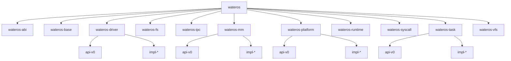

# WaterOS 项目架构快照

本文件汇总当前 WaterOS 的公共 API、实现接入方式、架构关系图和功能快照，是整体项目快照的主入口。

## 事实来源

- `os/Cargo.toml`
- `os/src/main.rs`
- `os/feature-tree.txt`
- 各一级组件 `Cargo.toml`
- 各一级组件聚合 `src/lib.rs`
- 各 crate 内 **`//!` / `///`** 等 Rust 文档注释（与 `docs/prompts/documentation.md`、`docs/tasks/commenting.md` 对齐；**含全部子 crate 与可选 feature 路径**；语义契约以源码 rustdoc 为准）

## 总体结构

根 crate `wateros` 当前聚合的一级组件包括：

- `wateros-abi`
- `wateros-base`
- `wateros-driver`
- `wateros-fs`
- `wateros-ipc`
- `wateros-klog`（见 [`docs/architecture/wateros-klog.md`](wateros-klog.md)）
- `wateros-mm`
- `wateros-platform`
- `wateros-runtime`
- `wateros-syscall`
- `wateros-klog`
- `wateros-task`
- `wateros-vfs`

`wateros-utils` 等组件也已存在于组件树中，但当前根 crate 的直接依赖仍以实际 `os/Cargo.toml` 为准。

## 架构总图

## 当前主线启动路径

`os/src/main.rs` 当前完成的主线动作包括：

- 处理 panic 与分配错误。
- 在 `qemu-riscv64-opensbi` 路径下进入 `kernel_main`。
- 构造平台引导上下文。
- 记录 DTB 物理基址（`driver::init_when_boot`），并初始化控制台、日志与堆分配器。（计划在此前后插入 **`klog::init()`**，见 [`docs/architecture/wateros-klog.md`](wateros-klog.md)。）
- 执行内核态 MM 自检（含与 feature 相关的可选分页冒烟路径）。
- 调用 **`driver::active_impl::init_after_boot()`** 完成 DTB 扫描、virtio-blk 注册及经 **`wateros-fs`** 的 devfs 刷新；成功后再 **`fs::init()`** / **`fs::test()`**；在启用 **`vfs-bridge`** 时追加 **`vfs::test()`**（内含 **`self_test`** RW 读回烟囱，见 **`docs/exports/public-api/wateros-vfs.md`**）。
- **bring-up 总线**（`user_bringup_bus`）：**`mount_default_root_rw`** → **`vfs::ensure_proc_mount_point`** → **`vfs::mount_procfs_at("/proc")`**（详见 [`docs/architecture/wateros-procfs.md`](wateros-procfs.md)）。
- 初始化任务调度器并创建演示性 kernel task。
- `wateros-task` 条件等待、最小父子关系与 child-exit wait 已服务 `wateros-ipc` / `wateros-syscall`；RISC-V 自检会启动根卷 **`/elf/000_hello_world.elf`** 与 **`/elf/010_pipe_smoke.elf`** 用户任务，并创建内核内部 ring-buffer pipe 覆盖阻塞读写、EOF、BrokenPipe 与非阻塞 WouldBlock。
- 通过 **`extern crate syscall as _`** 链接 **`wateros-syscall`**，供平台 trap 路径调用其分发符号；per-task fd 表在 **`wateros-vfs`**（`fd-session`），syscall 经 **`vfs::fd`** 完成 `pipe` / `read` / `write` / `close`（见 **`docs/exports/features/wateros-syscall.md`**、**`docs/exports/features/wateros-vfs.md`**）。
- 启用中断与定时器，并进入首个任务。
- 在 `qemu-loongarch64-virt` 路径下初始化 UART 控制台、日志、堆、LoongArch trap、timer interrupt 与 round-robin 调度器；已完成 **LoongArch64 三级页表 MM bring-up**（帧分配器、内核全局页表、恒等映射 RAM/MMIO、PGDL 切换探针）、**驱动层**（硬编码 virtio-mmio 槽位扫描 0x1000_8000，注册 virtio-blk 块设备）、**FS/VFS 自检**（devfs 刷新 + ext4 根卷挂载 + VFS 桥自检）。同时保留 PLV3 用户态 syscall smoke 用于验证用户态 trap 环路闭环。
- `wateros-mm` 的 **`impl-loongarch64`** 已实现完整的三级页表 walk、map/unmap/protect/translate、fork/destroy 以及 `from_elf_path` / `from_elf_bytes` ELF 装载器；用户地址空间与内核恒等映射共用一套页表。系统调用号表与 RISC-V 路径一致复用 Linux generic 64-bit 约定（见 **`wateros-abi`** 的 **`impl-linux-generic64`**）。`trap_handler` 已在返回用户态时为 `impl-loongarch64` 切换到内核地址空间 token。下一步用 `from_elf_path` 替代硬编码 PLV3 smoke，从根卷加载真实 ELF 用户任务。

设备树、virtio-mmio 与 devfs 协作的细节说明见 **`docs/guides/device-driver.md`**。

## 对应导出结果

- 公共 API：`docs/exports/public-api/`（按一级组件拆分的快照 Markdown，与根 **`os/Cargo.toml`** 依赖对齐；含 **`wateros-syscall.md`** 等。）
- 新增 impl 指南：`docs/exports/impl-guide/`
- 架构图：`docs/exports/architecture/`
- 功能快照：`docs/exports/features/`（目录说明见该路径下 **`README.md`**）
- klog 设计（组件未落地）：[`docs/architecture/wateros-klog.md`](wateros-klog.md)
- procfs 设计：[`docs/architecture/wateros-procfs.md`](wateros-procfs.md)
- 版本概述：`docs/exports/release-overview/`

## 注释覆盖维护（无行为变更）

最近一次全树注释对齐以 `docs/tasks/commenting.md` 为基准，覆盖 `os/components/**`、`os/src/`、`user/**` 及板级/架构侧汇编与链接脚本中的必要说明；**未改变**根 `os/Cargo.toml` 依赖图、默认 feature 组合或运行时启动语义。对外契约仍以各 crate 内 **`///` / `//!`** 与 `documentation.md` 为准。

### fork/clone 实现状态

当前 `clone` 系统调用（`syscall nr=220`）在 `wateros-syscall-impl-kernel` 的 `sys::clone::sys_clone` 中实现，经 `task::fork_current` 进入 `fork_user_task`。

用户栈策略：

| 场景 | 实现 |
|------|------|
| `clone(child_stack≠0)` | 子进程使用调用者提供的独立栈 |
| `fork()`（`child_stack=0`）+ `Kernel` 栈 | 分配新 `UserStack` |
| `fork()` + `External` 栈 | **共享物理栈页，子进程 SP 从栈底+4KB 开始** |

**当前方案是临时性的。** 地址空间（页表）在父子进程间完全共享，长期需要实现独立地址空间或 COW。详情见 `docs/exports/features/wateros-task.md` 的 fork/clone 实现说明。
