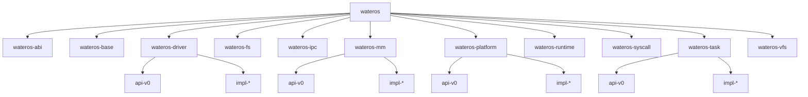

# WaterOS 项目架构快照

本文件汇总当前 WaterOS 的公共 API、实现接入方式、架构关系图和功能快照，是整体项目快照的主入口。

## 事实来源

- `os/Cargo.toml`
- `os/src/main.rs`
- `os/feature-tree.txt`
- 各一级组件 `Cargo.toml`
- 各一级组件聚合 `src/lib.rs`
- 各 crate 内 **`//!` / `///`** 等 Rust 文档注释（与 `docs/prompts/documentation.md`、`docs/tasks/commenting.md` 对齐；**含全部子 crate 与可选 feature 路径**；语义契约以源码 rustdoc 为准）

## 总体结构

根 crate `wateros` 当前聚合的一级组件包括：

- `wateros-abi`
- `wateros-base`
- `wateros-driver`
- `wateros-fs`
- `wateros-ipc`
- `wateros-mm`
- `wateros-platform`
- `wateros-runtime`
- `wateros-syscall`
- `wateros-task`
- `wateros-vfs`

`wateros-utils` 等组件也已存在于组件树中，但当前根 crate 的直接依赖仍以实际 `os/Cargo.toml` 为准。

## 架构总图

## 当前主线启动路径

`os/src/main.rs` 当前完成的主线动作包括：

- 处理 panic 与分配错误。
- 在 `qemu-riscv64-opensbi` 路径下进入 `kernel_main`。
- 构造平台引导上下文。
- 记录 DTB 物理基址（`driver::init_when_boot`），并初始化控制台、日志与堆分配器。
- 执行内核态 MM 自检（含与 feature 相关的可选分页冒烟路径）。
- 调用 **`driver::active_impl::init_after_boot()`** 完成 DTB 扫描、virtio-blk 注册及经 **`wateros-fs`** 的 devfs 刷新；成功后再 **`fs::init()`** / **`fs::test()`**；在启用 **`vfs-bridge`** 时追加 **`vfs::test()`** 与 **`vfs::bridge`** 对根卷的 RW 烟囱读回校验（依赖 **`wateros-fs`** 公开 API，见 **`docs/exports/public-api/wateros-vfs.md`**）。
- 初始化任务调度器并创建演示性 kernel task。
- 通过 **`extern crate syscall as _`** 链接 **`wateros-syscall`**，供平台 trap 路径调用其分发符号（见 **`docs/exports/features/wateros-syscall.md`**）。
- 启用中断与定时器，并进入首个任务。
- 在 `qemu-loongarch64-virt` 路径下初始化 UART 控制台、日志、堆、LoongArch trap、timer interrupt 与 round-robin 调度器，并创建两个演示性 kernel task 进行轮转；同时创建一个独立 `.text.user_smoke` 段内的 PLV3 用户态 syscall smoke，用 `UserTaskSpec` 记录 entry/image 元数据并由 observer 回收断言。
- LoongArch64 当前仍未接入真实 MM、driver、fs/vfs 与 ELF loader；paging facade 仍为占位，用户 smoke 不声明地址空间句柄；系统调用号表与 RISC-V 路径一致复用 Linux generic 64-bit 约定（见 **`wateros-abi`** 的 **`impl-linux-generic64`**）。要运行真实 ELF 用户任务，下一步需要补齐 LoongArch 页表/MMU 切换、根卷块设备/FS 接入，以及按 LoongArch 页表格式实现 `from_elf_path`。

设备树、virtio-mmio 与 devfs 协作的细节说明见 **`docs/guides/device-driver.md`**。

## 对应导出结果

- 公共 API：`docs/exports/public-api/`（按一级组件拆分的快照 Markdown，与根 **`os/Cargo.toml`** 依赖对齐；含 **`wateros-syscall.md`** 等。）
- 新增 impl 指南：`docs/exports/impl-guide/`
- 架构图：`docs/exports/architecture/`
- 功能快照：`docs/exports/features/`（目录说明见该路径下 **`README.md`**）
- 版本概述：`docs/exports/release-overview/`

## 注释覆盖维护（无行为变更）

最近一次全树注释对齐以 `docs/tasks/commenting.md` 为基准，覆盖 `os/components/**`、`os/src/`、`user/**` 及板级/架构侧汇编与链接脚本中的必要说明；**未改变**根 `os/Cargo.toml` 依赖图、默认 feature 组合或运行时启动语义。对外契约仍以各 crate 内 **`///` / `//!`** 与 `documentation.md` 为准。
