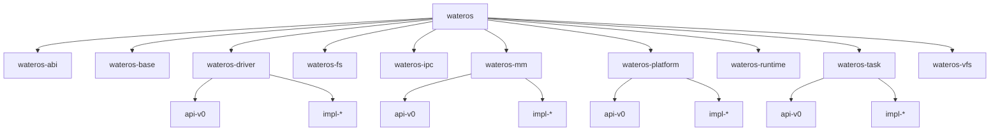

# WaterOS 项目架构快照

本文件汇总当前 WaterOS 的公共 API、实现接入方式、架构关系图和功能快照，是整体项目快照的主入口。

## 事实来源

- `os/Cargo.toml`
- `os/src/main.rs`
- `os/feature-tree.txt`
- 各一级组件 `Cargo.toml`
- 各一级组件聚合 `src/lib.rs`

## 总体结构

根 crate `wateros` 当前聚合的一级组件包括：

- `wateros-abi`
- `wateros-base`
- `wateros-driver`
- `wateros-fs`
- `wateros-ipc`
- `wateros-mm`
- `wateros-platform`
- `wateros-runtime`
- `wateros-task`
- `wateros-vfs`

`wateros-utils` 等组件也已存在于组件树中，但当前根 crate 的直接依赖仍以实际 `os/Cargo.toml` 为准。

## 架构总图

## 当前主线启动路径

`os/src/main.rs` 当前完成的主线动作包括：

- 处理 panic 与分配错误。
- 在 `qemu-riscv64-opensbi` 路径下构造平台引导上下文，初始化驱动、控制台、日志、堆、MM 自检、任务调度器、定时器中断，并进入首个任务。
- 在 `qemu-loongarch64-virt` 路径下初始化 UART 控制台、日志、堆、LoongArch trap、timer interrupt 与 round-robin 调度器，并创建两个演示性 kernel task 进行轮转。
- LoongArch64 当前仍未接入真实 MM、driver、fs/vfs 与用户态地址空间；paging facade 仍为占位，syscall dispatch 仅完成最小 Linux generic 号表接线。

## 对应导出结果

- 公共 API：`docs/exports/public-api/`
- 新增 impl 指南：`docs/exports/impl-guide/`
- 架构图：`docs/exports/architecture/`
- 功能快照：`docs/exports/features/`
- 版本概述：`docs/exports/release-overview/`
