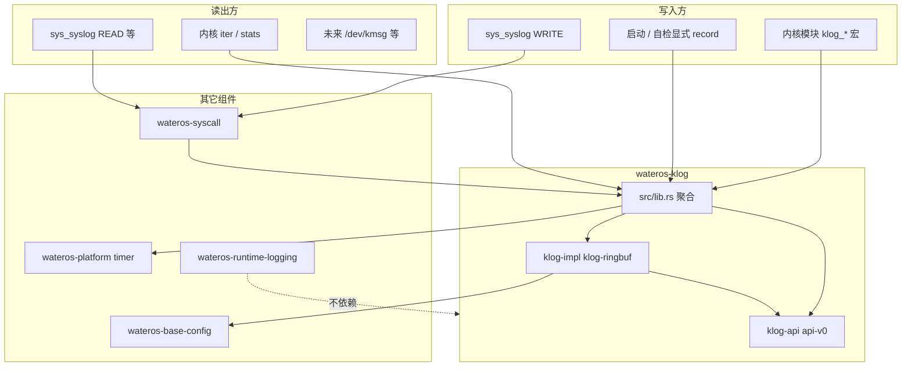

# wateros-klog 设计说明

## 用途

本文档固化 **`wateros-klog`** 一级组件的设计共识：内核可查询、可迭代的**消息环**（klog ring），以及与 Linux **`syslog(2)` / `sys_syslog`**（RISC-V 64 上 **`__NR_syslog` = 116**）的适配方式。

设计目标：

- **内核内部信息可见性**：在 API 层明确记录结构、字段含义、全局存储布局与统计量；内核模块可通过 trait/迭代器观测环内容，而不依赖用户态工具。
- **与用户态兼容**：通过 `wateros-syscall` 导出**传统 syslog 读路径**线格式（如 `"<3>..."`），满足 busybox / `dmesg` 类测例。
- **与 `wateros-runtime-logging` 分离**：`log!` / 控制台着色输出面向开发调试；**持久环与 syscall 只走 klog 自有 API**，两组件零耦合。

**实现状态**：组件已落地于 `os/components/wateros-klog/`；本文档为设计基线与实现对照。变更时须同步 `docs/exports/features/wateros-klog.md` 与源码 rustdoc。

## 事实来源与关联文档

| 文档 | 内容 |
|------|------|
| 本文档 | 完整设计、数据结构、syscall 语义、分阶段计划 |
| [`docs/exports/features/wateros-klog.md`](../exports/features/wateros-klog.md) | 能力边界快照（随实现更新） |
| [`docs/exports/public-api/wateros-klog.md`](../exports/public-api/wateros-klog.md) | 聚合层对外 API 清单 |
| [`docs/exports/impl-guide/wateros-klog.md`](../exports/impl-guide/wateros-klog.md) | 新增子 crate / impl 检查清单 |
| [`docs/exports/features/wateros-syscall.md`](../exports/features/wateros-syscall.md) | syscall 分发与 klog 接线 |
| [`docs/exports/features/wateros-abi.md`](../exports/features/wateros-abi.md) | `SYSLOG = 116` 号表扩展 |
| Linux [`asm-generic/unistd.h`](https://github.com/torvalds/linux/blob/master/include/uapi/asm-generic/unistd.h) | `__NR_syslog` 编号与 generic 64-bit ABI |

## 背景：Linux 116 号与当前缺口

- RISC-V 64（及 WaterOS 当前复用的 **Linux generic 64-bit** 号表）上，**116 = `syslog`**，内核实现为 **`sys_syslog`**，**不是**名为 `sys_log` 的独立调用。
- 用户态 `busybox` 等会通过 `ecall` 传入 `a0=action`（例如 `SYSLOG_ACTION_SIZE_BUFFER = 10`），此前 WaterOS 因号表未收录 116，在 `dispatch_unknown` 路径 **panic**。
- Linux 内核内部的 printk 使用 `printk_info` + 变长文本环（`printk_ringbuffer`）；**该结构不导出给用户态**。WaterOS 采用**自有** `KlogRecordMeta` 契约，仅在**导出**时格式化为传统 ASCII 线。

---

## 设计决策记录（评审结论）

以下条目来自架构商讨三轮选择题，作为实现与评审的约束。

| 维度 | 决策 |
|------|------|
| 组件名 | **`wateros-klog`** |
| 子 crate 布局 | **`klog-api/api-v0`** + **`klog-impl/klog-ringbuf`** + 根 **`src/lib.rs` 聚合**（对齐 platform / mm / ipc 范式） |
| 存储布局 | **描述符槽（desc）+ 变长数据环（text ring）** |
| 与 `runtime-logging` | **零耦合**；`log!` 仅控制台；环由 **klog 宏/函数** 写入；需「上屏+进环」时**调用方**自行 `klog_*!` + `log::*!` |
| syscall 首期范围 | **尽量覆盖 `sys_syslog` action 全子集**（非仅 SIZE_* 桩） |
| 用户态线格式 | **传统 syslog 读路径**（`<level>message` 风格） |
| 权限（bring-up） | **全开**（任意进程 READ/WRITE/CLEAR） |
| 容量配置 | **`wateros-base-config`** 常量（`KLOG_DESC_SLOTS`、`KLOG_TEXT_RING_BYTES`） |
| 并发 | **自旋锁**包裹 append / read / cursor 更新 |
| 未支持行为（测试期） | **panic**（未知 syscall nr、未实现 action、非法参数组合等），便于测例驱动补全 |
| CLEAR / READ_CLEAR | **`mark_read` 游标**；环内数据**保留**，供内核 `iter`；不物理删除旧记录 |
| 用户态 WRITE | 与内核 **`klog::record` 同一环**；meta 置 **`USER` 来源标志** |
| 环满策略（默认，实现前可再审） | **覆盖最旧记录**，`KlogStats.records_dropped` 递增 |

---

## 组件边界与依赖

### 目录结构（计划）

```text
os/components/wateros-klog/
  Cargo.toml
  src/lib.rs                 # init、global、宏、export、syscall 再导出
  klog-api/api-v0/           # 类型、trait、常量、错误
  klog-impl/klog-ringbuf/    # desc + varlen 环、全局单例、spin mutex
```

### 依赖方向（禁止环依赖）



| 依赖方 | 被依赖方 | 说明 |
|--------|----------|------|
| `klog-ringbuf` | `klog-api`、`base-config` | 仅实现存储 |
| `wateros-klog` 聚合 | `klog-ringbuf`、`platform` | 时间戳、`init` |
| `wateros-syscall` | `wateros-klog` | `sys_syslog` 薄适配 |
| `wateros` 根 crate | `wateros-klog`（计划） | `klog::init()` 早于 `runtime::logging::init()` |
| `wateros-runtime-logging` | — | **不**依赖 klog |

### 与 `wateros-runtime-logging` 的分工

| 能力 | `wateros-runtime-logging` | `wateros-klog` |
|------|---------------------------|----------------|
| 主要用途 | 开发期**控制台**可读输出（`log` crate → 着色 `println`） | **持久消息环** + 统计 + 用户态 **syslog** 可读 |
| 典型调用 | `log::info!` / `runtime::logging::*` | `klog_info!` / `klog::record` |
| 用户态可见 | 否（无 syscall 导出） | 是（`sys_syslog` READ 等） |
| 双发 | 由**调用方**自行组合，无 crate 级自动双写 | — |

---

## 数据模型（`klog-api`）

### `KlogRecordMeta`（固定大小，内核契约）

建议 `repr(C)`，字段含义在 `klog-api` 以 `///` 文档化；**不**原样 `copy_to_user`。

| 字段 | 类型 | 含义 |
|------|------|------|
| `seq` | `u64` | 提交后单调递增序号；读侧用于检测丢记录 |
| `ts_nsec` | `u64` | 单调时钟纳秒（`platform::timer`） |
| `text_len` | `u16` | 本条正文字节数 |
| `facility` | `u8` | syslog facility，默认 `LOG_USER` / `LOG_KERN` 等 |
| `level` | `u8`（3 bit 有效） | syslog level，与 `LOG_ERR` 等对齐 |
| `flags` | `u8` 位域 | 见下表 |
| `caller_id` | `u32` | 写入时 `task::current_task_id()`，无任务则为 0 |

**`KlogFlags`（建议）**

| 位 | 名 | 含义 |
|----|-----|------|
| 0 | `CONT` | 续行（对应 Linux continuation） |
| 1 | `TRUNC` | 正文因环或单条上限被截断 |
| 2 | `USER` | 来自用户态 `sys_syslog` WRITE |
| 3.. | 保留 | 实现前不得假定用户态可见 |

### 变长正文

- 存储于 **text ring**；desc 槽记录 **偏移 + `text_len`**（及有效性世代/状态，供无锁读一致性，实现细节留在 `klog-ringbuf`）。
- 单条最大长度：由 `text_len` 类型与 `KLOG_MAX_RECORD_BYTES`（`base-config` 可选）共同约束。

### `KlogStats`（全局统计，内核可读）

| 字段 | 含义 |
|------|------|
| `records_committed` | 成功提交条数 |
| `records_dropped` | 因环满覆盖最旧而丢弃的条数（或实现定义的其他丢弃） |
| `bytes_dropped` | 可选：丢弃的正文字节累计 |
| `oldest_seq` / `newest_seq` | 当前环内可见序号范围 |

### 读侧游标（非 Linux 导出，WaterOS 自有）

| 状态 | 含义 |
|------|------|
| `read_cursor_seq` | 用户态 `READ` / `READ_CLEAR` 已消费到的序号 |
| `unread_bytes` | 由游标与环内容推导，供 `SYSLOG_ACTION_SIZE_UNREAD` |

**`SYSLOG_ACTION_CLEAR`**：仅推进/重置 **read 游标**，**不**擦除 desc/text 物理内容（已选 **`mark_read`** 策略）。

---

## 存储实现（`klog-impl/klog-ringbuf`）

### 三环逻辑（概念两层）

与 Linux `printk_ringbuffer` 类似，WaterOS bring-up 采用 **desc + varlen** 两层即可（字典环 **不** 在首期实现）：

1. **desc 槽数组**：长度 `KLOG_DESC_SLOTS`，与 `KlogRecordMeta` 一一对应（或含 generation/state 字段）。
2. **text 字节环**：长度 `KLOG_TEXT_RING_BYTES`，追加变长 payload；槽满时按决策表**覆盖最旧** desc 及对应数据区间。

### 全局单例

- 静态 `KLOG_GLOBAL: KlogRingbuf`（或 `OnceCell` 模式，以实现时 crate 惯例为准）。
- `klog::init()`：初始化锁、清空统计、可选写入 boot 标记记录。
- 所有 `append` / `read_for_syslog` / `iter_from` 经 **同一把 spin mutex**。

### `KlogStore` trait（`klog-api`，`klog-ringbuf` 实现）

概念方法（具体签名以实现时 rustdoc 为准）：

| 方法 | 职责 |
|------|------|
| `append(meta, text)` | 分配 desc + 写入 text ring；更新 stats |
| `iter_from(start_seq)` | 内核迭代，供调试/自检 |
| `stats()` | 返回 `KlogStats` |
| `unread_bytes()` | syslog `SIZE_UNREAD` |
| `buffer_bytes()` | syslog `SIZE_BUFFER`（见下节语义） |
| `read_next_for_export(buf)` | 取下一条未读记录并格式化到临时缓冲 |
| `advance_read_cursor(clear)` | `READ` / `READ_CLEAR` / `CLEAR` |

### 环满策略（默认）

- **覆盖最旧** desc 及 text 区间；`records_dropped += 1`。
- 被覆盖记录不再参与 `READ`；`iter` 可跳过或标记 gap（实现时二选一并在 rustdoc 写明）。

---

## 配置（`wateros-base-config`）

计划新增常量（名称可在实现时微调，文档同步更新）：

| 常量 | 建议初值 | 说明 |
|------|----------|------|
| `KLOG_DESC_SLOTS` | `256` | desc 槽数量 |
| `KLOG_TEXT_RING_BYTES` | `32768`（32 KiB） | 变长正文环大小 |
| `KLOG_MAX_RECORD_BYTES` | `1024` | 单条正文上限 |

QEMU 小内存目标可在 `base-config` 内按 arch feature 分档（与现有配置风格一致）。

---

## 聚合层 API（`wateros-klog` 根 crate）

### 初始化

```text
klog::init()              // 必须早于依赖环的 syscall / 用户任务
runtime::logging::init()  // 与 klog 无关
```

### 写入：函数 + 宏（已选 **宏 + `format_args!`**）

**底层**

```rust
// 概念签名
pub fn record(level: KlogLevel, facility: KlogFacility, text: &[u8]) -> AppendResult;
```

**上层宏（计划导出）**

- `klog_trace!` / `klog_debug!` / `klog_info!` / `klog_warn!` / `klog_error!`
- 内部：`format_args!` → UTF-8 字节 → `record`

**双发约定**：宏**不**调用 `log::info!`；需要控制台时调用方写两行。

### 内核观测

| API | 用途 |
|-----|------|
| `klog::stats()` | 自检、伪 shell |
| `klog::iter_from(seq)` | 调试打印结构化 meta + 正文 |
| `klog::global()` | 返回 `&'static dyn KlogStore`（或等价） |

---

## 用户态导出（传统 syslog 线格式）

### 格式化

模块 **`klog::export`**（或 `klog-export` 子模块）：

- 输入：`KlogRecordMeta` + 正文 `&[u8]`
- 输出：传统线，例如 `"<3>subsys: message\n"`（`level` 映射到 `<0>`..`<7>` 前缀；细节与 Linux `syslog(2)` READ 行为对齐，实现时对照 man page 与 busybox 测例）

**不**导出 `/dev/kmsg` 的 `level,seq,ts,cont;text` 格式（首期）；若未来需要，另增 formatter，syscall 默认仍用 traditional。

### `sys_syslog` action 表（首期目标）

Linux `syslog(2)` / `klogctl` 常用 `type`（与 man page 一致）：

| 值 | 名 | 首期目标行为 |
|----|-----|----------------|
| 0 | `CLOSE` | no-op 成功（无持久 fd 会话） |
| 1 | `OPEN` | no-op 成功 |
| 2 | `READ` | 读一条未读 → traditional 格式化 → `copy_to_user`；无未读：按 Linux 返回 0 或错误（实现时选定一种并 **文档化**；未选定前 **panic**） |
| 3 | `READ_ALL` | 类似 READ，允许更长缓冲 / 多条拼接策略（实现时写明） |
| 4 | `READ_CLEAR` | 读一条并推进 `read_cursor` |
| 5 | `CLEAR` | 仅重置 `read_cursor`（环保留） |
| 6 | `CONSOLE_OFF` | 实现或 **panic**（full 范围要求；禁止静默假成功除非评审通过） |
| 7 | `CONSOLE_ON` | 同上 |
| 8 | `CONSOLE_LEVEL` | 同上；`arg2` 为 level |
| 9 | `SIZE_UNREAD` | 返回 `unread_bytes()` |
| 10 | `SIZE_BUFFER` | 返回 `buffer_bytes()`（建议：text ring 容量或当前已用字节，与 Linux 语义对齐须在实现注释中引用 man page） |
| 其他 | — | **panic**（测试期） |

**WRITE（`type` 为 priority）**：`type` 高 3 位 level、低 3 位 facility（Linux 约定）；`buf`/`len` 为消息 → `record` + `USER` flag。

### 权限

bring-up：**不检查** uid / `CAP_SYSLOG`；后续可在 `wateros-cred` 接入后再收紧。

### 错误与 panic 策略

| 情况 | 行为 |
|------|------|
| 号表未知 nr | **panic**（`syscall_unknown`） |
| 已解码 `Syslog` 但 action 未实现 | **panic** |
| 非法 action 值、矛盾参数组合 | **panic** |
| 用户指针无效 | 测试期按评审 **panic**；若实现中改为 `-EFAULT`，须同步本文档 |

实现稳定后，可将 panic 改为 `-EINVAL` / `-EFAULT`，并保留 `feature = "klog-strict-panic"` 供 CI。

---

## `wateros-abi` / `wateros-syscall` 接线

### ABI

- `SyscallNumberTable::SYSLOG = SyscallNumber(116)`
- `SyscallKind::Syslog`
- `SyscallKind::decode` 增加 116 分支

### syscall

```text
sys_syslog(args)
  → klog::syscall::dispatch(action, buf_ptr, len)
  → UserRet（经 user_copy 读写用户缓冲）
```

- 移除 **仅** 因 116 未收录导致的 `unknown nr=116` panic。
- `docs/exports/features/wateros-syscall.md` 增加 `syslog (116)` 行。

---

## 启动顺序（计划）

```text
1. platform / 基础运行时
2. klog::init()
3. runtime::logging::init()
4. mm / driver / fs / vfs / task ...
5. syscall 与用户任务（可触发 sys_syslog）
```

可选：`klog::init` 内写入 1 条 boot 记录（`LOG_KERN` + `LOG_INFO`），便于首次 `dmesg` 非空。

---

## 分阶段实现计划

| 阶段 | 交付物 | 验收 |
|------|--------|------|
| **P0** | `klog-api` 类型 + `base-config` 常量；`klog-ringbuf` + `init` + `record` + stats；ABI 116 + `SyslogKind`；`sys_syslog` 骨架；消除 nr=116 panic | QEMU 跑 busybox 不再因 116 panic |
| **P1** | `SIZE_*` / `READ` / `READ_CLEAR` / `CLEAR` / `WRITE` 全 action；traditional 格式化；`klog_*!` 宏 | `dmesg` 类测例有输出 |
| **P2** | 内核 `iter` / 自检打印；文档与 rustdoc 对齐 | 可见性目标：环内容可观测 |
| **P3** | `CONSOLE_*` 与 `runtime-console` 策略联动（若需要）；权限；可选 kmsg 线格式 | 与 Linux 行为差分文档化 |

---

## 与 Linux `printk_info` 的对照（参考，非绑定）

| Linux `printk_info` | WaterOS `KlogRecordMeta` |
|---------------------|---------------------------|
| `seq` | `seq` |
| `ts_nsec` | `ts_nsec` |
| `text_len` | `text_len` |
| `facility` / `level` | 同 |
| `caller_id` | 同 |
| `dev_info` | **首期无**；可用 `flags` + 未来 `source` 字段扩展 |

---

## 维护要求

- 实现或变更行为时，同步更新：
  - 本文档
  - `docs/exports/features/wateros-klog.md`
  - `docs/exports/public-api/wateros-klog.md`
  - `docs/exports/features/wateros-syscall.md`（116 行）
  - `docs/architecture/snapshot.md`（根依赖与启动顺序）
  - `docs/prompts/structure.md`（一级组件列表）
- `klog-api` 中所有对外 `pub` 类型/trait 须补齐 `///` 契约说明。

---

## 修订记录

| 日期 | 说明 |
|------|------|
| 2026-06-03 | 初版：落实架构商讨三轮决策 |
