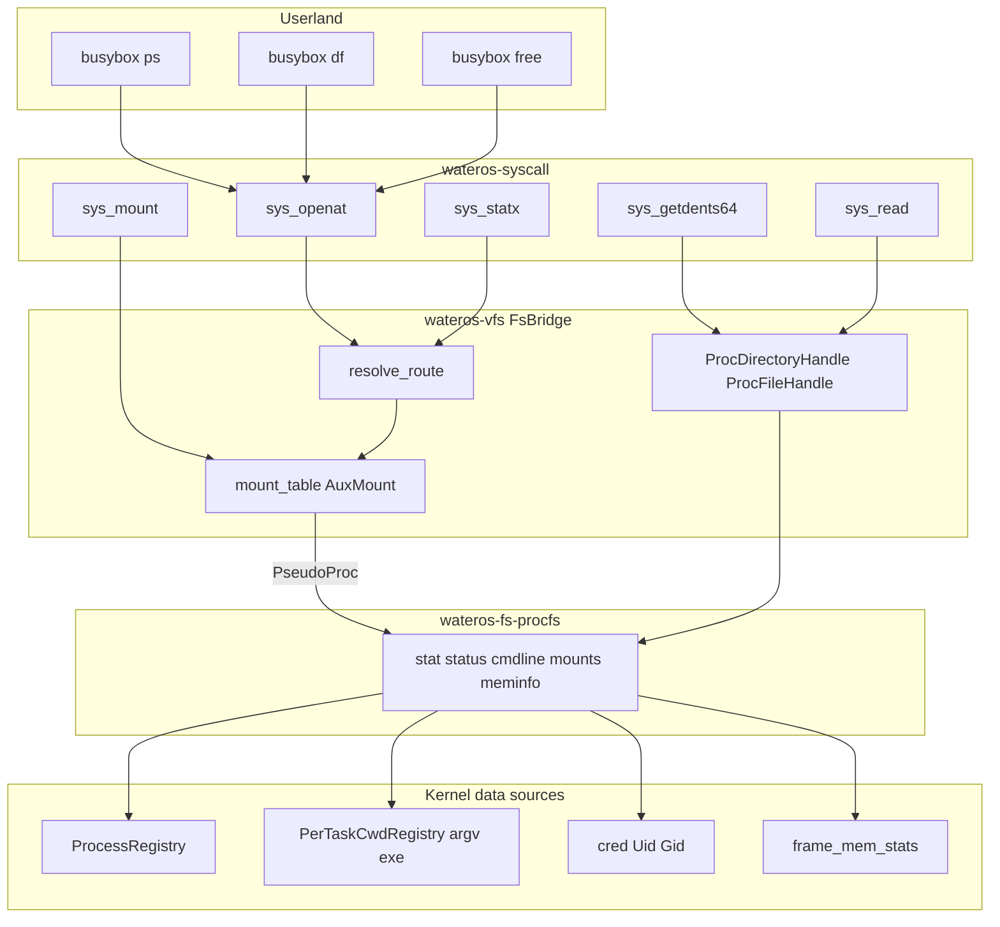
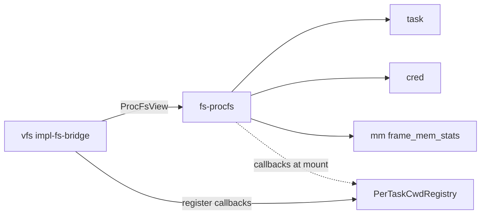

# wateros-procfs 设计说明

## 用途

本文档固化 **`wateros-fs/fs-procfs`** 与 **`wateros-vfs`** 伪挂载协作方式：在 ext4 根卷 `/proc` 目录上挂载只读 procfs，为 busybox `ps` / `df` / `free` 等工具提供 Linux 兼容的 `/proc` 子集。

设计目标：

- **用户态兼容**：`openat` / `getdents64` / `read` / `statx` 经 VFS 正常路径访问 `/proc`，不再出现 `can't open '/proc'`。
- **分层清晰**：procfs 内容生成在 `wateros-fs`；路由与句柄在 `wateros-vfs/impl-fs-bridge`；不引入 fs↔vfs 环依赖。
- **可演进**：第一期仅覆盖 busybox 所需最小文件集；`/proc/self/exe` 等保留现有 syscall 特判，后续可迁入 procfs。

**实现状态**：组件设计已定稿；源码见 `os/components/wateros-fs/fs-procfs/` 与 `os/components/wateros-vfs/vfs-impl/impl-fs-bridge/`。变更时须同步 `docs/exports/features/wateros-fs.md`、`wateros-vfs.md` 与 public-api 快照。

## 事实来源与关联文档

| 文档 | 内容 |
|------|------|
| 本文档 | 完整设计、挂载模型、路径语义、数据流 |
| [`docs/exports/features/wateros-fs.md`](../exports/features/wateros-fs.md) | fs 层 procfs 能力快照 |
| [`docs/exports/features/wateros-vfs.md`](../exports/features/wateros-vfs.md) | VFS 伪挂载与 `mount_procfs_at` |
| [`docs/exports/public-api/wateros-fs.md`](../exports/public-api/wateros-fs.md) | `wateros-fs-procfs` 导出项 |
| [`docs/exports/public-api/wateros-vfs.md`](../exports/public-api/wateros-vfs.md) | 聚合层 proc 挂载 API |
| [`docs/exports/public-api/wateros-mm.md`](../exports/public-api/wateros-mm.md) | `frame_mem_stats()`（meminfo 数据源） |
| [`docs/architecture/snapshot.md`](snapshot.md) | 启动路径：根 RW → mkdir `/proc` → procfs 伪挂载 |
| Linux [`proc(5)`](https://man7.org/linux/man-pages/man5/proc.5.html) | 用户态工具期望的路径与字段格式 |

---

## 背景：busybox 与 `/proc` 缺口

- busybox `ps` 通过 `openat("/proc")` + `getdents64` 枚举 PID 目录，再读 `<pid>/stat` 与 `cmdline`。
- busybox `df` 读取 `/proc/mounts`；`free` 读取 `/proc/meminfo`。
- 此前 WaterOS 根卷 ext4 上无 `/proc` 或无可读 procfs 视图，`openat("/proc")` 返回 `ENOENT`，导致 B3 类测例失败。

---

## 设计决策记录（评审结论）

| 维度 | 决策 |
|------|------|
| Q1 分层 | 新建 `wateros-fs/fs-procfs`（`procfs-api/api-v0` + `procfs-impl/impl-kernel`）；VFS `impl-fs-bridge` 路由 |
| Q2 挂载模型 | 扩展 `mount_table::AuxMount` 为 `PseudoProc`；**挂载点 A**：bring-up 在 ext4 根卷 `mkdir /proc` 后 `mount_aux_proc_at("/proc")` |
| Q3 第一期范围 | ps 所需 + `/proc/mounts` + `/proc/meminfo` |
| Q4 cmdline | exec/spawn 时在 `PerTaskCwdRegistry` 持久化 `argv[]` |
| Q5 可见进程 | `ProcessRegistry` 全部条目（含 Exited 未 reap 的 zombie） |
| Q6 mount syscall | `sys_mount` 识别 `fstype=proc` |
| Q7 bring-up | **仅内核自动 mount**（不依赖 busybox 脚本） |
| Q8 `/proc/self/exe` | **保留** `readlinkat` 特判，第一期不迁入 procfs |
| Q9 argv 存储 | 扩展 `PerTaskCwdRegistry`（与 `exe_path` 同 owner 模型） |
| Q10 meminfo | 从 `wateros-mm` 帧分配器 `frame_mem_stats()` 推导 |

---

## 架构与数据流



**路径解析顺序**（与现有 ext4 辅助挂载一致）：

1. `normalize_absolute_path`
2. `longest_aux_mount`（含 `/proc` 伪挂载）
3. 否则根卷 ext4

---

## 组件边界与依赖

### 目录结构

```text
os/components/wateros-fs/fs-procfs/
  Cargo.toml
  src/lib.rs                      # 聚合 active_impl
  procfs-api/api-v0/              # ProcFsView trait、ProcMountLine、回调类型
  procfs-impl/impl-kernel/        # KernelProcFs：路径解析 + 内容生成
  procfs-impl/impl-dummy/         # 占位 impl

os/components/wateros-vfs/vfs-impl/impl-fs-bridge/
  src/mount_table.rs              # AuxMount::PseudoProc、FsRoute::PseudoProc
  src/proc_handle.rs              # ProcDirectoryHandle / ProcFileHandle
  src/lib.rs                      # FsBridge 路由分支
  src/file_handle.rs              # open_path → proc_handle
```

### 依赖方向（禁止环依赖）

| 依赖方 | 被依赖方 | 说明 |
|--------|----------|------|
| `procfs-impl-kernel` | `task`、`cred`、`mm-frame-alloctor` | 进程/凭证/内存统计 |
| `procfs-impl-kernel` | `procfs-api`、`fs-api-v0` | 契约与元数据类型 |
| `impl-fs-bridge` | `wateros-fs`（含 procfs） | 路由与句柄 |
| `wateros-vfs` 聚合 | `impl-fs-bridge`、`cwd` | `mount_procfs_at` 注册 argv/exe 回调 |
| `procfs` | **不**直接依赖 `wateros-vfs` | argv/exe/mount 经函数指针注册 |



---

## 阶段 1：MM 内存统计（meminfo 前置）

**位置**：`mm-frame-alloctor/frame-alloctor-api/api-v0`、`impl-stack`、`mm-frame-alloctor/src/lib.rs`

- `FrameMemStats`：`total_frames` / `free_frames`，乘以 `PAGE_BYTES`（4096）得字节。
- `StackFrameAllocator::mem_stats()`：基于 `(end_ppn - start_ppn)`、`next_novel`、`recycled.len()` 计算空闲帧。
- 聚合导出 `frame_mem_stats()`；未初始化或 dummy impl 返回零值。
- procfs **只**依赖此 API，不直接访问 `UniprocessorSafeCell` 内部。

---

## 阶段 2：argv 持久化（PerTaskCwdRegistry）

**位置**：`vfs-impl/impl-fd-session/src/cwd.rs`、`wateros-vfs/src/cwd.rs`

- 新增 `argv_vectors: Vec<Option<Vec<String>>>`，与 `exe_paths` / owner / ref_count 共享语义。
- API：`set_argv`、`get_argv`；`drop_task` 清理；`copy_cwd_from_parent` 深拷贝；`share_cwd_from_parent` 共享 owner 的 argv。
- 聚合层：`set_task_argv`、`lookup_argv_for_task`、`lookup_exe_for_task`。
- 接线：
  - `execve`：`set_task_argv(current_tid, final_argv)`
  - `clone`：fork 复制 / thread 共享（与 cwd 一致）
  - bring-up spawn：`on_user_task_spawned_for_elf(tid, path, argv)`

---

## 阶段 3：wateros-fs/fs-procfs

### ProcFsView 契约（api-v0）

```rust
pub trait ProcFsView {
    fn exists(&self, rel_path: &str) -> FsResult<bool>;
    fn metadata(&self, rel_path: &str) -> FsResult<FsMetadata>;
    fn read(&self, rel_path: &str) -> FsResult<Vec<u8>>;
    fn read_dir(&self, rel_path: &str) -> FsResult<Vec<FsDirEntry>>;
}
```

回调类型（避免 fs↔vfs 环依赖）：

- `TaskArgvLookup`、`TaskExeLookup`、`MountListLookup`

### 路径语义（impl-kernel 内部，相对 procfs 挂载根）

| 路径 | 类型 | 行为 |
|------|------|------|
| `/` | dir | 数字 PID 目录 + `meminfo` + `mounts` |
| `/<pid>/` | dir | `stat`, `status`, `cmdline` |
| `/<pid>/stat` | file | Linux `/proc/pid/stat` 最小字段集；state 映射 `ProcessState`；utime ≈ `tick_count * USER_HZ` |
| `/<pid>/status` | file | `Name`, `State`, `Pid`, `PPid`, `Uid`, `Gid` |
| `/<pid>/cmdline` | file | argv NUL 分隔；无 argv 时 fallback `exe_path` |
| `/meminfo` | file | `frame_mem_stats()` 格式化；`Cached`/`Buffers` 填 0 |
| `/mounts` | file | VFS `list_proc_mount_lines()` 回调 |

### FsImpl 登记

- `KernelProcFsImpl`：`FsKind::Other("procfs")`、`ReadOnly`
- 聚合 `registered_fs_impls()` 含 `procfs::active_impl::IMPL`
- 启动日志：`[fs] supported: kind=Other("procfs") access=ReadOnly`

---

## 阶段 4：VFS 伪挂载与句柄

### AuxMount 扩展

```rust
enum AuxMount {
    Rw(SharedRwFs),
    Ro(SharedFs),
    PseudoProc,  // 零大小，路由到 procfs active_impl
}
```

- `mount_aux_proc_at(mount_point)`：走 `mount_aux_common`（挂载点须为 ext4 上**空目录**）
- `FsRoute::PseudoProc { rel: String }`
- `list_proc_mount_lines()` → `/proc/mounts` 内容

### FsBridge 分支

对 `PseudoProc`：`exists` / `metadata` / `read` / `read_dir` / `read_range` 委托 `procfs::active_impl::view()`。

`open_path`：

- 目录 → `ProcDirectoryHandle`（`fill_getdents64`，复用 `dir_handle` 编码）
- 普通文件 → `ProcFileHandle`（按需生成 + offset 读）

写路径：`assert_path_writable` 对 `PseudoProc` 返回 `ReadOnlyFs`。

### 聚合层对外 API（wateros-vfs）

| API | 说明 |
|-----|------|
| `ensure_proc_mount_point()` | 根卷 `mkdir /proc`（已存在则 OK） |
| `mount_procfs_at(mount_point)` | 注册 argv/exe/mount 回调 + `mount_aux_proc_at` |
| `is_proc_mounted_at(mount_point)` | 查询是否已伪挂载 proc |

---

## 阶段 5：bring-up 与 mount syscall

### bring-up（`user_bringup_bus.rs`）

```text
mount_default_root_rw() OK
  → vfs::ensure_proc_mount_point()
  → vfs::mount_procfs_at("/proc")
  → log "[bringup] procfs mounted at /proc"
```

### sys_mount（`mount.rs`）

- `fstype == "proc"` → `ensure_proc_mount_point` + `mount_procfs_at(target)`
- 同路径已挂载 → `EBUSY`
- 与 ext4 分支并列，不破坏现有 oscomp 测例

---

## 挂载生命周期

1. `fs::mount_default_root_rw()` 挂载 ext4 根卷。
2. `vfs::ensure_proc_mount_point()` 在根卷创建 `/proc`（已存在则忽略）。
3. `vfs::mount_procfs_at("/proc")` 注册回调并 `mount_aux_proc_at`。
4. `fs::rootfs::bump_mount_generation()`；VFS 页缓存按新代失效。

---

## 第一期文件清单与 Linux 兼容性

| 路径 | 数据源 |
|------|--------|
| `/proc/<pid>/stat` | `process_snapshot` + `task_snapshot` + argv/exe comm |
| `/proc/<pid>/status` | 同上 + `cred::credentials_for(leader)` |
| `/proc/<pid>/cmdline` | `PerTaskCwdRegistry` argv；无 argv 时 fallback exe |
| `/proc/meminfo` | `mm_frame_alloctor::frame_mem_stats()` |
| `/proc/mounts` | `impl_fs_bridge::list_proc_mount_lines()` |

**刻意未覆盖**：

- `/proc/self` 及符号链接语义
- 完整 Linux `stat` 字段顺序与数量
- 线程级 `/<tid>/` 目录
- `meminfo` 中 `Cached` / `Buffers` 非零（仅标注「基于帧分配器」）

---

## 风险与缓解

| 风险 | 缓解 |
|------|------|
| ext4 镜像已有 `/proc` 文件冲突 | `mkdir` 容忍 `Exists`；挂载前 `read_dir_on_root` 须为空目录 |
| BusyBox `stat` 字段顺序/数量 | 对照 Linux 文档生成最小可解析子集；以 busybox `procps.c` 所需字段做烟囱 |
| argv 在 thread clone 下语义 | 与 `exe_path` 相同 owner 共享，fork 深拷贝 |
| mm stats 不含用户页/cache | meminfo 文档说明数据源；`Cached`/`Buffers` 填 0 |

---

## 验证要点

| 测例 | 预期 |
|------|------|
| busybox `ps` | 不再报 `can't open '/proc'`；列出 PID/COMMAND |
| busybox `df` | `/proc/mounts` 可读 |
| busybox `free` | `/proc/meminfo` 可读，输出非空 |
| `vfs::test()` / procfs self_test | 路径解析与 stat 格式烟囱 |
| 已有 ext4 mount 测例 | 不受影响 |

构建 / QEMU 日志应出现：

- `[fs] supported: kind=Other("procfs") access=ReadOnly`
- `[bringup] procfs mounted at /proc`
- `[fs::procfs] self_test ok`

---

## 维护要求

行为、挂载语义或导出 API 变化时，同步更新：

- 本文档
- [`docs/architecture/snapshot.md`](snapshot.md)
- `docs/exports/features/wateros-fs.md`、`wateros-vfs.md`
- `docs/exports/public-api/wateros-fs.md`、`wateros-vfs.md`、`wateros-mm.md`
