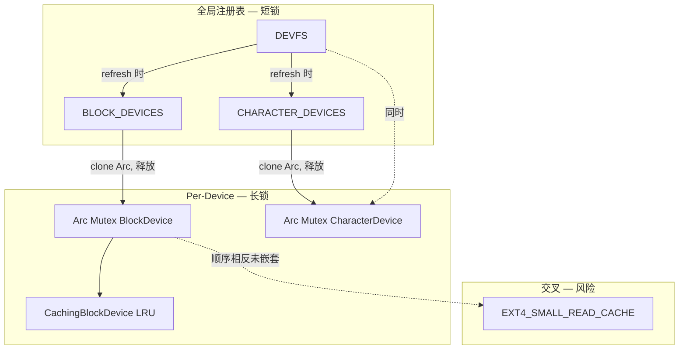

# 锁机制审计：BLOCK_DEVICES / CachingBlockDevice / CHARACTER_DEVICES

> 审计范围：清单 #22–#24（`driver-block-char` 分组）  
> Baseline：单核多线程；`spin::Mutex` 为自旋锁，持锁期间禁止调度/睡眠  
> 生成时间：2026-06-25  
> 审计状态：**已完成**（源码复核于 2026-06-25；**无已落地修复/收敛**）

---

## P0 / P1 / Fixed 摘要

| 级别 | ID | 问题 | 状态 |
|------|-----|------|------|
| **P0** | §5.2 | per-device 块锁覆盖 VirtIO I/O + LRU 全路径；同盘并发 I/O 长时间自旋/假死 | **开放** |
| **P0** | §5.6 | devfs `refresh` 持 `DEVFS` 锁期间调用 `character_device_kind_at`（嵌 per-char 设备锁）；与 `lookup_*` 反向可死锁 | **开放**（启动期单线程，运行时 refresh 未设计） |
| **P1** | §5.1 | `EXT4_SMALL_READ_CACHE` 与 `SharedBlockDevice` 锁顺序相反、全局单槽无设备锁协同；并发 RW 存在缓存一致性竞态 | **开放**（当前路径**未嵌套**持两锁，不构成经典 AB-BA，但维护风险高） |
| **P1** | §5.3 | 字符设备写路径持 `SharedCharacterDevice` Mutex 期间 UART THRE 自旋（`SPIN_TX_MAX = 10⁶`） | **开放** |
| **P1** | §5.4 | `serial_poll_revents` 两次 `device.lock()`；poll 可能消费字节 | **开放** |
| P2 | §5.5 | `BlockDevice::read_bytes` 默认实现于持锁上下文堆分配 | **开放** |
| P2 | §5.7 | LoongArch 串口未注册 `CHARACTER_DEVICES`，锁模型与 RISC-V 不一致 | **开放** |
| P3 | §5.8 | 注册表仅追加、无 `unregister` | **开放**（设计假设，非锁泄漏） |
| — | 本组注册表 API | `BLOCK_DEVICES` / `CHARACTER_DEVICES` 短临界区、clone 后释表锁 | **正确** |
| — | `with_character_device` | 表锁 → clone → 释表锁 → 设备锁；**不嵌套** | **正确** |
| — | 收敛 warn（`[lock]` 宏） | 文档建议的不可靠路径 warn + 安全失败 | **未实现**（代码库无 `[lock]` 标记） |

**Fixed（本轮）**：无。

---

## 1. 概述

本组包含驱动层三类带锁结构：

| # | 名称 | 文件 | 锁类型 | 角色 |
|---|------|------|--------|------|
| 22 | `BLOCK_DEVICES` | `driver-block/block-api/api-v0/src/lib.rs` | `spin::Mutex<Vec<SharedBlockDevice>>` | 块设备全局注册表 |
| 23 | `CachingBlockDevice` + 包装层 | `driver-block/block-impl/impl-block-cache/` | 外层 `Arc<spin::Mutex<Box<dyn BlockDevice>>>`；LRU 无独立锁 | 写穿块缓存装饰器 |
| 24 | `CHARACTER_DEVICES` | `driver-character/character-api/api-v0/src/lib.rs` | `spin::Mutex<Vec<SharedCharacterDevice>>` | 字符设备全局注册表 |

共享句柄类型：

```rust
pub type SharedBlockDevice     = Arc<Mutex<Box<dyn BlockDevice>>>;
pub type SharedCharacterDevice = Arc<Mutex<Box<dyn CharacterDevice>>>;
```

**双层锁模型**：全局注册表锁（短临界区，克隆 `Arc` 即释放）+ per-device `Arc<Mutex>`（I/O 路径持锁区间长）。`CachingBlockDevice` 本身无内部 Mutex，LRU 状态完全依赖外层 per-device 锁保护。

---

## 2. 锁调用点清单

### 2.1 `BLOCK_DEVICES`

| 函数 | 操作 | 持锁区间 |
|------|------|----------|
| `register_block_device` | `lock` → `push` → 隐式 `unlock` | 仅 Vec 修改 |
| `block_device_count` | `lock` → `len` | 极短 |
| `first_block_device` | `lock` → `first().cloned()` | 极短 |
| `block_device_at` | `lock` → `get().cloned()` | 极短 |

**无** `with_block_device` 辅助函数；调用方自行 `device.lock()`。

### 2.2 `CachingBlockDevice` / `BlockCacheManager`

| 位置 | 锁 | 说明 |
|------|-----|------|
| `BlockCacheManager::wrap` | 构造 `Arc::new(Mutex::new(cached))` | 注册前一次性包装 |
| `CachingBlockDevice::{read,write}_blocks` | 无直接 lock；由调用方持有外层 Mutex | 见 §4 |
| `BlockCacheManager::flush_all` | 无 | 写穿策略下为 no-op |

启用路径：`impl-qemu-riscv64-opensbi` 在 `feature = "block-cache"` 下调用 `BlockCacheManager::wrap`。LoongArch 平台当前直接 `Arc::new(Mutex::new(dev))`，**未**启用缓存层。

### 2.3 `CHARACTER_DEVICES`

| 函数 | 操作 | 持锁区间 |
|------|------|----------|
| `register_character_device` | `lock` → `push` | 极短 |
| `character_device_count` | `lock` → `len` | 极短 |
| `character_device_at` | `lock` → `get().cloned()` | 极短 |
| `first_character_device` | `lock` → `first().cloned()` | 极短 |
| `with_character_device` | `character_device_at`（表锁）→ `dev.lock()`（设备锁）→ `f` | 两段式，**不嵌套**表锁与设备锁 |
| `character_device_kind_at` | 委托 `with_character_device` | 同上 |

---

## 3. 主要调用链与持锁区间

### 3.1 块设备路径

```
平台 probe (riscv/loongarch)
  └─ register_block_device(Arc<Mutex<...>>)     [BLOCK_DEVICES 短锁]
  └─ devfs_impl::refresh()
       └─ block_device_at(idx)                   [BLOCK_DEVICES 短锁，clone Arc]
       └─ 存入 DEVFS.block_bindings              [DEVFS 锁，见交叉关注]

rootfs mount
  └─ lookup_block_device(path) → SharedBlockDevice
  └─ probe_ext4_magic / Ext4::load
       └─ device.lock().read_bytes/read_blocks   [per-device 长锁]

ext4 RW (impl-ext4/rw.rs)
  └─ read_with_small_cache / block_write_bytes
       └─ dev.lock()                             [per-device 长锁]
       └─ EXT4_SMALL_READ_CACHE.lock()           [交叉锁，见 §5.1]

CachingBlockDevice::read_blocks（外层 Mutex 已持有）
  └─ cache_copy_out / cache_put                   [LRU，同锁内]
  └─ inner.read_blocks(...)                       [VirtIO 轮询/DMA，同锁内]
```

### 3.2 字符设备路径

```
平台 probe (riscv)
  └─ register_character_device(Arc<Mutex<SerialPortCharacterDevice>>)
  └─ register_builtin_character_devices()       [rtc-stub / null-stub]

devfs refresh
  └─ character_device_at + character_device_kind_at  [表锁 + 设备锁]

VFS open (/dev/console, /dev/ttyS0, …)
  └─ lookup_character_device → CharDevHandle

CharDevHandle (char_dev_handle.rs)
  └─ read/write/poll/ioctl → self.device.lock()
  └─ serial_poll_revents: 连续两次 device.lock()  [见 §5.4]

fd session 默认 stdin/stdout
  └─ default_serial_device()
       └─ character_device_kind_at(idx) × N       [启动期 O(n) 重复加锁]
```

### 3.3 全局锁与 per-device 锁的嵌套关系

| 场景 | 锁顺序 | 是否嵌套同一时刻 |
|------|--------|------------------|
| `register_*` | 仅全局表 | 否 |
| `block_device_at` + I/O | 表锁（clone）→ 释放 → 设备锁 | **否**（正确） |
| `with_character_device` | 表锁（clone）→ 释放 → 设备锁 | **否**（正确） |
| `devfs refresh` | DEVFS → 多次 BLOCK_DEVICES/CHARACTER_DEVICES 短锁 → 偶发 per-char 设备锁 | DEVFS 与 per-char 设备锁**同时持有** |
| ext4 + 小读缓存 | 读 miss：`dev` → 释 → `EXT4`；写：`EXT4` → 释 → `dev` | **否**（顺序相反但未嵌套） |

**结论**：BLOCK_DEVICES / CHARACTER_DEVICES 与 per-device Mutex **未设计为嵌套持有**；`Arc::clone` 后释放表锁再操作设备，注册表路径本身无 AB-BA 死锁。风险集中在 **per-device 长持锁区间**、**EXT4 小读缓存一致性**、**devfs refresh 与 lookup 的 DEVFS↔char 交叉锁**。

---

## 4. CachingBlockDevice LRU 持锁区间分析

`CachingBlockDevice` 无独立锁；所有 LRU 操作（`touch_lru`、`alloc_slot`、`evict_lru_slot`、`cache_put`、`cache_copy_out`）在 `BlockDevice::read_blocks` / `write_blocks` 调用栈内执行，即 **外层 `SharedBlockDevice` Mutex 整个 I/O 期间持锁**。

### 4.1 `read_blocks` 持锁区间（capacity > 0）

```
[获取外层 Mutex]
  while i < nblocks:
    cache_copy_out (命中) → touch_lru          // 快路径
    或:
      扫描连续未命中 run
      inner.read_blocks(run)                   // ⚠ VirtIO 后端 I/O，可能长时间自旋
      for k in i..j: cache_put                 // 填入 LRU
[释放外层 Mutex]
```

**关键点**：

1. **合并未命中读**：连续 miss 合并为一次 `inner.read_blocks`，减少 VirtIO 往返，但持锁时间随 run 长度线性增长。
2. **写穿**：`write_blocks` 先 `inner.write_blocks` 再更新已缓存行；写路径同样全程持锁。
3. **无 flush 语义**：`flush()` / `BlockCacheManager::flush_all()` 均为 no-op；写穿下无脏页，但将来若改 write-back 须重新划分持锁区间。
4. **默认 `read_bytes`**（trait 默认实现）：在已持锁的调用栈内 `vec![0u8; scratch_len]` 堆分配，进一步拉长临界区（ext4 RO 路径经 `BlockDeviceReader` 触发）。

### 4.2 与 VirtIO 的叠加效应

`VirtioBlkDevice::read_blocks` → `virtio-drivers` 队列提交 + 完成轮询。单核多线程下，另一线程对**同一** `SharedBlockDevice` 的任何操作（第二次 ext4 读、probe、自检 `virtio_blk_probe_test`）均自旋等待，表现为 **卡死/假死**，尤其在 LTP 等高并发 I/O 测试中。

---

## 5. 潜在问题列表

### 5.1 [P1] `EXT4_SMALL_READ_CACHE` 与 per-device 块锁：顺序相反 + 缓存一致性

**位置**：`fs-impl/impl-ext4/src/rw.rs`（非本 crate，但由块设备 I/O 触发）

| 路径 | 顺序 |
|------|------|
| `read_with_small_cache`（miss，≤64B 单块） | `dev.lock()` → 释 → `EXT4_SMALL_READ_CACHE.lock()` |
| `read_with_small_cache`（跨块/大读） | 仅 `dev.lock()` |
| `block_write_bytes` | `invalidate_small_read_cache`（**先** EXT4 缓存锁）→ `dev.lock()` |

**复核结论**：各路径对两把锁均为**顺序获取、从不嵌套**——写路径在 `invalidate` 完全释锁后才 `dev.lock()`（L164–165）；读 miss 在 `dev` 释锁后才更新 EXT4 缓存（L78–86）。因此**当前代码不构成经典 AB-BA 死锁**。

仍存在的风险：

1. **锁顺序未文档化**：读 miss 为 `dev→EXT4`，写为 `EXT4→dev`；后续维护若在某路径嵌套持锁，易引入死锁。
2. **全局单槽缓存无设备锁协同**：线程 A 读 miss 在释 `dev` 后填缓存前，线程 B 可 `invalidate` 或并发 miss，导致 stale 命中或重复 I/O。
3. **大读路径**（L59–62）持 `dev` 锁调用 `read_bytes`，与小读缓存无关，但拉长 per-device 临界区。

**收敛建议**：

- 固定全局顺序（先 `EXT4_SMALL_READ_CACHE` 后 `SharedBlockDevice`），或把小读缓存移入 `CachingBlockDevice`（已有 per-device 锁）；
- 并发 RW 路径加 warn 并返回 `DriverError::Unsupported` 直至顺序统一。

```rust
logging::warn!(
    "[lock] EXT4_SMALL_READ_CACHE: concurrent rw cache coherency risk, op={}, loc={}:{}",
    "read/write", file!(), line!()
);
```

---

### 5.2 [P0] per-device 块锁长持锁：VirtIO I/O + LRU 同锁

**位置**：`CachingBlockDevice::read_blocks` / `write_blocks`；无缓存时同理（`VirtioBlkDevice`）。

**表现**：

- 持锁覆盖完整 VirtIO 传输 + LRU 驱逐/插入；
- 同盘并发 I/O 完全串行；
- 单核多线程下其他任务自旋等待，测试表现为主线程/工作线程 **长时间无进展**。

**收敛建议**（短期）：

- 文档标注「单块设备不支持并发 I/O」；
- `capacity_blocks == 0` 透传路径已存在，可作调试降级；
- 长期：缓存层改用「短锁填槽 + 无锁只读槽」或 I/O 在锁外提交、完成回调填缓存。

---

### 5.3 [P1] 字符设备写路径持锁期间 UART 自旋

**位置**：`SerialPortCharacterDevice::write` → `SerialPort::write_all` → `write_byte`（`SPIN_TX_MAX = 1_000_000`，`impl-qemu-riscv64-opensbi/src/uart.rs:22`）

`CharDevHandle::write` 先 `device.lock()` 再写 UART。长输出（如 `printf` 大量文本）期间 **独占字符设备 Mutex**，其他任务对同一 UART 的 read/poll/write 全部自旋。

**收敛建议**：

- warn + 限制单次 write 字节数并在锁外分批；
- 或将 THRE 等待移出 Mutex（需仔细处理并发写语义）。

---

### 5.4 [P1] `serial_poll_revents` 重复加锁与语义偏差

**位置**：`vfs-impl/impl-fd-session/src/char_dev_handle.rs:150–174`

1. 第一次 `device.lock()`：调用 `poll_revents`（内部 `try_read_byte` 可能**消费**一字节）；
2. `drop(guard)` 后第二次 `device.lock()`：`read` 探测是否有数据。

可能导致：poll 报 POLLIN 但后续 read 无数据，或字节在第一次 poll 被消耗。属 **语义/竞态**，在单线程 poll→read 时偶发；多线程下加剧。

**收敛建议**：合并为单次持锁，或 poll 使用不消费数据的 `peek` 接口。

---

### 5.5 [P2] `BlockDevice::read_bytes` 默认实现堆分配于持锁上下文

**位置**：`block-api/api-v0/src/lib.rs:51–84`；调用方 `impl-ext4/ro.rs` 的 `BlockDeviceReader`

每次 `read_bytes` 在 caller 已持 `device.lock()` 时 `vec![0u8; scratch_len]`。大跨度读放大持锁时间与堆压力。

**收敛建议**：ext4 路径改用 `read_blocks` + 栈/复用缓冲；或在 `CachingBlockDevice` 层 override `read_bytes` 利用槽位缓冲。

---

### 5.6 [P0] devfs refresh 持 DEVFS 锁期间查询字符设备 kind

**位置**：`fs-devfs/devfs-impl/impl-kernel/src/lib.rs:65–103`

`DEVFS.lock()` 全程持有，循环内调用 `character_device_kind_at(idx)` → 获取 per-char 设备锁。若某任务正持有该字符设备锁并调用 `lookup_character_device`（需 DEVFS 锁，L191–198），将 **互相自旋**（DEVFS ↔ per-char）。

启动期单线程 refresh 风险低；若将来支持运行时 refresh，需缩短 DEVFS 临界区或 refresh 前预收集 kind（不持 DEVFS 调 per-device 锁）。

---

### 5.7 [P2] LoongArch 串口未注册到 `CHARACTER_DEVICES`

**位置**：`impl-qemu-loongarch64-virt` 使用独立 `UART_GLOBAL`；`register_builtin_character_devices` 仅注册 rtc/null stub。

VFS 默认 stdin/stdout 走 `default_serial_device()` 可能找不到 Serial kind 设备，回退 `ConsoleInHandle`/`ConsoleOutHandle`，与 RISC-V 路径锁模型不一致。属 **覆盖范围** 问题，非直接死锁，但审计时需标注平台差异。

---

### 5.8 [P3] 注册表仅追加、无卸载

`BLOCK_DEVICES` / `CHARACTER_DEVICES` 无 `unregister`；设备生命周期与 `Arc` 引用绑定。热插拔场景下表只增不减，无锁泄漏，但索引稳定性依赖「只注册不删除」假设。

---

## 6. 当前实际支持范围

| 路径 | 加锁是否正确 | 说明 |
|------|-------------|------|
| 启动期 `register_block_device` / `register_character_device` | ✅ | 单线程 probe，短临界区 |
| `block_device_at` / `character_device_at` + clone | ✅ | 表锁不嵌套设备锁 |
| 单线程 ext4 RO/RW 顺序 I/O | ⚠️ | 可用；长持锁致延迟 |
| 多线程同盘并发 ext4 RW | ❌ | §5.2 串行/自旋；§5.1 缓存一致性 |
| RISC-V + block-cache | ⚠️ | LRU 与 VirtIO 同锁，§5.2 |
| LoongArch 无 block-cache | ⚠️ | 仍有 §5.2（VirtIO 层） |
| 字符设备单 fd read/write | ✅ | 单客户端 |
| 多 fd 共享 `/dev/console`（duplicate） | ⚠️ | 共享 `Arc<Mutex>`，写路径 §5.3 |
| `poll` + `read` 串口 | ⚠️ | §5.4 语义 |
| devfs refresh @ runtime | ❌ | 未设计；§5.6 |
| 块设备 `with_*` 辅助 API | 部分 | 字符有 `with_character_device`，块设备无对等 API |

---

## 7. 收敛建议汇总

| 优先级 | 问题 | 建议动作 |
|--------|------|----------|
| P0 | §5.2 块设备长持锁 | 标注不支持并发 I/O；评估锁外 I/O |
| P0 | §5.6 devfs refresh 交叉锁 | refresh 不持 DEVFS 调 per-device；或禁止运行时 refresh |
| P1 | §5.1 EXT4 小读缓存 | 统一锁顺序或移入块缓存层；并发 RW warn |
| P1 | §5.3 UART 写自旋持锁 | 缩短临界区或分批 write |
| P1 | §5.4 poll 双锁 | 合并持锁区间 / peek 接口 |
| P2 | §5.5 read_bytes 堆分配 | ext4 改 read_blocks |
| P2 | §5.7 LoongArch UART 注册 | 与 RISC-V 对齐注册 CHARACTER_DEVICES |
| P3 | §5.8 无 unregister | 文档化生命周期假设 |

**建议 warn 模板**（不可靠路径）：

```rust
logging::warn!(
    "[lock] {}: concurrent {} on same handle unsupported, loc={}:{}",
    "SharedBlockDevice", "read_blocks", file!(), line!()
);
// 返回 DriverError::Unsupported 或降级为单线程模式
```

---

## 8. 锁顺序参考图



---

## 9. 相关文件索引

| 文件 | 关联 |
|------|------|
| `driver-block/block-api/api-v0/src/lib.rs` | BLOCK_DEVICES、BlockDevice trait |
| `driver-block/block-impl/impl-block-cache/src/lib.rs` | CachingBlockDevice LRU |
| `driver-block/block-impl/impl-block-cache/src/manager.rs` | BlockCacheManager::wrap |
| `driver-character/character-api/api-v0/src/lib.rs` | CHARACTER_DEVICES |
| `vfs-impl/impl-fd-session/src/char_dev_handle.rs` | VFS 字符设备持锁 |
| `vfs-impl/impl-fd-session/src/registry.rs` | 默认 stdin/stdout 设备选择 |
| `fs-devfs/devfs-impl/impl-kernel/src/lib.rs` | devfs refresh 交叉锁 |
| `fs-impl/impl-ext4/src/rw.rs` | EXT4_SMALL_READ_CACHE 交叉锁 |
| `fs-impl/impl-ext4/src/ro.rs` | read_bytes 持锁读 |
| `driver-impl/impl-qemu-riscv64-opensbi/src/lib.rs` | block-cache 注册 |
| `driver-impl/impl-qemu-loongarch64-virt/src/lib.rs` | 无 block-cache |

---

## 10. Top 3 高优先级问题（摘要）

1. **per-device 块锁覆盖 VirtIO I/O + LRU 全路径（§5.2）**  
   `CachingBlockDevice`（及裸 VirtIO）在单次 `read_blocks`/`write_blocks` 内持锁直至 DMA 完成；同盘并发访问导致 **长时间自旋/假死**。

2. **devfs refresh 与 lookup 的 DEVFS↔字符设备锁交叉（§5.6）**  
   `refresh` 持 `DEVFS` 期间调 `character_device_kind_at`；与 `lookup_character_device` 反向路径可 **互相自旋**（运行时 refresh 未启用，属设计债）。

3. **字符设备写路径持锁 UART 自旋（§5.3）**  
   `CharDevHandle::write` 持 `SharedCharacterDevice` Mutex 期间执行最多 10⁶ 次 THRE 自旋；多 fd 或读写并发时 **独占 UART 锁**，易触发测试卡死。
