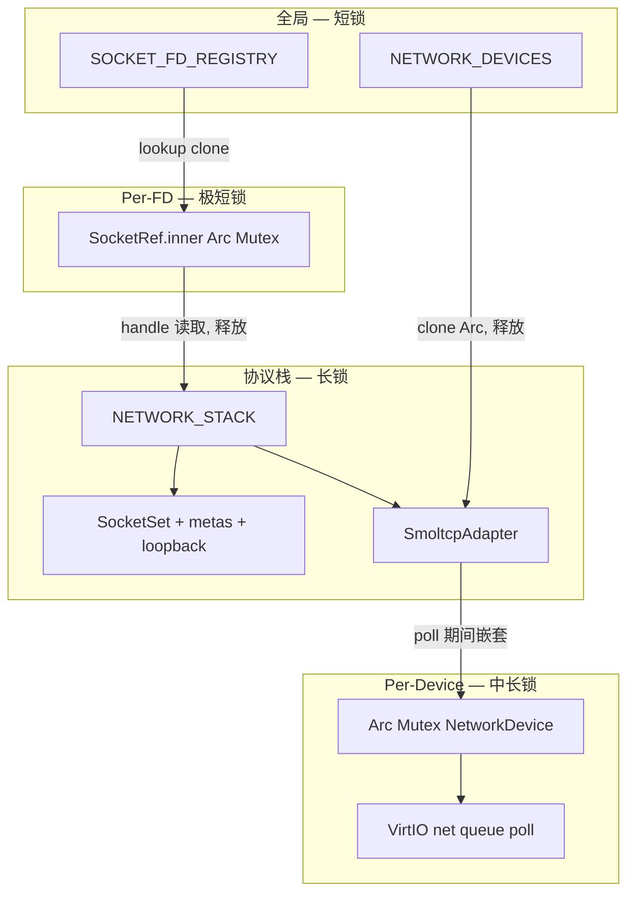

# 锁机制审计：NETWORK_DEVICES / NETWORK_STACK / SocketHandle.inner

> 审计范围：清单 #25–#27（`driver-network` 分组）  
> 关联路径：`poll_engine.rs`、inet socket 相关 syscall、`network_poller_task`  
> Baseline：单核多线程；`spin::Mutex` 为自旋锁，持锁期间禁止调度/睡眠  
> 生成时间：2026-06-25（源码复核：2026-06-25）

---

## 0. P0 / P1 / Fixed 摘要

### P0（易导致卡死/假死，未修复）

| ID | 问题 | 位置 | 状态 |
|----|------|------|------|
| P0-1 | `NETWORK_STACK` 单 Mutex 覆盖 smoltcp 全栈 poll + 全部 socket 操作；`network_poller_task` 与 syscall 阻塞循环**自旋竞争同一把锁** | `driver-network/src/lib.rs` `stack::*`；`main.rs` `network_poller_task` | **开放** |
| P0-2 | `poll_at_millis` 持 `NETWORK_STACK` 期间在 `SmoltcpAdapter` 内嵌套 `SharedNetworkDevice` 锁执行 VirtIO send/receive；临界区极长，且对未来 device→stack 锁序反转构成**死锁隐患** | `impl-smoltcp/src/lib.rs`；`poll_at_millis` 调用链 | **开放** |

### P1（高延迟/锁放大，未修复）

| ID | 问题 | 位置 | 状态 |
|----|------|------|------|
| P1-1 | syscall 阻塞循环与 `poll_engine` 反复 `drive_network_stack`（每 tick 完整 `poll_at_millis` + `poll_socket_events`）；`socket_send`/`recv` 成功后再 poll ×2；`poll(2)` 每 fd 5~8 次独立加锁 | `recvfrom.rs`、`connect.rs`、`accept.rs`、`poll_engine.rs`；`stack::socket_send`/`socket_recv` | **开放** |
| P1-2 | `poll_block_until_ready` 对 socket fd **无 wait**（skip pipe wait），纯 `sleep_for_ticks(1)` 忙等；`still_waiting` 闭包内再次 `scan_count`→`drive_network_stack` | `poll_engine.rs:275–345` | **开放** |

### P2 / P3（语义/效率，未修复）

| ID | 问题 | 状态 |
|----|------|------|
| P2-1 | `SocketRef.inner` 与 `NETWORK_STACK` 非原子绑定（`handle()` 释 inner 锁后才进 stack）；`accept`+`replace_handle` TOCTOU | **开放** |
| P2-2 | `tcp_info` / `poll_socket_revents` 对 `NETWORK_STACK` 重复加锁（O(nfds×8)） | **开放** |
| P2-3 | 与 `SOCKET_FD_REGISTRY`（#31）交叉：须维持 registry→stack 顺序 | **文档约束** |
| P3-1 | 仅 `first_network_device()` 接入协议栈；注册表无 `with_network_device` | **开放** |
| P3-2 | `NETWORK_DEVICES` 无 unregister | **已知限制** |

### Fixed / 已确认正确（本轮无代码修复）

| 项 | 说明 |
|----|------|
| 持锁闭环 | 全部 `NETWORK_DEVICES` / `NETWORK_STACK` / `SocketRef.inner` 路径均为 RAII `MutexGuard`，**无漏释锁/重复释锁** |
| 锁序（当前代码） | `NETWORK_DEVICES` 与 `NETWORK_STACK` **从不嵌套**；`SocketRef.inner`→`NETWORK_STACK` **从不嵌套**；poll 路径固定为 `NETWORK_STACK`→`SharedNetworkDevice` |
| `NETWORK_DEVICES` | 四 API 均为极短临界区；`stack::init` clone Arc 后不再访问注册表 |
| loopback-only | 无 NIC 时不触发 per-device 嵌套锁 |
| 收敛 warn | 代码库中**尚未**添加 `[lock] NETWORK_STACK` 类 warn/安全失败；问题均标注为待实现 |

---

## 1. 概述

本组包含网络驱动与协议栈三层带锁结构：

| # | 名称 | 文件 | 锁类型 | 角色 |
|---|------|------|--------|------|
| 25 | `NETWORK_DEVICES` | `driver-network/network-api/api-v0/src/lib.rs` | `spin::Mutex<Vec<SharedNetworkDevice>>` | 网卡全局注册表 |
| 26 | `NETWORK_STACK` | `driver-network/src/lib.rs`（`stack` 模块） | `spin::Mutex<Option<NetworkStack>>` | smoltcp 协议栈全局状态 |
| 27 | `SocketHandle.inner` | `driver-network/src/socket_handles.rs` | `Arc<spin::Mutex<SocketHandle>>` | per-fd smoltcp 句柄映射 |

共享句柄类型：

```rust
pub type SharedNetworkDevice = Arc<Mutex<Box<dyn NetworkDevice>>>;

pub struct SocketRef {
    inner: Arc<Mutex<SocketHandle>>,  // smoltcp iface::SocketHandle
    inode: u64,
}
```

**三层锁模型**：

1. **全局注册表锁**（`NETWORK_DEVICES`，短临界区，clone `Arc` 即释放）
2. **per-device `Arc<Mutex>`**（VirtIO 网卡 `send`/`receive`，在 `SmoltcpAdapter` 内由协议栈 poll 路径触发）
3. **全局协议栈锁**（`NETWORK_STACK`，覆盖 smoltcp `Interface` + `SocketSet` + 全部 socket 元数据 + `SmoltcpAdapter`）
4. **per-fd 句柄锁**（`SocketRef.inner`，仅保护 smoltcp `SocketHandle` 整型 ID，供 `accept` 替换监听 socket 时使用）

当前实现**仅使用 `first_network_device()`** 绑定协议栈；多网卡注册后其余设备不会被 `stack::init` 使用。

---

## 2. 锁调用点清单

### 2.1 `NETWORK_DEVICES`

| 函数 | 操作 | 持锁区间 |
|------|------|----------|
| `register_network_device` | `lock` → `push` | 仅 Vec 修改 |
| `network_device_count` | `lock` → `len` | 极短 |
| `first_network_device` | `lock` → `first().cloned()` | 极短 |
| `network_device_at` | `lock` → `get().cloned()` | 极短 |

**无** `with_network_device` 辅助函数；`SmoltcpAdapter` 在 `stack::init` 时 clone `SharedNetworkDevice` 后长期持有，不再访问注册表。

### 2.2 `NETWORK_STACK`

| 函数/场景 | 操作 | 持锁区间 |
|-----------|------|----------|
| `stack::init` | `lock` → 构造 `NetworkStack` → `Some(...)` | 中等（堆分配 socket buffer） |
| `poll_at_millis` | `lock` → `iface.poll(...)` → 隐式释放 | **长**（含 smoltcp 全栈处理 + 嵌套 device 锁） |
| `poll_socket_events` | `lock` → 遍历 `metas` 更新 Connecting→Connected | 短～中 |
| `with_tcp_socket` / `with_udp_socket` | `lock` → `f(get_mut)` | 取决于回调 |
| `create_*_socket` / `socket_bind` / `socket_listen` / `socket_connect` / `socket_accept` / `socket_close` 等 | 各自 `lock` 全程或分段 | 中～长 |
| `socket_send` / `socket_recv` / `socket_sendto` | 先短锁读 meta → 释放 → `with_*_socket` → **释放后再 `poll()`** | 见 §4 |
| `socket_getsockopt(TCP_INFO)` → `tcp_info` | 多次独立 `lock`（`socket_is_connected`、`socket_send_capacity` 各锁一次） | 短 × N |
| `tcp_send` / `tcp_recv` 等兼容 API | 单次 `lock` 遍历全部 socket | 中 |

`NETWORK_STACK` 保护的内容：

- `SmoltcpAdapter`（内含 `Option<SharedNetworkDevice>`）
- smoltcp `Interface`、`SocketSet<'static>`
- `metas: BTreeMap<SocketHandle, SocketMeta>`
- UDP loopback 队列（`udp_loopback` / `udp_loopback_pending`）
- `ephemeral_port` 计数器

### 2.3 `SocketHandle.inner`（`SocketRef`）

| 方法 | 操作 | 持锁区间 |
|------|------|----------|
| `SocketRef::handle` | `inner.lock()` → 读取 `SocketHandle` | 极短 |
| `SocketRef::replace_handle` | `inner.lock()` → 写入新 handle | 极短（`accept` 替换监听 socket） |
| `TcpStreamHandle::poll_revents` | `handle()` → 多次 `stack::*` 调用 | inner 锁不嵌套 stack 锁 |
| `TcpStreamHandle::read/write/close` | `handle()` → `stack::socket_*` | 同上 |

`should_close_underlying` 使用 `Arc::strong_count`，**无锁**。

### 2.4 交叉：`SOCKET_FD_REGISTRY`（清单 #31，syscall 层）

inet syscall 典型顺序：

```
socket_fd::lookup(fd)          [SOCKET_FD_REGISTRY 短锁]
  → socket.handle()            [SocketRef.inner 短锁]
  → stack::socket_*()          [NETWORK_STACK 锁]
```

`poll_engine::poll_socket_revents` 对每个 socket fd 重复上述链条，且 `stack::socket_kind`、`socket_state`、`socket_can_recv` 等**各自独立加锁**。

---

## 3. 主要调用链与持锁区间

### 3.1 启动与协议栈初始化

```
平台 probe (riscv/loongarch)
  └─ register_network_device(Arc<Mutex<VirtioNet*>>)   [NETWORK_DEVICES 短锁]
  └─ kernel_main
       └─ stack::init(ip, gw)
            └─ first_network_device()                    [NETWORK_DEVICES 短锁，clone Arc]
            └─ SmoltcpAdapter::new(device)               [无锁，保存 SharedNetworkDevice]
            └─ *NETWORK_STACK.lock() = Some(...)         [NETWORK_STACK 锁，堆分配 TCP/UDP buffer]
       └─ spawn network_poller_task
            └─ loop: poll_at_millis + poll_socket_events  [NETWORK_STACK 长锁，见 §3.2]
```

### 3.2 协议栈 poll 路径（核心热路径）

```
network_poller_task / drive_network_stack (syscall & poll_engine)
  └─ stack::poll_at_millis(millis)
       └─ NETWORK_STACK.lock()
            └─ iface.poll(timestamp, adapter, sockets)
                 └─ SmoltcpAdapter::receive/transmit
                      └─ dev_handle.lock().receive/send   [⚠ 嵌套：STACK → per-device]
                      └─ VirtIONetDevice::receive/send    [VirtIO 队列轮询，可能长时间自旋]
       └─ [释放 NETWORK_STACK]

  └─ stack::poll_socket_events()
       └─ NETWORK_STACK.lock() → 更新 Connecting→Connected
```

### 3.3 Syscall I/O 路径（以 TCP recv 为例）

```
sys_recvfrom / read (socket fd)
  └─ socket_fd::lookup(fd)                               [SOCKET_FD_REGISTRY]
  └─ socket.handle()                                      [SocketRef.inner]
  └─ loop (默认最多 4096 tick，`SO_RCVTIMEO` 可覆盖):
       └─ drive_network_stack()                          [NETWORK_STACK 长锁 ×1]
       └─ stack::socket_can_recv / socket_may_recv / socket_state  [各独立加锁 ×3]
       └─ stack::socket_recv
            └─ with_tcp_socket → recv_slice               [NETWORK_STACK 锁]
            └─ poll() + poll_socket_events()              [NETWORK_STACK 长锁 ×2，成功时]
       └─ task::sleep_for_ticks(1)                        [释放所有锁后睡眠]

connect / accept 阻塞路径（`socket_blocking_tick`）:
  └─ loop (无 tick 上限，直至连接/入连接就绪或 EINTR):
       └─ drive_network_stack()                          [每 tick 完整 poll]
       └─ stack::socket_is_connected / socket_has_pending_accept  [各独立加锁]
       └─ task::sleep_for_ticks(1)
```

### 3.4 poll/select 路径

```
poll / ppoll / select / pselect6
  └─ scan_pollfds / scan_fd_sets
       └─ drive_network_stack()                          [NETWORK_STACK 长锁]
       └─ for each fd:
            └─ poll_socket_revents(fd, events)
                 └─ socket_fd::lookup                    [SOCKET_FD_REGISTRY]
                 └─ stack::socket_kind / socket_state / socket_*  [NETWORK_STACK ×5~8/fd]
  └─ poll_block_until_ready (仅 pipe 走 poll_wait_for_ticks；socket 靠 sleep/yield)
       └─ loop: scan_count → drive_network_stack()       [每轮完整 poll]
```

### 3.5 全局锁嵌套关系

| 场景 | 锁顺序 | 同一时刻嵌套 |
|------|--------|-------------|
| `register_network_device` | 仅 NETWORK_DEVICES | 否 |
| `stack::init` | NETWORK_DEVICES（clone）→ 释放 → NETWORK_STACK | 否 |
| `poll_at_millis` | NETWORK_STACK → SharedNetworkDevice | **是**（poll 全程） |
| `SmoltcpTxToken::consume`（在 poll 内） | NETWORK_STACK → SharedNetworkDevice | **是** |
| syscall `socket_*` | SocketRef.inner → 释放 → NETWORK_STACK | 否 |
| `socket_send` 成功路径 | NETWORK_STACK → 释放 → NETWORK_STACK（poll） | 否（顺序重入，非嵌套） |
| `NETWORK_DEVICES` + `NETWORK_STACK` | 无并发路径同时持有 | 否 |

**结论**：注册表与协议栈锁**未设计为嵌套**；风险集中在 **`NETWORK_STACK` 长持锁区间**及其与 **per-device VirtIO 锁的嵌套**，以及 **syscall/poll 路径对 `NETWORK_STACK` 的反复加锁与 `network_poller_task` 竞争**。

---

## 4. `NETWORK_STACK` 持锁区间分析

### 4.1 `poll_at_millis` — 最长临界区

```
[获取 NETWORK_STACK]
  iface.poll(timestamp, adapter, sockets)
    ├─ adapter.receive → dev.lock().receive()     // VirtIO RX 轮询
    ├─ TCP/UDP/ARP/IP 状态机处理
    └─ adapter.transmit → dev.lock().send()       // VirtIO TX 提交
[释放 NETWORK_STACK]
```

**关键点**：

1. **单锁保护整个协议栈**：所有 socket 操作、元数据、loopback 队列与 smoltcp 内部状态在同一 Mutex 下。
2. **嵌套 per-device 锁**：poll 期间持有 `NETWORK_STACK`，同时在 adapter 内获取 `SharedNetworkDevice` Mutex；VirtIO `send`/`receive` 含队列完成轮询，临界区进一步拉长。
3. **与 poller 任务叠加**：`network_poller_task` 每 tick 调用 `poll_at_millis`；任意 syscall 阻塞循环内也调用 `drive_network_stack()`，多任务**自旋竞争同一 `NETWORK_STACK`**。
4. **`socket_send`/`socket_recv` 额外 poll**：I/O 成功后再次 `poll()` + `poll_socket_events()`，单次 send/recv 最多 **3 次**完整 stack 加锁。

### 4.2 `SocketRef.inner` — 极短 per-fd 锁

`inner` 仅存储 smoltcp `SocketHandle`（数组下标），不保护 socket 数据面。`accept` 通过 `replace_handle` 将监听 fd 的 handle 替换为新监听器，已连接 fd 使用新 `SocketRef`。

`handle()` 与 `stack::*` 之间**无原子绑定**：高并发下（若将来多核）存在 handle 读取与 stack 操作之间的 TOCTOU 窗口；单核 cooperative 调度下风险较低。

---

## 5. 潜在问题列表

### 5.1 [严重] `NETWORK_STACK` 全局锁覆盖 poll + 全部 socket 操作

**位置**：`driver-network/src/lib.rs` `stack` 模块；所有 `stack::*` API。

**表现**：

- `poll_at_millis` 持锁直至 smoltcp 完整处理一轮收发包；
- 任意 `socket_bind`/`connect`/`send`/`recv`/`accept`/`close` 与 poll **完全串行**；
- `network_poller_task` 与 syscall 阻塞循环（connect/accept **无 tick 上限**、recv 默认 4096 tick）**竞争同一自旋锁**；
- 单核多线程下，等锁任务长时间无进展，LTP/netperf/iperf 类测试易出现 **假死或极高延迟**。

**收敛建议**：

- 短期：文档标注「网络栈不支持并发 syscall」；评估降低 poller 频率或 syscall 内 `drive_network_stack` 调用次数；
- 中期：拆分 `NETWORK_STACK` 为「device poll 锁」+「socket 表锁」，或改用 `UniprocessorSafeCell` 明确单核语义；
- 长期：锁外提交 VirtIO I/O，completion 回调再入栈。

```rust
logging::warn!(
    "[lock] NETWORK_STACK: poll held {} ms, blocked syscalls may spin",
    elapsed_ms
);
```

---

### 5.2 [严重] poll 路径嵌套 `SharedNetworkDevice` 长持锁

**位置**：`impl-smoltcp/src/lib.rs` `SmoltcpAdapter::{receive, transmit}`、`SmoltcpTxToken::consume`；`poll_at_millis` 调用链。

**锁顺序**：`NETWORK_STACK` → `SharedNetworkDevice`（固定顺序，当前无 AB-BA）。

**表现**：

- 持 `NETWORK_STACK` 期间调用 `dev.lock().receive()` / `send()`；
- VirtIO net 队列提交与完成轮询在 **双层锁内**执行；
- 所有 socket syscall 等锁期间，**网卡 I/O 亦被阻塞**；
- 若将来有代码在持有 `SharedNetworkDevice` 锁时调用 `stack::*`（锁顺序反转），将 **死锁**——当前代码库无此路径，但缺少类型/API 层防护。

**收敛建议**：

- 在 `NetworkDevice` trait 文档中强制「禁止在 device 锁内调用 stack API」；
- 考虑 `SmoltcpAdapter` 在 poll 入口 clone `SharedNetworkDevice` Arc 后 **释放 stack 锁再 I/O**（需重构 smoltcp 集成方式）；
- 交叉路径加 warn（见模板）。

---

### 5.3 [高] I/O 与 poll 路径反复 `drive_network_stack` 放大竞争

**位置**：

- `recvfrom.rs` / `read.rs` / `connect.rs` / `accept.rs` / `sendto.rs` / `write.rs` / `sendmsg.rs` 中 `drive_network_stack`
- `poll_engine.rs` `scan_pollfds` / `scan_fd_sets` / `poll_block_until_ready`
- `stack::socket_send` / `socket_recv` / `socket_sendto` 成功后的额外 `poll()`

**表现**：

- 阻塞 recv 循环：每 tick 至少 1 次完整 `poll_at_millis` + 1 次 `poll_socket_events` + 多次独立 `stack::socket_*` 加锁；
- `socket_send` 成功后再 poll 两次；
- `poll(2)` 扫描 N 个 socket fd：先 `drive_network_stack`，再每 fd 5~8 次 `NETWORK_STACK` 加锁；
- 与 `network_poller_task` 叠加，**锁获取次数 O(ticks × syscalls × fds)**，单核自旋开销显著。

**收敛建议**：

- syscall 阻塞循环改为「仅 `poll_socket_events` + 状态查询」，完整 `poll_at_millis` 交给 poller 任务（需验证 liveness）；
- `poll_socket_revents` 合并为单次 `stack::with_stack_snapshot` 批量查询；
- `socket_send` 去掉同步 `poll()`，依赖 poller（或显式 `if !poller_recently_ran` 门槛）。

---

### 5.4 [高] `poll_engine` 对 socket fd 无专用 wait，纯 sleep/yield 忙等

**位置**：`poll_engine.rs:315–345`（`poll_block_until_ready`）、`poll_block_fd_sets`

**表现**：

- pipe fd 使用 `poll_wait_for_ticks` 可阻塞等待；
- socket fd 在 `poll_wait_pipe_fds` / `poll_wait_monitored_fds` 中 **被 skip**（`socket_fd::lookup` 命中则 `continue`）；
- socket-only 的 `poll`/`select` 仅靠 `sleep_for_ticks(1)` 或 `yield_now` × 4 轮询；
- 每轮 `scan_count` 仍调用 `drive_network_stack`（持 `NETWORK_STACK` 长锁）。

**收敛建议**：

- 为 socket 增加 `stack::wait_socket_ready(handle, events, ticks)` 批量等待接口，内部一次加锁完成 drive + 状态检查；
- 或让 poller task 通过 wait queue 唤醒 blocked poll（类似 pipe 模型）。

---

### 5.5 [中] `SocketRef.inner` 与 `NETWORK_STACK` 非原子 handle 绑定

**位置**：`socket_handles.rs`；`accept.rs` `replace_handle`；所有 `socket.handle()` + `stack::*` 调用点。

**表现**：

- `handle()` 释放 inner 锁后才进入 `stack::socket_accept` 等；
- `accept` 将 listener fd 的 handle 替换为新监听器，若将来多核并发对同一 `SocketRef` 读写，可能用 **过期 handle** 操作 stack；
- `TcpStreamHandle::poll_revents` 连续 4~5 次 `stack::*` 调用，期间 handle 可能被 `accept` 替换（监听 socket 场景）。

**收敛建议**：

- 提供 `stack::with_socket_ref(socket: &SocketRef, f)` 在 **一次 inner 锁内**完成 handle 读取 + stack 操作（需避免 inner→stack 嵌套死锁：inner 锁区间必须短于 stack 锁，或复制 handle 后释放 inner 再锁 stack——当前模式）；
- 监听 socket 的 `poll_revents` 应走 `socket_has_pending_accept` 专用路径（`poll_engine` 已实现，VfsIoHandle 版 `TcpListenerHandle` 未实现 `poll_revents`）。

---

### 5.6 [中] `tcp_info` / `poll_socket_revents` 重复加锁

**位置**：`stack::tcp_info`；`poll_engine::poll_socket_revents`

**表现**：

- `getsockopt(TCP_INFO)` 触发 `tcp_info`，内部 `socket_is_connected`、`socket_send_capacity` 各获取一次 `NETWORK_STACK`；
- 单 fd poll 扫描：`socket_kind` + `socket_state` + `socket_can_recv` + `socket_may_recv` + `socket_send_capacity` 等 **5~8 次**独立加锁；
- 多 fd `poll` 放大为 **O(nfds × 8)** 次自旋锁操作。

**收敛建议**：

- 增加 `stack::inspect_tcp(handle) -> TcpSnapshot` 单次加锁返回只读快照；
- `poll_socket_revents` 改用快照 API。

---

### 5.7 [中] 交叉关注：`SOCKET_FD_REGISTRY`（#31）与 `NETWORK_STACK` 顺序

**位置**：`socket_fd.rs`；各 inet syscall。

**表现**：

- 典型顺序：先 `SOCKET_FD_REGISTRY` 后 `NETWORK_STACK`，不嵌套；
- `lookup_or_errno` 失败路径调用 `vfs::fd::with_current_io`（临时移出 fd 表），与 pipe poll 注释中的 `POLLNVAL` 问题类似，但 socket 走 registry 优先，**风险较低**；
- `fork`/`exec` 时 `copy_from_parent` / `share_from_parent` 持有 `SOCKET_FD_REGISTRY` 克隆全部 socket 映射，与 stack 无交叉。

**收敛建议**：维持「先 registry 后 stack」顺序；新增 syscall 时禁止在持有 `NETWORK_STACK` 时调用 `socket_fd::lookup`。

---

### 5.8 [低] 仅绑定第一块网卡；注册表无 `with_*` API

**位置**：`stack::init` → `first_network_device()`；`network-api/api-v0/src/lib.rs`

**表现**：

- 多块 VirtIO net 注册时仅第一块接入 smoltcp；
- 与 `BLOCK_DEVICES` 类似，无 `with_network_device` 辅助函数；
- 非锁 bug，但影响多 NIC 场景下的锁竞争分布（所有流量挤在同一 device Mutex）。

---

### 5.9 [低] 注册表仅追加、无卸载

`NETWORK_DEVICES` 无 `unregister`；`stack::init` 仅启动期调用一次。热插拔场景表只增不减，无锁泄漏，但索引稳定性依赖「只注册不删除」假设。

---

## 6. 当前实际支持范围

| 路径 | 加锁是否正确 | 说明 |
|------|-------------|------|
| 启动期 `register_network_device` + `stack::init` | ✅ | 单线程 bring-up，顺序正确 |
| `network_device_at` + clone | ✅ | 表锁不嵌套 stack 锁 |
| `network_poller_task` 周期 poll | ⚠️ | 与 syscall 竞争 §5.1 |
| 单线程顺序 socket I/O | ⚠️ | 可用；反复 poll 致延迟 §5.3 |
| 多线程并发 socket syscall | ❌ | 全局 `NETWORK_STACK` 串行 + 自旋 §5.1 |
| 多线程 poll + send/recv | ❌ | §5.1 + §5.3 |
| TCP connect/accept 阻塞等待 | ⚠️ | 无限循环 + 每 tick drive_network_stack §5.3 |
| poll/select 仅 socket fd | ⚠️ | 无 socket wait，sleep 忙等 §5.4 |
| poll/select 混合 pipe + socket | ⚠️ | pipe 可 wait，socket 仍 busy-loop |
| `accept` + `replace_handle` | ⚠️ | 单核 OK；§5.5 TOCTOU |
| loopback-only（无 NIC） | ✅ | 不触发 per-device 锁 |
| 多 NIC 注册 | ⚠️ | 仅第一块接入 §5.8 |
| `getsockopt(TCP_INFO)` under load | ⚠️ | §5.6 重复加锁 |

---

## 7. 收敛建议汇总

| 优先级 | 问题 | 建议动作 |
|--------|------|----------|
| P0 | §5.1 全局 `NETWORK_STACK` 长持锁 | 拆分锁或锁外 I/O；标注不支持并发 syscall |
| P0 | §5.2 poll 嵌套 device 锁 | 文档强制锁顺序；评估 poll 期间释放 stack 锁 |
| P1 | §5.3 反复 drive_network_stack | 减少 syscall 内 full poll；send 后去掉同步 poll |
| P1 | §5.4 poll socket 无 wait | 增加 stack wait 接口或 poller 唤醒 |
| P2 | §5.5 handle TOCTOU | `with_socket_ref` 辅助；Listener 实现 poll_revents |
| P2 | §5.6 重复加锁 | `TcpSnapshot` 批量查询 API |
| P2 | §5.7 registry 交叉 | 文档化顺序约束 |
| P3 | §5.8 多 NIC | 扩展 init 绑定策略 |

**建议 warn 模板**（不可靠路径）：

```rust
logging::warn!(
    "[lock] NETWORK_STACK: concurrent {} blocked on global stack mutex, loc={}:{}",
    "socket_recv", file!(), line!()
);
```

---

## 8. 锁顺序参考图



---

## 9. 相关文件索引

| 文件 | 关联 |
|------|------|
| `driver-network/network-api/api-v0/src/lib.rs` | NETWORK_DEVICES、NetworkDevice trait |
| `driver-network/src/lib.rs` | NETWORK_STACK、stack 全部 API |
| `driver-network/src/socket_handles.rs` | SocketRef.inner、VfsIoHandle 桥接 |
| `driver-network/network-impl/impl-smoltcp/src/lib.rs` | SmoltcpAdapter、device 嵌套锁 |
| `driver-network/network-impl/impl-virtio-mmio/src/lib.rs` | VirtIO MMIO net send/receive |
| `driver-network/network-impl/impl-virtio-pci/src/lib.rs` | VirtIO PCI net |
| `syscall-impl/impl-kernel/src/poll_engine.rs` | poll/select 驱动 stack、socket revents |
| `syscall-impl/impl-kernel/src/socket_fd.rs` | SOCKET_FD_REGISTRY（交叉 #31） |
| `syscall-impl/impl-kernel/src/sys/socket.rs` | socket(2) 创建 |
| `syscall-impl/impl-kernel/src/socket_block.rs` | connect/accept 阻塞 tick（无上限） |
| `syscall-impl/impl-kernel/src/sys/connect.rs` | connect 阻塞 + drive_network_stack |
| `syscall-impl/impl-kernel/src/sys/accept.rs` | accept + replace_handle |
| `syscall-impl/impl-kernel/src/sys/recvfrom.rs` | recv 阻塞循环 |
| `syscall-impl/impl-kernel/src/sys/sendto.rs` | send 阻塞 + bulk yield |
| `syscall-impl/impl-kernel/src/sys/read.rs` / `write.rs` | read/write socket 路径 |
| `syscall-impl/impl-kernel/src/sys/bind.rs` / `listen.rs` / `sockopt.rs` | bind/listen/setsockopt |
| `driver-impl/impl-qemu-riscv64-opensbi/src/lib.rs` | register_network_device |
| `driver-impl/impl-qemu-loongarch64-virt/src/lib.rs` | PCI net 注册 |
| `os/src/main.rs` | stack::init、network_poller_task |

---

## 10. Top 3 高优先级问题（摘要）

1. **`NETWORK_STACK` 全局 Mutex 覆盖完整 poll 与全部 socket 操作（§5.1）**  
   `poll_at_millis` 持锁运行 smoltcp 全栈处理；所有 inet syscall 与 `network_poller_task` **自旋竞争同一把锁**，多线程网络 I/O 下易 **长时间假死/极高延迟**。

2. **poll 路径嵌套 `SharedNetworkDevice` 且覆盖 VirtIO 队列轮询（§5.2）**  
   持 `NETWORK_STACK` 期间在 `SmoltcpAdapter` 内 lock 网卡并执行 VirtIO send/receive；临界区极长，且对未来「device 锁内调 stack」形成 **锁顺序反转死锁** 隐患。

3. **syscall 阻塞循环与 poll_engine 反复 `drive_network_stack` 放大锁竞争（§5.3 + §5.4）**  
   connect/accept **无限循环**、recv 默认 4096 tick，每 tick 完整 poll；`socket_send` 成功后再次 poll；`poll(2)` 扫描每 fd 多次独立加锁且 socket **无 wait 机制** 仅靠 sleep/yield，与 poller 任务叠加后 **锁操作次数爆炸**。
