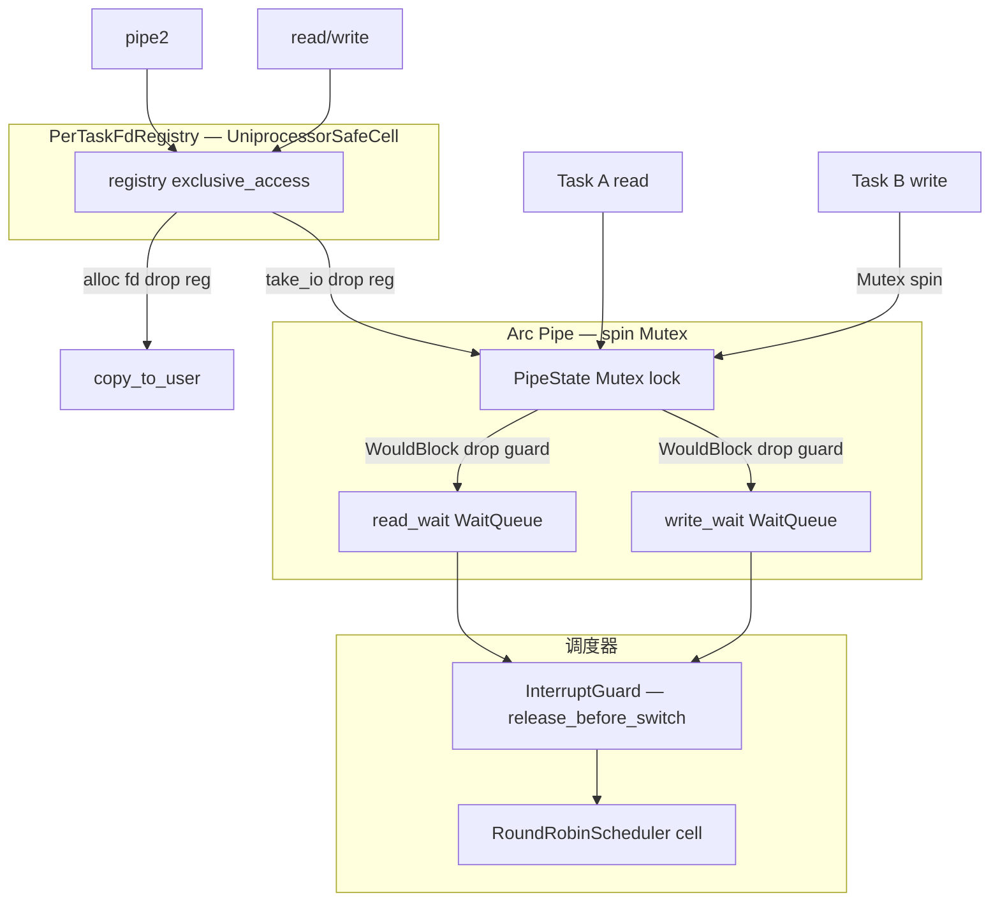

# 锁机制审计：KernelPipe / PipeState / PipeEndpoint

> 审计范围：lock-inventory #17（`ipc-pipe` 分组）  
> Baseline：单核多线程（UP + 定时器抢占）；`PipeState` 由 `spin::Mutex` 保护；`WaitQueue` 经调度器 `InterruptGuard` 阻塞  
> 审计日期：2026-06-25（复核：UniprocessorSafeCell → spin::Mutex 迁移及阻塞 wait 路径）

---

## P0 / P1 / 已修复摘要

| 级别 | ID | 问题 | 状态 |
|------|-----|------|------|
| **P0** | P-1 | `UniprocessorSafeCell` 无法保护跨任务共享的 `Arc<Pipe>`（RefCell panic） | **已修复** → `spin::Mutex<PipeState>` |
| **P0** | P-2 | 多读/写端阻塞时 `wake_one` 导致永久睡眠 | **已修复** → `try_read`/`try_write` 成功后 `wake_all()` |
| **P1** | P-3 | 阻塞 wait 路径 `InterruptGuard` 跨 `__switch` 未 `release_before_switch` | **已修复**（调度器层，`impl-round-robin`/`impl-multi-class` `wait_current_while` L277） |
| P1 | P-4 | UP 抢占下 `spin::Mutex` 持锁被切换 → 等锁任务永久自旋 | **开放**（通用 spin 锁限制；临界区极短，实践风险低） |
| P2 | P-5 | `PerTaskFdRegistry` 仍为 `UniprocessorSafeCell`（pipe I/O 已释表锁，pipe2 已缩短 borrow） | **开放**（交叉：`per-task-registries`） |
| P2 | P-6 | poll 多 fd 等待 `wait_ticks = remaining.min(1)` | **开放**（延迟/精度，非死锁） |
| P3 | P-7 | `close_read`/`close_write` 与 ref 计数双轨 API | **开放**（生产 fd 路径仅用 `release_*`） |
| P3 | P-8 | SMP 多核：`spin::Mutex` + 非原子 ref | **开放**（SMP 里程碑） |

---

## 1. 概述

本组审计内核 pipe 实现：`PipeState` 由 **`spin::Mutex`** 保护（已从 `UniprocessorSafeCell` 迁移），`Pipe` 额外持有两个无锁 `WaitQueue`（读/写阻塞与 poll 等待）。用户态可见路径经 `PipeEndpoint` → VFS `PipeReadHandle`/`PipeWriteHandle` → syscall（`pipe2` / `read` / `write` / `poll` / `ppoll` / `close` / `dup` / `fork`）。

| 结构 | 文件 | 锁/同步类型 | 保护内容 |
|------|------|-------------|----------|
| `PipeState` | `kernel_pipe.rs` | `spin::Mutex<PipeState>` | ring buffer、head/len、read/write 开关、端点引用计数 |
| `Pipe` | `kernel_pipe.rs` | 上述 Mutex + `WaitQueue` ×2 | 读写阻塞、poll 等待、唤醒 |
| `PipeEndpoint` | `endpoint.rs` | 无独立锁；共享 `Arc<Pipe>` | fd 方向、非阻塞标志、ref 增减 |
| `PerTaskFdRegistry` | `wateros-vfs/src/fd.rs` | `UniprocessorSafeCell`（交叉） | fd 分配/关闭；与 pipe 本体 **锁域分离** |

默认容量：`DEFAULT_PIPE_CAPACITY = 4096`（`base-config/ipc.rs`）。

```rust
pub struct Pipe {
    state: Mutex<PipeState>,
    read_wait: WaitQueue,
    write_wait: WaitQueue,
}
```

**设计意图**：`Mutex` 保证跨任务 `Arc<Pipe>` 并发访问互斥；阻塞时 **先释 Mutex 再进 WaitQueue**，避免持锁睡眠。  
**迁移验证**：`grep` 确认 `ipc-pipe` 内无 `UniprocessorSafeCell` / `wake_one` 残留；`lock-inventory` #17 已标注 Mutex。

---

## 2. 锁调用点清单

### 2.1 `PipeState` / `spin::Mutex`

| 函数 | 操作 | 持锁区间 |
|------|------|----------|
| `with_capacity` | `Mutex::new(PipeState::with_capacity(...)?)` | 构造期 |
| `capacity` / `len` | `state.lock()` 读字段 | 极短 |
| `try_read` | lock → `read_into` → `drop` → `write_wait.wake_all()` | 仅 buffer 操作 |
| `try_write` | lock → `write_from` → `drop` → `read_wait.wake_all()` | 仅 buffer 操作 |
| `read` / `write`（阻塞） | `try_*` 短持锁；`WouldBlock` 时 condition 闭包内 **一次** 短 lock → `wait_current_while` | **不**跨睡眠持锁 |
| `close_read` / `close_write` | lock 改 `*_open` → guard drop → `wake_all` | 极短 |
| `acquire_read` / `acquire_write` | `read_refs`/`write_refs` += 1 | 极短 |
| `release_read` / `release_write` | ref -= 1；归零时关端 + `drop` + `wake_all` | 极短 |
| `poll_revents_read` / `poll_revents_write` | lock 读状态算 revents | 极短 |
| `read_poll_blocked` / `write_poll_blocked` | lock 判断 poll 是否应阻塞 | 极短 |

**无** `UniprocessorSafeCell`；`spin::Mutex::lock()` 在锁被占用时 **自旋**（非 panic）。

### 2.2 `WaitQueue`（无独立锁）

| 函数 | 唤醒/等待 | 说明 |
|------|-----------|------|
| `read` 阻塞 | `read_wait.wait_current_while` | condition：`is_empty() && write_open`（闭包内短持 Mutex） |
| `write` 阻塞 | `write_wait.wait_current_while` | condition：`is_full() && read_open` |
| `poll_wait_read_for_ticks` | `read_wait.wait_current_while_for_ticks` | 与 `still_waiting` 组合 |
| `poll_wait_write_for_ticks` | `write_wait.wait_current_while_for_ticks` | 同上 |
| `try_read` 成功 | `write_wait.wake_all()` | 唤醒全部阻塞写者 |
| `try_write` 成功 | `read_wait.wake_all()` | 唤醒全部阻塞读者 |
| `close_*` / ref 归零 | `wake_all` | 唤醒全部对应端等待者 |

底层：`wait_current_while` 在 `InterruptGuard` 内执行 `condition()`，可能 `schedule_wait` + `__switch`；切换前 **`guard.release_before_switch()`**（`impl-round-robin/src/lib.rs:269–278`）。

### 2.3 `PipeEndpoint` / VFS 句柄

| 操作 | 锁 | 说明 |
|------|-----|------|
| `PipeEndpoint::pair` | 无；`Arc::new(Pipe)` + `acquire_read/write` | 创建时 ref=1 |
| `Clone` | `acquire_read` 或 `acquire_write` | dup/fork 继承 |
| `close` | `release_read` 或 `release_write` | fd 关闭 |
| `read` / `write` | 委托 `Pipe`，无额外锁 | 阻塞/非阻塞分支 |
| `PipeReadHandle::duplicate` | `endpoint.clone()` | VFS dup |
| `UnixStreamPairEnd` | 两个独立 `Pipe` | socketpair 双 pipe |

### 2.4 `sys_pipe2`

| 步骤 | 锁 |
|------|-----|
| `pipe_handle_pair` | 无（创建 `Pipe`） |
| `registry().exclusive_access()` | **PerTaskFdRegistry** borrow |
| `alloc_fd_for_task` ×2 | 同上 borrow 内 |
| `drop(reg)` | 释 FD 表 |
| `copy_to_user` | 已释表 |

---

## 3. 主要调用链与持锁区间

### 3.1 创建路径

```
sys_pipe2 (pipe2.rs)
  └─ vfs::pipe_handle_pair(nonblocking)
       └─ PipeEndpoint::pair
            └─ Arc::new(Pipe::new()) + acquire_read/write
  └─ registry().exclusive_access()          [FD 注册表 borrow，短]
       └─ alloc_fd_for_task(read/write)
  └─ drop(reg)
  └─ copy_to_user(pipefd)
```

### 3.2 读写路径

```
sys_read / sys_write
  └─ vfs::fd::with_current_io(fd, |handle| ...)
       ├─ registry().exclusive_access() → take_io_for_task  [短 borrow]
       ├─ drop(reg)                                         [释 FD 表]
       └─ PipeReadHandle::read / PipeWriteHandle::write
            └─ Pipe::read / write / try_*
                 ├─ state.lock()                            [PipeState 短持锁]
                 ├─ drop(guard)
                 └─ read_wait/write_wait.wait_current_while  [不持 PipeState 锁]
       └─ registry().exclusive_access() → restore_io        [短 borrow]
```

**关键点**：I/O 执行时 **不持** fd 注册表锁；多任务可并发触达同一 `Arc<Pipe>`，由 **`spin::Mutex`** 串行化 `PipeState` 访问（自旋等待，非 panic）。

### 3.3 poll / ppoll 路径

```
poll_engine::poll_block_until_ready
  └─ scan_pollfds → poll_revents_fd
       └─ with_current_io → PipeEndpoint::poll_revents
            └─ poll_revents_read/write → state.lock()  [短]
  └─ poll_wait_pipe_fds（无就绪时）
       └─ 逐 fd：with_current_io → poll_wait_for_ticks
            └─ Pipe::poll_wait_*_for_ticks
                 └─ wait_current_while_for_ticks + read/write_poll_blocked
```

`poll_engine.rs:301–303` 注释：wait 条件内 **不得** 重扫全体 pollfd（否则 `with_current_io` 临时卸表导致 `POLLNVAL` 忙等）。当前实现遵守该约束。

### 3.4 fork / dup / close

```
fork: copy_fd_table_from_parent
  └─ registry().exclusive_access()              [长 borrow：整表 duplicate]
       └─ handle.duplicate() → PipeEndpoint::clone → acquire_read/write

dup: dup_fd_for_task → duplicate()              [同上，单 fd]

close: close_fd
  └─ take_fd_for_close [短 registry borrow]
  └─ handle.close() → release_read/write       [PipeState 短持锁 + wake_all]
```

### 3.5 锁嵌套关系

| 场景 | 锁顺序 | 同时嵌套？ |
|------|--------|------------|
| `pipe2` | 仅 FD 注册表 | 否 |
| `read`/`write` | FD 表（take/restore 短）↔ PipeState Mutex（I/O 段，不重叠 FD 表） | **否** |
| 两任务同 pipe 并发 read | 两路 `state.lock()` | **串行**（自旋，无 RefCell panic） |
| pipe 阻塞 wait + 调度器 | WaitQueue → `InterruptGuard`（switch 前释放）→ Scheduler cell | 不持 PipeState Mutex |
| `UnixStreamPairEnd` poll | 同一任务先后 wait 两个 pipe 的 WaitQueue | 串行，无嵌套 Pipe Mutex |

---

## 4. WaitQueue 与 PipeState 协同分析

### 4.1 阻塞读/写（Mesa 语义）

```
read 循环:
  try_read → [lock: 读 buffer 或 WouldBlock]
  WouldBlock → wait_current_while(空且写端开) → 唤醒后重试

write 循环:
  try_write → [lock: 写 buffer 或 WouldBlock/BrokenPipe]
  WouldBlock → wait_current_while(满且读端开) → 唤醒后重试
```

condition 为 `FnOnce`，仅在 **入睡前** 检查一次；唤醒后靠外层 `loop` + `try_*` 重试。符合 Mesa 风格，**无**在 wait 内持 PipeState Mutex。

### 4.2 唤醒策略（已修复 P-2）

| 事件 | 唤醒 |
|------|------|
| `try_read` 消费数据 | `write_wait.wake_all()` |
| `try_write` 写入数据 | `read_wait.wake_all()` |
| 读端关闭 / `release_read` 归零 | `write_wait.wake_all()` |
| 写端关闭 / `release_write` 归零 | `read_wait.wake_all()` |
| `close_read` / `close_write`（trait，非 fd 路径） | `wake_all` |

`wake_all` 经调度器 `InterruptGuard` 唤醒；**释 Pipe Mutex 后再 wake**，锁序正确。

### 4.3 引用计数与关闭语义

- `PipeEndpoint::close` → `release_*`：ref 归零时置 `read_open`/`write_open = false` 并 `wake_all`。
- `KernelPipe::close_read`/`close_write`：**不**走 ref 计数，直接关端；仅 `self_tests` 使用，生产 fd 路径 **未** 调用。
- `release_*` 在 ref 已为 0 时减 ref 为 no-op，不会 double-close。

---

## 5. 潜在问题列表

### 5.1 ~~[P0] UniprocessorSafeCell 无法保护跨任务共享 Arc~~ → **已修复**

**原问题**：多任务并发 `exclusive_access()` 同一 `Arc<Pipe>` → RefCell panic。

**当前实现**（`kernel_pipe.rs:8–9, 91`）：

```rust
use spin::Mutex;
// ...
state: Mutex<PipeState>,
```

并发 read/write 改为 Mutex 自旋互斥，**不再 panic**。

---

### 5.2 ~~[P0] wake_one 导致多 fd 阻塞者饿死~~ → **已修复**

**原问题**：`try_read`/`try_write` 成功后仅 `wake_one()`。

**当前实现**（`kernel_pipe.rs:288–289, 322–323`）：

```rust
drop(state);
self.write_wait.wake_all();  // try_read
// ...
self.read_wait.wake_all();   // try_write
```

dup/fork 共享读/写端时，缓冲区状态变化会唤醒 **全部** 相关 waiters。

---

### 5.3 ~~[P1] 阻塞 wait InterruptGuard 跨 __switch 未释放~~ → **已修复（调度器）**

**原问题**：`wait_current_while` 切换前未 `release_before_switch()`。

**当前实现**（`impl-round-robin/src/lib.rs:269–278`，multi-class 对称）：

```rust
let guard = InterruptGuard::new();
if !condition() { return TaskWaitResult::Woken; }
let switch_pair = with_scheduler(|s| s.schedule_wait(wait_handle, None));
guard.release_before_switch();
finish_wait_after_switch(switch_pair)
```

pipe `read`/`write`/`poll_wait_*` 均受益；tick/超时/信号在阻塞期间可正常触发。

---

### 5.4 [P1] UP 抢占下 spin::Mutex 持锁被切换

**位置**：任意 `state.lock()` 临界区（`read_into`/`write_from` 等）。

**机制**（`lock-inventory` §2.1）：持锁任务被定时器抢占切换走后，等锁任务在 UP 上 **永久自旋**。

**对 pipe 的影响**：临界区为 ring buffer 拷贝（≤4096 字节循环），极短；当前 LTP/shell 管道场景 **未见** 报告，但理论上存在。

**收敛建议**：SMP/严格 UP 语义下可换 `Mutex`+sleep 或持锁段关抢占；短期可接受并文档标注。

---

### 5.5 [P2] PerTaskFdRegistry 仍为 UniprocessorSafeCell

**位置**：`fd.rs:19–27`；`pipe2.rs:27–39` 持表 borrow 双次 alloc。

**改进**：`pipe2` 已在 `copy_to_user` 前 `drop(reg)`；I/O 路径 `with_current_io` 仍正确释表。

**风险**：fork 整表 duplicate 长 borrow、同任务 fd 表重入 RefCell panic（与 pipe 锁域无关）。

---

### 5.6 [P2] poll 多 fd 等待 `wait_ticks = remaining.min(1)`

**位置**：`poll_engine.rs:286`。

多 pipe fd 串行 `poll_wait_for_ticks`，每个 fd 最多 1 tick。非死锁，但 `nfds` 大 + 短 timeout 时延迟与 CPU 空转。

---

### 5.7 [P3] close_read/close_write 与 ref 计数双轨

**位置**：`kernel_pipe.rs:353–361` vs `release_*`。

生产 fd 路径仅用 `release_*`；trait 级 `close_*` 为 internal/test，误用可导致 ref 与 `*_open` 不一致。

---

### 5.8 [P3] SMP / 多核

`Pipe` 使用 `spin::Mutex`（SMP 可用），但 `read_refs`/`write_refs` 为非原子 `usize`；多 hart 无额外内存序保证。SMP 里程碑须原子 ref 或等价 RCU。

---

## 6. 当前实际支持范围

| 路径 | 状态 | 说明 |
|------|------|------|
| 单任务 `pipe2` + 自读自写 | ✅ | |
| 父子进程 shell 管道（单读者单写者） | ✅ | Mutex + wait 路径已修复 |
| 同 pipe 多任务并发 read/write | ✅ | Mutex 串行（自旋） |
| dup 读端 + 多任务同时阻塞 read | ✅ | `wake_all` |
| `O_NONBLOCK` pipe2 | ✅ | 不进入 wait |
| `poll`/`ppoll` 单 pipe fd | ✅ | 阻塞 wait 释中断 |
| `poll` 多 fd 含 pipe | ⚠️ | §5.6 1-tick 切片 |
| fork 继承 pipe | ✅ | ref 正确；并发 I/O Mutex 保护 |
| socketpair（双 pipe） | ✅ | 两独立 Pipe，各 Mutex |
| 阻塞 write 部分写 + `EINTR` | ✅ | `kernel_pipe.rs:338–343` |
| UP 抢占 + 长临界区 | ⚠️ | §5.4 理论自旋风险 |
| SMP | ❌ | §5.8 非原子 ref |

---

## 7. 收敛建议汇总

| 优先级 | 问题 | 建议动作 | 状态 |
|--------|------|----------|------|
| ~~P0~~ | RefCell 跨任务 | `PipeState` → `spin::Mutex` | **已完成** |
| ~~P0~~ | wake_one 饿死 | `wake_all` | **已完成** |
| ~~P1~~ | 中断未释放 | 调度器 `release_before_switch` | **已完成** |
| P1 | spin 持锁抢占 | 关抢占或换可睡眠锁 | 待评估 |
| P2 | FD 表 RefCell | 注册表改 Mutex（`per-task-registries`） | 开放 |
| P2 | poll 1-tick 切片 | 按 deadline 合并 wait | 开放 |
| P3 | 双轨 close | 标注 internal-only 或删除 trait 直关 | 开放 |
| P3 | SMP ref | 原子 ref / RCU | 开放 |

---

## 8. 锁顺序参考图



---

## 9. 相关文件索引

| 文件 | 关联 |
|------|------|
| `ipc-pipe/pipe-impl/impl-ringbuf/src/kernel_pipe.rs` | PipeState、KernelPipe、WaitQueue |
| `ipc-pipe/pipe-impl/impl-ringbuf/src/endpoint.rs` | PipeEndpoint、ref 计数 |
| `ipc-pipe/pipe-api/api-v0/src/kernel_pipe.rs` | KernelPipe trait |
| `wateros-vfs/vfs-impl/impl-fd-session/src/handles.rs` | PipeReadHandle/WriteHandle、socketpair |
| `wateros-vfs/src/fd.rs` | with_current_io、registry |
| `wateros-syscall/.../sys/pipe2.rs` | pipe2 syscall |
| `wateros-syscall/.../poll_engine.rs` | poll/ppoll pipe 等待 |
| `wateros-base/src/sync/uniprocessor.rs` | UniprocessorSafeCell（pipe 已不再使用） |
| `wateros-base/base-config/src/ipc.rs` | DEFAULT_PIPE_CAPACITY |
| `task-scheduler/.../impl-round-robin/src/lib.rs` | wait_current_while + release_before_switch |

---

## 10. Top 3 摘要（当前）

1. **~~RefCell 跨任务 panic~~ → 已修复**：`spin::Mutex<PipeState>` 保护共享 `Arc<Pipe>`。  
2. **~~wake_one 饿死~~ → 已修复**：读写成功路径 `wake_all()`。  
3. **~~pipe 阻塞继承关中断~~ → 已修复**：调度器 wait 出口 `release_before_switch()`。  

**剩余关注**：UP 下 spin 锁极短临界区的抢占自旋（P1，低概率）；FD 注册表 RefCell 与 poll 1-tick 切片（P2，交叉子系统）。
