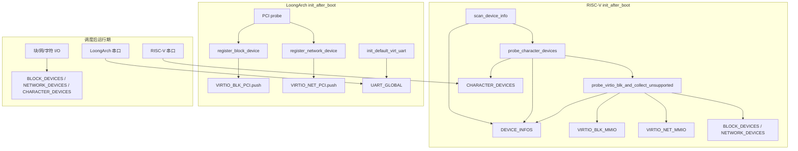

# PlatformDeviceProbe 锁机制审计

> 审计范围：清单 #28–#30（`lock-inventory.md`）  
> 平台：`impl-qemu-riscv64-opensbi`、`impl-qemu-loongarch64-virt`  
> Baseline：单核多线程；`spin::Mutex` 为自旋锁，持锁期间若被抢占会导致其他任务空转等待  
> 审计日期：2026-06-25

---

## 0. P0 / P1 / Fixed 摘要

| ID | 严重度 | 状态 | 问题 | 位置 |
|----|--------|------|------|------|
| PLAT-01 | **P0** | 未修复 | RISC-V `probe_virtio_blk_and_collect_unsupported` 全程嵌套持有 `DEVICE_INFOS` + `VIRTIO_BLK_MMIO` + `VIRTIO_NET_MMIO`；循环内 `from_mmio`、DMA 帧分配、`register_*`、`log::info!` | `impl-qemu-riscv64-opensbi/src/lib.rs:237–326` |
| PLAT-02 | **P0** | 未修复 | `init_after_boot` / `test()` 非幂等：重入时清空/重填 probe 表但 **`BLOCK_DEVICES` / `NETWORK_DEVICES` / `CHARACTER_DEVICES` 不清空**，可双注册、MMIO 双初始化 | `impl-qemu-riscv64-opensbi/src/lib.rs:430–498`；`impl-qemu-loongarch64-virt/src/lib.rs:83–245` |
| PLAT-03 | **P1** | 未修复 | LoongArch `with_default_uart` 闭包全程持 `UART_GLOBAL`；伪 shell 内 `read_byte_blocking` 无限自旋 | `impl-qemu-loongarch64-virt/src/uart.rs:126–133` |
| PLAT-04 | P2 | 未修复 | `device_infos()` 暴露裸 `&'static Mutex<…>`，仓库内零调用方，API footgun | `impl-qemu-riscv64-opensbi/src/lib.rs:231–234` |
| PLAT-05 | P3 | 未修复 | LoongArch `VIRTIO_*_PCI` 仅 bring-up 诊断，运行期 I/O 不读；冗余锁面 | `impl-qemu-loongarch64-virt/src/lib.rs:23–25` |

**Fixed（本轮）**：无。上述项均未在代码中收敛（无 `init_after_boot` 幂等 guard、无调度后 probe 拒绝、未拆分 `UART_GLOBAL` 持锁区间）。

**正常启动路径缓解**：`kernel_main` 仅在 `run_first_task` **之前**调用一次 `driver::active_impl::init_after_boot()`；`driver::test()` **未被** `kernel_main` / `fs::test()` 调用，PLAT-02 为 latent 风险（手动调用 `driver::test()` 或未来接线时触发）。

---

## 1. 概述

PlatformDeviceProbe 指 QEMU 平台驱动在引导期对 DTB / PCI 的扫描、设备实例化与 probe 元数据缓存。涉及三组静态 `spin::Mutex`：

| # | 名称 | 文件 | 用途 |
|---|------|------|------|
| 28 | `DEVICE_INFOS` / `VIRTIO_BLK_MMIO` / `VIRTIO_NET_MMIO` | `impl-qemu-riscv64-opensbi/src/lib.rs` | DTB 节点摘要；成功绑定的 virtio-mmio 窗口 |
| 29 | `VIRTIO_BLK_PCI` / `VIRTIO_NET_PCI` | `impl-qemu-loongarch64-virt/src/lib.rs` | 成功绑定的 virtio-pci 探测信息 |
| 30 | `UART_GLOBAL` | `impl-qemu-loongarch64-virt/src/uart.rs` | LoongArch 全局 UART 单例（伪 shell / runtime-serial） |

RISC-V 侧串口**不**使用 `UART_GLOBAL`，经 `CHARACTER_DEVICES` 注册表 + `with_character_device(0, …)` 访问（`uart.rs`）。

**引导时序**（两平台一致）：`init_when_boot`（单线程，调度前；LoongArch 另调 `init_early_default_uart`）→ MM / 页表 → `init_after_boot`（仍在 `run_first_task` 之前）→ 网络栈 / FS / 用户态 bring-up → 开启中断与调度。

---

## 2. 锁调用点清单

### 2.1 RISC-V64 OpenSBI（`impl-qemu-riscv64-opensbi/src/lib.rs`）

| 函数 | 锁操作 | 持锁区间 |
|------|--------|----------|
| `scan_device_info` | `DEVICE_INFOS.lock()` | 清空 + 遍历 DTB 填充，全程持锁 |
| `device_infos` | 无（返回 `&'static Mutex<…>`） | — |
| `probe_virtio_blk_and_collect_unsupported` | `DEVICE_INFOS` → `VIRTIO_BLK_MMIO` → `VIRTIO_NET_MMIO`（嵌套，全程） | 遍历 `DEVICE_INFOS`；对每个节点可能调用 `VirtioBlkDevice::from_mmio` / `VirtioNetDevice::from_mmio`、`register_*` |
| `probe_character_devices` | `DEVICE_INFOS.lock()` | 遍历 + `register_uart_character_device` → `register_character_device`（嵌套 `CHARACTER_DEVICES`） |
| `dump_device_and_devfs_info` | `DEVICE_INFOS.lock()`（只读） | 打印后 `drop` |
| `virtio_blk_probe_test` | `VIRTIO_BLK_MMIO.lock()`（短暂） | 取首元素后释锁，再独立 `from_mmio` |
| `init_after_boot` | 间接：`scan_device_info` → `probe_character_devices` → `probe_virtio_blk_and_collect_unsupported` | 顺序调用，无并行 |

### 2.2 LoongArch64 virt（`impl-qemu-loongarch64-virt`）

| 函数 | 锁操作 | 持锁区间 |
|------|--------|----------|
| `init_after_boot` | `VIRTIO_BLK_PCI.lock().clear()`；`VIRTIO_NET_PCI.lock().clear()` | 分开加锁，无嵌套 |
| `init_after_boot`（注册成功路径） | `VIRTIO_BLK_PCI.lock().push` / `VIRTIO_NET_PCI.lock().push` | 各一次短临界区；**先** `register_*`（持 `BLOCK_DEVICES`/`NETWORK_DEVICES`），**后** push probe 表 |
| `virtio_blk_probe_test` | **不**使用 `VIRTIO_*_PCI` | 经 `first_block_device().lock()` 访问已注册设备 |
| `init_default_virt_uart` / `init_early_default_uart` | `UART_GLOBAL.lock()` | 写入 `Some(uart)`；`UART_INIT_DONE`（`AtomicBool`）在锁外 `swap` |
| `with_default_uart` | `UART_GLOBAL.lock()` | **整个闭包**期间持锁 |

LoongArch **无** `DEVICE_INFOS`；DTB 仅用于 `physical_ram_end_exclusive` 与 PCI ECAM 基址。

### 2.3 跨子系统锁（probe 路径触达）

| 调用 | 子系统锁 | 典型顺序（相对 probe 静态量） |
|------|----------|-------------------------------|
| `register_block_device` | `BLOCK_DEVICES` | RISC-V：`DEVICE_INFOS` + `VIRTIO_*` 已持 → 再 `BLOCK_DEVICES` |
| `register_network_device` | `NETWORK_DEVICES` | 同上 |
| `register_character_device` | `CHARACTER_DEVICES` | RISC-V：`DEVICE_INFOS` 已持 → 再 `CHARACTER_DEVICES` |
| `log::info!` / `log::warn!`（probe 内大量调用） | `KLOG`（`klog-ringbuf`） | 在持 probe 锁期间可能嵌套 |
| `VirtioBlkDevice::from_mmio` | 帧分配器 `UniprocessorSafeCell`（非 spin） | 在 RISC-V 三锁持有时调用 |
| `devfs_impl::refresh` / `set_dt_unsupported_paths` | `DEVFS` 等 | **在** probe 释锁**之后**（`sync_devfs` / LoongArch `refresh`） |

---

## 3. 锁顺序分析

### 3.1 RISC-V 固定顺序

```
scan_device_info:
  DEVICE_INFOS

probe_character_devices:
  DEVICE_INFOS → CHARACTER_DEVICES → (per-device Arc<Mutex>)

probe_virtio_blk_and_collect_unsupported:
  DEVICE_INFOS → VIRTIO_BLK_MMIO → VIRTIO_NET_MMIO
    → [循环内] BLOCK_DEVICES | NETWORK_DEVICES
    → [循环内] log → KLOG
```

**全局约定（当前代码隐式）**：若需同时访问 probe 静态量与子系统注册表，顺序应为  
`DEVICE_INFOS` → `VIRTIO_BLK_MMIO` → `VIRTIO_NET_MMIO` → `BLOCK_DEVICES` / `NETWORK_DEVICES` / `CHARACTER_DEVICES`。

**风险**：`device_infos()` 对外暴露 `&'static Mutex<Vec<DeviceInfo>>`，仓库内**无**其它调用方，但 API 允许调用方任意加锁顺序，与未来 `BLOCK_DEVICES` 路径形成 AB-BA 死锁（多核或持锁睡眠场景下更严重）。

### 3.2 LoongArch 固定顺序

```
init_after_boot:
  VIRTIO_BLK_PCI（clear / push，互不嵌套）
  VIRTIO_NET_PCI（clear / push）
  （无 DEVICE_INFOS）

UART:
  UART_INIT_DONE（AtomicBool，非锁）
  UART_GLOBAL
```

`VIRTIO_BLK_PCI` 与 `VIRTIO_NET_PCI` **无**嵌套关系；与 `BLOCK_DEVICES` 的先后顺序为：先 `register_block_device`（持 `BLOCK_DEVICES`），再 `VIRTIO_BLK_PCI.push`——**不会**同时持有两把锁。

### 3.3 Probe 阶段 vs 运行期

| 阶段 | 并发模型 | probe 静态量写入 | 运行期读者 |
|------|----------|------------------|------------|
| `init_when_boot` | 单线程 | LoongArch：`UART_GLOBAL` 首次写入 | 无 |
| `init_after_boot` | 单线程（`run_first_task` 前） | 全部 probe 表填充 / 清空 | 无 |
| 调度后 | 多任务 + 中断 | **默认不再写入** | 见下表 |

| 静态量 | 调度后读路径 | 调度后写路径 |
|--------|--------------|--------------|
| `DEVICE_INFOS` | 无（未导出读取 API 的使用方） | 仅 `scan_device_info` / `init_after_boot` / `test()` |
| `VIRTIO_*_MMIO` | `virtio_blk_probe_test`（仅 `test()` 链） | 同左 |
| `VIRTIO_*_PCI` | **无**（自检走 `BLOCK_DEVICES`） | 仅 `init_after_boot` / `test()` |
| `UART_GLOBAL` | `with_default_uart`（伪 shell、runtime-serial） | `init_default_virt_uart`（`AcqRel` 幂等，调度后不应再调） |

**结论**：正常启动路径下 probe 与运行期**不重叠写**；运行期 I/O 走 `BLOCK_DEVICES` / `NETWORK_DEVICES` / `CHARACTER_DEVICES`（RISC-V）或 `UART_GLOBAL`（LoongArch），与 probe 缓存解耦。异常路径：`driver::test()` → `init_after_boot()` 可**重复 probe**（见 §4.2）。

---

## 4. 潜在问题

### 4.1 【P0 / PLAT-01】RISC-V：`probe_virtio_blk_and_collect_unsupported` 长临界区三锁嵌套

**现象**：整个 virtio 注册循环期间同时持有 `DEVICE_INFOS`、`VIRTIO_BLK_MMIO`、`VIRTIO_NET_MMIO`。循环内执行：

- MMIO 探测与 `VirtioBlkDevice::from_mmio`（帧分配、virtio 队列 DMA）
- `register_block_device` / `register_network_device`
- 大量 `log::info!`

**严重程度**：单核引导线程下**当前可工作**；一旦在调度后重入 `init_after_boot` / `scan_device_info`，或与持 `BLOCK_DEVICES` 的任务交错，会长时间占锁并阻塞任何需 `DEVICE_INFOS` 的路径；多核扩展时极易死锁。

**收敛建议**：

1. 缩短临界区：仅持 `DEVICE_INFOS` 克隆必要字段或索引列表，释锁后再 `from_mmio` + `register_*`，最后短持 `VIRTIO_*` 做 `push`。
2. 若检测到 `task::is_scheduler_running()`（或等价标志）仍调用 probe，打 `warn!` 并返回 `DriverError::Unsupported`，禁止运行期 rescan。

### 4.2 【P0 / PLAT-02】`test()` / 重复 `init_after_boot` 非幂等 + 与全局注册表不一致

**现象**：

- `impl-qemu-riscv64-opensbi::test()`、`impl-qemu-loongarch64-virt::test()` 均再次调用完整 `init_after_boot()`。
- Probe 侧重载 `VIRTIO_*` / `DEVICE_INFOS`，但 **`BLOCK_DEVICES` / `NETWORK_DEVICES` / `CHARACTER_DEVICES` 不清空**，导致重复注册、索引漂移、双 virtio 实例争用同一 MMIO/PCI BAR。
- `driver::test()` 在 `wateros-driver/src/lib.rs` 聚合上述平台 `test()`，但 **`kernel_main` 未调用** `driver::test()`；正常 boot 仅单次 `init_after_boot`。

**严重程度**：手动或未来接线 `driver::test()` 且在调度后调用 → 数据竞争 + 潜在 MMIO 双初始化；即使单线程重复调用也会造成语义混乱。

**收敛建议**：

1. `init_after_boot` 入口增加「已初始化」原子标志，重复调用 `warn!` + 早退。
2. 或 `test()` 改为只读自检（读 `block_device_count` / `virtio_blk_probe_test`），不重复 scan。
3. warn 模板：`[lock-audit][platform-probe] duplicate init_after_boot ignored (platform=…, caller=…)`。

### 4.3 【P1 / PLAT-03】LoongArch：`UART_GLOBAL` 持锁覆盖阻塞 I/O

**现象**：`with_default_uart` 在**整个闭包**内持有 `UART_GLOBAL`。伪 shell（`wateros-pseudo-shell`）在闭包内调用 `read_byte_blocking`，内部无限自旋直至收到字节。

**严重程度**：单核下其它任务若调用 `with_default_uart` 将自旋等待（占 CPU）；持锁 + 自旋**禁止**调度协作，延迟不可接受。与 probe 静态量无直接死锁，但属于运行期串口全局锁设计缺陷。RISC-V 路径为 `CHARACTER_DEVICES` 短持锁 + per-device `Arc<Mutex>`，阻塞读在设备锁内，问题类似但粒度更细（见 `locks/driver-block-char.md` §5.3）。

**收敛建议**：

1. 将 `UART_GLOBAL` 改为 `Mutex<Option<Arc<Mutex<Uart>>>>` 或注册到 `CHARACTER_DEVICES`（与 RISC-V 对齐）；I/O 在 per-device 锁上完成。
2. 短期：文档约束「仅 boot 或单任务伪 shell 使用 `with_default_uart`」；多任务访问打 `warn!`。

### 4.4 【中】RISC-V：`probe_character_devices` 持 `DEVICE_INFOS` 注册字符设备

**现象**：注册 UART 时持 `DEVICE_INFOS`，嵌套 `CHARACTER_DEVICES` 锁。持锁期间调用 `register_builtin_character_devices`（在 `drop(infos)` 之后）——顺序正确，但 UART 注册段仍偏长。

**严重程度**：低于 §4.1；引导期单线程可接受。

**收敛建议**：与 §4.1 相同，先拷贝 DTB 节点列表再释锁注册。

### 4.5 【P2 / PLAT-04】`device_infos()` 暴露裸 Mutex

**现象**：公开 `&'static Mutex<Vec<DeviceInfo>>`，注释将加锁责任推给调用方；仓库内零使用。

**严重程度**：API footgun；未来若与 `BLOCK_DEVICES` 反向加锁，死锁。

**收敛建议**：改为 `with_device_infos(|infos| …)` 回调 API，或只读快照 + 内部统一锁顺序；废弃直接返回 `Mutex` 引用。

### 4.6 【P3 / PLAT-05】LoongArch：`VIRTIO_*_PCI` 与运行期完全脱节

**现象**：`VIRTIO_BLK_PCI` / `VIRTIO_NET_PCI` 仅 `clear`/`push`，运行期 I/O 不读；自检用 `first_block_device()`。

**严重程度**：非锁 bug；多余锁增加 audit 面，无运行期竞争。

**收敛建议**：合并为单 `PROBE_SNAPSHOT` 或在注册完成后 `drop` 静态表（仅保留 `BLOCK_DEVICES` 索引）；若保留，文档标注「仅 bring-up 诊断，非运行期真相源」。

### 4.7 【低】LoongArch：`init_default_virt_uart` 与 `UART_INIT_DONE` 竞态

**现象**：`swap(true)` 与 `UART_GLOBAL.lock()` 非同一临界区；两线程同时首次 init 可能重复 `init_minimal`（硬件幂等）。

**严重程度**：当前 `init_when_boot` + `init_after_boot` 均在调度前，实际不可竞态。

**收敛建议**：调度后若检测到 init 调用，打 `warn!` 并忽略。

### 4.8 【低】持 probe 锁期间 logging → `KLOG`

**现象**：probe 循环内 `log::info!` 可能持 `KLOG`；若日志后端再回调驱动（当前无），可能嵌套。单核下 `KLOG` 与 probe 锁顺序固定为 probe → KLOG，**无**反向路径。

**严重程度**：低；保持 probe 内日志简短即可。

---

## 5. 当前支持范围（锁语义）

| 路径 | 是否受 probe 锁保护 | 说明 |
|------|---------------------|------|
| 首次 `kernel_main` → `init_after_boot` | ✅ / 🔒 | 设计主路径，单线程，闭环完整 |
| `physical_ram_end_exclusive`（读 DTB） | 否（仅 `AtomicUsize` DTB 基址） | 与 `DEVICE_INFOS` 无锁共享 |
| 块 / 网 / 字符设备 syscall I/O | 否 | 使用子系统注册表，不读 `VIRTIO_*` |
| LoongArch 伪 shell 串口 | ⚠️ | `UART_GLOBAL` 全程持锁，见 §4.3 |
| RISC-V 伪 shell / console | ⚠️ | `CHARACTER_DEVICES[0]` + device mutex |
| `driver::test()` 重复 probe | ❌ | 见 §4.2；当前 boot 未调用 |
| 运行期 rescan DTB | ❌ | 无 API，但若添加需全局 probe 锁策略 |

---

## 6. 收敛与修复优先级

| 优先级 | ID | 项 | 动作 |
|--------|-----|-----|------|
| P0 | PLAT-01 | §4.1 三锁长临界区 | 缩短持锁区间；禁止调度后 probe |
| P0 | PLAT-02 | §4.2 重复 init | 幂等 guard + `test()` 不重复注册 |
| P1 | PLAT-03 | §4.3 UART 持锁 I/O | 与字符设备注册表对齐或拆分锁 |
| P2 | PLAT-04 | §4.5 `device_infos()` API | 回调式只读访问 |
| P3 | PLAT-05 | §4.6 PCI probe 表 | 文档化或删除冗余静态锁 |

**建议 warn 宏形态**（供主 agent 统一）：

```rust
log::warn!(
    "[lock-audit][platform-probe] {} op={} loc={}:{} ctx={:?}",
    "DEVICE_INFOS", "lock-held-rescan", file!(), line!(), extra
);
```

---

## 7. 附录：锁顺序速查图



---

## 8. 审计结论

- **引导主路径**（单次 `init_after_boot`、调度前）：锁成对释锁，无明确漏释；LoongArch PCI probe 锁粒度合理。
- **主要风险**集中在 RISC-V **三 Mutex 长嵌套**（PLAT-01）、**非幂等重复 probe**（PLAT-02），以及 LoongArch **`UART_GLOBAL` 持锁阻塞 I/O**（PLAT-03）；后两者在「测试/调试重复 init」或「多任务串口」场景下易表现为卡死或硬件争用。
- **运行期**与 probe 静态表基本隔离；`VIRTIO_*_PCI` 为冗余诊断锁，不参与运行期顺序。
- **本轮无代码修复**；全部 P0/P1 项仍为待实现状态。
