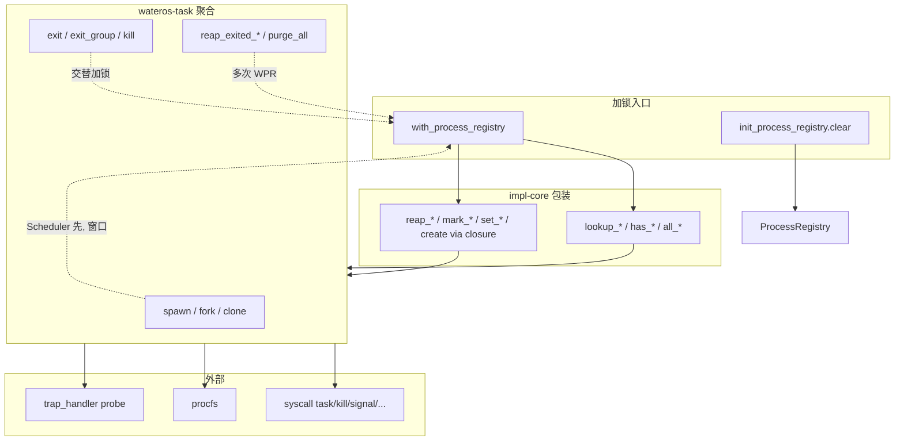

# ProcessRegistry 锁机制审计

> 审计时间：2026-06-25  
> Baseline：单核多线程（`UniprocessorSafeCell` + 关中断）  
> 关联清单：`docs/audits/lock-inventory.md` #2

---

## 1. 基本信息

| 项 | 内容 |
|---|---|
| **数据结构** | `ProcessRegistry` |
| **逻辑实现** | `os/components/wateros-task/task-impl/impl-core/src/process.rs` |
| **全局实例与加锁入口** | `os/components/wateros-task/task-impl/impl-core/src/lib.rs` |
| **全局实例** | `static mut PROCESS_REGISTRY: MaybeUninit<UniprocessorSafeCell<ProcessRegistry>>` |
| **就绪标志** | `static PROCESS_REGISTRY_READY: AtomicBool` |
| **锁类型** | `UniprocessorSafeCell<ProcessRegistry>`（内部 `RefCell`，`exclusive_access()` → `try_borrow_mut`，重入 panic） |
| **同步辅助** | `ProcessRegistryInterruptGuard`：加锁前关全局中断，`Drop` 时恢复 |
| **统一入口** | `with_process_registry(f)` = 关中断 + `exclusive_access` + 闭包 |
| **原语定义** | `os/components/wateros-base/src/sync/uniprocessor.rs` |

`ProcessRegistry` 维护进程 PCB（`ProcessControlBlock`）、PID/TID 分配、进程-任务归属、rlimit、reap/托孤等；**不参与调度决策**（调度器只认 `TaskId`）。

---

## 2. 锁 API 与调用点

### 2.1 原语层（`UniprocessorSafeCell`）

- `exclusive_access()`：`RefCell::try_borrow_mut`，已有借用则 **panic**（`RefCell already borrowed: ProcessRegistry`）
- 无显式 `unlock`：RAII，`RefMut` 离开作用域即释借

### 2.2 ProcessRegistry 层直接 `exclusive_access`（仅 2 处）

| 位置 | 函数 | 关中断 | 说明 |
|------|------|--------|------|
| `impl-core/src/lib.rs:52` | `init_process_registry` | **否** | init 路径 `clear()`；调度器尚未运行 |
| `impl-core/src/lib.rs:76-79` | `with_process_registry` | **是** | 所有运行时访问的唯一正确入口 |

### 2.3 `with_process_registry` 包装函数（`impl-core/src/lib.rs`，各独立持锁一次）

| 行 | 包装 API | 底层 `ProcessRegistry` 方法 |
|----|----------|---------------------------|
| 82-84 | `lookup_process` | `lookup_process` |
| 86-88 | `lookup_task` | `lookup_task` |
| 90-92 | `leader_task_for_process` | `leader_task_for_process` |
| 94-96 | `task_ids_for_process` | `task_ids_for_process` |
| 98-100 | `take_exited_member_tasks` | `take_exited_member_tasks` |
| 102-104 | `task_id_for_thread` | `task_id_for_thread` |
| 106-108 | `find_exited_child_process` | `find_exited_child_process` |
| 110-112 | `has_child_process` | `has_child_process` |
| 114-116 | `all_process_pids` | `all_process_pids` |
| 118-120 | `collect_exited_process_pids` | `collect_exited_process_pids` |
| 122-124 | `set_task_clear_child_tid` | `set_task_clear_child_tid` |
| 126-128 | `task_clear_child_tid` | `task_clear_child_tid` |
| 130-132 | `reap_process` | `reap_process` |
| 134-136 | `reap_process_with_tasks` | `reap_process_with_tasks` |
| 138-140 | `get_process_rlimit` | `get_process_rlimit` |
| 142-148 | `set_process_rlimit` | `set_process_rlimit` |

`process.rs` 中其余 `pub fn`（`create_process_for_task`、`mark_task_exited` 等）**无独立加锁**；仅允许在 `with_process_registry` 闭包内或 `process_model_self_test` 的栈上局部实例上调用。

### 2.4 聚合层写路径（`wateros-task/src/lib.rs`）

| 函数 | 行 | Registry 操作 | 与 Scheduler 顺序 |
|------|-----|---------------|-------------------|
| `spawn_user_task` | 83-90 | `create_process_for_task` | **Scheduler 先**（`enqueue_ready` 在 `with_scheduler` 内）→ 中断恢复窗口 → Registry 后 |
| `fork_current` | 223-234 | `create_process_like_fork` | Scheduler 先 → Registry 后 |
| `clone_current_thread` | 239-255 | `add_task_to_process` | Scheduler 先 → Registry 后 |
| `execve_current` | 260-286 | `update_process_address_space` | Scheduler 先 → Registry 后 |
| `exit_current` | 315-321 | `mark_task_exited` | **Registry 先** → Scheduler 后 |
| `exit_group_current` | 326-339 | `task_ids_for_process` → `mark_process_exiting` → 循环 `kill_task` | 多次交替（3+ 段 Registry / Scheduler） |
| `kill_task` | 344-351 | `mark_task_exited` | Scheduler 先 → Registry 后 |
| `terminate_other_threads_for_exec` | 356-382 | `task_ids_for_process` → 循环 `kill_task` → `retain_only_task_in_process` | 多次交替 |

**Scheduler 侧 spawn/fork/clone 入队时机**（`impl-round-robin/src/scheduler.rs:68-72, 366-387`；`impl-multi-class` 对称）：`registry` 插入 TCB 后 **同一 `with_scheduler` 闭包内** 即 `enqueue_ready_task`，故 Registry 登记前子任务/新任务已在就绪队列。

### 2.5 聚合层读/复合路径（多次独立加锁）

| 函数 | 行 | 加锁次数 | 说明 |
|------|-----|----------|------|
| `reap_exited_task` | 198-213 | ≥3 | `lookup_task` → `lookup_process` →（scheduler reap）→ `reap_process` |
| `reap_one_exited_task` | 291-300 | ≥3 | scheduler reap 先 → `lookup_task` → `lookup_process` → `reap_process` |
| `reap_exited_process` | 624-632 | 1 + N | `reap_process_with_tasks` 一次；scheduler reap 在锁外 |
| `reap_exited_member_threads` | 439-447 | 1 + N | `take_exited_member_tasks` 一次；逐 task scheduler reap |
| `purge_all_user_processes` | 550-590 | 大量 | 循环内反复 `all_process_pids` / `lookup_process` / `task_ids_for_process` / `kill_task` / `reap` |
| `reap_all_exited_processes` | 601-619 | 循环 | `collect_exited_process_pids` + `reap_exited_process` |
| `process_model_self_test` | 648-649 | 0（全局） | 栈上局部 `ProcessRegistry`，不碰全局 cell |

### 2.6 外部调用链（syscall / procfs / trap）

经 `wateros-task` 公开 API 间接加锁，**未发现** bypass `with_process_registry` 的路径。

| 模块 | 文件 | 典型 API / 路径 |
|------|------|-----------------|
| syscall task | `syscall-impl/.../sys/task.rs` | `waitpid`（`has_child_process` + `find_exited_child_process` + `wait_on_while` 条件）、`getpid`/`getppid`、`setrlimit`/`prlimit64`、`reap_exited_member_threads_runtime_resources` |
| syscall kill | `syscall-impl/.../sys/kill.rs` | `process_task_snapshot`、`task_ids_for_process` |
| syscall signal | `syscall-impl/.../sys/signal.rs` | `current_process_task_snapshot`、`task_ids_for_process`、`process_snapshot` |
| syscall clone | `syscall-impl/.../sys/clone.rs` | `current_process_task_snapshot`、`fork_current`/`clone_current_thread` 后 `process_task_snapshot` |
| syscall robust | `syscall-impl/.../sys/robust.rs` | `task_ids_for_process`、`current_process_task_snapshot` |
| syscall cap / ltp | `sys/cap.rs`、`sys/ltp_cgroup_helper.rs` | `process_task_snapshot`、`process_snapshot` |
| procfs | `fs-procfs/procfs-impl/impl-kernel/src/lib.rs` | `all_process_pids`、`process_snapshot` |
| trap | `os/src/trap_handler.rs:40` | `current_process_task_snapshot`（probe 日志） |

**嵌套 `with_process_registry`**：全库 **0 处**；若未来在 `reap_process_with_tasks` 持借期间回调再查 Registry → RefCell panic。

---

## 3. 持锁区间分析

### 3.1 标准临界区形态

```
ProcessRegistryInterruptGuard::new()   // 关中断
  └─ registry_cell().exclusive_access()  // RefMut 持有
       └─ 闭包内 BTreeMap 读写
  └─ Drop 恢复中断                      // RefMut 已释放
```

- **持锁期间睡眠/调度**：`with_process_registry` 闭包内无 `yield`/`wait`/`block`。**合规**。
- **持锁期间上下文切换**：关中断阻止 tick 抢占；闭包返回前不会 switch。**合规**。
- **漏释锁 / 重复释锁**：RAII；闭包 panic 连带 panic，无静默漏释。**合规**（panic = 硬失败）。

### 3.2 持锁区间内的跨子系统调用

历史实现的 `reap_process_with_tasks` 曾在 **仍持有 Registry 借用的闭包内** 调用：

```rust
mm_api::user_aspace_lifecycle::drop_user_aspace_on_task_exit(ptr);
```

- MM 钩子经 `register_drop_user_aspace_hook` 注册，典型实现走堆/帧释放（`LockedHeap` / `StackFrameAllocator` 等带锁路径）。
- 已确认 MM **不会**回调 `ProcessRegistry`（无重入 RefCell）。
- **当前状态**：已改为 `detach_exited_process` / `detach_aborted_fork` 锁内移除并返回
  owned `RetiredProcess`，闭包返回后再执行 `cleanup()` 和 MM drop。PR-02 已关闭。

### 3.3 与 Scheduler 锁的交互

Scheduler 使用独立 `UniprocessorSafeCell<RoundRobinScheduler|MultiClassScheduler>` + `InterruptGuard`。**当前无**在持 Scheduler 锁时调用 `with_process_registry` 的路径。

复合路径模式：

1. `InterruptGuard` + `with_scheduler(...)` → 释 Scheduler 借、恢复中断（或相反顺序）
2. **中断可开启的窗口**
3. `ProcessRegistryInterruptGuard` + `with_process_registry(...)`

**锁序不一致**：

| 路径 | 顺序 |
|------|------|
| `exit_current` | Registry → Scheduler |
| `kill_task` / spawn / fork / clone | Scheduler → Registry |

两锁从不同时持有 → **当前无 AB-BA 死锁**；属未来嵌套持锁维护风险（PR-08）。

### 3.4 多段临界区（锁外窗口）

以下路径在 **多次** `with_process_registry` 之间 **中断可开启**，其他任务/tick 可修改 Registry 或调度新 task：

| 路径 | 窗口后果 |
|------|----------|
| `spawn_user_task` / `fork_current` / `clone_current_thread` | 新 task 已在 Scheduler 就绪队列，Registry 尚无条目 → `current_process_task_snapshot()` 为 `None` |
| `reap_exited_task` / `reap_one_exited_task` | leader 判定与 `reap_process` 之间进程状态可变 |
| `exit_group_current` | `task_ids_for_process` 快照与后续 `kill_task` 非同一临界区 |
| `terminate_other_threads_for_exec` | 同上 |
| `waitpid`（`sys/task.rs:831-886`） | `has_child_process` 与 `find_exited_child_process` 非原子；`wait_on_while` 条件谓词两次独立加锁 |
| `purge_all_user_processes` | 多轮 kill/reap 间状态漂移 |

---

## 4. 潜在问题

### P0 — 卡死 / panic

| ID | 问题 | 路径 | 机制 |
|----|------|------|------|
| **PR-01** | **Spawn/Fork/Clone 登记窗口** | `spawn_user_task`、`fork_current`、`clone_current_thread` | Scheduler 在 `with_scheduler` 内 `enqueue_ready_task` 后释锁；Registry 登记前若 tick 调度到新 task，`current_process_task_snapshot()` 为 `None`，syscall 返回 `ESRCH` 或 robust/futex 清理异常；压测下可能与 wait/reap 互相等待 |
| **PR-02** | **持锁内 MM 释放延长临界区** | `detach_exited_process` / `RetiredProcess::cleanup` | **已修复**：detach 在锁内，MM drop 在锁外 |
| **PR-03** | **RefCell 重入 panic** | 任意嵌套 `with_process_registry` | 当前无嵌套；若 reap 钩子回调 cred/fd/procfs 再查 Registry → **必 panic**，表现为硬卡死 |

### P1 — 语义偏差 / 单核 TOCTOU

| ID | 问题 | 路径 |
|----|------|------|
| **PR-04** | **Kill 与 Registry 退出标记非原子** | `kill_task`：Scheduler 已 `mark_exited`，Registry 尚未 `mark_task_exited` |
| **PR-05** | **Reap 复合路径 TOCTOU** | `reap_exited_task`、`reap_one_exited_task`：多次独立加锁 |
| **PR-06** | **exit_group 线程表快照过期** | `exit_group_current`：`task_ids_for_process` 与后续 `mark_process_exiting` / `kill_task` 非同一临界区 |
| **PR-07** | **waitpid 条件非原子** | `waitpid_wait_for_child`：`has_child_process` && `find_exited_child_process` 各一次加锁 |

### P2 — 维护性 / 多核

| ID | 问题 | 说明 |
|----|------|------|
| **PR-08** | **Scheduler↔Registry 锁序不统一** | 扩展为嵌套持锁时易死锁 |
| **PR-09** | **`init_process_registry` 无 InterruptGuard** | 仅单核 init 安全；SMP 或未初始化并发 init 不可靠 |
| **PR-10** | **SMP 未支持** | `UniprocessorSafeCell` + 关中断仅适用于单 hart |

---

## 5. 当前实际支持范围（Coverage）

### 5.1 已正确加锁的路径

- 所有经 `impl-core` 包装 API 的 **单次** 读/写（lookup、rlimit、单次 mark/reap 等）。
- `with_process_registry` 闭包内无睡眠、无调度、无 Registry 重入（在 MM 钩子不变前提下）。
- 外部模块（syscall、procfs、trap）均通过 `wateros-task` 公开 API，**无 bypass**。
- 持锁闭环：每次 `exclusive_access` 均有 RAII 释借路径（含 panic 链）。

### 5.2 未完整覆盖 / 不可靠的路径

| 场景 | 状态 |
|------|------|
| Spawn/Fork/Clone 原子「Scheduler + Registry」 | **未覆盖**（两阶段，中间有中断窗口） |
| Kill/Reap/Exit_group 与 Scheduler 状态一致 | **部分覆盖**（顺序因路径而异，非原子） |
| waitpid / purge 等多步复合语义 | **依赖多次加锁 + 重试**，非严格原子 |
| `reap_process_with_tasks` 内 MM 释放 | **功能可用**，锁语义上临界区过大 |
| SMP / 多 hart | **不支持** |

---

## 6. 收敛建议

### 6.1 PR-01：Spawn/Fork/Clone 登记窗口（最高优先级）

**策略**：合并为单次关中断临界区，或保证「Registry 登记完成前 task 不可运行」。

建议实现（二选一）：

1. **推荐**：`with_scheduler_and_process_registry`（统一关中断；或 Scheduler 创建为不可运行态直至 Registry 登记完成）。
2. **最小收敛**：登记前勿 `enqueue_ready`；登记完成后再入队。

暂不可可靠实现时的 warn + 安全失败：

```rust
if active_impl::lookup_task(task_id).is_none() {
    log::warn!(
        "[ProcessRegistry] register-after-spawn gap task_id={} — ESRCH risk",
        task_id
    );
}
```

### 6.2 PR-02：持锁内 MM 释放

`reap_process_with_tasks` 仅收集 aspace ptr，锁外 drop：

```rust
let ptrs = with_process_registry(|r| r.collect_reap_aspace_ptrs(pid));
for ptr in ptrs { drop_user_aspace_on_task_exit(ptr); }
```

### 6.3 PR-04–07：复合路径原子化

- `reap_exited_task` / `exit_group_current` / `purge_all_user_processes`：合并为 **单次** `with_process_registry`（或专用 snapshot API），Scheduler 侧提供「无锁内部 API」需 Scheduler 审计配合。
- `waitpid`：条件谓词改为单次 `snapshot_wait_state(parent_pid)` 或在 leader `TaskWaitHandle` 路径保证事件与 Registry 一致。

### 6.4 PR-03：防重入

调试构建 reentrancy 计数；禁止在 reap/MM 钩子中调用任何 `wateros-task` process API（注释 + CI grep）。

### 6.5 统一锁序（PR-08）

文档约定：**Registry 先于 Scheduler**（与 `exit_current` 一致）；新增复合操作遵循此序。

---

## 7. 已修复 / 相关改进（非锁收敛）

| 项 | 说明 | 状态 |
|----|------|------|
| **exit_group 托孤** | `mark_process_exiting` 在修改 PCB 前调用 `reparent_orphans`（`process.rs:256-269`） | **已合入**（生命周期语义，减轻 zombie 泄漏；不消除 PR-06 锁窗口） |
| **PR-02 锁外销毁** | process detach 后才销毁 MM | **已修复** |
| **末线程完成判定** | `mark_task_exited` 在同一 Registry 临界区内返回是否刚转为 `Exited`，消除父进程漏唤醒 TOCTOU | **已修复** |
| **PR-01、PR-03** | spawn 窗口、重入防护 | **未修复** |
| **PR-04–PR-07 其余 TOCTOU** | kill/reap/waitpid 复合路径 | **部分未修复** |

---

## 8. 审计结论摘要

| 维度 | 结论 |
|------|------|
| 显式 lock/unlock 成对 | **是**（RAII / RefCell） |
| bypass 无锁访问 | **未发现** |
| 持锁睡眠 | **无** |
| 重入 / 嵌套 `with_process_registry` | **当前无**；reap+MM 为最大风险点 |
| 与 Scheduler 一致性 | **多路径两阶段**，单核下 TOCTOU 语义偏差 |
| 卡死主因关联度 | **PR-01 登记窗口**、**PR-02/03 临界区过长与重入** 与「意外卡死」高度相关 |

---

## 附录：调用链简图


