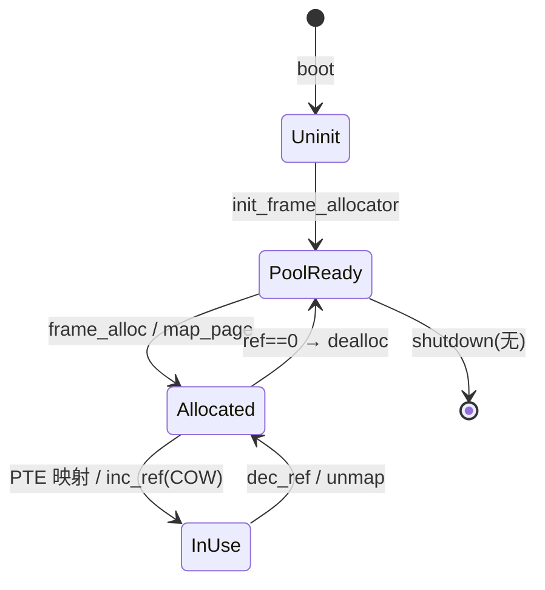
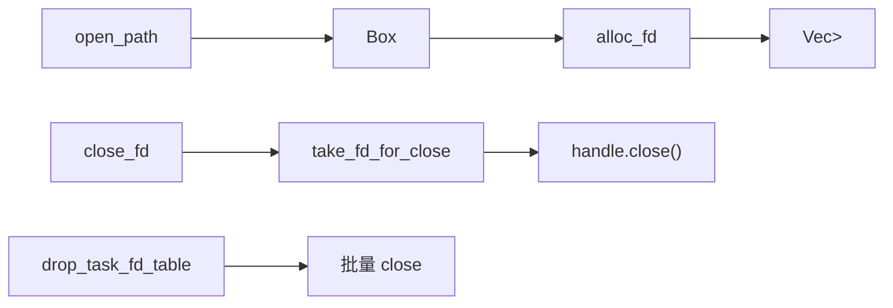

# 资源类型与生命周期说明

> 生成时间：2026-06-25  
> 来源：合并 `docs/audits/resources/*.md`  
> 索引：[`resource-inventory.md`](resource-inventory.md)

---

## 1. 物理页帧与地址空间（#1–5）

**组件**：`wateros-mm`  
**账本结论**：部分稳定

### 生命周期



| 阶段 | 持有者 | 转移条件 |
|------|--------|---------|
| 帧池初始化 | `StackFrameAllocator` | `init_frame_allocator(start,end)` |
| 用户 aspace 创建 | `Box::leak(Sv39AddressSpace)` | exec/load、`fork_user_aspace` |
| 映射页 | 用户 PTE + 可选 `ref_count` | brk/mmap/缺页/COW |
| 释放 | `drop_user_aspace` → `destroy_table` | 进程 reap / exec 替换 |

**关键入口**：分配 `frame_alloc()`；回收 `frame_dealloc()` / `destroy_table()`  
**硬上限**：帧池由 RAM 区间决定；用户 VA `0x4000_0000_0000`  
**耗尽**：`OutOfMemory`；部分路径 panic 或 SIGSEGV

---

## 2. 内核堆（#6）

**组件**：`wateros-runtime/runtime-heap-allocator`  
**账本结论**：部分稳定

| 阶段 | 说明 |
|------|------|
| init | `heap_allocator::init()` 绑定 128MiB BSS |
| alloc | 全组件 `Box`/`Vec`/TCB/元数据 |
| dealloc | `Drop` → `GlobalAlloc::dealloc` |
| OOM | `alloc_error_handler` → **panic** |

**硬上限**：128 MiB（`KERNEL_HEAP_SIZE`）  
**主要消费者**：帧分配器元数据（~2–3MiB）、页缓存（~16MiB）、TCB×N、VMA Vec

---

## 3. 任务 / 进程槽位（#7–12）

**组件**：`wateros-task`  
**账本结论**：部分稳定

### 端到端路径

| 事件 | 分配 | 回收 |
|------|------|------|
| spawn 用户任务 | `allocate_id` + `new_user_task` + `create_process_for_task` | `exit` → `reap_task` + `reap_process_with_tasks` |
| fork | `fork_current` + `fork_user_aspace` + `on_fork` | 子进程独立 exit 路径 |
| clone 线程 | `clone_thread_from` + `add_task_to_process` | 线程 exit；进程末线程触发 reap |
| waitpid | — | `reap_exited_task` 消费 Exited 队列 |

**硬上限**：TaskId slot u32；`RLIMIT_NPROC` 仅 getrlimit 默认 1024，**未强制**  
**WaitQueueId**：`allocate_wait_queue` / `try_release_empty`（多处临时队列未释放）

---

## 4. 文件描述符（#13–16）

**组件**：`wateros-vfs/impl-fd-session`  
**账本结论**：部分稳定



**硬上限**：`RLIMIT_NOFILE` 默认 1024  
**fork**：`share_fd_table_from_parent` / `copy_fd_table_from_parent` + owner/ref_count  
**耗尽**：`-EMFILE`（rlimit）、`-ENOMEM`（句柄分配失败）

---

## 5. 页缓存（#17–18）

**组件**：`impl-page-cache`  
**账本结论**：帧池稳定；元数据/open_refs 不可靠路径见 P0

| 资源 | 分配 | 回收 |
|------|------|------|
| 缓存帧 | `install_page` / LRU 驱逐 | `purge_closed_file` / 驱逐写回 |
| FileEntry | `get_file_entry` | `purge_closed_file` |
| open_refs | `acquire_open_ref`（open/dup） | `release_open_ref`（close） |

**硬上限**：4096 帧 × 4KiB ≈ 16MiB

---

## 6. 块设备缓存（#19）

**组件**：`impl-block-cache`  
**账本结论**：稳定

固定 64 槽预分配；LRU 驱逐复用索引；写穿策略。无动态堆增长。

---

## 7. Pipe 与环缓冲（#20–21）

**组件**：`ipc-pipe/impl-ringbuf` + vfs handles  
**账本结论**：部分稳定（正常 close/exit OK；内部 fd 表重置不可靠）

| 对象 | 分配 | 回收 |
|------|------|------|
| `Arc<Pipe>` | `Pipe::with_capacity(4096)` | 两端 `release_*` → refs==0 → Drop |
| `PipeEndpoint` | `pair()` | `close()` |
| fd 句柄 | `pipe_handle_pair` + `alloc_fd`×2 | `close_fd` |

---

## 8. Futex / Signal / SHM（#22–26）

**组件**：`wateros-ipc`  
**账本结论**：部分稳定

| 资源 | 分配 | 回收 |
|------|------|------|
| Futex 队列 | `get_queue` 惰性插入 | `cleanup_empty_queue` |
| Robust 表 | `set_robust_list` | `drop_robust_list` / exit cleanup |
| 信号状态 | `register_process/thread` | `drop_process/thread` |
| SHM 段 | `create_or_get` + 物理页 | `remove_segment`（nattch==0） |
| SHM attach | `begin_attach`/`finish_attach` | `detach` / `drop_task_attachments` |

**硬上限**：SHM 单段 4MiB；NSIG=64；robust 遍历 4096 步

---

## 9. 套接字（#27–29）

**组件**：`driver-network` + `socket_fd.rs` + `unix_sock.rs`  
**账本结论**：inet 部分稳定；unix **不可靠**

三层结构：
1. smoltcp `SocketHandle`（`NETWORK_STACK`）
2. `SocketFdRegistry`（AF_INET fd 侧表）
3. `unix_sock`：`FD_TABLE` + `BOUND`

**回收链**：`close` → `socket_fd::remove` / `unix_sock::unregister` → `stack::socket_close`  
**缺口**：execve CLOEXEC、fork 后 BOUND 引用、dup 侧表同步

---

## 10. 文件系统实例（#30–35）

**组件**：`wateros-fs` + `mount_table`  
**账本结论**：部分稳定

| 资源 | 分配 | 回收 |
|------|------|------|
| 根卷 RO/RW | `mount_root_*` | `clear_root_fs` |
| 辅助挂载 | `mount_aux_*` / tmpfs | `unmount_aux_at` |
| ext4 inode | `create_regular` 等 | `ialloc_free_inode` |
| tmpfs inode | `alloc_inode` 递增 | unlink 节点（**号不回收**） |

---

## 11. 驱动槽位（#36–41）

**组件**：`wateros-driver`  
**账本结论**：启动期稳定；无运行时注销

| 表 | 分配 | 回收 |
|----|------|------|
| BLOCK/CHAR/NETWORK_DEVICES | `register_*` | **无** |
| VirtIO DMA | `dma_alloc` | `dma_dealloc`（设备 Drop 时；表持有阻止 Drop） |
| PCI BAR | bump 分配 | **无** |

---

## 跨资源退出钩子（统一视图）

```
sys_exit / exit_group
  └─ drop_task_runtime_resources_with_aspace
       ├─ vfs::fd::drop_task_fd_table
       ├─ socket_fd::drop_task / unix_sock::drop_task
       ├─ shm::drop_task_attachments
       ├─ signal::on_thread_exit
       ├─ futex robust_exit_cleanup
       └─ drop_user_aspace (末进程线程)
  └─ reap_process_with_tasks → ProcessRegistry
```

完整分组文档见 [`docs/audits/resources/`](resources/)。
