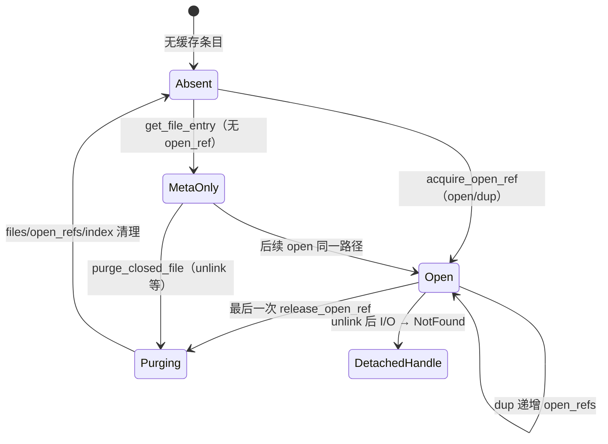

# 页缓存资源生命周期审计

> 审计时间：2026-06-25  
> 分组：`page-cache`（资源 #17–18）  
> Baseline：单核多线程；对照 Linux 常见语义（`close` 刷脏、`unlink` 延迟回收 inode、重挂载缓存失效）  
> 交叉参考：`docs/audits/resource-inventory.md` #17–18、`docs/audits/lock-inventory.md` #12、`docs/audits/lock-issues.md` PC-01/TRUNC-01

---

## 1. 资源概览

| # | 资源名称 | 所属组件 | 主要类型 | 硬上限 | 账本复杂度 |
|---|---------|---------|---------|--------|-----------|
| 17 | 页缓存帧（全局 LRU） | `vfs-impl-page-cache` | `GlobalCacheState`、`PageFrame` | **4096 帧 × 4KiB ≈ 16MiB**（`FILE_PAGE_CACHE_CAPACITY`） | 高 |
| 18 | per-file 元数据 / 打开引用 | 同上 + `PagedFileHandle` | `FileEntryInner`、`open_refs: BTreeMap<FileCacheKey, usize>` | 无显式路径数上限；依赖 `close`/`purge` | 中高 |

**适用范围**：仅**根卷**普通文件经 `PagedFileHandle` 使用页缓存；辅助挂载（`AuxRw`/`AuxRo`）走 `BufferedFileHandle`（整文件堆缓冲），**不经过本审计对象**。

**缓存键**：`(mount_gen, path)`，其中 `mount_gen` 来自 `fs::rootfs::active_impl::mount_generation()`。

**全局单例**：`GLOBAL_CACHE: Mutex<Option<Arc<GlobalFilePageCache>>>`，经 `global_cache(mount_gen)` / `reset_global_cache` 管理。

---

## 2. 分配入口

### 2.1 页缓存帧（#17）

| 入口 | 文件 | 条件 | 说明 |
|------|------|------|------|
| `GlobalCacheState::new()` | `impl-page-cache/src/lib.rs` | 首次 `GlobalFilePageCache::new` / `reset_global_cache` | **启动期一次性**预分配 `capacity` 个 `PageFrame`（每帧 `vec![0; FILE_PAGE_SIZE]`） |
| `install_page` | 同上 | `read`/`write`/`flush` miss | 从 `free` 或 LRU 尾取槽；槽位复用，**不新增帧** |
| `install_zero_page` | 同上 | 写洞区 / 整页覆盖写 | 同上 |
| LRU 驱逐 | `pop_free_or_lru_index` → `detach_slot_for_reuse` | 缓存饱和 | 脏页驱逐前经 `writeback_evicted_page` 写回下层 |

**前置依赖**：`FILE_PAGE_CACHE_CAPACITY > 0`（当前 4096）；`capacity == 0` 时 `install_*` 静默 no-op，但 `read` 仍 `expect("page installed")` — **配置为 0 会 panic**（当前配置非 0）。

**临时堆分配**：每次 `install_page` miss 分配 `page_buf: Vec<u8>`（4KiB）；驱逐脏页时 `data.clone()` 一份用于锁外写回。

### 2.2 per-file 元数据与 open_refs（#18）

| 入口 | 文件 | 触发路径 |
|------|------|---------|
| `get_file_entry` | `impl-page-cache/src/lib.rs` | 首次 `read`/`write`/`flush`/`truncate`/`set_logical_size` 触及该路径 |
| `acquire_open_ref` | 同上 | `PagedFileHandle::open`、`Clone`/`duplicate`（dup/fork） |
| `FileEntryInner` 字段 | 同上 | `logical_size`、`dirty_pages: BTreeMap<u64, ()>` 随写扩展 |

**打开路径**：`FsBridge::open` → `paged_handle::open_file` → `PagedFileHandle::open`（`impl-fs-bridge/src/paged_handle.rs`）。

**不登记 open_ref 的路径**：`get_file_entry` 仅因读/写触及缓存、无 fd 打开（例如 `metadata` 叠加 `overlay_cached_size`）。

---

## 3. 回收入口

### 3.1 页缓存帧

| 入口 | 机制 |
|------|------|
| LRU 驱逐 | `detach_slot_for_reuse`：清 `key`、移出 `index`/`lru`，脏页写回后槽进 `free` 或复用 |
| `purge_closed_file` | 移除该路径全部 `index` 项，槽位归还 `free`（**不写回**） |
| `truncate` | 丢弃 EOF 之后页的 `index` 项，槽归还 `free`（**不写回**被截断区间的脏页） |
| `reset_global_cache` | 丢弃整个 `Arc<GlobalFilePageCache>`，旧帧随 `Drop` 释放堆 `Vec` |
| `GlobalFilePageCache` Drop | 帧 `Vec`、预分配 `PageFrame.data` 随结构体释放 |

### 3.2 per-file 元数据

| 入口 | 文件 | 配对条件 |
|------|------|---------|
| `release_open_ref` → `purge_closed_file` | `impl-page-cache` | `open_refs` 减至 0（正常 `close`） |
| `purge_closed_file`（直接） | `impl-fs-bridge/src/lib.rs` | `unlink_path`、`overwrite_file_at` |
| `reset_global_cache` | `impl-page-cache` | 整表替换（应先 `flush_all`） |

### 3.3 PagedFileHandle 生命周期

```
open → acquire_open_ref
dup/fork(copy_fd_table) → duplicate() → Clone → acquire_open_ref
close → sync_dirty(flush) → release_open_ref
任务退出 → vfs::fd::drop_task_fd_table → drain + handle.close()（syscall 路径）
```

| 阶段 | 函数 | 资源效果 |
|------|------|---------|
| `close` | `paged_handle.rs:344` | flush 脏页 → `release_open_ref` |
| `flush` / `fsync` | `sync_dirty` | 仅 flush，**不**释放 open_ref |
| `truncate` | 下层 truncate + `cache.truncate` | 调整 logical_size，丢弃 EOF 后缓存页 |
| 任务退出 | `vfs/src/fd.rs:drop_task_fd_table` | 对每个句柄 `close()`（含 flush + release） |
| `Drop` | **未实现** | 依赖显式 `close`；fd 表 drain 路径会调用 `close` |

**detach 模式**：下层返回 `NotFound`（如 unlink 后写）时句柄转 `detached`，脏数据进 `detached_data` 堆 `Vec`，**脱离页缓存**。

---

## 4. 生命周期状态机

### 4.1 页帧槽位（#17）

```mermaid
stateDiagram-v2
    [*] --> Free: GlobalCacheState::new 预分配
    Free --> Resident: install_page / install_zero_page
    Resident --> Resident: touch_lru（命中）
    Resident --> Evicting: LRU 压力 / pop_free_or_lru_index
    Evicting --> Free: 干净页或脏页写回成功
    Evicting --> Resident: 写回失败，return_detached_slot 回滚
    Resident --> Free: purge_closed_file / truncate 移除键
    Free --> [*]: reset_global_cache 丢弃整表
```

**半初始化**：`install_page` 在锁外读盘后二次检查；写回失败时 `return_detached_slot` 将槽归还 `free` 而不挂新键 — **可安全重试**。

### 4.2 per-file 条目（#18）



**持有者与转移**：

- **页帧**：全局 `GlobalFilePageCache` 独占；多 fd 通过同一路径键共享。
- **FileEntryInner**：`Arc<RwLock<>>`；`open_refs` 与 fd 句柄数对齐（dup/fork 各 +1）。
- **PagedFileHandle**：per-fd 私有（offset、`detached` 状态）；`mount_gen` 在 open 时快照。

---

## 5. 账本稳定性结论

| 维度 | 结论 | 说明 |
|------|------|------|
| 帧分配/释放成对 | **稳定** | 固定池；无动态扩池；驱逐有写回回滚 |
| open_refs 成对 | **部分稳定** | 正常 `close`、任务退出 `drop_task_fd_table` 成对；**flush 失败 close**、**mount_gen 漂移**、**unlink 强 purge** 可破坏 |
| files BTreeMap | **部分稳定** | 依赖 `open_refs→0` 或 `purge_closed_file`；泄漏时**单调增长**耗尽内核堆 |
| 脏页写回 | **部分稳定** | `close`/`flush`/驱逐写回完整；**purge/truncate 丢弃页不写回** |
| double-free / UAF | **低风险** | Rust 所有权 + 固定槽位；无显式 double-free |
| 跨代次混用 | **不可靠** | `global_cache(stale_gen)` 返回新代次 `Arc`，与句柄快照 `mount_gen` 键不一致 |

**综合**：**部分稳定** — 稳态读写 + 正常 close 路径可信；unlink/rename/remount/close 失败路径存在数据丢失与元数据泄漏风险。

---

## 6. 耗尽与失败处理

### 6.1 页帧池（#17）

| 场景 | 行为 | 与预期差距 |
|------|------|-----------|
| 池满 | LRU 驱逐；脏页先 `writeback_evicted_page` | 接近期望；写回失败返回 `Err`，调用方中止 |
| `free`+`lru` 双空 | `pop_free_or_lru_index` 从 `index` 强驱逐首个键 | 有 `expect` panic 兜底（正常不应触发） |
| `capacity == 0` | `install_*` 返回 `Ok(())` | `read` 随后 **panic**（`expect("page installed")`） |
| 写回失败 | `return_detached_slot` + `Err` | 正确回滚槽位 |

### 6.2 per-file 元数据（#18）

| 场景 | 行为 | 与预期差距 |
|------|------|-----------|
| 路径数无上限 | `files`/`open_refs` 随打开过的唯一路径增长 | Linux 靠 inode 回收；此处靠 purge，**无硬 cap** |
| open_refs 泄漏 | 条目永不 purge | 长跑测试可**内核堆耗尽** |
| unlink 打开文件 | Linux 仍可按 fd 访问；此处 **purge 缓存且未 flush** | **语义不符 + 丢数据** |

### 6.3 全局缓存重建

| 场景 | 行为 |
|------|------|
| `reset_file_page_cache` | `flush_all` → `reset_global_cache`（**安全**） |
| aux 挂载/卸载 | `bump_mount_generation_after_cache_flush`（**安全**） |
| `mount_aux_*` 别名复用根卷 | `rootfs` 内直接 `bump_mount_generation()`，**未 flush** |
| `global_cache(new_gen)` | `new_gen > existing` 时 warn 并**无 flush 重建** |
| `global_cache(stale_gen)` | 返回当前新缓存 `Arc`，句柄键与 `open_refs` **可能错位** |

---

## 7. 跨资源耦合

| 事件 | 页缓存行为 | 风险 |
|------|-----------|------|
| `open` / `read` / `write` | 帧安装、元数据扩展 | 与 ext4 `SharedRwFs` 锁序：须先 entry 再 state 再 FS（见模块头注释） |
| `dup` / `fork` (`copy_fd_table_from_parent`) | `duplicate` → `acquire_open_ref` | **成对** |
| `CLONE_FILES` 线程共享 fd 表 | 共享同一 `PagedFileHandle` 盒；close 仅一次 | 与 fd 表语义耦合（FD-01），open_ref 不在此膨胀 |
| `close(fd)` | flush + release | flush 失败 → open_ref 泄漏 |
| `drop_task_fd_table` | 批量 `close()` | syscall 路径正确 |
| `unlink` | 磁盘 unlink + **`purge_closed_file`（无 flush）** | 打开中 fd 脏页丢失 |
| `rename` | **无缓存迁移/失效** | 旧路径缓存残留；已打开句柄持旧 path |
| `overwrite_file_at` | 写盘后 `purge_closed_file` | 合理 |
| 辅助挂载 `bump_mount_generation` | 部分路径无 flush | 脏页随旧 `Arc` 丢弃 |
| `sync`/`fsync` syscall | `flush_all_open_files` → 各句柄 flush | 不释放 open_ref |
| 块缓存 / ext4 小读缓存 | 独立资源（#19、EXT4_SMALL_READ_CACHE） | 写路径锁序交叉已收敛（BLK-01） |

---

## 8. 潜在问题列表

### P0（数据丢失 / 堆耗尽 / 账本破坏）

| ID | 类型 | 描述 | 触发路径 |
|----|------|------|---------|
| **PC-LC-01** | 数据丢失 | `purge_closed_file` **不 flush** 脏页即回收帧与 `FileEntryInner` | `unlink_path`（`lib.rs:431`）在文件仍打开或有未刷脏页时 |
| **PC-LC-02** | 泄漏 + 丢刷 | `close_fd` 已从 fd 表取出句柄；`PagedFileHandle::close` 中 `sync_dirty` 失败则**不** `release_open_ref`，句柄被 drop | 写回错误、磁盘满、I/O 失败 |
| **PC-LC-03** | 语义错误 | `rename_path` 不迁移/失效 `(mount_gen, old_path)` 缓存；已打开 `PagedFileHandle` 持**旧路径**字符串 | `rename(2)` 与并发读写 |
| **PC-LC-04** | 数据丢失 | `mount_aux_*` 别名复用根卷时 `bump_mount_generation()` **未经** `reset_file_page_cache`；`global_cache` 重建丢弃旧 `Arc` 上脏页 | `rootfs-impl/impl-kernel/src/lib.rs:135,168` |
| **PC-LC-05** | 账本错位 | `global_cache(stale_mount_gen)` 在 `mount_gen < existing` 时返回**新代次**缓存；句柄 `open_refs` 登记键 `(old_gen, path)` 与后续 `file_key` `(new_gen, path)` 不一致 | 根卷 remount 后旧 fd 未关闭 |

### P1（错误路径 / 部分回滚）

| ID | 类型 | 描述 |
|----|------|------|
| **PC-LC-06** | 静默截断 | `truncate` 丢弃 EOF 后脏页缓存槽**不写回**（通常可接受；跨 EOF 脏页若存在则丢） |
| **PC-LC-07** | 无界增长 | 仅 `get_file_entry` 触及、从未 open/close 的路径条目**无** `open_refs`，仅靠 `purge_closed_file` 清理；大量唯一路径顺序读可撑大 `files` |
| **PC-LC-08** | 错误码 | 池逻辑无 `ENOMEM`；饱和靠驱逐；驱逐写回失败传播 `VfsError::Io`，**非** Linux `ENOMEM` |

### P2（边界 / 可观测性）

| ID | 类型 | 描述 |
|----|------|------|
| **PC-LC-09** | panic | `FILE_PAGE_CACHE_CAPACITY == 0` 时 `read` 必 panic |
| **PC-LC-10** | 性能 | 每次 miss 堆分配 4KiB `page_buf`；高 churn 压力内核堆分配器 |
| **PC-LC-11** | 交叉 | 锁审计 PC-01（驱逐重入死锁）已修复；本审计仍须保证 flush 路径不持 entry 写锁调 I/O |

---

## 9. 收敛建议

1. **PC-LC-01**：`unlink_path` 前对仍 `open_refs > 0` 的路径**拒绝 unlink** 或仅删目录项保留缓存直至末次 `close`（Linux unlink 语义）；至少 `purge` 前 `flush`。短期：`open_refs > 0` 时 `log::warn!` + 跳过 purge 或强制 flush。
2. **PC-LC-02**：`close` 改为「flush 失败仍 `release_open_ref`」或 close 失败时**恢复 fd 槽位**；禁止静默 drop 泄漏。warn 含 `path`、`open_refs` 计数、`dirty_page_count`。
3. **PC-LC-03/05**：`rename` 时迁移缓存键或 bump 代次并失效；句柄内 path 更新或转 inode 级键（长期）。
4. **PC-LC-04**：所有 `bump_mount_generation` 统一走 `bump_mount_generation_after_cache_flush`。
5. **PC-LC-07**：为 `files.len()` 加软上限 + warn；或定期 `reset_file_page_cache`（测例已有）。
6. **不可靠路径统一契约**：warn 模板  
   `[page-cache] <op> path={} open_refs={} dirty_pages={} files={} used_frames={}/{} mount_gen={}`

---

## 10. 修复任务草案

| 优先级 | 标题 | 文件 | 验收标准 |
|--------|------|------|---------|
| P0 | unlink 前 flush 或 defer purge | `impl-fs-bridge/src/lib.rs`、`impl-page-cache/src/lib.rs` | 打开中文件 `unlink` 后 `read`/`write` 数据与 Linux 一致；或返回 `EBUSY`；无静默丢脏页 |
| P0 | close flush 失败仍释放 open_ref 或恢复 fd | `paged_handle.rs`、`vfs/src/fd.rs` | 模拟写回失败后 `files`/`open_refs` 不泄漏；文档约定错误码 |
| P0 | 统一 mount_gen bump 前 flush | `fs-rootfs/.../lib.rs` | 所有 bump 路径先 `flush_all`；无 warn 重建 |
| P1 | rename 缓存失效 | `impl-fs-bridge/src/lib.rs` | rename 后旧路径缓存清除；新路径 miss 读盘正确 |
| P1 | stale mount_gen 句柄处理 | `impl-page-cache/src/lib.rs`、`paged_handle.rs` | remount 后旧 fd 返回 `EBADF` 或透明失效；`open_refs` 键一致 |
| P2 | `capacity==0` 安全降级 | `impl-page-cache/src/lib.rs` | `capacity==0` 时 bypass 缓存直读下层，不 panic |
| P2 | `files` 软上限 warn | `impl-page-cache/src/lib.rs` | 超阈值 warn + 可选拒绝新 `get_file_entry` |

---

## 11. 关键代码索引

| 符号 | 路径 |
|------|------|
| `GlobalFilePageCache` | `os/components/wateros-vfs/vfs-impl/impl-page-cache/src/lib.rs` |
| `PagedFileHandle` | `os/components/wateros-vfs/vfs-impl/impl-fs-bridge/src/paged_handle.rs` |
| `open_file` / `unlink_path` / `reset_file_page_cache` | `os/components/wateros-vfs/vfs-impl/impl-fs-bridge/src/lib.rs` |
| `FILE_PAGE_CACHE_CAPACITY` | `os/components/wateros-base/base-config/src/fs.rs` |
| `drop_task_fd_table` | `os/components/wateros-vfs/src/fd.rs` |
| `copy_fd_table_from_parent` | `os/components/wateros-vfs/vfs-impl/impl-fd-session/src/registry.rs` |

---

## 12. 审计结论

- **资源 #17（页帧池）**：固定 16MiB 预分配，LRU 驱逐与写回回滚设计完整；**账本稳定**。
- **资源 #18（per-file 元数据 + open_refs）**：正常 open/dup/close/任务退出路径**基本稳定**；**unlink 强 purge、close 失败、remount 代次漂移** 为三大不可靠路径。
- **PagedFileHandle**：生命周期与 fd 表绑定；`detached` 模式为 unlink 后兜底，但**不能**弥补 purge 导致的脏页丢失。

**建议主 agent 并入文档 A 的 P0 项**：PC-LC-01、PC-LC-02、PC-LC-04、PC-LC-05（PC-LC-03 可并列 P0/P1）。
