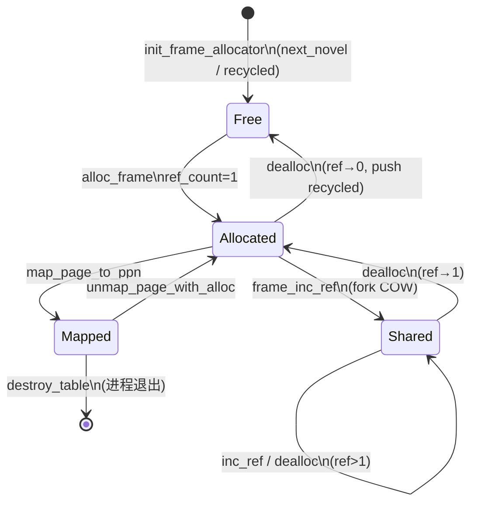

# 物理页帧与地址空间生命周期审计

> **分组**：`physical-frames`（资源 #1–5）  
> **生成时间**：2026-06-25  
> **Baseline**：单核多线程；对照 Linux `brk`/`mmap`/`munmap`/`mremap`/`fork`/`exit` 常见语义  
> **交叉引用**：[`syscall-issues.md`](../syscall-issues.md)（P0-04/05、MM-P1-01/02）、[`lock-inventory.md`](../lock-inventory.md)（#8 `StackFrameAllocator`）、[`resource-inventory.md`](../resource-inventory.md)

---

## 1. 资源总览

| # | 资源名称 | 所属组件 | 主要类型/结构体 |
|---|---------|---------|----------------|
| 1 | 物理页帧 | `wateros-mm` / `impl-stack` | `StackFrameAllocator`、`PhysPageNum`、`FrameMemStats` |
| 2 | 页表帧（中间/叶子） | `wateros-mm` / `impl-sv39` | 与数据帧共用 `StackFrameAllocator`；`alloc_table_frame_zeroed()` |
| 3 | 用户虚拟页映射 | `wateros-mm` / `impl-sv39` | `Sv39AddressSpace` + `HeapBrk` / `MmapOps` / VMA 元数据 |
| 4 | 用户地址空间对象 | `wateros-mm` / `impl-sv39` | `Sv39AddressSpace`（`Box::leak` 裸指针 + `user_aspace_lifecycle` 钩子） |
| 5 | 内核全局页表 | `wateros-mm` / `impl-sv39` | `KERNEL_ASPACE`（`AtomicPtr` + `Box::leak`，故意不 `Drop`） |

**帧池上界**：由 bring-up 传入 `init_frame_allocator(start_ppn, end_ppn)` 的半开 PPN 区间决定（`os/src/main.rs` 从 `kernel_end` 对齐至 DTB 保留区或 RAM 末端）。**用户 VA 上界**：`USER_VA_LIMIT = 0x4000_0000_0000`（Sv39 39 位用户空间）。

---

## 2. 分配链路（函数级）

### 2.1 物理页帧（#1）

| 阶段 | 函数 | 文件 |
|------|------|------|
| 初始化 | `init_frame_allocator(start_ppn, end_ppn)` | `mm-frame-alloctor/.../impl-stack/src/lib.rs` |
| 分配 | `StackFrameAllocator::alloc_frame()` → `frame_alloc()` / `frame_alloc_result()` | 同上 |
| 适配器 | `GlobalPhysFrameAllocator::alloc_frame()` | 同上 |
| 引用计数 | `frame_inc_ref()` / `frame_ref_count()` | 同上（fork COW 路径） |
| 统计 | `frame_mem_stats()` | 同上 |

**调用方（非穷举）**：

- 页表：`alloc_table_frame_zeroed()`（`impl-sv39/src/pagetable.rs`）
- 用户映射：`map_zeroed_page_with_alloc` / `map_range_from_*`（`mm-impl/common/src/lib.rs`）
- ELF 装载：`kernel_elf.rs` 各 `map_load_segment*` 路径
- 内核辅助：`kernel_global.rs::map_anon_range_user`（`expect` OOM）
- Trap 缺页：`MmapOps::handle_page_fault` → 栈/brk/懒加载文件页
- COW 写：`handle_cow_page` / `ensure_private_for_write`
- VirtIO DMA：经 `dma_alloc` 间接使用帧池（见 `driver-slots` 分组）

### 2.2 页表帧（#2）

| 操作 | 函数 | 文件 |
|------|------|------|
| 分配并清零 | `alloc_table_frame_zeroed()` | `impl-sv39/src/pagetable.rs` |
| 建表 walk | `Sv39AddressSpace::walk_create()` | 同上 |
| fork 复制树 | `fork_table()` | 同上 |
| 进程销毁递归释放 | `destroy_table()` | 同上 |

### 2.3 用户虚拟页映射（#3）

| 入口 | 路径 | 文件 |
|------|------|------|
| `brk` 扩展/收缩 | `HeapBrk::brk` → `map_zeroed_page_with_alloc` / `unmap_page_with_alloc` | `impl-sv39/src/user_heap_mmap.rs` |
| `mmap` 匿名 | `mmap_anonymous` → `map_zeroed_range_with_alloc` | 同上 |
| `mmap` 文件（eager） | `mmap_file` / `mmap_file_with_loader_inner` | 同上 |
| `mmap` 文件（lazy） | `mmap_file_lazy` → `register_lazy_file_vma`；缺页 `handle_lazy_page_fault` | 同上 |
| `munmap` | `unmap_range_with_alloc` + VMA 清理 | 同上 |
| `mremap` | `mremap_range`（`mm-impl/common/src/lib.rs`） | common + user_heap_mmap |
| `mprotect` | `protect_page` / COW 写前 `ensure_private_for_write` | user_heap_mmap + pagetable |
| 用户栈缺页 | `handle_stack_page_fault` | user_heap_mmap |
| ELF PT_LOAD | `map_load_segments_from_path*` | `kernel_elf.rs` |
| 内核 RAM 恒等（用户表内） | `map_identity_range_user` | `kernel_global.rs` |

**Syscall 拼合层**：`wateros-syscall/.../sys/brk.rs`、`mmap.rs`（含 `munmap`/`mprotect`/`mremap`）→ `with_user_aspace_mut` + `GlobalPhysFrameAllocator`。

### 2.4 用户地址空间对象（#4）

| 阶段 | 函数 | 文件 |
|------|------|------|
| 创建（exec/load） | `Sv39AddressSpace::new()` → `Box::leak` | `kernel_elf.rs` |
| 布局初始化 | `init_user_layout()` | `pagetable.rs` |
| fork | `fork_user_aspace()` → `fork_cow()` → `Box::into_raw` | `impl-sv39/src/lib.rs` |
| 退出释放钩子注册 | `register_drop_user_aspace_hook(drop_user_aspace)` | `kernel_global.rs::init` |
| 释放 | `drop_user_aspace()` → `Box::from_raw` → `Drop` → `destroy()` | `impl-sv39/src/lib.rs` |
| 进程 reap 触发 | `drop_user_aspace_on_task_exit(ptr)` | `user_aspace_lifecycle.rs` ← `process.rs::reap_process_with_tasks` |
| exec 替换 | `drop_user_aspace(old)` | `sys/execve.rs` |

### 2.5 内核全局页表（#5）

| 阶段 | 函数 | 文件 |
|------|------|------|
| 创建+恒等映射 | `kernel_mm::init()` | `kernel_global.rs` |
| 泄漏常驻 | `Box::leak` → `KERNEL_ASPACE.store` | 同上 |
| 运行期修改 | `map_identity_range_user` / `map_anon_range_user` / `ensure_user_execute_for_kernel_va` | 同上 |

---

## 3. 回收链路（函数级）

### 3.1 物理页帧

| 场景 | 函数 | 说明 |
|------|------|------|
| 显式释放 | `dealloc_frame()` / `frame_dealloc_result()` | 引用计数 >1 时仅递减 |
| 忽略错误释放 | `frame_dealloc()` | 失败仅 `warn!`，不向上传播 |
| unmap 叶子页 | `AddressSpaceOps::unmap_page_with_alloc` | `unmap_page_to_ppn` + `dealloc_frame` |
| 进程/ exec 销毁 | `destroy_table()` 对用户叶子 PTE | 跳过 `shared_anon_vmas` 标记的共享页 |
| COW 分裂 | `handle_cow_page` 成功后 `dealloc` 旧帧 | 递减共享引用 |

### 3.2 页表帧

| 场景 | 函数 | 说明 |
|------|------|------|
| 进程退出 / `drop_user_aspace` | `destroy_table()` 递归 | 释放全部中间表 + 根表 |
| **`munmap` / `brk` 收缩** | **无** | 仅清 PTE，**中间页表帧不回收**（见 §6） |
| fork 失败回滚 | `destroy_table(child_sub, ...)` | `fork_table` 错误路径 |

### 3.3 用户地址空间

| 事件 | 回收时机 | 入口 |
|------|---------|------|
| 进程 `reap`（wait 收尸） | `ProcessRegistry::reap_process_with_tasks` | `drop_user_aspace_on_task_exit` |
| `execve` 成功 | 装载新 ELF 前 | `kernel_mm::drop_user_aspace(old)` |
| 线程退出 | **不**单独释放 aspace | 与同进程线程共享；由进程 reap 统一释放 |
| `fork` 失败（部分路径） | **应释放子 aspace，当前缺失** | 见 §6 P0 |

### 3.4 内核全局页表

**无回收**（设计意图：`kernel_global.rs` 注释说明避免 `satp` 悬空）。

---

## 4. 生命周期状态机

### 4.1 物理页帧



**半初始化风险**：`map_zeroed_range_with_alloc` 循环中途 `alloc_frame` 失败时，已映射页不回滚（见 §6）。

### 4.2 用户地址空间对象

```mermaid
stateDiagram-v2
    [*] --> Empty: Sv39AddressSpace::new
    Empty --> Loaded: ELF map + init_user_layout\nBox::leak
    Loaded --> Active: 任务安装 satp / syscall
    Active --> Active: brk/mmap/munmap/mremap
    Active --> ForkedParent: fork_cow\n(父进程 COW PTE)
  ForkedParent --> Active: COW fault / 继续运行
    Active --> ChildCopy: fork_cow\n(子进程新页表树)
    ChildCopy --> Active: 独立 satp
    Active --> Destroying: drop_user_aspace\n(exec/reap)
    Destroying --> [*]: destroy()\n释放用户页+页表帧
```

**持有者**：`LoadedElf::user_aspace_ptr` / `UserTask` / `ProcessControlBlock::address_space`；**释放权**在进程 reap 或 exec，不在单线程 `exit`。

### 4.3 用户虚拟映射（单页）

| 状态 | 条件 | 下一状态 |
|------|------|---------|
| 未映射 | 无 PTE | 已映射（eager mmap/brk/缺页） |
| 已映射（私有） | 独占 PPN | unmap → 帧回池 |
| 已映射（COW） | PTE `COW` 位 + `ref_count≥2` | 写 fault → 私有副本 |
| 已映射（MAP_SHARED anon） | `shared_anon_vmas` 登记 | fork 共享 PPN；**munmap/exit 语义不一致** |
| 懒加载 VMA | `lazy_file_vmas`，无 PTE | 读 fault → 分配+填页 |

---

## 5. 账本稳定性结论

| 资源 | 结论 | 依据 |
|------|------|------|
| #1 物理页帧 | **部分稳定** | 有 `allocated`/`ref_counts` 位图与 OOM 返回；`frame_dealloc()` 吞错误；`init` 可重置位图但不感知仍被映射的帧（仅自测路径） |
| #2 页表帧 | **部分稳定** | 进程 `destroy` 路径完整；**`munmap` 不回收中间表** → 长期 mmap 抖动泄漏 |
| #3 用户虚拟映射 | **部分稳定** | eager 映射 + 缺页路径基本成对；**部分分配无回滚**；**MAP_SHARED 与 fork/munmap/exit 三方不一致** |
| #4 用户地址空间 | **部分稳定** | exec/reap 释放闭环；**fork 失败泄漏子 aspace**；`user_aspace_ptr==0` 时 syscall 已收敛为 `-ENOSYS`（P0-04 已修） |
| #5 内核全局页表 | **稳定（故意不回收）** | 引导期一次性；帧占用计入池但无释放 API，符合设计 |

**综合**：**部分稳定** — 单进程 exec/exit 主路径可用；fork 失败、共享映射、页表中间节点与部分 syscall 错误语义仍可导致帧池漂移或 UAF。

---

## 6. 耗尽与失败处理现状

| 路径 | 耗尽/失败行为 | 与 Linux 差距 |
|------|--------------|--------------|
| `frame_alloc_result` | `FrameAllocError::OutOfMemory` → `MmError::OutOfMemory` → syscall `-ENOMEM` | 一致 |
| `brk` 扩页失败 | syscall **返回当前 break 作“成功”**（`sys/brk.rs` L20–22） | **无 `-ENOMEM`**（MM-P1-02） |
| `mmap`/`munmap`/`mremap` | `mm_err_to_errno` 映射；无 aspace → `-ENOSYS` | 基本一致 |
| `mmap` 中途 OOM | 已映射页**不回滚**，返回 `-ENOMEM` | Linux 期望原子性 |
| `kernel_mm::map_anon_range_user` | `frame_alloc_result().expect(...)` | **panic**（bring-up 路径） |
| `fork_user_aspace` OOM | `-ENOMEM`；`fork_table` 局部 `destroy_table` 回滚 | 子表回滚 OK |
| `fork_current` 失败 | 返回 `-EAGAIN`，**已分配子 aspace 未释放** | 泄漏 |
| Trap 未处理 fault | `SIGSEGV` 或杀任务 | 合理 |
| COW fault OOM | fault 处理失败 → 未处理 fault → SIGSEGV | 可接受 |
| `frame_mem_stats` | 只读统计；**无硬限额拦截** | 无 cgroup/rlimit 级内存限额 |

---

## 7. 潜在问题列表（按严重度）

### P0 — 泄漏 / UAF / 卡死

| ID | 类型 | 描述 | 位置 |
|----|------|------|------|
| **PF-P0-01** | **泄漏** | `fork_user_aspace` 成功后，若 `fork_current` / `process_task_snapshot` / `on_fork` 失败，**子 `Sv39AddressSpace` 永不 `drop`** | `sys/clone.rs` L176–201 |
| **PF-P0-02** | **UAF** | `MAP_SHARED` 匿名/文件映射：`fork_cow` 对共享页**不 `inc_ref`**，但 `munmap` → `unmap_page_with_alloc` **直接 `dealloc_frame`**；兄弟进程仍映射同一 PPN | `pagetable.rs` `fork_table` L874–876；`address_space.rs` `unmap_page_with_alloc` |
| **PF-P0-03** | **泄漏** | 进程 `destroy_table` 对 `shared_anon_vmas` 页**跳过 `dealloc`**，且无其他回收路径 → **共享匿名页永久占帧** | `pagetable.rs` `destroy_table` L822–827 |
| **PF-P0-04** | **卡死** | 未映射用户 VA 若缺页处理失败（含 lazy/COW OOM），trap 路径可能 **SIGSEGV 循环或杀任务**；与帧池耗尽叠加时表现为后期随机崩溃（交叉 syscall 审计） | `trap_handler.rs` L183–244 |

### P1 — 错误路径 / 静默语义 / 慢泄漏

| ID | 类型 | 描述 | 位置 |
|----|------|------|------|
| PF-P1-01 | 泄漏 | `munmap`/`brk` 收缩仅释放**叶子数据帧**，**中间页表帧永不回收** | `unmap_page_to_ppn`；无 table collapse |
| PF-P1-02 | 错误码不符 | `brk` 扩页 OOM 返回**旧 break 指针**而非 `-ENOMEM` | `sys/brk.rs`；MM-P1-02 |
| PF-P1-03 | 部分分配 | `map_zeroed_range_with_alloc` / `HeapBrk::brk` 扩页循环**无失败回滚** | `common/lib.rs`；`user_heap_mmap.rs` |
| PF-P1-04 | 静默耗尽 | `frame_dealloc()` 忽略 `InvalidFrame`，掩盖 double-free 尝试 | `impl-stack/src/lib.rs` L259–264 |
| PF-P1-05 | 语义偏差 | `mremap` grow 遇冲突走 `mremap_relocate`，先分配新区再拷贝；失败时**新旧映射可能并存** | `common/lib.rs` `mremap_range` |
| PF-P1-06 | 交叉 | ASID `NEXT_USER_ASID` 循环复用（65535），**无 TLB shootdown 协议**；单核下切换 `satp` 通常可接受，多核需补强 | `pagetable.rs` L161 |

### P2 — 设计已知 / 文档偏差

| ID | 类型 | 描述 |
|----|------|------|
| PF-P2-01 | 故意泄漏 | 内核全局页表 `Box::leak`（#5） |
| PF-P2-02 | 文档滞后 | `wateros-mm.md` 写「Drop 仅回收根页表」；代码 `destroy_table` 已递归（用户页+表帧） |
| PF-P2-03 | 无 demand paging | 文件 `MAP_PRIVATE` 走 lazy VMA，但无真 COW/写回 |
| PF-P2-04 | 无 rlimit | 用户内存无 `RLIMIT_AS` 类硬顶，仅帧池物理上限 |

---

## 8. 收敛建议

1. **MAP_SHARED 统一引用语义**：fork 时对共享页 `inc_ref`；`munmap`/`destroy` 均走 `dealloc` 引用计数；`destroy_table` **不得**无条件跳过共享页（或改为只有 `ref==0` 才释放）。
2. **fork 失败回滚**：`fork_user_aspace` 之后任何错误路径调用 `drop_user_aspace(new_aspace_ptr)`。
3. **`brk` OOM**：扩页失败返回 `-ENOMEM`（保留 `brk(0)` 查询当前值）。
4. **部分映射回滚**：`map_zeroed_range_with_alloc` / brk 扩页在 `Err` 时 `unmap_range_with_alloc` 已分配前缀。
5. **页表帧回收（中期）**：`unmap` 后 walk 空子表并 `dealloc` 中间节点（或惰性 collapse）。
6. **耗尽可观测**：帧池使用率超过阈值（如 90%）时 `warn!` 打 `used/total`；可选拒绝新 `mmap`/`fork`。
7. **禁止生产 panic**：`map_anon_range_user` OOM 改为 `Result` + 调用方错误处理。

---

## 9. 修复任务草案

### T-PF-01（P0）fork 失败释放子地址空间

- **文件**：`os/components/wateros-syscall/syscall-impl/impl-kernel/src/sys/clone.rs`
- **验收标准**：`fork_user_aspace` 成功且后续 `fork_current`/`on_fork`/快照失败时，调用 `mm::kernel_mm::drop_user_aspace(new_aspace_ptr)`；`frame_mem_stats().free_frames` 在失败前后一致；LTP `fork` 压力用例无帧池单调下降。

### T-PF-02（P0）MAP_SHARED 帧引用计数闭环

- **文件**：`os/components/wateros-mm/mm-impl/impl-sv39/src/pagetable.rs`（`fork_table`、`destroy_table`）、`mm-api/api-v0/src/address_space.rs`（`unmap_page_with_alloc` 或 Sv39 专用 unmap）
- **验收标准**：父进程 `mmap(MAP_SHARED|ANONYMOUS)` + `fork` 后，子进程存活时父 `munmap` **不**导致子进程读写 UAF；两进程均退出后 `frame_mem_stats` 恢复至用例前 ± 页表开销；新增单元/集成测：共享映射 fork + 单侧 munmap + 对侧读写。

### T-PF-03（P0）进程销毁回收共享匿名页

- **文件**：`pagetable.rs::destroy_table`
- **验收标准**：`MAP_SHARED` 匿名映射仅单进程持有时，exit 后对应 PPN 回到 `free_frames`；与 T-PF-02 联调后无 double-free。

### T-PF-04（P1）brk 扩页失败返回 ENOMEM

- **文件**：`os/components/wateros-syscall/syscall-impl/impl-kernel/src/sys/brk.rs`
- **验收标准**：帧池耗尽时 `brk(expand)` 返回 `-ENOMEM` 且 `current break` 不变；`brk(0)` 仍返回当前 break。

### T-PF-05（P1）mmap/brk 部分分配回滚

- **文件**：`mm-impl/common/src/lib.rs`（`map_zeroed_range_with_alloc`）、`impl-sv39/src/user_heap_mmap.rs`（`HeapBrk::brk` 扩页）
- **验收标准**：人为限制小帧池下大 `mmap` 失败时，已申请 VA 区间无残留 PTE；`translate_addr` 对失败区间返回 `None`。

### T-PF-06（P1）munmap 回收空闲页表中间帧

- **文件**：`impl-sv39/src/pagetable.rs`（新增 `unmap_page_collapse` 或 post-unmap 清理）
- **验收标准**：重复 `mmap`/`munmap` 同大小区域 10⁴ 次后，`used_frames` 不线性增长（允许根表常数开销）。

### T-PF-07（P2）帧池高水位 warn

- **文件**：`impl-stack/src/lib.rs`（`alloc_frame` OOM 前）、可选 `bringup_stats`
- **验收标准**：`free_frames/total_frames < 10%` 时打印含 `used/capacity` 的 `warn!`；不改变功能语义。

---

## 10. 与 syscall / 锁审计交叉项

| 交叉 ID | 本分组关联 |
|---------|-----------|
| P0-04 / P0-05 | `mmap` 族无 aspace、`MmError::Unsupported` 已收敛；本组关注有 aspace 后的帧账本 |
| MM-P1-01 | `msync`/`madvise` no-op 不直接影响帧池 |
| MM-P1-02 | 即 PF-P1-02 |
| lock #8 | `StackFrameAllocator` 持 `UniprocessorSafeCell` + 中断屏蔽；**禁止**在 `exclusive_access` 内嵌套 `frame_alloc`（文档已警告） |
| page-cache #17 | 页缓存帧与用户帧**独立**；mmap 文件经 VFS 按页读入用户帧，不经全局页缓存 |

---

## 11. 关键代码锚点

帧分配器 OOM：

```155:156:os/components/wateros-mm/mm-frame-alloctor/frame-alloctor-impl/impl-stack/src/lib.rs
        Err(FrameAllocError::OutOfMemory)
    }
```

fork 共享页不增引用：

```871:876:os/components/wateros-mm/mm-impl/impl-sv39/src/pagetable.rs
                if !is_shared_anon {
                    frame_inc_ref(ppn).map_err(MmError::from)?;
                }
                let child_flags = if is_shared_anon {
                    flags
```

进程销毁跳过共享页释放：

```822:827:os/components/wateros-mm/mm-impl/impl-sv39/src/pagetable.rs
                if !is_shared_anon {
                    let _ = frame_dealloc_result(child_ppn);
                }
```

fork 失败未释放子 aspace：

```176:188:os/components/wateros-syscall/syscall-impl/impl-kernel/src/sys/clone.rs
    let (new_aspace_ptr, new_satp) = match mm::kernel_mm::fork_user_aspace(parent_aspace) {
        Ok(p) => p,
        Err(_) => return UserRet::from_error(ErrNo::ENOMEM),
    };
    // ...
    let child_id = match task::fork_current(child_stack, new_aspace_ptr, new_satp) {
        Some(id) => id,
        None => return UserRet::from_error(ErrNo::EAGAIN),
    };
```
