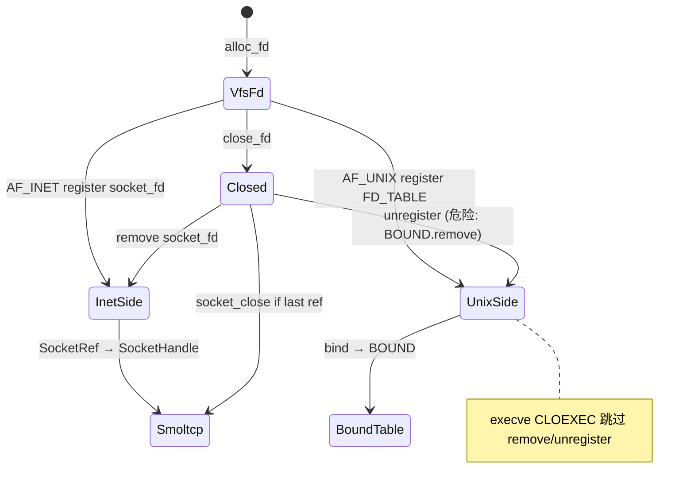

# 资源生命周期审计：Sockets 分组（#27–29）

> **生成时间**：2026-06-25  
> **Subagent 分组**：`sockets`  
> **覆盖资源**：#27 Inet socket（smoltcp）、#28 `SocketFdRegistry`、#29 Unix 域套接字  
> **Baseline**：单核多线程；对照 Linux `EMFILE`/`ENOMEM`/`EBADF`/`ENOTSOCK` 等  
> **交叉参考**：[`syscall-issues.md`](../syscall-issues.md)（P0-17/18、IO-P1-01/02 已收敛）、[`resource-inventory.md`](../resource-inventory.md) §#27–29

---

## 1. 概述

WaterOS 网络 I/O 由三层叠加构成：

| 层 | 组件 | 职责 |
|----|------|------|
| 协议栈 | `driver-network` / `stack`（smoltcp） | 全局 `NetworkStack`：`SocketSet` + `metas` + UDP loopback 队列 |
| INET 侧表 | `syscall/impl-kernel/socket_fd.rs` | fd → `SocketRef`（`Arc<Mutex<SocketHandle>>`）+ `O_NONBLOCK` 标志 |
| UNIX 侧表 | `syscall/impl-kernel/unix_sock.rs` | `(task_id, fd)` → `UnixSockRef`；全局 `BOUND` 绑定/accept/dgram 队列 |
| VFS 桥接 | `driver-network/socket_handles.rs` | `TcpStreamHandle` / `TcpListenerHandle` / `UdpSocketHandle` 实现 `VfsIoHandle` |
| 入口 | `sys/socket.rs`、`accept.rs`、`close.rs`、`task.rs` 等 | syscall 分配 fd、驱动协议栈、任务退出批量回收 |

**账本稳定性总评**：**部分稳定（不可靠路径较多）**

- INET smoltcp 句柄在 `close` / 末次 `VfsIoHandle::close` 路径上基本成对，但存在 **partial alloc 泄漏** 与 **无数量上限**。
- `SocketFdRegistry` 与 VFS fd 表在 `fork`/`clone` 线程路径上基本对齐，但 **`execve` CLOEXEC** 与 **dup（UNIX）** 未同步。
- Unix 域套接字 **`BOUND` 表无引用计数**，`unregister` 语义错误，是本轮最高危生命周期缺陷。

---

## 2. 资源 #27：smoltcp `SocketHandle`

### 2.1 类型与位置

| 项 | 内容 |
|----|------|
| 主要类型 | `smoltcp::iface::SocketHandle`；内核侧元数据 `SocketMeta`（`SocketState`、`SocketKind` 等） |
| 全局容器 | `NETWORK_STACK: Mutex<Option<NetworkStack>>`（`driver-network/src/lib.rs` `stack` 模块） |
| 单 socket 内存 | TCP：`2 × 256 KiB` 收发缓冲（`TCP_BUFFER_SIZE`）；UDP：约 4 KiB 级 packet buffer |

### 2.2 分配入口

| 函数 | 文件 | 触发路径 |
|------|------|----------|
| `stack::init(ip, gateway)` | `driver-network/src/lib.rs` | 引导期网卡注册后初始化协议栈（一次性） |
| `stack::create_tcp_socket()` | 同上 | `sys_socket`（`AF_INET` + `SOCK_STREAM`） |
| `stack::create_udp_socket()` | 同上 | `sys_socket`（`AF_INET` + `SOCK_DGRAM`） |
| `stack::socket_accept()` 内 `sockets.add()` | 同上 | 每次 TCP `accept` 创建**替换监听器**的新句柄 |
| `stack::tcp_connect()` / `stack::udp_send()` 内惰性创建 | 同上 | 自检/便捷 API（非主 syscall 路径） |

**前置依赖**：`NETWORK_STACK` 已 `init`；分配从内核堆 `vec![0; TCP_BUFFER_SIZE]`，失败表现为 `Err("stack not initialized")` 或堆分配 panic/OOM。

### 2.3 回收入口

| 函数 | 文件 | 触发路径 |
|------|------|----------|
| `stack::socket_close(handle)` | `driver-network/src/lib.rs` | `VfsIoHandle::close`（`socket_handles.rs`，`should_close_underlying()` 为真时） |
| `stack::socket_close(established_handle)` | `sys/accept.rs` | `alloc_fd` 失败时的错误回滚 |
| TCP 两阶段 remove | `socket_close` | `Connected`/`Connecting` 先 `tcp.close()` + poll，再从 `SocketSet`/`metas` 移除 |
| `socket_shutdown` | 同上 | **不**从 `SocketSet` 移除，仅 `tcp.close()` + `meta.state = Closed` |

**未回收路径**：

- `sys/socket.rs`：`create_*_socket` 成功后若 `alloc_fd` 或 `set_fd_flags`（`O_CLOEXEC`）失败，**未调用 `socket_close`** → smoltcp 句柄与堆缓冲泄漏。
- `socket_shutdown` 后 fd 仍有效，句柄常驻 `SocketSet` 直至 `close`。
- 无全局 socket 数量上限；耗尽时依赖堆分配失败，无主动 `ENOMEM` 预判。

### 2.4 生命周期状态机

```
[未初始化] --stack::init--> [Stack 就绪]
                                |
                    create_tcp/udp_socket
                                v
                           [Created]
                                | socket_bind (TCP 仅元数据 / UDP smoltcp bind)
                                v
                           [Bound]
                                | socket_listen (TCP)
                                v
                          [Listening] --accept--> 原句柄 [Connected] + 新句柄 [Listening]
                                | socket_connect (TCP)
                                v
                          [Connecting] --poll--> [Connected]
                                | socket_close / shutdown+close
                                v
                            [Closed] --> 从 SocketSet 移除
```

**半初始化状态**：`Created` 且已 `create_*` 但未注册 fd（`socket()` 失败路径）——句柄留在 `SocketSet`，用户不可见，**账本泄漏**。

### 2.5 账本稳定性

| 维度 | 结论 |
|------|------|
| 正常 close | **稳定**：`SocketRef` 引用计数（`Arc::strong_count <= 2`）控制末次 `socket_close` |
| dup/fork | **稳定**：dup 共享 `SocketRef`；fork `copy_from_parent` 克隆映射；末次 close 关闭底层 |
| accept | **稳定**：监听 fd 的 `SocketRef` 经 `replace_handle` 指向新监听器；已连接句柄在新 fd 上 |
| 错误路径回滚 | **不可靠**：`socket()` partial alloc 未回滚 smoltcp |
| double-free / UAF | **低风险**：`socket_close` 对无效 handle 返回 Err；移除后无复用句柄 ID 的显式防护（依赖 smoltcp 内部） |

### 2.6 耗尽与失败处理

| 场景 | 现状 | 与 Linux 差距 |
|------|------|---------------|
| socket 数量 | **无硬上限** | Linux 受 `RLIMIT_NOFILE` + 协议模块 tunable |
| TCP 缓冲 | 固定 256 KiB/socket | 接受 `setsockopt(SO_RCVBUF/SO_SNDBUF)` 但不改变实际缓冲 |
| `create_*` 失败 | `socket()` → `-ENOMEM` | 合理 |
| 堆耗尽 | 可能 panic 或隐式 OOM | 应 warn + `-ENOMEM` |
| UDP loopback 队列 | 每 socket/端口 **1024** 包上限，溢出 `pop_front` 丢包 | 静默丢包，非错误返回 |

### 2.7 潜在问题（#27）

| ID | 严重度 | 问题 |
|----|--------|------|
| SKT-27-P1-01 | P1 泄漏 | `sys/socket.rs`：`alloc_fd`/`set_fd_flags` 失败未 `socket_close(smoltcp_handle)` |
| SKT-27-P1-02 | P1 静默耗尽 | 无 smoltcp socket 计数上限；大量 `socket()` 可耗尽 128 MiB 内核堆 |
| SKT-27-P2-01 | P2 | UDP loopback 队列满时丢最旧包，无 `warn` |
| SKT-27-P2-02 | P2 | `socket_shutdown` 不释放 `SocketSet` 槽位，仅标记 `Closed` |

---

## 3. 资源 #28：`SocketFdRegistry`

### 3.1 类型与位置

| 项 | 内容 |
|----|------|
| 结构 | `SocketFdRegistry { maps, status_flags, owners, ref_counts }` |
| 文件 | `syscall-impl/impl-kernel/src/socket_fd.rs` |
| 值类型 | `SocketRef`（`driver-network/socket_handles.rs`） |

侧表存在原因：`VfsIoHandle` 无法向下转型，syscall 层需独立维护 fd → `SocketRef` 与 `O_NONBLOCK`。

### 3.2 分配入口

| API | 调用方 |
|-----|--------|
| `register_with_flags(fd, socket, flags)` | `sys/socket.rs`、`sys/accept.rs`、`sys/dup.rs`、`sys/fcntl.rs`（`F_DUPFD*`） |
| `copy_from_parent(child, parent)` | `sys/clone.rs` `fork` |
| `share_from_parent(child, parent)` | `sys/clone.rs` `clone` 线程（`CLONE_FILES` 语义） |

### 3.3 回收入口

| API | 调用方 |
|-----|--------|
| `remove(fd)` | `sys/close.rs` |
| `drop_task(task_id)` → `release_task` | `sys/task.rs` `drop_task_runtime_resources_with_aspace` |
| `remove(newfd)` | `sys/dup.rs` `dup3` 覆盖已打开 socket fd |

**缺失回收**：

- **`execve` CLOEXEC**：`vfs::fd::close_cloexec_fds_for_current_task()` 关闭 VFS 句柄，**未**调用 `socket_fd::remove`。
- 任务退出时：`drop_task_fd_table` 先于 `socket_fd::drop_task`；fd 表 drain 会 `handle.close()` 关闭 smoltcp，但 `drop_task` 仅删映射表，顺序可接受。问题在于 **execve 路径** 非任务退出。

### 3.4 生命周期状态机

```
[无映射] --register_with_flags--> [(task_owner, fd) -> SocketRef + flags]
        |--dup/fcntl dup--> 新 fd 条目，共享 SocketRef Arc
        |--fork copy--> 子任务独立 map 副本（同 Arc）
        |--clone thread share--> 子任务 owners 指向父 owner，ref_counts++
        |--close/remove--> 删除 (owner, fd) 条目；底层由 VfsIoHandle::close 决定
        |--drop_task--> release_task；ref_counts==0 时删除 owner 全部条目
```

### 3.5 账本稳定性

| 维度 | 结论 |
|------|------|
| close 路径 | **稳定**（`close.rs` 先 `close_fd` 再 `remove`） |
| dup/fcntl | **稳定**（INET） |
| fork/clone 线程 | **稳定**（与 fd 表 owner/refcount 模型对齐） |
| execve CLOEXEC | **不可靠**：侧表条目残留，**可导致 fd 号复用后 syscall 误路由** |
| 与 VFS fd 一致性 | **部分稳定**：侧表条目数是 VFS「曾注册为 socket」的超集（含陈旧项） |

### 3.6 耗尽与失败处理

- 条目数受 **RLIMIT_NOFILE（默认 1024）** 间接约束（需先 `alloc_fd` 成功）。
- 侧表自身无独立上限；`BTreeMap` 增长受堆限制。
- `lookup_or_errno`：`ENOTSOCK` vs `EBADF` 区分正确。

### 3.7 潜在问题（#28）

| ID | 严重度 | 问题 |
|----|--------|------|
| SKT-28-P0-01 | **P0 UAF/误路由** | `execve` CLOEXEC 未 `socket_fd::remove`；fd 槽释放后若复用为普通文件，`read`/`connect` 等仍可能命中陈旧 `SocketRef`（`read.rs` 优先查 `socket_fd::lookup`） |
| SKT-28-P1-01 | P1 | `fcntl(F_SETFL)` 仅更新侧表 `status_flags`；与 VFS 层无联动（INET 可接受，但与 UNIX 问题对称） |

---

## 4. 资源 #29：Unix 域套接字（`unix_sock`）

### 4.1 类型与位置

| 项 | 内容 |
|----|------|
| 每 fd 对象 | `UnixSockRef` → `UnixSockInner`（类型、nonblocking、bound_key、endpoint、inbox 等） |
| 全局绑定表 | `BOUND: Mutex<BTreeMap<Vec<u8>, BoundEntry>>`（accept 队列、dgram 收件箱） |
| fd 侧表 | `FD_TABLE: Mutex<BTreeMap<(task_id, fd), UnixSockRef>>` |
| VFS 句柄 | `UnixSocketHandle`（`unix_sock.rs`） |
| 文件 | `syscall-impl/impl-kernel/src/unix_sock.rs` |

### 4.2 分配入口

| 函数 | 触发路径 |
|------|----------|
| `alloc_unix_socket(typ, flags)` | `sys/socket.rs`（`AF_UNIX`） |
| `accept()` 内新建 `UnixSockRef` | `sys/accept.rs` → `accept_unix` |
| `connect_stream` → `stream_pair_handle_pair` | `vfs` pipe 对端，非新 `BOUND` 条目 |
| `bind` → `BOUND.insert` + pathname `mknod_socket_absolute` | `sys/bind.rs` |
| `copy_fds_from_parent` | `fork` 与 `clone` 线程均调用（**注意**：线程 clone 时 fd 表 share，但 unix 表为 copy） |

### 4.3 回收入口

| 函数 | 触发路径 |
|------|----------|
| `unregister(task_id, fd)` | `sys/close.rs`；`drop_task` 遍历调用 |
| `drop_task(task_id)` | `sys/task.rs` |
| `UnixSocketHandle::close` | **默认 trait 空实现**（`Ok(())`）——**不**执行 unix 特有清理 |
| `unregister` 内 `BOUND.remove(key)` | 当关闭 fd 的 socket 曾 `bind` 时 |

**pathname 绑定**：`install_pathname_socket` 在 VFS 创建 `S_IFSOCK` 节点；**close/unregister 不 unlink**，磁盘 socket 文件永久残留 → 再次 bind 同路径 `EADDRINUSE`。

### 4.4 生命周期状态机

**Stream socket**

```
[Created] --bind--> [Bound + BOUND 表项] --listen--> [Listening]
                                                      |
                    connect -------------------------> accept_queue
                                                      |
[Connected client] <-- endpoint ---------------- [Accepted server fd]
```

**Dgram socket**

```
[Created] --bind--> [Bound] <--sendto--- 对端
              dgram_inbox 无界 VecDeque
```

### 4.5 账本稳定性

| 维度 | 结论 |
|------|------|
| 单任务单 fd close | **不可靠**：`unregister` 按 `bound_key` **整表删除 `BOUND` 条目**，未考虑 fork 继承、dup 多 fd 共享同一 `UnixSockRef` |
| fork 后子进程 close 继承的 listening fd | **P0**：子进程 `unregister` 删除 `BOUND`，父进程监听器失效 |
| dup | **P1**：`dup`/`fcntl` **不向 `FD_TABLE` 注册**；dup 出的 fd 调用 `bind`/`connect`/`accept` 等 → `ENOTSOCK` |
| Arc 共享 | `UnixSockRef` 使用 `Arc`；`duplicate()` 克隆 Arc，但侧表无对应 fd 条目 |
| pathname 文件 | **泄漏**：bind 创建的 socket 文件不 unlink |
| accept 队列 / dgram 队列 | **无界** `VecDeque`；恶意或测试大量 connect/sendto 可耗尽堆 |
| `execve` CLOEXEC | **P0**：同 #28，未 `unregister` |

### 4.6 耗尽与失败处理

| 场景 | 现状 |
|------|------|
| fd 数量 | 受 RLIMIT_NOFILE |
| accept_queue / dgram_inbox | **无上限** |
| `alloc_fd` 失败（accept） | 返回 `-ENOMEM`；已构造的 `UnixSockRef`/pipe 端 **未显式释放**（依赖 Drop） |
| nonblocking | 创建时 `SOCK_NONBLOCK`；`fcntl(F_SETFL)` **不更新** `UnixSockInner.nonblocking`（走 VFS 默认 no-op） |

### 4.7 潜在问题（#29）

| ID | 严重度 | 问题 |
|----|--------|------|
| SKT-29-P0-01 | **P0 破坏全局状态** | `unregister` 在任意 fd close 时 `BOUND.remove(bound_key)`，fork 后子进程关闭继承的 bound/listening socket 会破坏父进程及同地址其他 fd |
| SKT-29-P0-02 | **P0 误路由** | `execve` CLOEXEC 未 `unix_sock::unregister`；陈旧 `(task_id,fd)` 映射可令 `is_unix_fd` 误判 |
| SKT-29-P1-01 | P1 功能错误 | `dup`/`fcntl(F_DUPFD*)` 未注册 `FD_TABLE`；dup 出的 AF_UNIX fd 不可用 |
| SKT-29-P1-02 | P1 泄漏 | pathname bind 的 `S_IFSOCK` 节点 close 时不 unlink |
| SKT-29-P1-03 | P1 静默耗尽 | `accept_queue`、`dgram_inbox`、`inbox` 无界 |
| SKT-29-P2-01 | P2 | `fcntl(F_SETFL O_NONBLOCK)` 不更新 `UnixSockInner.nonblocking` |
| SKT-29-P2-02 | P2 | `clone` 线程：`fd` 表 share 但 `unix_sock` 为 copy，模型不一致（当前可用，但增加审计复杂度） |

---

## 5. 跨资源耦合

### 5.1 生命周期钩子矩阵

| 事件 | smoltcp | socket_fd | unix_sock | VFS fd 表 |
|------|---------|-----------|-----------|-----------|
| `socket()` | `create_*` | `register` | `register`（UNIX） | `alloc_fd` |
| `close(fd)` | `socket_close`（末次） | `remove` | `unregister` | `close_fd` → `handle.close()` |
| `fork` | — | `copy_from_parent` | `copy_fds_from_parent` | `copy_fd_table_from_parent` |
| `clone` 线程 | — | `share_from_parent` | `copy_fds_from_parent` | `share_fd_table_from_parent` |
| `dup`/`dup3` | — | `register`（INET） | **无** | `dup_fd` |
| `execve` CLOEXEC | `handle.close` | **无** | **无** | `close_cloexec` |
| 任务退出 | `handle.close` × N | `drop_task` | `drop_task` | `drop_task_fd_table` |

### 5.2 调用链（close）

```
sys_close
  ├─ socket_fd::lookup → was_socket
  ├─ unix_sock::is_unix_fd → was_unix
  ├─ vfs::fd::close_fd
  │     └─ close_slot → take handle → VfsIoHandle::close()
  │           ├─ INET: socket_handles → stack::socket_close (if should_close_underlying)
  │           └─ UNIX: 默认 close () 空操作
  ├─ socket_fd::remove(fd)
  └─ unix_sock::unregister(task_id, fd)  [可能 BOUND.remove]
```

### 5.3 与 syscall 审计交叉项

| syscall 审计 ID | 资源侧关联 |
|-----------------|-----------|
| P0-17/18、IO-P1-01/02（已收敛） | 阻塞/EINTR 属 syscall 语义；smoltcp 资源未在阻塞中泄漏 |
| SIG-P1-04 | socket `poll` 轮询属实现策略，不直接泄漏句柄 |
| file-descriptors #13 | fd 表与 socket 侧表必须在 close/execve/fork 同步维护 |

### 5.5 耦合风险小结



---

## 6. 潜在问题汇总（按严重度）

### P0（泄漏 / UAF / 全局状态破坏 / 卡死风险）

| ID | 资源 | 问题 | 文件 |
|----|------|------|------|
| **SKT-29-P0-01** | unix_sock | fork 后子进程 close 继承的 bound socket 会 `BOUND.remove`，破坏父进程监听器 | `unix_sock.rs` `unregister` |
| **SKT-28-P0-01** | socket_fd | `execve` CLOEXEC 未清理侧表；fd 复用后 `read`/`connect` 等误走 socket 路径 | `execve.rs`、`read.rs`、`socket_fd.rs` |
| **SKT-29-P0-02** | unix_sock | 同上，未 `unregister`；`is_unix_fd` 误判 | `execve.rs`、`unix_sock.rs` |

### P1（错误路径回滚 / 功能错误 / 可预期耗尽）

| ID | 资源 | 问题 |
|----|------|------|
| SKT-27-P1-01 | smoltcp | `socket()` 失败路径未 `socket_close` |
| SKT-27-P1-02 | smoltcp | 无 socket 数量上限，堆静默耗尽 |
| SKT-29-P1-01 | unix_sock | dup 未注册 `FD_TABLE` |
| SKT-29-P1-02 | unix_sock | pathname socket 文件不 unlink |
| SKT-29-P1-03 | unix_sock | accept/dgram 队列无界 |

### P2（语义偏差 / 文档级）

| ID | 资源 | 问题 |
|----|------|------|
| SKT-27-P2-01 | smoltcp | UDP loopback 静默丢包 |
| SKT-27-P2-02 | smoltcp | `shutdown` 不释放 SocketSet 槽位 |
| SKT-29-P2-01 | unix_sock | `fcntl O_NONBLOCK` 不生效 |
| SKT-29-P2-02 | unix_sock | clone 线程 unix 表 copy 与 fd share 不一致 |

---

## 7. 收敛建议

对不可靠路径统一：**判断 → `warn!` → 明确错误 → partial alloc 回滚**。

| 路径 | 建议动作 |
|------|----------|
| `socket()` partial alloc | 失败时 `stack::socket_close(h)`；若已 `alloc_fd` 则再 `close_fd` |
| `execve` CLOEXEC | 关闭每个 cloexec fd 时同步 `socket_fd::remove(fd)`、`unix_sock::unregister(task_id, fd)` |
| `unix_sock::unregister` | `BOUND` 改为引用计数或「仅当最后一个绑定该 key 的 socket 关闭」时删除；**禁止**因 fork 副本 close 删除全局绑定 |
| pathname bind | last-close 时 `unlink` socket 路径（或 `BoundEntry` 引用计数归零时） |
| dup / fcntl dup | 若 `is_unix_fd(oldfd)` 或 `lookup` 到 unix，则 `unix_sock::register(newfd, sock.clone())` |
| smoltcp 上限 | 增加 `MAX_SMOLTCP_SOCKETS`（或按堆用量 warn）；达上限 `warn!` + `socket()` 返回 `-ENOMEM` |
| 无界队列 | `accept_queue`/`dgram_inbox` 设 `MAX_UNIX_SOCK_QUEUED`；溢出 `warn!` + `-ENOBUFS` 或 drop 策略文档化 |

**warn 示例**：

```text
warn!("[resource] unix_sock BOUND remove key={:?} task_id={} fd={} reason=last_bound_ref",
      key, task_id, fd);
warn!("[resource] smoltcp socket leak avoided: closing handle={:?} at socket() rollback",
      handle);
```

---

## 8. 修复任务草案

| 优先级 | 标题 | 主要文件 | 验收标准 |
|--------|------|----------|----------|
| P0-1 | `BOUND` 引用计数，修复 fork close 破坏监听 | `unix_sock.rs` | 父进程 listen；子进程继承 fd 后 exit；父进程仍可 accept |
| P0-2 | `execve` CLOEXEC 同步清理 socket 侧表 | `execve.rs` 或 `fd.rs` 钩子 | `socket(..., SOCK_CLOEXEC)` + `execve` 后同 fd 号 `open` 普通文件；`read` 不走 socket 路径 |
| P1-1 | `socket()` 错误路径回滚 smoltcp | `sys/socket.rs` | 人为使 `alloc_fd` 失败时不增加 `SocketSet` 计数 |
| P1-2 | dup/fcntl 注册 unix `FD_TABLE` | `dup.rs`、`fcntl.rs`、`unix_sock.rs` | `dup(unix_fd)` 后 `getsockname` 成功 |
| P1-3 | pathname unix socket close 时 unlink | `unix_sock.rs` + vfs | bind `/tmp/s` → close → 再 bind 同路径成功 |
| P1-4 | smoltcp socket 全局计数与上限 | `driver-network/src/lib.rs` `stack` | 超限 `socket()` 返回 `-ENOMEM` 且 `warn` 含 `used/capacity` |
| P2-1 | unix 队列上限与溢出错误码 | `unix_sock.rs` | 队列满时 `connect`/`sendto` 返回 `-ENOBUFS` |
| P2-2 | `fcntl F_SETFL` 同步 unix nonblocking | `fcntl.rs`、`unix_sock.rs` | `fcntl` 设置 `O_NONBLOCK` 后 `accept` 立即 `EAGAIN` |

---

## 9. 账本结论表

| 资源 | 正常路径 | 错误回滚 | fork/clone | execve | 耗尽处理 | 总评 |
|------|----------|----------|------------|--------|----------|------|
| #27 smoltcp | 稳定 | 不可靠 | 稳定 | CLOEXEC 靠 handle.close | 无上限 | **部分稳定** |
| #28 socket_fd | 稳定 | — | 稳定 | **不可靠** | 间接受限 | **部分稳定** |
| #29 unix_sock | 不可靠 | 弱 | **P0 缺陷** | **不可靠** | 队列无界 | **不可靠** |

---

## 10. 扫描文件索引

| 路径 | 说明 |
|------|------|
| `os/components/wateros-driver/driver-network/src/lib.rs` | `NetworkStack`、socket 工厂与操作 |
| `os/components/wateros-driver/driver-network/src/socket_handles.rs` | `SocketRef`、`VfsIoHandle` 实现 |
| `os/components/wateros-driver/driver-network/network-api/api-v0/src/lib.rs` | 网卡注册表 |
| `os/components/wateros-syscall/syscall-impl/impl-kernel/src/socket_fd.rs` | INET fd 侧表 |
| `os/components/wateros-syscall/syscall-impl/impl-kernel/src/unix_sock.rs` | AF_UNIX 实现 |
| `os/components/wateros-syscall/syscall-impl/impl-kernel/src/sys/socket.rs` | `socket(2)` |
| `os/components/wateros-syscall/syscall-impl/impl-kernel/src/sys/accept.rs` | `accept`/`accept4` |
| `os/components/wateros-syscall/syscall-impl/impl-kernel/src/sys/close.rs` | `close(2)` |
| `os/components/wateros-syscall/syscall-impl/impl-kernel/src/sys/task.rs` | 任务退出资源回收 |
| `os/components/wateros-syscall/syscall-impl/impl-kernel/src/sys/clone.rs` | fork/clone 继承 |
| `os/components/wateros-syscall/syscall-impl/impl-kernel/src/sys/execve.rs` | CLOEXEC 缺口 |
| `os/components/wateros-syscall/syscall-impl/impl-kernel/src/sys/dup.rs` | dup 与 unix 缺口 |
