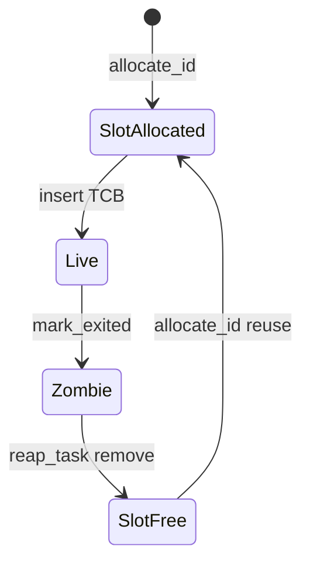

# task-slots 资源生命周期审计

> 审计时间：2026-06-25  
> 分组 ID：`task-slots`  
> 覆盖资源：`resource-inventory.md` #7–12（TaskId/TCB/内核栈/PID/TID/WaitQueue）  
> Baseline：单核多线程；对照 Linux `fork`/`clone`/`exit`/`waitpid`、`RLIMIT_NPROC`、`ENOMEM`/`EAGAIN`  
> 交叉参考：`docs/audits/locks/process-registry.md`（PR-01）、`docs/audits/lock-inventory.md` #2–4、`docs/exports/features/wateros-task.md`

---

## 1. 分组总览

| # | 资源 | 主要类型 | 所属路径 | 硬上限（代码） | 账本结论 |
|---|------|---------|---------|--------------|---------|
| 7 | 任务槽位 / TaskId | `TaskTable`、`TaskSlot` | `task-scheduler/scheduler-api/api-v0/src/registry.rs` | 无；`Vec` 受内核堆约束；slot 低 32 位 | **部分稳定** |
| 8 | TCB | `TaskControlBlock` | `task-impl/impl-core/src/tcb.rs` | 与任务槽 1:1 | **部分稳定** |
| 9 | 内核栈 | `KernelStack`（32 KiB） | `task-api/api-v0/src/kernel.rs` | 32 KiB/任务；堆分配 | **不可靠**（OOM） |
| 10 | 进程槽 / PID | `ProcessRegistry`、`ProcessControlBlock` | `task-impl/impl-core/src/process.rs` | 无；`next_pid` 单调递增 | **部分稳定** |
| 11 | 线程 TID | `ProcessTask`、`Vec<ProcessTask>` | 同上 | 无每进程线程数上限 | **部分稳定** |
| 12 | WaitQueueId | `WaitQueues` | `task-scheduler/scheduler-api/api-v0/src/wait_queues.rs` | 无；id 可复用 | **部分稳定**（泄漏路径） |

**整体结论**：正常 `spawn` → `exit` → `reap` / `waitpid` 主路径在 bring-up 下可闭环；**fork/clone 错误路径 partial alloc 无回滚**、**内核栈 OOM 未处理**、**WaitQueue 临时分配未释放**、**RLIMIT_NPROC 未接入** 是主要账本风险。调度器与 `ProcessRegistry` 非原子登记（PR-01）会放大短暂不一致窗口。

---

## 2. 资源 #7：任务槽位 / TaskId

### 2.1 主要类型

- `TaskTable`：`Vec<TaskSlot>` + `free_slots: Vec<usize>`
- `TaskSlot`：`generation: usize` + `Option<Box<TaskControlBlock>>`
- `TaskId`：高 32 位 generation + 低 32 位 slot（`IDLE_TASK_ID` 的 slot 永不回收）

### 2.2 分配入口

| 入口 | 函数链路 | 条件 |
|------|---------|------|
| 调度器 init | `TaskRegistry::init` → 插入 idle | 一次性 |
| 内核任务 | `spawn_kernel_task` → `allocate_id` → `insert` | 无失败返回 |
| 用户任务 | `spawn_user_task_spec` → `allocate_id` → `insert` | 无失败返回 |
| fork | `TaskRegistry::fork_current` → `allocate_id` → `fork_from` → `insert` | 父须为当前用户任务 |
| clone 线程 | `clone_current_thread` → 同上 | 父须为当前用户任务 |
| syscall | `sys_clone` → `task::fork_current` / `clone_current_thread` | 见 `sys/clone.rs` |

```63:71:os/components/wateros-task/task-scheduler/scheduler-api/api-v0/src/registry.rs
    fn allocate_id(&mut self) -> TaskId {
        if let Some(slot) = self.free_slots.pop() {
            let generation = self.slots[slot].generation;
            return make_task_id(slot, generation);
        }
        let slot = self.slots.len();
        self.slots.push(TaskSlot::empty(0));
        make_task_id(slot, 0)
    }
```

### 2.3 回收入口

| 场景 | 入口 |
|------|------|
| 正常 zombie reap | `WaitQueues::reap_exited_task` → `TaskRegistry::reap_task` → `TaskTable::remove` |
| 进程级 reap | `reap_exited_process` → 对每个 `task_id` 调用 `scheduler::reap_exited_task` |
| 成员线程 reap | `reap_exited_member_threads` → `take_exited_member_tasks` + `reap_exited_task` |
| bring-up 清理 | `purge_all_user_processes` |

`remove` 对非 idle 槽位：`generation += 1`（`saturating_add`）、`free_slots.push(slot)`。

### 2.4 生命周期状态机

```
未分配 ──allocate_id──► 已分配 ID（槽空或复用 generation）
         ──insert(TCB)──► 使用中（Ready/Running/Blocking/Sleeping）
         ──mark_exited──► Exited（仍在 task_table，在 exited_queue）
         ──reap_task/remove──► 槽释放（generation++，入 free_slots）
```

**半初始化风险**：`allocate_id` 之后、`insert` 之前若 `fork_from` 返回 `None`，槽位已扩展但**未入 `free_slots`**，形成永久空槽泄漏（当前 `fork_from` 仅非用户父会失败，fork 路径理论上安全）。

### 2.5 耗尽处理

- **无显式上限**；`allocate_id` 仅 `Vec::push`，失败依赖堆分配 panic/abort。
- Linux 对照：应受 `RLIMIT_NPROC` 与内存约束，返回 `EAGAIN`/`ENOMEM`。
- **generation 饱和**：`saturating_add` 后不再递增，极端复用下存在 **TaskId ABA**（陈旧 `TaskId` 可能意外匹配），见 `docs/exports/features/wateros-task.md` 后续关注点。

### 2.6 账本稳定性

| 维度 | 评估 |
|------|------|
| 正常 exit→reap | 稳定 |
| idle 槽 | 稳定（特殊处理） |
| fork/clone 后 syscall 失败 | **不可靠**（见 §8 P0-1） |
| generation 饱和 | 长期运行风险（P1） |

---

## 3. 资源 #8：任务控制块（TCB）

### 3.1 主要类型

`TaskControlBlock`：`TaskInner` = `Idle` / `Kernel` / `User`，含 `task_cx`、调度字段、`wait_result`。

### 3.2 分配入口

| 路径 | 构造函数 |
|------|---------|
| idle | `TaskControlBlock::new_idle_task` |
| 内核任务 | `new_kernel_task` |
| 用户任务 | `new_user_task` |
| fork | `fork_from`（复制 trap 帧 + 新 `UserTask` + 新内核栈） |
| clone 线程 | `clone_thread_from`（共享 `UserTask` 规格，独立 trap 帧/内核栈） |

每次用户/内核任务创建均 **新建 `KernelStack`**（32 KiB）。

### 3.3 回收入口

- `TaskTable::remove` 取出 `Box<TaskControlBlock>` → `Drop`
- `mark_exited` 对用户任务调用 `user.without_user_aspace()`，**避免 CLONE_VM 共享地址空间被线程 exit 提前 destroy**（aspace 由进程 reap 统一释放）

```510:516:os/components/wateros-task/task-impl/impl-core/src/tcb.rs
    pub fn mark_exited(&mut self, exit_code : TaskExitCode) {
        if let TaskInner::User(u) = &mut self.inner {
            u.user = u.user.without_user_aspace();
        }
        self.state = TaskState::Exited(exit_code);
    }
```

- `execve_from`：**故意保留当前内核栈**（注释说明替换栈会 UAF）；仅替换 trap 帧与 `UserTask` 元数据

### 3.4 生命周期状态机

与调度状态 `TaskState` 绑定：`Ready` → `Running` → (`Blocking`|`Sleeping`|`Exited`)。  
`Exited` 后 TCB 仍驻留至 `reap_task`；属 **zombie** 语义。

### 3.5 跨资源耦合

- fork：`mm::fork_user_aspace` 提供独立 aspace；TCB 持 `user_aspace_ptr` 句柄
- exit：`sys/task.rs` 在 `exit_current` 前 `drop_task_runtime_resources`（fd/cwd/shm/socket，属 file-descriptors 审计）
- 进程 reap：`reap_process_with_tasks` 对 PCB 的 `address_space` 调 `drop_user_aspace_on_task_exit`

### 3.6 账本稳定性

**部分稳定**：正常路径 Drop 完整；fork 失败回滚、syscall 部分成功路径不完整。

---

## 4. 资源 #9：内核栈（KernelStack）

### 4.1 分配

```38:48:os/components/wateros-task/task-api/api-v0/src/kernel.rs
    pub fn new() -> Self {
        let layout = Layout::new::<AlignedKernelStack>();
        let ptr = unsafe { alloc::alloc::alloc_zeroed(layout) as *mut AlignedKernelStack };
        let storage = unsafe { Box::from_raw(ptr) };
        ...
    }
```

- 大小：**32 KiB**（`KERNEL_TASK_STACK_SIZE`）
- 来源：内核堆 `GlobalAlloc`（128 MiB 上限，见 `kernel-heap` 分组）

### 4.2 回收

随 `TaskControlBlock` Drop 释放 `Box<AlignedKernelStack>`。  
`execve_from` **不**替换内核栈（正在使用的栈）。

### 4.3 耗尽处理

- **`alloc_zeroed` 返回 null 时未检查**，`Box::from_raw(null)` 为 UB → 可能 panic 或更严重故障
- 无 `ENOMEM` 向上传播；与 Linux 语义差距大

### 4.4 账本结论

**不可靠**（OOM 路径）。多线程压测下每线程 32 KiB，成员线程若未及时 `reap_exited_member_threads` 会堆积（`sys/clone`、`sys/exit` 已主动 reap 成员线程以缓解）。

---

## 5. 资源 #10：进程槽位 / PID

### 5.1 主要类型

- `ProcessRegistry`：`BTreeMap<ProcessId, ProcessControlBlock>`
- `ProcessControlBlock`：pid、parent_pid、leader_task_id、`tasks`、`address_space`、rlimit 等

### 5.2 分配入口

| 入口 | 函数 |
|------|------|
| 首个用户任务 | `spawn_user_task` → `create_process_for_task` |
| fork | `fork_current` → `create_process_like_fork` |
| PID 分配 | `alloc_pid`：递增 `next_pid`，跳过仍占用 map 与 tid 冲突 |

leader 的 **TID 初始等于 PID**（`ThreadId::from_raw(pid.raw())`）。

### 5.3 回收入口

| 入口 | 行为 |
|------|------|
| `waitpid` 成功 | `reap_exited_process` → `reap_process_with_tasks` |
| `reap_exited_task`（leader + 进程已 Exited） | `lib.rs` 内联 `reap_process` |
| `purge_all_user_processes` | kill + `reap_exited_process` |
| 托孤 | `reparent_orphans`：父 reap/exit_group 时子 `parent_pid` → init(1) |

`reap_process_with_tasks` 仅在 `ProcessState::Exited` 时移除；移除前 `reparent_orphans`；若 PCB 持 `address_space` 则 `drop_user_aspace_on_task_exit`。

### 5.4 生命周期状态机

```
（无 PCB）──create_process_for_task──► Running（1..N 个 ProcessTask）
         ──mark_task_exited（末线程）──► Exited（zombie，仍占 PID）
         ──reap_process_with_tasks──► 已释放（PID 可经 alloc_pid 跳过复用）
```

`mark_process_exiting`（exit_group）：立即将所有 `ProcessTask` 标 Exited 并 `reparent_orphans`。

### 5.5 耗尽处理

- **无 `RLIMIT_NPROC`  enforcement**；`sys_getrlimit` 默认 1024 仅为查询桩，**创建进程不检查**
- `next_pid` `usize` 递增；仅当 map 中仍存在同 pid 时跳过——**未 reap 的 zombie 占用 PID**
- `BTreeMap` 增长无硬顶，依赖堆

### 5.6 账本稳定性

**部分稳定**：reap + 托孤路径完整；僵尸未 wait 会长期占 PID；与调度器登记非原子（PR-01）。

---

## 6. 资源 #11：线程 TID / 进程内线程列表

### 6.1 分配

- 首线程：随 `create_process_for_task`，tid = pid
- 额外线程：`add_task_to_process` → `alloc_tid`（独立递增 `next_tid`）
- syscall：`sys_clone` 线程路径 → `clone_current_thread`

### 6.2 回收

| 场景 | 机制 |
|------|------|
| 非 leader 线程 exit | `mark_task_exited` 更新 `ProcessTask`；`reap_exited_member_threads` 从 `tasks` 移除并 reap TCB |
| 进程 reap | `reap_process_with_tasks` 返回全部 `task_id`，逐个 scheduler reap |
| exec 多线程 | `terminate_other_threads_for_exec` → kill + reap + `retain_only_task_in_process` |

### 6.3 生命周期

`ProcessTaskState::Runnable` → `Exited(code)`；从 `process.tasks` 删除发生在 **reap 路径**，非 `mark_task_exited` 时。

### 6.4 耗尽处理

- **无每进程线程数上限**（Linux `RLIMIT_NPROC`/内部 `max_threads` 未实现）
- TID 在从 `tasks` 移除后可被 `alloc_tid` 复用（扫描冲突）

### 6.5 触发 reap 的 syscall 钩子

- `sys_exit` / `sys_exit_group` 开头：`reap_exited_member_threads_runtime_resources`
- `sys_clone` 线程路径：clone 前同样 reap（避免 pthread join 压测堆积 zombie）

### 6.6 账本稳定性

**部分稳定**：主动 reap 设计合理；若长期无新 clone/exit，已退出成员仍占 TCB 直至下次钩子（可接受但需文档化）。

---

## 7. 资源 #12：调度 WaitQueueId

### 7.1 主要类型

`WaitQueues`：`wait_queues: Vec<VecDeque<TaskId>>`、`free_wait_queues`；另含 `exit_wait_queues`、`child_exit_wait_queues`（按 `TaskId` 索引，非 `WaitQueueId`）。

### 7.2 分配入口

- `WaitQueues::allocate_wait_queue`：复用 `free_wait_queues` 或 `push` 新队列
- 封装：`task::WaitQueue::new()` → `scheduler::allocate_wait_queue`
- 使用方：pipe（`read_wait`/`write_wait`）、futex hub、**syscall 临时等待**（`rt_sigtimedwait`、`signal` 等）

### 7.3 回收入口

- `try_release_wait_queue`：队列空且未在 free 列表则入 `free_wait_queues`
- `WaitQueue::try_release_empty`：显式调用（**无 `Drop` 自动释放**）
- futex hub 在 `cleanup_empty_queue` 时调用 `try_release_empty`
- 任务退出：`detach_task_from_run_queues` 清理 exit/child_exit 等待结构

### 7.4 退出顺序（关键）

`QueueTarget::Exited`：**先** `wake_all_waiters_for_task_exit`，**再** `detach_task_from_run_queues`（`wateros-task.md` 已文档化）。顺序错误会导致 `wait_for_task_exit` 永久卡死。

### 7.5 耗尽处理

- 无硬上限；`wait_queues.len()` 单调增直至 `try_release`
- 临时 `WaitQueue::new()` 未 `try_release_empty` → **id 泄漏**（`sys/task.rs:506`、`sys/signal.rs:391` 等）

### 7.6 账本稳定性

**部分稳定**：长期对象（pipe）有释放模式；syscall 临时队列 **不可靠**。

---

## 8. 端到端生命周期（跨资源）

### 8.1 用户进程创建（spawn / exec 后首线程）

```
spawn_user_task_from_loaded_elf / spawn_user_task
  ├─ scheduler: allocate_id + new_user_task(TCB+内核栈) + enqueue_ready
  ├─ ProcessRegistry: create_process_for_task(pid,tid,aspace)
  └─ （窗口：TCB 已就绪但 PCB 未登记 — PR-01）
```

### 8.2 fork（`sys_clone` 非线程）

```
sys_clone
  ├─ fork_user_aspace → (new_aspace_ptr, new_satp)  [mm 资源]
  ├─ task::fork_current
  │    ├─ scheduler: fork_current → TCB
  │    ├─ ProcessRegistry: create_process_like_fork
  │    └─ enqueue_ready_task
  ├─ signal::on_fork / vfs::copy_* / cred::fork_cred / shm::fork_*
  └─ 返回 child_pid
```

### 8.3 clone 线程（`CLONE_VM|CLONE_THREAD`）

```
sys_clone → clone_current_thread
  ├─ scheduler: clone_current_thread → TCB（共享 UserTask/aspace）
  ├─ ProcessRegistry: add_task_to_process（新 tid）
  ├─ signal::on_clone_thread / vfs::share_* / cred::share_cred
  └─ 返回 child_tid
```

### 8.4 线程 exit（`sys_exit`）

```
sys_exit
  ├─ reap_exited_member_threads_runtime_resources（兄弟线程 zombie）
  ├─ signal::on_thread_exit / robust / clear_child_tid / futex wake
  ├─ drop_task_runtime_resources（fd/cwd/shm…）
  └─ task::exit_current
       ├─ ProcessRegistry: mark_task_exited
       └─ scheduler: exit_current → Exited 队列 + 切换
```

当前线程 TCB：留在 `exited_queue` 直至同进程其他路径 `reap_exited_member_threads` 或进程级 `waitpid`/`reap_exited_process`。

### 8.5 进程 exit（`sys_exit_group` / 末线程 `sys_exit`）

```
exit_group / last thread exit
  ├─ mark_process_exiting / kill 兄弟线程
  ├─ drop 各线程外围资源
  └─ exit_current
waitpid → reap_exited_process
  ├─ ProcessRegistry: reap_process_with_tasks（aspace drop + 移除 PCB）
  └─ 对每个 task_id: scheduler::reap_exited_task（TCB+内核栈+TaskSlot）
```

### 8.6 Mermaid：任务槽 + TCB 主路径



---

## 9. 潜在问题列表

### P0（泄漏 / UAF / 卡死）

| ID | 类型 | 描述 | 位置 |
|----|------|------|------|
| **P0-1** | 泄漏 + 孤儿任务 | `sys_clone` fork 路径：`task::fork_current` 已成功（TCB、PID、就绪队列、独立 aspace）后，若 `signal::on_fork` 失败返回 `EAGAIN`，**无回滚**——子任务仍可被调度，父 syscall 却失败 | `sys/clone.rs:185-201` |
| **P0-2** | 泄漏 | clone 线程路径：`on_clone_thread` 失败同样无回滚 TCB/PCB/就绪队列 | `sys/clone.rs:236-250` |
| **P0-3** | UAF/崩溃 | `KernelStack::new` 未检查 `alloc_zeroed` 失败（null 指针 `Box::from_raw`） | `task-api/api-v0/src/kernel.rs:39-43` |
| **P0-4** | 卡死（已修复需回归） | `Exited` 路径须先 `wake_all_waiters_for_task_exit` 再 `detach`；顺序颠倒会丢 exit waiter | `wait_queues.rs:194-205`；见 feature 文档 |
| **P0-5** | 泄漏 | `fork_user_aspace` 成功后 `fork_current` 返回 `None` 时未 `drop_user_aspace` | `sys/clone.rs:176-187` |

### P1（错误路径 / 限额 / 长期耗尽）

| ID | 类型 | 描述 | 位置 |
|----|------|------|------|
| P1-1 | 静默耗尽 | `RLIMIT_NPROC` 仅在 `sys_getrlimit` 返回默认 1024，**创建进程/线程不检查** | `sys/task.rs:954-955`、`process.rs:create_process_*` |
| P1-2 | 泄漏 | `WaitQueue::new` 用于 `rt_sigtimedwait`/`signal` 等临时等待，作用域结束**未** `try_release_empty` | `sys/task.rs:506`、`sys/signal.rs:391` |
| P1-3 | 不一致窗口 | Spawn/Fork/Clone：scheduler 先 insert+enqueue，`ProcessRegistry` 后登记（PR-01） | `lib.rs:83-90,223-234`；`locks/process-registry.md` |
| P1-4 | ABA | `TaskSlot.generation` 使用 `saturating_add`，饱和后 TaskId 可能重复 | `registry.rs:129` |
| P1-5 | 半初始化 | `allocate_id` 后 `insert` 前失败导致空槽永久占用 | `registry.rs:200-210` |
| P1-6 | 无错误码 | `TaskTable`/`ProcessRegistry` 扩展仅依赖堆，无 `ENOMEM`/`EAGAIN` 传播 | 全局 |

### P2（语义差距 / 可观测性）

| ID | 描述 |
|----|------|
| P2-1 | fork 路径未解析除 `CSIGNAL` 外 clone flags（已知限制） |
| P2-2 | PID/TID/zombie 无全局计数器或 warn 日志，耗尽时难以诊断 |
| P2-3 | `sys_clone` 在 `on_fork` 失败后仍可能已执行部分 vfs/cred 复制（若将来移到回滚前） |

---

## 10. 收敛建议

1. **fork/clone 事务化**：在 `task` 层提供 `fork_current` / `clone_current_thread` 的「延迟 enqueue」变体，或统一 `RollbackGuard`：`on_fork`/信号失败时 `kill_task` + `reap_exited_task` + `reap_process` + `drop_user_aspace`。
2. **`KernelStack::new` → `Result<Self, ()>`**：分配失败打 warn（含 requested bytes、堆用量若可得）并向上返回 `ENOMEM`/`EAGAIN`。
3. **`RLIMIT_NPROC`**：在 `create_process_for_task` / `add_task_to_process` 前检查 `processes.len()` 与 rlimit；拒绝时 warn + 错误。
4. **临时 `WaitQueue`**：`Drop` 实现中 `try_release_empty`，或 syscall 路径改用栈上 guard。
5. **generation**：改用 `wrapping_add` 并配合「id 无效」查询，或饱和时 panic/warn（bring-up 可接受 fail-fast）。
6. **指标**：`TaskTable::slots.len()`、`free_slots.len()`、`ProcessRegistry::processes.len()`、`wait_queues.len()` 周期性 trace（debug 构建）。

---

## 11. 修复任务草案

| 优先级 | 标题 | 主要文件 | 验收标准 |
|--------|------|---------|---------|
| P0 | clone fork 失败回滚子任务与 aspace | `sys/clone.rs`、`task/src/lib.rs` | `on_fork` 注入失败时无子 PID/TCB/就绪项；aspace 计数恢复；`fork` 压测无孤儿 |
| P0 | clone 线程 `on_clone_thread` 失败回滚 | `sys/clone.rs` | 失败返回 `EAGAIN` 且无多余 tid/TCB |
| P0 | `KernelStack` OOM 安全 | `task-api/api-v0/src/kernel.rs`、`tcb.rs` | `alloc` 失败返回 `Err`，spawn/fork 传播 `ENOMEM`，无 UB |
| P0 | `fork_current` 失败释放 aspace | `sys/clone.rs` | `fork_user_aspace` 成功 + `fork_current` None 时调用 `drop_user_aspace` |
| P1 | 接入 `RLIMIT_NPROC` | `process.rs`、`lib.rs` | 超限创建返回错误；`getrlimit` 与行为一致 |
| P1 | `WaitQueue` 临时队列自动释放 | `wait_queue.rs`、`sys/task.rs`、`sys/signal.rs` | sigtimedwait 循环 1e4 次 `wait_queues.len()` 不线性增长 |
| P1 | 合并 scheduler/registry 登记原子性 | `lib.rs`、scheduler | fork 后 `process_task_snapshot(child)` 不为 None；或文档化并加断言 |
| P2 | TaskId generation 饱和策略 | `registry.rs` | 文档 + 测试或 wrapping 语义 |

---

## 12. 与相邻审计的交叉引用

| 主题 | 关联分组 / 文档 |
|------|----------------|
| 用户地址空间 fork/exec/exit | `physical-frames` #3–4；`execve.rs` 显式 `drop_user_aspace(old)` |
| exit 时 fd/cwd/shm/socket | `file-descriptors`、`ipc-shm-futex-signal`；`drop_task_runtime_resources` |
| futex/pipe WaitQueue | `pipe-buffers`、`ipc-shm-futex-signal`；pipe 持长久队列，futex hub 会 `try_release_empty` |
| 调度器锁与 PR-01 | `docs/audits/locks/process-registry.md`、`docs/audits/locks/scheduler.md` |
| syscall 语义 | `docs/audits/syscall-issues.md`（`clone`/`exit`/`waitpid` 相关项） |

---

## 13. 扫描范围说明

已扫描：

- `os/components/wateros-task/**`（`impl-core`、`scheduler-api`、`impl-multi-class`、`impl-round-robin`、聚合 `src/lib.rs`）
- `os/components/wateros-syscall/syscall-impl/impl-kernel/src/sys/clone.rs`
- `os/components/wateros-syscall/syscall-impl/impl-kernel/src/sys/task.rs`（`exit`/`exit_group`/`waitpid`/reap 钩子）
- 交叉只读：`sys/execve.rs`（aspace 替换）、`sys/signal.rs`（fork/线程注册）

未深入（由其它 subagent 负责）：用户栈 VMA、页表帧、`GlobalAlloc` 统计接口。
