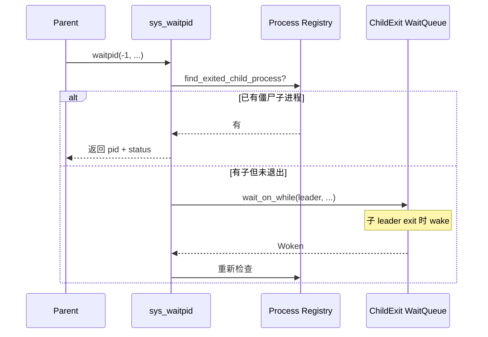

# 系统调用语义审计：进程 / 执行 / 调度（G21–G28）

> 审计范围：G21–G28 进程/执行/调度组  
> Baseline：Linux syscall 语义（riscv64 / loongarch64 通用 64 位 ABI）  
> 主要实现：`syscall-impl/impl-kernel/src/sys/{task,clone,execve,kill,sched}.rs`  
> 生成时间：2026-06-25

---

## 1. 概述

| 分组 | Syscall | Nr | 入口 | 实现文件 |
|------|---------|-----|------|----------|
| G21 | `exit` | 93 | `sys_exit` | `sys/task.rs` |
| G21 | `exit_group` | 94 | `sys_exit_group` | `sys/task.rs` |
| G22 | `fork` → `clone` | 220 | `sys_clone` | `sys/clone.rs` |
| G22 | `clone3` | 435 | `sys_clone3` | `sys/clone.rs` |
| G23 | `execve` | 221 | `sys_execve` | `sys/execve.rs` |
| G24 | `waitpid` / `wait4` | 260 | `sys_waitpid` | `sys/task.rs` |
| G25 | `kill` | 129 | `sys_kill` | `sys/kill.rs` |
| G26 | `sched_yield` | 124 | `sys_yield` | `sys/task.rs` |
| G27 | `sched_setparam` … `sched_getattr` | 118–123, 125–126, **274/275 旁路** | `sys_sched_*` | `sys/sched.rs` |
| G28 | `getpid` / `getppid` / `gettid` | 172 / 173 / 178 | `sys_getpid` 等 | `sys/task.rs` |
| G28 | `setsid` | 157 | `sys_setsid` | `sys/task.rs` |
| G28 | `setpgid` | 154 | `sys_setpgid` | `sys/task.rs` |
| G28 | `set_tid_address` | 96 | `sys_set_tid_address` | `sys/task.rs` |

**整体结论**：bring-up 级最小实现已覆盖 fork/线程 clone、基本 execve（含 shebang）、阻塞 wait、信号 kill、调度查询/设置子集。与 Linux 差距集中在：**会话/进程组未建模**、**clone flag 未收敛**、**wait4 参数不全**、**非 leader fork 与 wait 唤醒错位**、**execve 失败不可恢复**、**274/275 未进主分发表**。

---

## 2. 逐 syscall 审计

### 2.1 `exit`（93）

**Linux 语义**：终止调用线程；`status` 低 8 位为退出码；最后一线程退出时进程变僵尸并向父进程发 `SIGCHLD`；`set_tid_address` / `CLONE_CHILD_CLEARTID` 地址写 0 并 futex wake；释放线程资源，进程资源由最后一线程或 `wait` reap。

**当前覆盖**：`sys_exit` 在 `task::exit_current` 前完成：回收已退出成员线程运行时资源、`clear_child_tid` 写 0 + futex wake、robust list 清理、fd/cwd/cred/shm 等 per-task 资源释放；仅当 `last_thread` 时 `notify_parent_sigchld` + `on_thread_exit(..., true)`。

| 严重度 | 问题 | 收敛建议 |
|--------|------|----------|
| **P1** | 多线程进程中非 leader 线程 `exit` 后，调度器 `parent_id` 仍指向 fork/clone 发起者；若该发起者非 leader，`waitpid` 在 leader 的 `ChildExit` 队列上睡眠，可能**无法被唤醒**（见 §2.5）。 | 短期：非 leader 调用 `fork`/`exit` 时 `warn` 并文档化；中期：统一以进程 leader 作为 wait 唤醒键，或按 Linux 将子进程挂到进程级 wait 通道。 |
| **P2** | 线程单独 `exit` 时立即 `drop_task_runtime_resources`（含 fd 表），与同进程其它线程仍共享 VM/fd 的 Linux 语义不一致（Linux 在线程完全退出前不拆进程级资源）。 | bring-up 可接受；完整 pthread 语义前勿在多线程进程混用 per-thread `exit` 与共享 fd。 |
| **P2** | `clear_child_tid` 写用户内存失败仅 `warn`，不阻止退出。 | 与 Linux 一致（退出不因 EFAULT 中止）；保持日志即可。 |

---

### 2.2 `exit_group`（94）

**Linux 语义**：终止调用进程内**所有**线程；向父发 `SIGCHLD`；托孤子进程；当前线程 `clear_child_tid`；整组退出码一致。

**当前覆盖**：当前线程 `clear_child_tid`；`reap_exited_member_threads_runtime_resources`；
先发布 `ProcessState::Exiting` 再 kill/通知兄弟线程；每个线程自行清理运行时资源。
`mark_task_exited` 在进程表同一临界区内判断是否刚完成退出，只有完成者执行
`on_thread_exit(..., true)`、`notify_parent_sigchld` 和父 wait 唤醒。

| 严重度 | 问题 | 收敛建议 |
|--------|------|----------|
| **P2** | 兄弟线程资源清理与 `kill_task` 顺序依赖调度器异步退出，极端竞态下可能短暂不一致。 | 保持 `exit_group` 为唯一推荐的多线程进程终止路径；监控 bring-up 日志。 |
| **P2** | 与 `exit` 相同：Per-thread 资源在组退出路径上由当前任务路径与 `kill_task` 分担，语义复杂。 | 文档化；长期合并为单一进程退出状态机。 |

---

### 2.3 `fork` / `clone`（220）

**Linux 语义**：`fork` 即 `clone(SIGCHLD, 0)`；`clone(flags, stack, parent_tid, child_tid, tls)` 按 flag 共享/复制 VM、文件表、cwd、信号处理等；非法 flag 组合返回 `-EINVAL`；不支持的 flag 应拒绝或明确降级。

**当前覆盖**：

- `FORK`(220) 在分发层映射到 `sys_clone`（`syscall-api` `dispatch`）。
- **新进程路径**（非 `CLONE_VM|CLONE_THREAD`）：`fork_user_aspace` 独立地址空间、`fork_current`、继承 cwd/fd/cred/shm；返回**子进程 pid**（父视角）；子进程 trap 帧 a0=0。
- **线程路径**（`CLONE_VM && CLONE_THREAD`）：校验 `CLONE_THREAD ⇒ CLONE_VM`、`CLONE_SIGHAND` 等；`clone_current_thread`；`CLONE_PARENT_SETTID` / `CLONE_CHILD_SETTID` / `CLONE_CHILD_CLEARTID`；返回 **tid**。
- 校验：`CLONE_THREAD` 无 `CLONE_VM`、无 `CLONE_SIGHAND` 等返回 `-EINVAL`。

| 严重度 | 问题 | 收敛建议 |
|--------|------|----------|
| **P0** | **未校验/拒绝大量 clone flags**，走 fork 路径时静默忽略：`CLONE_VFORK`（父进程不阻塞）、`CLONE_VM` 单独出现（应共享 VM 却 fork 新 aspace）、`CLONE_PID`/`CLONE_NEW*` 等。用户态可能依赖 flag 语义导致**数据竞争或错误共享模型**。 | 在 `do_clone_request` 入口对 fork 路径维护 `SUPPORTED_FORK_FLAGS` 白名单（默认 0 或 `SIGCHLD`）；其余 `log::warn!("[clone] unsupported flags={:#x}", ...)` + `-EINVAL`。 |
| **P1** | **非 leader 线程 fork**：子进程调度 `parent_id` 指向 fork 调用线程，而 `waitpid` 在父进程 **leader** 的 `ChildExit` 队列等待 → 子退出时可能**唤醒错误队列，父永久阻塞**。 | 收敛：仅 leader 允许 fork（否则 `-EPERM`）；或子进程 `parent_id` 统一设为父 leader `TaskId`。 |
| **P1** | `CLONE_FILES`/`CLONE_FS`/`CLONE_SIGHAND` 在 fork 路径未按 flag 区分（始终 copy）；线程路径固定 share。与 Linux 部分组合不一致。 | 文档标注；不支持的组合 `-EINVAL`。 |
| **P2** | 未实现 `CLONE_PARENT_SETTID` 等于 0 时跳过写的区分以外的 Linux 错误路径（如无效 parent_tid）。 | 保持；非法地址已 `-EFAULT`。 |
| **P2** | `fork` 前无显式 `CLONE_CHILD_CLEARTID`；依赖 `set_tid_address`。 | 符合常见 libc 用法。 |

---

### 2.4 `clone3`（435）

**Linux 语义**：`clone_args` + `size`；`exit_signal` 独立于 `flags`；`stack`+`stack_size` 计算 SP；`set_tid`/`pidfd`/`cgroup` 等扩展字段。

**当前覆盖**：读取 64–88 字节 `clone_args`；拒绝 `flags` 低 8 位非零、`pidfd`、`set_tid`、`CLONE_INTO_CGROUP`（`-ENOSYS`）；`stack+stack_size` 作向下栈顶；合并 `flags|exit_signal` 后走 `do_clone_request`。

| 严重度 | 问题 | 收敛建议 |
|--------|------|----------|
| **P1** | 与 legacy `clone` 相同：**未收敛的 flags 在 fork 路径静默执行**。 | 共用 `do_clone_request` 白名单校验。 |
| **P2** | `size > 88` 时仅拷贝前 88 字节，不验证保留字段；未来结构扩展可能误读。 | `size > CLONE3_ARGS_SIZE_CURRENT` 时 `-E2BIG` 或 `-EINVAL`（对齐 Linux 5.3+）。 |
| **P2** | `CLONE_PIDFD`、`set_tid` 返回 `-ENOSYS`（已明确失败，良好）。 | 保持；在 `wateros-syscall` feature 文档登记。 |

---

### 2.5 `execve`（221）

**Linux 语义**：替换当前进程映像；`#!` 脚本经 binfmt 加载解释器；失败时**不**破坏原映像（除已定义的 vfork/exec 边界）；关闭 `FD_CLOEXEC`；多线程进程仅 exec 线程存活（或 `-EINVAL`）。

**当前覆盖**：

- 路径解析、`argv`/`envp` 读取、`load_program_from_path`（ELF + shebang，见 `wateros-mm` `executable.rs`）。
- Shebang：解析 `#!`、解释器 remap（`/bin/sh` → busybox）、`build_interpreted_argv`、递归深度 ≤4；`#!/usr/bin/env` **不支持**。
- `terminate_other_threads_for_exec`（**要求 leader**）→ 加载 → 关 CLOEXEC fd → `cred::on_exec` → `execve_current`。
- 错误码：`ENOEXEC`/`EINVAL`/`ENOENT`/`ENOMEM`/`EACCES` 等映射已实现。
- **测试旁路**：`ltp_cgroup_helper` 等对特定路径/父进程状态直接 `exit(0)`，偏离生产语义。

| 严重度 | 问题 | 收敛建议 |
|--------|------|----------|
| **P0** | **`terminate_other_threads_for_exec` 在 `load_program_from_path` 之前执行**；加载失败时兄弟线程已 kill 且 registry 已 `retain_only_task_in_process`，**原映像不可恢复**（Linux 应原子失败）。 | 将杀线程/改 registry 移到加载**成功**之后；或失败路径回滚（难）→ 优先调整顺序。 |
| **P1** | **非 leader 线程 execve** 直接 `-EINVAL`（`terminate_other_threads_for_exec` 失败），与 Linux（仅 exec 线程存活）不一致。 | 文档化；或允许任意线程 exec 并统一杀其它线程。 |
| **P1** | `read_string_array` 遇 EFAULT **静默截断** argv/envp，可能以不完整环境执行。 | 拷贝失败即 `-EFAULT`；勿继续 exec。 |
| **P1** | `compat_exec_load_path` 将 `/bin/sh`、`/bin/true` 等硬编码重定向到 busybox，**偏离路径语义**。 | bring-up 保留时在 warn 中打印原始路径；生产构建用 feature 门控。 |
| **P2** | Shebang 无 `env`、无 PT_INTERP 动态链接器完整语义；非 `/glibc|/musl` 脚本无 shebang 时 `-ENOEXEC`。 | 文档登记；`ENOSYS` 式拒绝 `#!/usr/bin/env`。 |
| **P2** | LTP fast-exit 旁路改变 exec 结果。 | 仅测试镜像启用；审计清单标注。 |

---

### 2.6 `waitpid` / `wait4`（260）

**Linux 语义**：`wait4(pid, status, options, rusage)`；`pid>0` 等指定子进程；`pid=-1` 任一子；`pid=0` 同组；`pid<-1` 进程组；`WNOHANG` 非阻塞；`WUNTRACED`/`WCONTINUED`；阻塞直到匹配子进程状态变化；`status` 编码退出/信号；`rusage` 可选。

**当前覆盖**：

- 仅使用 `arg0–arg2`（**无 `rusage`**）。
- `pid == -1`：循环 `find_exited_child_process` → `reap_exited_process`；无子 `-ECHILD`；`WNOHANG` 返回 0。
- `pid > 0`：校验 `parent_pid`；等待指定子进程退出。
- `pid <= 0`（除 -1）：**`-EINVAL`**。
- `options`：仅 `WNOHANG`；`WUNTRACED|WCONTINUED` 接受但 no-op（注释说明兼容 busybox）。
- 阻塞：`TaskWaitHandle::for_child_exit(父 leader)` + `wait_on_while`（ChildExit 等待队列，替代轮询）。

| 严重度 | 问题 | 收敛建议 |
|--------|------|----------|
| **P0** | **非 leader fork 时子退出唤醒队列与 wait 等待队列不一致** → 父进程 `waitpid` **永久阻塞**（卡死根因之一）。 | 与 §2.3 同步修复：fork 统一 parent 唤醒点或限制 fork 调用方。 |
| **P1** | **`pid==0` / `pid<-1` 未实现**（直接 `-EINVAL`），shell/作业控制常用。 | 短期保持 `-EINVAL` 并 `warn`；或实现最小 `pid==0`（任意子）。 |
| **P1** | **wait4 第 4 参数 `rusage` 忽略**；依赖 rusage 的测试读到未初始化内存（若用户传入非空指针）。 | 若 `arg3!=0`，写零化 `struct rusage` 或 `-ENOSYS`；推荐零化以兼容 glibc。 |
| **P2** | `WUNTRACED`/`WCONTINUED` 无 stop/continue 语义却返回成功，可能掩盖 ptrace/job control 缺失。 | 文档登记；需要时 `-ENOSYS` 未识别 option（当前已拒绝其它 option）。 |
| **P2** | 阻塞条件用进程 registry，唤醒用调度器 `ChildExit(leader)`，两套父子模型需保持一致。 | 修复 fork 父指针后回归 wait 测试。 |

---

### 2.7 `kill`（129）

**Linux 语义**：`pid>0` 发往进程/线程；`pid==0` 发往调用者进程组；`pid==-1` 全体（除 init/self）；`pid<-1` 发往进程组 `-pid`；`sig==0` 为空信号存在性探测；实时信号/权限检查。

**当前覆盖**：`pid<=0` → `-EINVAL`；`pid>0` 解析为**进程 leader** `TaskId`；`sig` 范围 `[0,64)`；`sig==0` 成功；否则 `send_process` + `apply_signal_dispatch` + 可中断成员线程。

| 严重度 | 问题 | 收敛建议 |
|--------|------|----------|
| **P1** | **不支持 `pid==0`、`-1`、`<-1`**，job control / `kill(0,sig)` 失败。 | 明确 `-EINVAL` + warn；或实现 `pid==0` 向同进程组（需 pgid，见 setsid）。 |
| **P1** | **不能按 tid 杀单线程**（`kill(tid, sig)` 在 Linux 线程语义下常发往单线程）；仅 `leader_task_for_process`。 | `resolve` 时先 `task_id_for_thread` 再 leader（与 `sched` 一致）。 |
| **P2** | 仅标准信号 0–63；无权限模型（`EPERM`）。 | bring-up 可接受；登记。 |

---

### 2.8 `sched_yield`（124）

**Linux 语义**：当前线程放弃 CPU，进就绪队列末尾；成功返回 0。

**当前覆盖**：`dispatch_yield` → `sys_yield` → `task::yield_now()` → `suspend_current_and_run_next()`。

| 严重度 | 问题 | 收敛建议 |
|--------|------|----------|
| **P3** | 单核 RR 下等价于主动让出一次调度，语义足够。 | 无需收敛。 |
| **P3** |  syscall 名在 API 层记为 `sched_yield`，与 Linux 一致。 | — |

---

### 2.9 `sched_setparam` / `sched_setscheduler` / `sched_getparam` / `sched_getscheduler`（118–121）

**Linux 语义**：设置/查询调度策略与 `sched_param`；`pid==0` 为当前线程；RT 策略需 `CAP_SYS_NICE`；`SCHED_OTHER` priority 必须为 0。

**当前覆盖**：用户结构拷贝；`task::resolve_sched_pid`（0=当前，正数=tid 或 pid）；`SchedPolicy::{Other,Fifo,Rr}`；参数校验；`set_scheduler` 可能触发 `RescheduleNow`。

| 严重度 | 问题 | 收敛建议 |
|--------|------|----------|
| **P2** | **`SCHED_FIFO/RR` 在 multi-class 调度器有队列，但 bring-up 有效策略仍为 Other**（`SchedPolicy::effective_for_bringup`）。设置 RT 可能成功但行为与 Linux 不完全一致。 | 文档登记；或 RT 设置返回 `-EPERM` 直至真正实现。 |
| **P2** | 无 `CAP_SYS_NICE` / 跨进程权限检查。 | bring-up 可接受。 |
| **P3** | `sched_setparam` 不改变 policy，与 Linux 一致。 | — |

---

### 2.10 `sched_setaffinity` / `sched_getaffinity`（122–123）

**Linux 语义**：设置/获取 CPU 亲和性 mask；`sched_getaffinity` 返回写入字节数。

**当前覆盖**：`cpusetsize` 校验；set 要求 mask 含 CPU0；get 填单核 mask，`cpu_affinity_ret_bytes()` 返回 8。

| 严重度 | 问题 | 收敛建议 |
|--------|------|----------|
| **P2** | 多核语义未实现；set 非 CPU0 失败。 | 单核环境可接受；多核前 `-EINVAL` 并 warn。 |
| **P3** | 与 Linux 单核 bring-up 行为基本一致。 | — |

---

### 2.11 `sched_get_priority_max` / `sched_get_priority_min`（125–126）

**当前覆盖**：Other→0；Fifo/Rr→99/1。

| 严重度 | 问题 | 收敛建议 |
|--------|------|----------|
| **P3** | 与 Linux 常用值一致。 | — |

---

### 2.12 `sched_setattr` / `sched_getattr`（274 / 275）— **dispatch_unknown 旁路**

**Linux 语义**：`struct sched_attr` 扩展调度；`pidfd` 无关；`flags` 目前应为 0。

**当前覆盖**：**未注册到 `SyscallKind` 主表**，由 `lib.rs::dispatch_unknown` 硬编码旁路调用 `sys_sched_setattr` / `sys_sched_getattr`；仅解析 `sched_policy` + `sched_priority`；`SCHED_DEADLINE` 等 `from_linux_raw` 返回 `None` → `-EINVAL`；`sched_flags/nice/runtime/...` 忽略。

| 严重度 | 问题 | 收敛建议 |
|--------|------|----------|
| **P1** | **旁路分发**：工具链按 nr 扫描表时可能误判为 `-ENOSYS`，与运行时行为不一致。 | 将 274/275 纳入 `SyscallNumberTable` + `SyscallKind` 正式分发。 |
| **P2** | 仅映射 Other/Fifo/Rr；`sched_attr.size` 部分字段静默丢弃。 | 不支持的 policy `-EINVAL`；过大 `size` 可只写回已知字段（getattr 已部分实现）。 |
| **P2** | `sched_setattr` 未校验 `sched_flags`。 | Linux 要求 0；非 0 时 `-EINVAL`。 |

---

### 2.13 `getpid`（172）

**当前覆盖**：`current_process_task_snapshot().pid`；无进程上下文 `-ESRCH`。

| 严重度 | 问题 | 收敛建议 |
|--------|------|----------|
| **P3** | 语义正确（进程组/线程组 id）。 | — |

---

### 2.14 `getppid`（173）

**当前覆盖**：`parent_pid`，无父时返回 **1**（`ORPHAN_PARENT_PID`）；与 `reparent_orphans` 一致。

| 严重度 | 问题 | 收敛建议 |
|--------|------|----------|
| **P3** | 托孤语义已实现。 | — |

---

### 2.15 `gettid`（178）

**当前覆盖**：`current_thread_id()`；无 `-ESRCH`。

| 严重度 | 问题 | 收敛建议 |
|--------|------|----------|
| **P3** | 与 Linux 线程 id 语义一致。 | — |

---

### 2.16 `setsid`（157）

**Linux 语义**：调用者不可为进程组组长；成功后成为新会话首进程，sid=pid，脱离控制终端。

**当前覆盖**：**stub**：有进程上下文则 **返回当前 pid**，无会话/ tty 状态变更。

| 严重度 | 问题 | 收敛建议 |
|--------|------|----------|
| **P1** | **语义错误**：未创建新会话，未检查是否已是组长；依赖 setsid 的 daemon/pty 流程行为错误。 | 短期：`warn!` + 保持返回值并文档化；中期：实现最小 sid/pgid 或返回 `-EPERM`/`-ENOTTY`。 |

---

### 2.17 `setpgid`（154）

**Linux 语义**：`setpgid(pid, pgid)`；`pid==0` 为当前进程；`pgid==0` 用 pid；权限与组长规则。

**当前覆盖**：**最小 stub**：仅允许 `pid==0 或 pid==self` 且 `pgid>=0`；**不持久化 pgid**，直接成功。

| 严重度 | 问题 | 收敛建议 |
|--------|------|----------|
| **P1** | **无真实进程组**；shell 管道/job 控制可能静默异常。 | 与 setsid 一并规划；未实现前对非自调用返回 `-ESRCH` 已部分收敛，但成功路径仍误导。 |
| **P2** | 不能 `setpgid(child, pgid)`。 | 返回 `-ESRCH`（已做）。 |

---

### 2.18 `set_tid_address`（96）

**Linux 语义**：设置 `clear_child_tid`；返回当前 `tid`；线程退出时写 0 并 futex wake；`addr==0` 清除。

**当前覆盖**：`task::set_task_clear_child_tid`；返回 `tid.raw()`；`exit`/`exit_group` 写 0 + `futex::wake_user_addr`；`clone(CLONE_CHILD_CLEARTID)` 初始化同一字段。

| 严重度 | 问题 | 收敛建议 |
|--------|------|----------|
| **P3** | 核心路径与 Linux pthread 一致。 | — |
| **P2** | 若未 `CLONE_CHILD_CLEARTID` 仅依赖本调用，与 glibc 行为一致；需保证 futex wake 与 robust list 顺序（当前先写后 wake）。 | 保持；回归 pthread join 测试。 |

---

## 3. 交叉关注点

### 3.1 `clear_child_tid` 全链路

```
clone(CLONE_CHILD_CLEARTID) / set_tid_address
    → task registry 存储 TaskClearTid
exit / exit_group
    → copy_to_user_struct(addr, 0)
    → futex::wake_user_addr(addr)
```

实现完整；与 futex 子系统耦合，审计见 futex 专项。

### 3.2 Shebang 加载链（execve → mm）

```
sys_execve → load_program_from_path
    → ELF magic? 直载
    → is_text_script? resolve_script_interpreter → 递归加载解释器
```

限制：`#!/usr/bin/env` 不支持；解释器 remap 依赖 `/glibc|/musl` 路径；busybox applet `argv[0]` 特殊处理。

### 3.3 waitpid 阻塞模型



**风险点**：WaitQ 键为父 **leader TaskId**，子进程 **scheduler parent_id** 必须为该 leader（或唤醒转发）。

---

## 4. 高优先级收敛列表（汇总）

| 优先级 | Syscall | 问题摘要 | 建议动作 |
|--------|---------|----------|----------|
| **P0** | `clone`/`fork` + `waitpid` | 非 leader fork 导致 wait **永久阻塞** | fork 限制 leader 或统一 wait 唤醒键 |
| **P0** | `clone`/`fork` | 未支持 clone flags 静默执行 | flags 白名单 + `-EINVAL` |
| **P0** | `execve` | 加载前杀线程，失败不可恢复 | 调整 `terminate_other_threads` 顺序 |
| **P1** | `wait4` | 无 rusage；`pid==0`/pgid 未实现 | 零化 rusage；逐步补 pid 语义 |
| **P1** | `setsid`/`setpgid` | 无会话/组状态 | warn + 文档 / 最小实现 |
| **P1** | `kill` | 无 pid≤0、无 tid 杀 | 扩展 resolve 或明确拒绝 |
| **P1** | `sched_setattr/getattr` | 274/275 仅旁路 | 纳入正式 syscall 表 |
| **P1** | `execve` | argv EFAULT 静默截断 | 失败即 `-EFAULT` |

---

## 5. 覆盖度速查

| Syscall | 状态 | 说明 |
|---------|------|------|
| `exit` | 部分实现 | 单线程/leader 路径可靠；多线程 parent 唤醒见 P0 |
| `exit_group` | 部分实现 | 主路径可用 |
| `fork`/`clone` | 部分实现 | 基本 fork + pthread clone；flags 未收敛 |
| `clone3` | 部分实现 | 常用字段可用；扩展字段 ENOSYS |
| `execve` | 部分实现 | ELF + shebang；失败回滚、env 旁路缺失 |
| `waitpid`/`wait4` | 部分实现 | `-1`/`>0` + `WNOHANG`；rusage/pgid 缺失 |
| `kill` | 部分实现 | 单 pid 定向 leader |
| `sched_yield` | 已实现 | — |
| `sched_*` (118–126) | 部分实现 | 单核/query 为主 |
| `sched_setattr/getattr` | 部分实现 | 旁路 + 最小 attr |
| `getpid/ppid/tid` | 已实现 | — |
| `setsid` | stub | 假成功 |
| `setpgid` | stub | 仅自调用假成功 |
| `set_tid_address` | 已实现 | 与 exit/futex 联动 |

---

## 6. 参考代码锚点

| 主题 | 位置 |
|------|------|
| exit / wait / set_tid | `syscall-impl/impl-kernel/src/sys/task.rs` |
| clone / clone3 | `syscall-impl/impl-kernel/src/sys/clone.rs` |
| execve | `syscall-impl/impl-kernel/src/sys/execve.rs` |
| kill | `syscall-impl/impl-kernel/src/sys/kill.rs` |
| sched | `syscall-impl/impl-kernel/src/sys/sched.rs` |
| 274/275 旁路 | `syscall-impl/impl-kernel/src/lib.rs` `dispatch_unknown` |
| shebang | `wateros-mm/mm-api/api-v0/src/executable.rs` |
| CloneFlags | `wateros-task/task-api/api-v0/src/process.rs` |
| ChildExit 唤醒 | `task-scheduler/.../wait_queues.rs` `wake_all_waiters_for_task_exit` |
