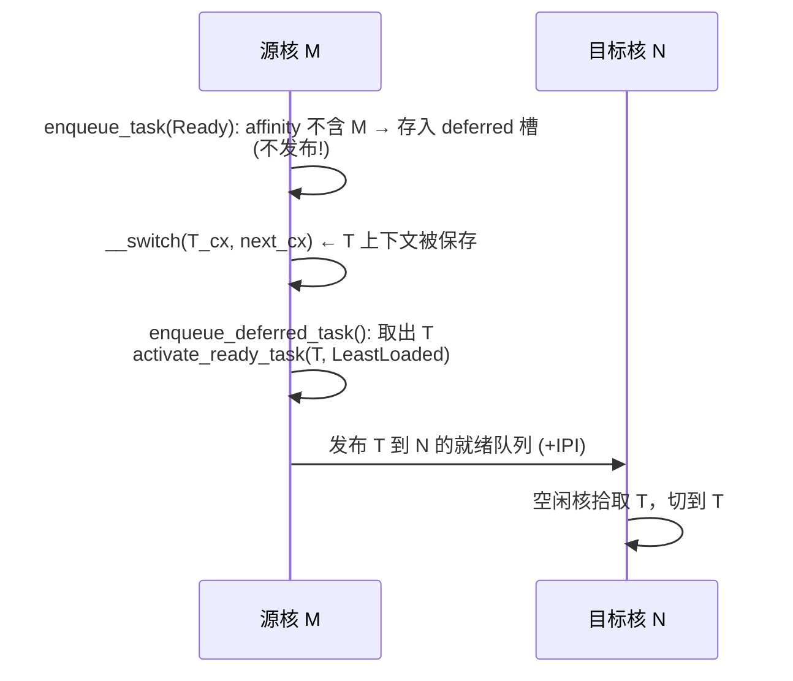

# Scheduler 跨核迁移发布过早（双核同跑）调试记录

> 分支：`sche`（由 `main` 的 `34b32807` 创建，修复尚未提交）
> 相关提交：侧分支 `merge/current-with-fix` 的 `d108ef04 [fix] defer cross-cpu task
> migration publication`（该提交**不在 main**，此处为按本项目结构移植 + 调整后的版本）

## 现象

在 RISC-V Final BuildStorm（多核 + 空闲偷取负载均衡）下，出现以下内核态崩溃：

```text
restore_current_trap_frame failed before sret to user
frame outside current task kernel stack
recursive heap allocation
```

共同特征：`current task` 的 snapshot 与硬件栈脱节 —— 用户 trap 入口从 trampoline
帧槽 37（`kernel_stack_top`）取到的内核栈，与 scheduler 认为的当前任务内核栈不是同一
个，或 trap 帧内容已被破坏。

## 定位过程

1. 空闲偷取（idle-pull stealing）上线后，多核压力下才开始复现；单核 / 低并发时无。
2. 加入诊断断言，确认问题出在"**就绪但仍在跑**"的脏状态：

   - 一个任务同时出现在某核的 `ready queue` 里，却又同时是另一个核的 `current`；
   - 空闲核通过 `pick_next_runnable_or_steal()` 合法拾取并 `__switch` 恢复它的上下文
     —— 与源核同时运行该任务，共享 TCB 的 `trap_frame` / `kernel_stack` 被双核写坏。

3. 追到源头是 `enqueue_task(QueueTarget::Ready)`：当前任务让出（yield/tick）后
   `Prefer(cpu_id)` 优先回本核，但当任务 **affinity 不含本核** 时，`pick_ready_cpu`
   回退到最小负载核 N 并立即 `enqueue_ready_on_cpu(T, N)` —— 在**锁内**就把"仍在物理
   运行"的当前任务 T 发布到了 N 的 runqueue。

### 关键认知

- **affinity 是放置策略，不是物理约束**。T 的 affinity 变了，并不会让 M 立刻停止运行
  T；M 只有在真正执行 `__switch(T_cx, U_cx)` 后才离开 T。
- bug 窗口 = "**锁内发布 T 到 N 的队列**" 与 "**M 执行 `__switch` 切走 T**" 之间的间隙。
  空闲核 N 在这个窗口内随时可能合法地拾取 T。
- 同核 re-enqueue（`Prefer(本核)`）是安全的：T 进入的队列属于 M 自己，只有 M 会在
  切走 T 之后才调度它，不会双核同跑。

## 修复：延迟到 `__switch` 之后再发布

核心思路：**先 `__switch` 切走（保存上下文、释放物理占用），再入队到别的核。**



### 1. per-CPU 延迟槽

`api-v0/src/cpu.rs` 的 `CPUState` 新增每核字段（`new()`/`init()` 置 `None`）：

```rust
/// 被强制迁出本 CPU 的当前任务；在 `__switch` 保存完上下文前不能发布到其它核，
/// 由调度器在切走之后（`enqueue_deferred_task`）取出并重新激活。
pub deferred_ready_after_switch : Option<TaskId>,
```

放在 `CPUState` 而非全局 `MultiClassScheduler`：它是**按核独立**的状态（每核最多一个
待迁任务），与 `current_snapshot` 等 per-CPU 字段同属一类。

### 2. 入队时不再提前发布

`runqueue.rs` `enqueue_task(QueueTarget::Ready)`：

```rust
let stay = self.registry
               .get_affinity(current_task_id)
               .expect("current task must exist in registry")
               .contains(cpu_id);
if stay {
    self.activate_ready_task(current_task_id, ReadyPlacement::Prefer(cpu_id));
} else {
    self.cpu_states[cpu_id.raw()].set_deferred_ready(current_task_id);
}
```

- affinity 含本核 → 照旧留本核（安全）；
- affinity 不含本核 → **只记录、不发布**，等切走后再处理。

### 3. `__switch` 之后才真正发布

`runqueue.rs` 新增方法（由切走后的两条路径调用）：

```rust
pub(crate) fn enqueue_deferred_task(&mut self, cpu_id : CpuId) {
    let Some(task_id) = self.cpu_states[cpu_id.raw()].take_deferred_ready()
    else {
        return;
    };
    self.activate_ready_task(task_id, ReadyPlacement::LeastLoaded);
}
```

- 此时源核已保存 T 的上下文，T 不再物理运行，可安全入队；
- `LeastLoaded` 由 `pick_ready_cpu` 兜底校验 online + affinity（本核已被 affinity 排除，
  直接选允许的最小负载核即可）。

### 4. 两条发布时机（覆盖所有切走路径）

`lib.rs`：

```rust
fn switch_and_unlock(guard : InterruptGuard, switch_pair : SwitchPair) {
    ...
    unsafe { __switch(switch_pair.0, switch_pair.1); }
    // 源核已保存离开任务的上下文；现在才发布被延迟迁移的任务。先取回待发送的
    // IPI 目标，释放中断守卫后再发送（与其它路径“开中断后发 IPI”的约定一致）。
    let targets = with_scheduler(|scheduler| {
        scheduler.enqueue_deferred_task(cpu_id);
        scheduler.take_pending_reschedule_cpus()
    });
    guard.release();
    dispatch_reschedules(targets, cpu_id);
}
```

```rust
/// 发布被延迟的跨核迁移任务。
///
/// 仅应在源 CPU 已通过 `__switch` 保存完离开任务的上下文后调用；已运行过的
/// 任务从 `switch_and_unlock` 返回时调用，首次运行的任务由 runtime 入口显式调用。
pub fn enqueue_deferred_task() {
    let cpu_id = cpu::current_cpu_id();
    let targets = {
        let _guard = InterruptGuard::new();
        with_scheduler(|scheduler| {
            scheduler.enqueue_deferred_task(cpu_id);
            scheduler.take_pending_reschedule_cpus()
        })
    };
    dispatch_reschedules(targets, cpu_id);
}
```

- **已运行过的任务**：从 `__switch` 返回到 `switch_and_unlock`，在此发布；
- **首次运行的任务**：`__switch` 直接进入 runtime 入口，不会回到 `switch_and_unlock`，
  故在 `runtime.rs` 的各入口开头显式调用：
  - `__wateros_task_runtime_enter_current_user_task()`（用户任务）
  - `__wateros_task_runtime_entry()`（内核任务与 idle 任务共用；idle 经它 → `bootstrap.run()`
    → `__wateros_idle_task_runtime_main`）。注意：最初只给用户与 idle 入口加了发布，内核
    任务入口漏掉——若 CPU 延迟了任务后又切到**首次运行的内核任务**，会卡在 deferred 槽，
    因此把发布上移到该共用入口统一覆盖。

## 诊断断言（保留）

- `runqueue.rs` `enqueue_ready_on_cpu`：若任务仍被某核当 current（还在物理运行）却发
  布到别的核，直接断言失败。**已收窄**：deferral 的合法路径（`running_cpu_id` 残留旧
  核但该核已 `__switch` 切走、不再是其 current）不会误报。
- `scheduler/cpu.rs` `steal_ready_task`：偷取的任务绝不能是任何 CPU 的 current。
- 偷取成功打 `[sched-steal] cpu=.. stole task=.. from cpu=..` 调试日志（正常现象）。

## 规范化调整（跟进）

- `switch_and_unlock` 在 `guard.release()` **之后**才 `dispatch_reschedules`，对齐项目
  "锁外 / 开中断后发 IPI" 约定，避免持外层守卫时发 IPI、以及潜在的嵌套
  `schedule_reschedule` → 递归上下文切换陷阱。
- `enqueue_task` 用 `.expect(...)` 替代 `.map_or(true, ...)`，符合"必须存在"用
  `expect` 的约定（`get_affinity` 返回 `Result`，当前任务必然在 registry 中）。

## 验证点

1. `cargo check --target riscv64gc-unknown-none-elf -p wateros-task-scheduler-api-v0
   -p wateros-task-scheduler-impl-multi-class -p wateros-task` 通过。
2. 全内核构建：
   `--no-default-features --features qemu-riscv64-opensbi,pre,heap-tlsf,dashboard-debug`。
3. BuildStorm（如 `SMP=8` / `dashboard-debug`）：
   - 原 trap 崩溃（`frame outside kernel stack` / `restore_current_trap_frame failed`）
     应消失；
   - 诊断断言不应触发；
   - `[sched-steal]` 日志出现属正常。

## 遗留

- 修复在 `sche` 分支未提交；确认 BuildStorm 回归通过后提交，并与侧分支
  `merge/current-with-fix` 的 `d108ef04` 语义对齐。
- `deferred_ready_after_switch` 每核最多一个（有 `assert!(slot.is_none())`）：若未来
  出现单次 `schedule()` 需要同时迁出多个任务，需扩展为队列。
