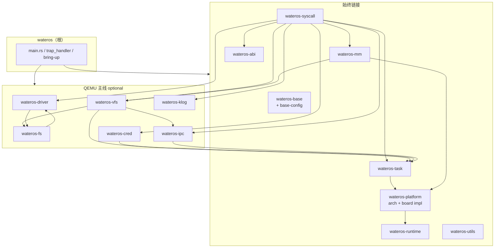
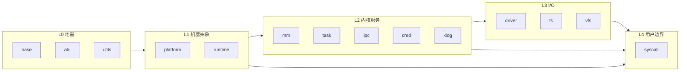
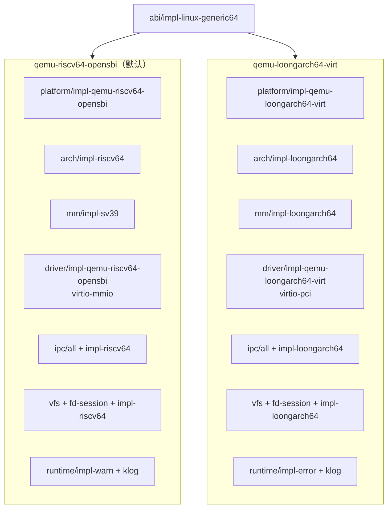

# 一级组件关系总图

事实来源：`os/Cargo.toml`（根依赖）、`os/feature-tree.txt`（feature 展开）。下图描述 **根 crate 直接依赖** 与主线运行时数据流，非 workspace 全量 crate 列表。

## 根依赖总览



## 分层语义



| 层级 | 组件 | 职责 |
|------|------|------|
| L0 | base, abi, utils | 类型、常量、syscall ABI；utils 暂为空壳 |
| L1 | platform, runtime | trap/时间/串口、panic/堆/开发日志 |
| L2 | mm, task, ipc, cred, klog | 地址空间、调度、同步/信号、凭证、内核环 |
| L3 | driver, fs, vfs | 硬件、块 FS/伪 FS、路径与 fd 语义 |
| L4 | syscall | trap 入口、Linux 号表分发 |

## 平台 feature 分叉

两主线在根 `Cargo.toml` 中互斥选用，均打开完整 I/O 栈（driver + fs + ipc + cred + vfs-bridge + klog + syscall/impl-kernel）。



共性：`task/impl-core`、`fs` 默认 ext4-rs + devfs、`syscall/impl-kernel`、`driver/impl-block-cache`。

## 组件内 api / impl 模式

每个一级组件（除 base、utils）普遍采用：

```text
<component>/
  *-api/api-v0/     # 稳定 trait 与类型
  *-impl/impl-*/    # 可替换实现
  src/lib.rs        # active_impl + 再导出
```

`platform` 额外拆分 `platform-arch`（ISA）与 `platform-impl`（板级）；`driver` 再分 block / character / network 子系统。详见 [`module-relations.md`](module-relations.md)。

## 未纳入根依赖

- `wateros-pseudo-shell`：feature `pseudo-shell` 可选。
- `arch_api_v0`：根直接依赖平台 arch API，供 `trap_handler` 等使用。
- workspace 内大量 `*-api-v0`、`*-impl-*` 子 crate 由组件聚合层 feature 拉入，不单独出现在根 `Cargo.toml`。
