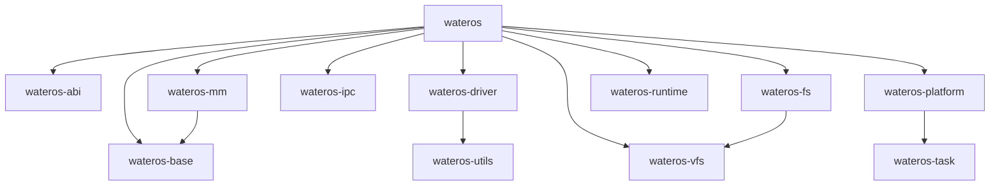

# 组件结构图

```mermaid
flowchart TD
    wateros[wateros]
    abi[wateros-abi]
    base[wateros-base]
    driver[wateros-driver]
    fs[wateros-fs]
    ipc[wateros-ipc]
    mm[wateros-mm]
    platform[wateros-platform]
    runtime[wateros-runtime]
    task[wateros-task]
    utils[wateros-utils]
    vfs[wateros-vfs]

    wateros --> abi
    wateros --> base
    wateros --> driver
    wateros --> fs
    wateros --> ipc
    wateros --> mm
    wateros --> platform
    wateros --> runtime
    wateros --> vfs

    platform --> task
    driver --> utils
    mm --> base
    fs --> vfs
```

## 说明

- 图中首先展示当前项目中最重要的一级组件。
- 根 crate 的直接依赖以 `os/Cargo.toml` 为准。
- 其余连线用于表达明显的结构关系，而非精确的全部 Cargo 依赖图。
