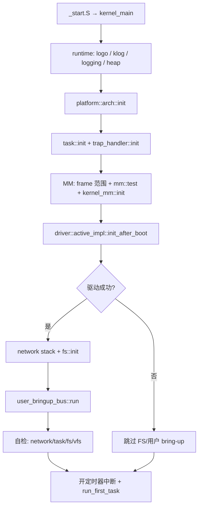

# 内核入口与 bring-up 流程

## 用途

从 `os/src/main.rs`、`os/build.rs` 与平台 `_start.S` 的链接关系，描述 WaterOS 内核二进制如何启动、如何把各一级组件串起来。事实来源：源码与 `os/Cargo.toml` feature 矩阵。

## 链接与汇编入口

| 环节 | 位置 | 说明 |
|------|------|------|
| 构建脚本 | `os/build.rs` | 按 board feature 传入 `-T.../link.ld`，并 `rerun-if-changed` 链接脚本与 `_start.S` |
| 汇编入口 | `platform-impl/.../asm/_start.S` | 经 `global_asm!` 编入根 crate；`ENTRY` 与 `link.ld` 一致 |
| Rust 入口 | `kernel_main` | `#[no_mangle]`，由 `_start` 跳转；**不返回**（`-> !`） |

根 crate 为 `#![no_std] #![no_main]` 二进制，无 `lib.rs`；全局 `#[panic_handler]` / `#[alloc_error_handler]` 委托 `wateros-runtime`。

## Board feature 与模块编译

| Feature | `kernel_main` 模块 | 额外 `os/src` 子模块 |
|---------|-------------------|----------------------|
| `qemu-riscv64-opensbi`（默认） | `qemu_riscv64_opensbi` | 含 `self_tests::task` |
| `qemu-loongarch64-virt` | `qemu_loongarch64_virt` | 无 `self_tests::task` |

以下子模块在 **任一 QEMU board feature** 下编译：`boot_timebase`、`trap_handler`、`user_bringup_*`、`self_tests`（`network` 两板共有；`task` 仅 riscv64）。

## 通用 bring-up 阶段（两板共有语义）

### 1. Runtime 与平台基础

- 控制台横幅、`klog::init`、`runtime::logging::init`、堆分配器 `init`。
- `platform::arch::init`：架构相关 CSR / 中断向量等。

### 2. 引导参数与 timebase

| 板级 | DTB/FDT 指针来源 | timebase 探测 |
|------|------------------|---------------|
| riscv64 | `boot_arg1`（OpenSBI 传入） | `boot_timebase::probe_and_init_timebase(boot_arg1)`，在 `driver::init_when_boot` 之后 |
| loongarch64 | `envp`（固件约定） | 同上，指针为 `envp` |

`boot_timebase` 只读 DTB `/cpus` 下 `timebase-frequency`，写入 `platform::time::set_frequency_hz`。

### 3. 任务与 trap（须在 MM 激活 satp **之前**）

1. `task::init()` — 调度器数据结构。
2. `trap_handler::init()` — 向 `arch_api_v0` 注册 `wateros_kernel_trap_handler`（syscall、页错、定时器 tick、信号投递）。

**契约**：页表切换后 trap 会立即发生；trap 路由必须先就绪。

### 4. 内存管理

- 从链接符号 `kernel_end` 到 `driver::physical_ram_end_exclusive()` 计算 frame 分配器 PPN 范围。
- 若 DTB 落在 RAM 高端，向下对齐保留固件数据区（不纳入 frame 池）。
- `mm::test_with_range` 自检后 `mm::kernel_mm::init` 安装内核页表。

**LoongArch 差异**：`init_paging_disable_mmu()` 在 MM 自检前关闭固件可能已开启的 MMU；可用 PPN 上限钳制为 `0x1_0000_0000 / PAGE_SIZE`。

### 5. 驱动、网络、文件系统

`driver::active_impl::init_after_boot()` 成功后：

1. `driver::network::stack::init` + `spawn_kernel_task(network_poller_task)` + `self_tests::network::run_sync_smoke`。
2. `fs::init()` — 探测块设备、注入 FS impl（**不**默认挂载根卷）。
3. [`user_bringup_bus::run`](../../../os/src/user_bringup_bus.rs) — RW 挂载 ext4、`/proc`、根布局链接，再跑已登记 bring-up 阶段。
4. 板级差异自检：
   - **riscv64**：另调 `self_tests::task::spawn_all()`（当前实现为禁用占位）。
   - **两板**：`self_tests::network::spawn_all()`（空）、`fs::test()`、可选 `vfs::test()`。

### 6. 进入调度

1. `platform::interrupt::enable_timer_interrupt` + `set_timer_after_ms(100)` + `enable_global_interrupt`。
2. `klog::post_init_hello()`。
3. `task::run_first_task()` — **首次**从引导上下文切换到已 spawn 的任务（含用户态 bring-up runner）。

此前所有 `spawn_user_task_*` / `spawn_kernel_task` 仅入队；用户态 `ecall` 与 bring-up 脚本在 `run_first_task` 之后才在 CPU 上执行。

## 用户态 bring-up 总线（组合层职责）

`user_bringup_bus::run` 是根 crate 把 **vfs / fs / mm / task / cred / syscall** 串成赛题测程的主线：

| 步骤 | 调用 | 依赖组件 |
|------|------|----------|
| stage-00 | `fs::mount_default_root_rw`、`vfs::ensure_proc_mount_point`、`mount_procfs_at` | fs, vfs |
| 布局 | `user_bringup_root_layout::ensure_busybox_path_links` | vfs RW 会话 |
| 可选阶段 | `user_bringup_mm` / `posix_fs` / `basic` / `busybox`（`run` 内注释切换） | mm, vfs, task |

默认启用 `user_bringup_busybox::run_stage_busybox`：登记内核 runner，在调度后串行执行 `BRINGUP_COMMANDS`（busybox + testcode.sh）。

共享装载逻辑在 `user_bringup_common`：`load_program_from_path` → `spawn_user_task` → `wait` → `reap` → `purge_all_user_processes`。

## Trap 组合层（`trap_handler`）

`wateros_kernel_trap_handler` 在 trap 入口：

- 用户态：切内核 satp、`prepare_user_trap_frame_access`。
- **UserEnvCall**：`syscall::dispatch_syscall_from_trap`；`execve` 成功时不推进 sepc。
- **页错**：COW、lazy map、否则 SIGSEGV / 杀进程。
- **监督态定时器**：`set_timer_after_ms(SCHED_TIMER_PERIOD_MS)` + `syscall::timer_tick` + `task::schedule_tick`。
- 返回用户前：信号投递、`restore_current_trap_frame` → 汇编 `sret`。

## 与一级组件的边界

| 组件 | 根 crate 角色 |
|------|----------------|
| `wateros-platform` | 汇编入口、arch、timer、interrupt、reset |
| `wateros-runtime` | panic/alloc 错误、console、logging、heap |
| `wateros-mm` | frame 范围、内核页表、ELF 装载（bring-up 调用） |
| `wateros-driver` | 早期 `init_when_boot`、PCI/块设备、`init_after_boot`、网络栈 |
| `wateros-fs` / `wateros-vfs` | `init`、挂载、bring-up 路径与 procfs |
| `wateros-task` | 调度、`spawn`/`wait`、trap 帧与 TCB |
| `wateros-syscall` | trap 内分派与信号 |
| `wateros-klog` | 环缓冲与 `post_init_hello` |

根 crate **不**再导出组件 API；仅实现全局 handler、`kernel_main` 与 bring-up/trap 胶水。

## 修订

| 日期 | 说明 |
|------|------|
| 2026-06-29 | 初版：自 `os/src/main.rs` 与 bring-up 模块整理 |
