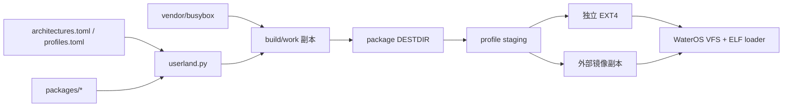

# userland — 架构

事实来源：`user/configs/`、`user/packages/`、`user/tools/` 与 `user/README.md`。

## 定位

`user/` 是 WaterOS 仓库内的普通目录，不再是 Rust 用户程序 Git 子模块。它是一个
离线、可组合的用户空间构建系统，负责双架构静态 BusyBox、profile staging、独立
EXT4 rootfs 和外部 EXT4 镜像副本叠加。内核仍通过现有 ELF loader、VFS 和 syscall
实现运行这些标准 Linux ABI 用户程序。

## 目录职责

| 路径 | 职责 |
| --- | --- |
| `configs/architectures.toml` | 工具链前缀、目标三元组、ABI flags、ELF machine |
| `configs/profiles.toml` | package 集合、合并覆盖和 overlay 替换范围 |
| `rootfs/base/` | 架构无关账号、网络、shell 环境与 rcS |
| `packages/*/package.toml` | package 元数据、依赖、架构和输入 |
| `packages/*/build.py` | 将一个 package 安装到隔离 DESTDIR |
| `vendor/` | 固定版本、带许可证的上游源码 |
| `tools/userland.py` | doctor、依赖排序、缓存、构建和 staging 合并 |
| `tools/image.py` | EXT4 创建、校验、inspect 和安全叠加 |
| `build/` | work、缓存、staging、manifest 和镜像；不提交 |

## 构建数据流

1. 读取架构与 profile TOML，解析 package 依赖并拓扑排序。
2. 将 vendor 源码复制到 `build/work`；只在副本上应用有序 patch。
3. package 构建入口收到 JSON context，安装到独立 DESTDIR。
4. 以“同一路径单一 owner”为默认规则合并 staging；未授权冲突立即失败。
5. 写入工具链/package/cache 元数据和逐路径 manifest。
6. `mke2fs -d` 创建无分区表 EXT4，或由 `debugfs` 写入基础镜像副本。

缓存键覆盖架构、源码、package/config/patch、额外输入和工具链版本，不能跨 ABI
误复用。构建过程不联网、不修改 vendor，也不要求 root/loop mount。

## 与内核的边界

- `os/Makefile` 只接收 `SDCARD=<path>`，不构建用户软件。
- 根目录 `make all` 不依赖 `user/build`，比赛外部镜像流程保持不变。
- operator supervisor 直接尝试 `/bin/sh`；首版不运行传统 PID 1。
- `/dev`、`/proc`、`/tmp` 在镜像中只是挂载点，由内核运行时提供。
- minimal/operator 不带比赛 `/glibc`、`/musl`；需要测例时使用 overlay 副本。

## 安全与可复现边界

- overlay 从不原地修改输入镜像，并在完成前后检查基础镜像摘要。
- `/glibc`、`/musl` 永不允许写入；其他路径受 allowlist 和 profile 替换权限约束。
- 独立镜像使用固定 UUID、label、时间基准和保守 EXT4 feature。
- 完成后执行 `e2fsck -fn`，并生成内容清单及 SHA-256。

## 修订

| 日期 | 说明 |
| --- | --- |
| 2026-08-09 | 将旧 Rust 子模块文档替换为双架构 BusyBox/package/EXT4 架构 |
