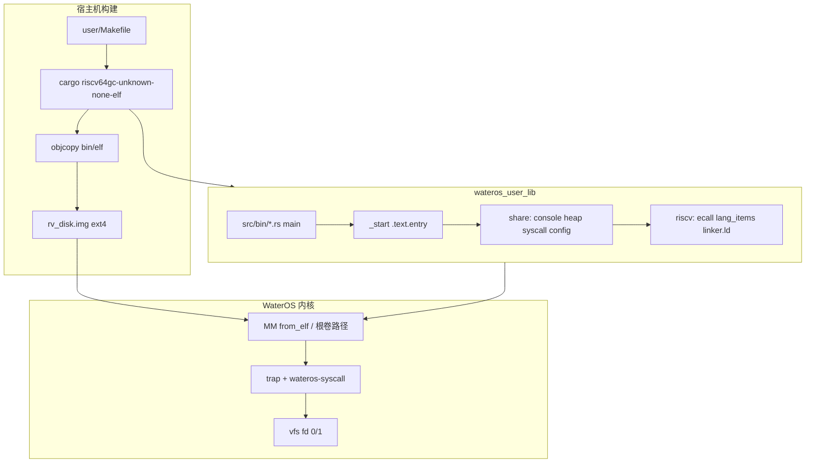
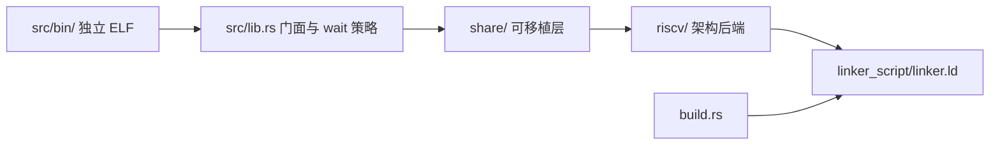
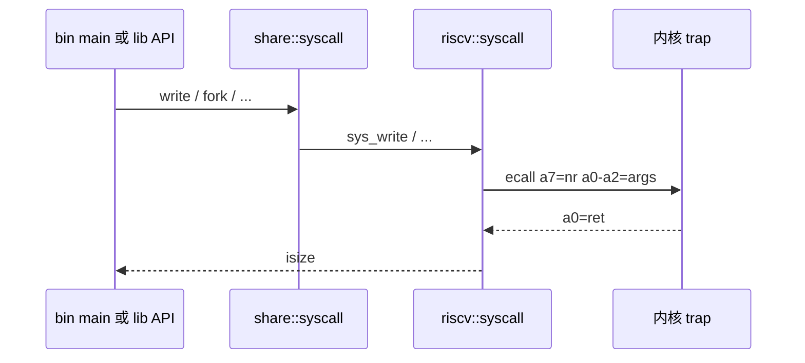

# userland — 架构

事实来源：`user/` 目录树、`user/Cargo.toml`、`user/Makefile`、内核 `os/src/main.rs` bring-up 路径。

## 在系统中的位置

用户态代码以 **Git 子模块** `user/`（远程 `wateros_user_mode_program`）维护，与内核仓库解耦构建；产物通过 ext4 磁盘镜像或 ELF 路径由内核加载器装入用户地址空间。

## 目录与职责

| 路径 | 职责 |
|------|------|
| `src/lib.rs` | `_start`、弱 `main`、对外 `write`/`fork`/… 门面；`wait` 轮询策略 |
| `src/share/` | 控制台、堆配置、syscall 薄封装（意图上与架构解耦） |
| `src/riscv/` | BSS 清零、`ecall`、panic、`linker.ld` |
| `src/bin/` | 各烟测与 shell；仅提供 `main` |
| `script/` | Makefile 生成、ext4 镜像、统计脚本 |
| `build.rs` | 链接脚本变更重编译 |

## 启动与链接布局

1. 内核将 ELF 映射到用户地址空间（装载地址假设与 `linker.ld` `USER_ENTRY_ADDRESS` 及加载器一致）。
2. CPU 从 `_start`（`.text.entry`）开始执行。
3. `clear_bss` → `init_heap` → 用户 `main` → `exit` syscall。

`linker.ld` 段顺序：`.text.entry` → trampoline 占位 → `.text.*` → `.rodata` → `.data` → `.bss`（含 `bss_start`/`bss_end`）。

## Syscall 路径

- 编号常量定义在 `riscv/syscall.rs`，与 `wateros-abi` `LinuxGeneric64` 调试子集对齐。
- 控制台 I/O 经 fd 0/1 进入内核 VFS/字符设备栈（具体驱动由内核 feature 决定）。

## 构建流水线

| 阶段 | 输出 |
|------|------|
| `script/gen_bin_makefile.sh` | `src/bin/Makefile.generated`（每个 `[[bin]]` 的 objcopy 规则） |
| `cargo build --target riscv64gc-unknown-none-elf --release` | `libwateros_user_lib.rlib` + 各 bin ELF |
| `objcopy -O binary` | `bin/riscv/*.bin` |
| `objcopy -O elf64-littleriscv` | `elf/riscv/*.elf` |
| `script/rv_gen_ext4_disk_img.sh` | `rv_disk.img`（供 QEMU/内核根卷） |

## 与内核组件对应

| 用户态 | 内核 |
|--------|------|
| `ecall` + 号表 | `wateros-platform` trap → `wateros-syscall` |
| 号表常量 | `wateros-abi` `impl-linux-generic64` |
| `read`/`write` fd 0/1 | `wateros-vfs` fd-session + 控制台 |
| `fork`/`exec`/`waitpid` | `wateros-task` + `wateros-mm` ELF 加载 |
| `brk` | `wateros-mm` 用户堆/ program break |
| `get_time` | `wateros-platform` 计时 / tick |

## 当前限制（架构层）

- **单架构**：仅 RISC-V 64；LoongArch 用户态未分叉。
- **共享地址空间 fork**：与内核 task 文档一致，fork 后页表共享为临时方案。
- **无动态链接**：静态链接 `wateros_user_lib` + `buddy_system_allocator`。
- **子模块检出**：父仓库 `user/` 为空时需初始化子模块，否则无源码可构建。

## 修订

| 日期 | 说明 |
|------|------|
| 2026-06-29 | 初版架构导出 |
