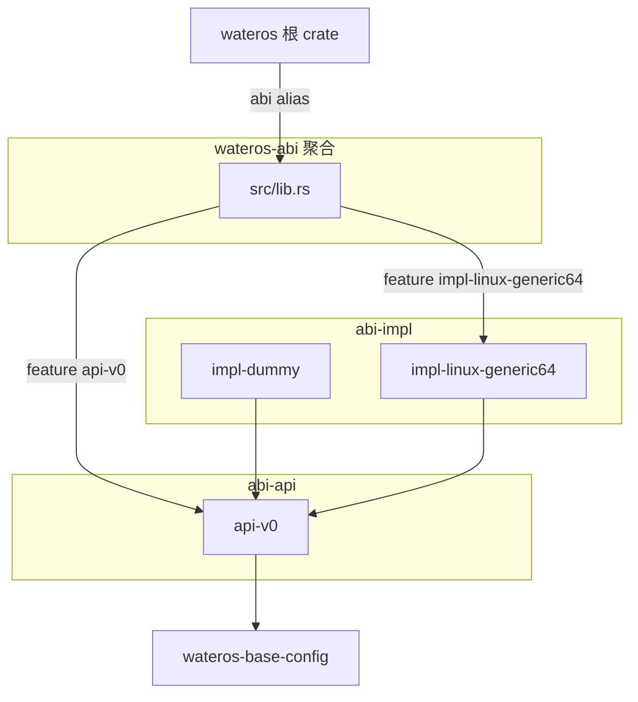

# wateros-abi — 架构

事实来源：各子 crate `Cargo.toml`、聚合 `src/lib.rs`、`os/Cargo.toml`。

## 组件结构



## 目录与职责

| 路径 | Crate 名 | 职责 |
|------|----------|------|
| `src/lib.rs` | `wateros-abi` | 按 feature 重导出 api-v0 模块；挂上 `ActiveSyscallNumberTable` |
| `abi-api/api-v0/` | `wateros-abi-api-v0` | 稳定 ABI 类型与 trait 定义 |
| `abi-impl/impl-dummy/` | `wateros-abi-impl-dummy` | 工作区占位 |
| `abi-impl/impl-linux-generic64/` | `wateros-abi-impl-linux-generic64` | Linux 通用 64 位号表 |

## api / impl 关系

- **api-v0** 定义契约：`ErrNo`、`UserRet`、`SyscallNumber`、`SyscallNumberTable`、`SyscallArgs`
- **impl-linux-generic64** 为 `SyscallNumberTable` 提供唯一当前生产 impl
- **impl-dummy** 不参与聚合重导出，满足 workspace members 与 `api-v0` feature 传递

## Feature 接线

```
api-v0 = [ impl-dummy/api-v0, impl-linux-generic64?/api-v0 ]
impl-linux-generic64 = [ api-v0, dep:impl-linux-generic64 ]
default = []
```

根内核 `qemu-riscv64-opensbi` / `qemu-loongarch64-virt` → `abi/impl-linux-generic64`。

## 下游消费者（典型）

- `wateros-syscall`：分发与 handler 对照 `SyscallNumberTable`
- `wateros-abi-api-v0` 被用户态或 IPC 边界间接引用（经聚合 `abi`）

## 缺口

- 无 api-v1 或其它 ABI 版本目录
- 仅一张 Linux 通用表，无 per-arch impl 选择机制
