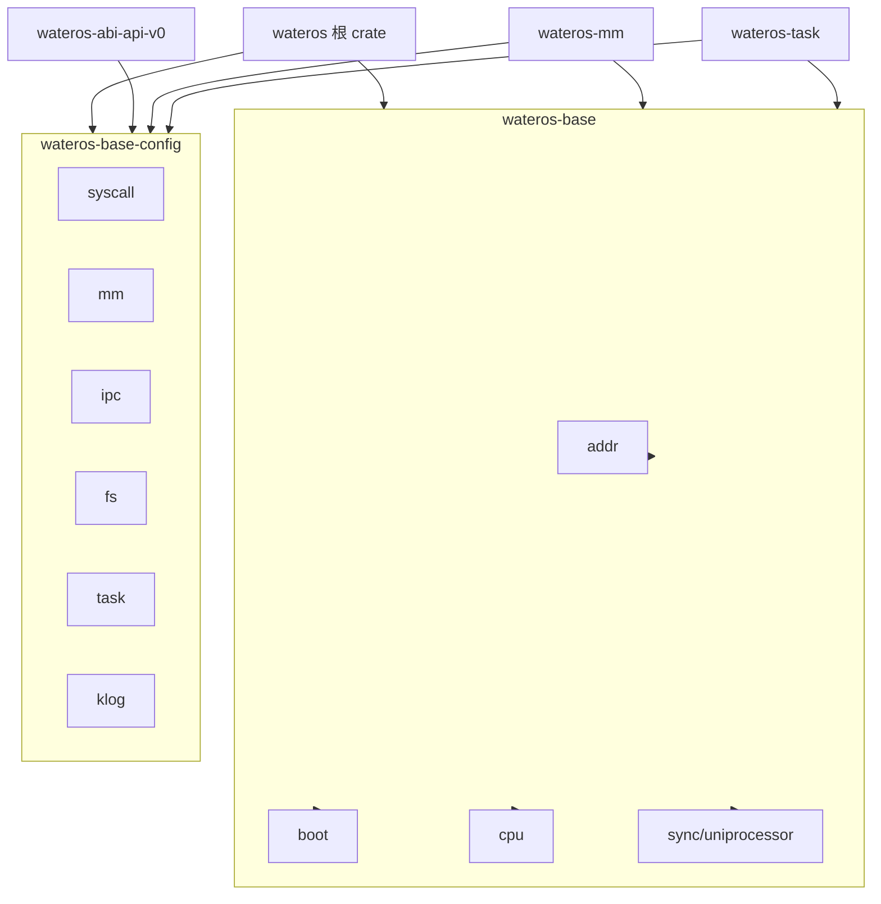

# wateros-base — 架构

事实来源：`wateros-base/Cargo.toml`、`base-config/Cargo.toml`。

## 组件结构

## 双 crate 分工

| Crate | 定位 | 依赖 |
|-------|------|------|
| `wateros-base` | 无策略的基础类型与单核同步容器 | 无 |
| `wateros-base-config` | 跨子系统共享的配置常量 | 无 |

聚合 `wateros-base` 的 workspace 仅含 `base-config`；配置 crate 可独立被 `wateros-abi-api-v0` 等引用，无需经过类型 crate。

## 模块关系

- `boot::DTBPA` 基于 `addr::BasePhysAddr`
- `sync::UniprocessorSafeCell` 供各 impl 持有全局状态（分配器等）
- `base-config::syscall::MAX_SYSCALL_ARGS` 决定 `SyscallArgs` 数组长度

## 与 impl 层

本组件无 `impl-*` 子 crate；平台差异由 `wateros-platform`、`wateros-mm` 等上层消化，此处只提供中性类型与 bring-up 缺省常量。

## 缺口

- 无多核同步原语
- 配置常量未按 board feature 拆分（QEMU virt 假设写死在 `mm` 模块）
