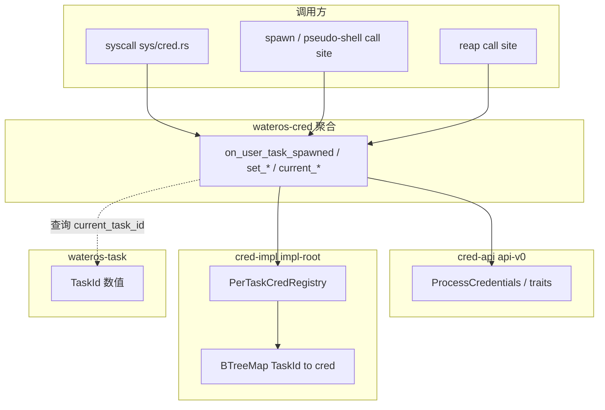

# wateros-cred — 架构关系

## 用途

描述凭证组件的侧表模型、与 task/syscall 的生命周期分工。事实来源：`cred-api/api-v0`、`cred-impl/impl-root`、`docs/guides/cred-module-design.md`。

## 分层

## 设计要点

| 决策 | 说明 |
|------|------|
| B2 侧表 | 凭证不进 TCB；`TaskId` 索引 |
| H2 生命周期 | `task` crate **不**依赖 `cred`；hook 由 syscall 与 call site 显式调用 |
| 线程共享 | `share_cred`：`owners` + `ref_counts` 指向同一 owner 条目 |
| 失败策略 | 无侧表条目 → panic（bring-up 与 vfs cwd 模式一致） |

## syscall 接线

- **读**：`getuid`/`geteuid`/`getgid`/`getegid`/`getgroups`/`getresuid`/`getresgid` → `current_credentials` 或按 tid。
- **写**：`setuid` 族 → 聚合 `set_*` → `impl_root::set_resuid` 等。
- **fork/clone**：`sys_clone` 内 `fork_cred` / `share_cred`。
- **execve**：`on_exec`（待扩展 setuid 位）。
- **权限检查**：`faccessat`、`fchownat` 等逐步调用 `may_*`（部分仍为桩）。

## 依赖方向

- `impl-root` → `api-v0`、`base::sync`、`alloc`。
- 聚合 `impl-root` → `task`（仅 `current_task_id`）。
- **禁止** `task` → `cred` 硬依赖。

## 修订

| 日期 | 说明 |
|------|------|
| 2026-06-29 | 初版 |
