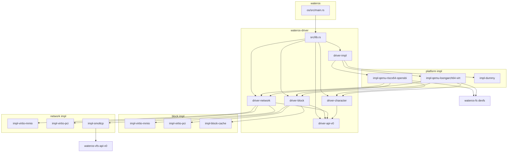
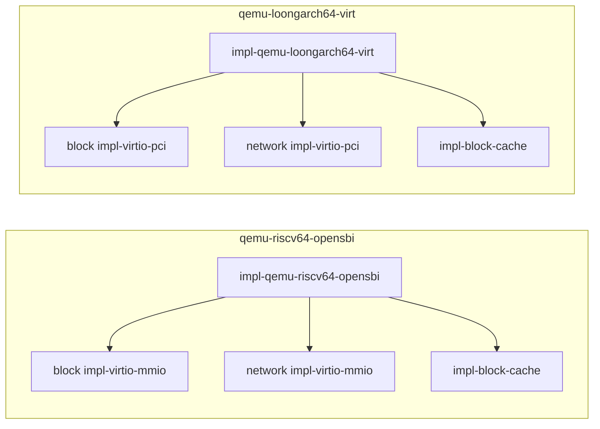
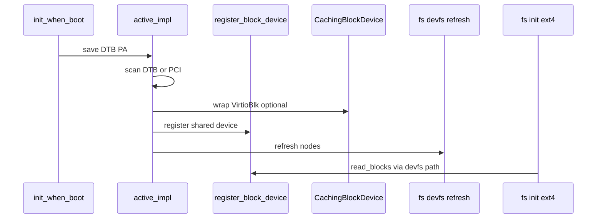

# wateros-driver — 组件关系

## 用途

描述 `wateros-driver` 内部子 crate 与根 `wateros` 的依赖关系（当前快照）。

## 总览

## Feature 与平台路径

## 运行时数据流（块设备 → 文件系统）

## 外部依赖

| 依赖组件 | 用途 |
|----------|------|
| `wateros-base-config` | RAM 回退、`BLOCK_CACHE_CAPACITY_BLOCKS` |
| `wateros-mm` 帧分配器 | VirtIO DMA（`frame_alloc_result`） |
| `wateros-fs` | devfs 刷新（平台 impl） |
| `wateros-vfs` | socket fd `VfsIoHandle`（`impl-smoltcp`） |
| `fdt` | RISC-V DTB 解析 |
| `virtio-drivers` | VirtIO MMIO/PCI transport |
| `smoltcp` | 内核协议栈 |

## 修订

| 日期 | 说明 |
|------|------|
| 2026-06-29 | 初版 |
