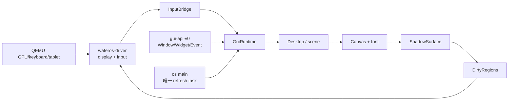

# wateros-gui — 组件关系

## 所有权

- driver 注册表拥有 `Arc<Mutex<Box<dyn DisplayDevice/InputDevice>>>`。
- `GuiRuntime` 持有选定 display 的共享句柄、输入设备状态、窗口树和 shadow surface。
- `Window` 拥有其 `Widget`，窗口 `Vec` 顺序即从底到顶的 z 序。
- 业务代码只持有 `WindowId/WidgetId`，通过语义事件识别动作。

## 一帧的时序

1. 刷新任务轮询硬件输入，原始事件转换成 `InputEvent`。
2. Desktop 更新指针、焦点、拖动和控件状态，输出 `GuiEvent`。
3. 变化区域进入 `DirtyRegions`。
4. renderer 在 shadow surface 合成窗口树。
5. runtime 短暂锁定 display，复制脏区并调用 `flush_region`。
6. 释放所有 GUI/设备锁后，刷新任务 sleep。

GUI 是可选 L3/L4 内核服务：依赖 driver，不被 syscall、task、MM 反向依赖。当前没有
用户态 GUI ABI。

