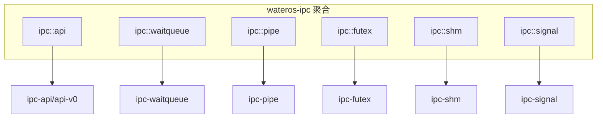
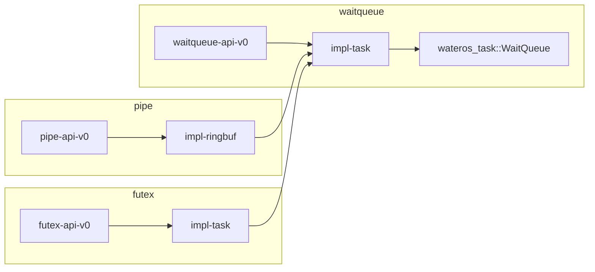

# wateros-ipc — 架构与模块关系

## 用途

描述 `wateros-ipc` 内部子 crate、API/impl 分层及与相邻一级组件的依赖关系。与 `docs/exports/features/wateros-ipc.md` 互补：本文侧重结构图与接线，后者侧重能力清单。

## 聚合层



## 子系统分层（API → impl）



## 外部依赖

| 消费者 | 使用的 ipc 模块 | 用途 |
|--------|-----------------|------|
| `wateros-syscall` | `pipe`, `futex`, `shm`, `signal`, `waitqueue` | syscall 实现 |
| `wateros-vfs` | `pipe::PipeEndpoint` | fd 表与 poll |
| `wateros-mm` | （间接）shm 返回 PPN | 用户映射由 syscall 调用 mm |
| `wateros-task` | 被 `waitqueue` 委托 | 阻塞/唤醒 |
| `os/self_tests` | `pipe` | 内核自检 |

| ipc 子 crate | 依赖 |
|--------------|------|
| `ipc-shm` | `wateros-mm-api-v0`, `wateros-mm-frame-alloctor` |
| `ipc-waitqueue/impl-task` | `wateros-task` |
| `ipc-pipe/impl-ringbuf` | `ipc-waitqueue`, `spin` |
| `ipc-futex/impl-task` | `ipc-waitqueue`, `wateros-task-api-v0`, `spin` |

## Feature 选路（根 `wateros`）

| 根 feature | ipc feature |
|------------|-------------|
| `impl-riscv64` | `ipc/all` |
| `impl-loongarch64` | `ipc/all` |
| 默认（无平台 impl） | 通常不链接 `ipc` |

`ipc/all` = `api-v0` + `impl-dummy` + `pipe` + `futex` + `shm` + `signal`。

## 数据流摘要

### pipe 读路径

```text
syscall read → vfs fd → PipeEndpoint::read
  → Pipe::read → WaitQueue 阻塞（空且写端开）
  → 写端 write 唤醒 → 返回数据
```

### futex 等待路径

```text
syscall futex WAIT → 用户内存 cmpxchg（syscall）
  → FutexHub::wait_while(condition)
  → WaitQueue 阻塞 → WAKE/requeue 唤醒
```

### shm 附加路径

```text
shmget → ShmRegistry::create_or_get
shmat → begin_attach → mm 映射 PPN → finish_attach
  （映射失败 → cancel_attach_reservation）
```

### 信号交付路径

```text
kill/tkill → SignalRegistry::send_*
trap 返回前 → has_deliverable → take_deliverable
  → 构建用户信号帧 → rt_sigreturn 恢复掩码
```

## 修订

| 日期 | 说明 |
|------|------|
| 2026-06-29 | 初版架构导出 |
