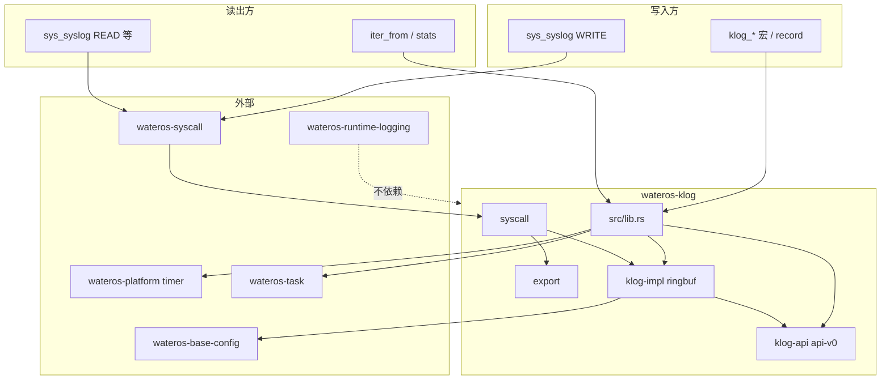

# wateros-klog — 架构与模块关系

## 组件定位

持久内核消息环 + `sys_syslog` 内核语义；与用户态 `dmesg` / busybox 兼容的 traditional 读路径。

## 目录结构

```text
os/components/wateros-klog/
  Cargo.toml
  src/lib.rs          # 聚合、宏、init/record
  src/export.rs       # traditional 格式化
  src/syscall.rs      # dispatch_kernel
  klog-api/api-v0/
  klog-impl/klog-ringbuf/
```

## 依赖关系



## 并发模型

`KlogRingbuf`：`spin::Mutex` + 进入时关全局中断（`KlogInterruptGuard`），与堆分配器中断策略类似。

## 存储两层（实现快照）

1. **desc 槽数组**：`KLOG_DESC_SLOTS`，每项含 `KlogRecordMeta` + 定长正文缓冲。
2. **逻辑 text 容量**：`KLOG_TEXT_RING_BYTES` 用于 `SIZE_BUFFER` 语义；物理上正文存于槽内数组而非独立字节环（与早期设计文档的「变长 text ring」在实现上简化为 per-slot 缓冲）。

## syscall 边界

- `wateros-syscall` 负责用户指针拷贝；`klog::syscall::dispatch_kernel` 仅操作内核侧缓冲。
- ABI：`SYSLOG = 116`（`wateros-abi`）。

## 修订

| 日期 | 说明 |
|------|------|
| 2026-06-29 | 初版导出；注明 per-slot 实现与 design doc 差异 |
