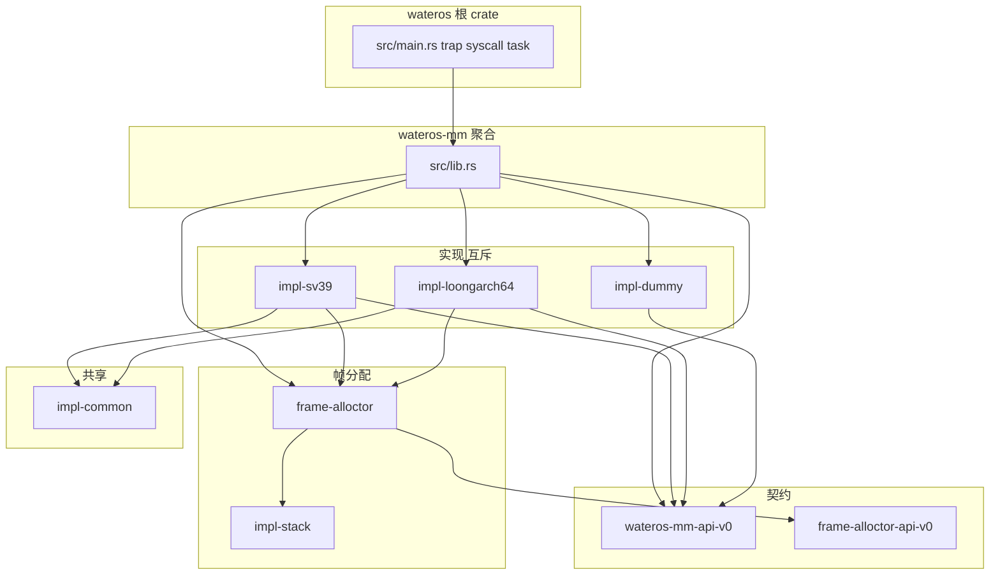

# wateros-mm 架构

## 用途

描述 `wateros-mm` 的 crate 分层、feature 选择链与数据流；与 `os/Cargo.toml`、`wateros-mm/Cargo.toml` 一致。

## Crate 分层



## Feature 选择

| 层级 | feature | 效果 |
|------|---------|------|
| `wateros` | `impl-sv39` | `mm/impl-sv39` |
| `wateros` | `qemu-loongarch64-virt` | `mm/impl-loongarch64` |
| `wateros-mm` | `impl-sv39` | 编译 `impl-sv39`，`kernel_mm` 转发 Sv39 符号 |
| `wateros-mm` | `impl-loongarch64` | 编译 LoongArch64 实现 |
| `wateros-mm` | `default` (`api-v0`) | 仅 API + `impl-dummy` 页表桩 |
| `wateros-mm` | `vfs-root-read` | 向 impl 传递根卷读能力 |

`impl-sv39` 与 `impl-loongarch64` **互斥**；聚合 `lib.rs` 用 `#[cfg(feature = "...")]` 选择 `active_mm_impl`。

## 地址空间与 token

| 概念 | RISC-V Sv39 | LoongArch64 |
|------|-------------|-------------|
| 用户页表根 | `Sv39AddressSpace.root` (PPN) | `LoongArch64AddressSpace.root` |
| 安装寄存器 | `satp` (MODE/ASID/PPN) | `CSR.PGDL` + `CSR.ASID` |
| `AddressSpaceOps::satp_value` | Sv39 编码 | bit `[47:0]` PGDL + bit `[57:48]` ASID |
| 内核全局表 | `kernel_global` 泄漏的 `Sv39AddressSpace` | 同结构，恒等基址 `0x9000_0000` |
| token 缓存 | `api::kernel_satp`（供 task/trap） | 同上 |

用户地址空间以 **裸指针** `LoadedElf::user_aspace_ptr` 泄漏给 task；syscall 经 `user_aspace::with_user_aspace_mut` 修改页表。

LoongArch64 保留 ASID 0 给内核，并从硬件 10 位空间中为用户地址空间分配
1..=1023。任务切换同时安装 PGDL 和 ASID，不再因为 PGDL 改变而全量刷新本地
TLB。地址空间记录所有可能缓存过其 TLB 项的 CPU；销毁时必须先完成这些 CPU
的 shootdown，随后才归还 ASID。若 shootdown 未确认完成，则退休该 ASID，
避免编号复用后命中旧映射。

## 页表 walk 与物理访问假设

两级实现（Sv39 / LoongArch64）均：

1. 三级页表，**仅 4 KiB 叶子**。
2. `table_mut(ppn)` 将 PPN 转为指针，要求 **内核恒等映射** 可直访物理 RAM。
3. 映射时预置访问/脏位（bring-up 策略），减少依赖硬件置位缺页。

fork 路径：`fork_cow` → 递归 `fork_table`；可写用户页 `prepare_cow`；`handle_cow_fault` 在 trap 中完成复制。

## 主要数据流

### Bring-up

```text
main → mm::test_with_range
     → mm::kernel_mm::init (内核页表 + frame_alloctor::init)
     → kernel_satp 写入 api::kernel_satp 缓存
```

### exec / spawn

```text
kernel_mm::load_program_from_path
  → 读根卷 ELF / shebang
  → 建立用户页表 + LoadedElf
prepare_elf_user_stack (ActiveUserMemoryOps)
  → 用户栈 argc/argv/envp/auxv
task 安装 user_aspace_ptr 与地址空间 token
```

### 页故障

```text
trap_handler
  → handle_cow_fault (写保护)
  → handle_user_page_fault → MmapOps::handle_page_fault
       → 栈 / brk / lazy file / lazy anon
```

### 任务退出

```text
api::user_aspace_lifecycle::drop_user_aspace_on_task_exit
  → kernel_mm::drop_user_aspace (impl 注册)
  → 本地/远端 TLB shootdown
  → 归还 LoongArch64 ASID
```

## 与周边组件边界

| 组件 | 关系 |
|------|------|
| `wateros-platform` | TLB 刷新、`set_kernel_trap_satp` |
| `wateros-task` | 持有 `user_aspace_ptr`、切换地址空间 |
| `wateros-syscall` | brk/mmap/mprotect/mremap/madvise/get_mempolicy |
| `wateros-vfs` | 根卷读 ELF（经 impl feature `vfs-root-read`） |
| `wateros-base` | `BasePPN`、`UniprocessorSafeCell` |

`mm-api` **不**依赖 `wateros-fs`，根卷错误用 `RootVolumeReadError` 语义映射。
