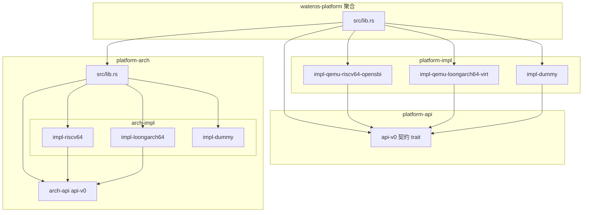
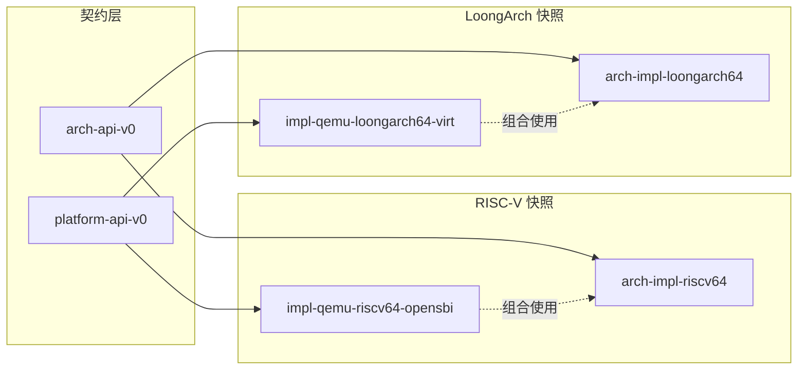
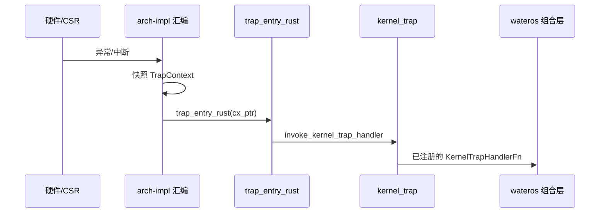

# wateros-platform — 架构分层

## 用途

描述 `wateros-platform` 组件内 **platform-api / platform-arch / platform-impl** 三层的职责边界与 feature 接线。事实来源：各 `Cargo.toml` 与聚合 `src/lib.rs`。

## 总览

## 分层职责

| 层 | Crate 路径 | 职责 | 不做什么 |
|----|------------|------|----------|
| **platform-api** | `platform-api/api-v0` | 板级/环境契约：boot 参数槽、时间频率、console、deadline timer、reset | trap 帧、CSR、页表格式 |
| **platform-arch** | `platform-arch/` | ISA 原语聚合：trap、时间 CSR、中断位、分页 CSR、任务硬件上下文 | SBI 调用、MMIO UART、ACPI 寄存器 |
| **arch-api** | `platform-arch/arch-api/api-v0` | 架构 trait 与 `kernel_trap` 路由入口 | 依赖 task/syscall |
| **arch-impl** | `platform-arch/arch-impl/impl-*` | CSR/汇编、trap 帧布局、`__switch` | 业务 trap 分发 |
| **platform-impl** | `platform-impl/impl-*` | 具体板级或 QEMU profile 实现 api-v0 trait | ISA trap 向量 |

## API / Impl 对应关系

根 crate feature `impl-qemu-riscv64-opensbi` 同时启用 `arch/impl-riscv64` 与对应 platform-impl；LoongArch 同理。

## Trap 路径（组合层接线）

`arch-impl` **不**直接依赖 `wateros-task` / `wateros-syscall`；组合层在启动时 `register_kernel_trap_handler`。

## 与相邻组件边界

| 邻居 | 关系 |
|------|------|
| `wateros-mm` | 页表内容与 `kernel_satp` 由 MM 维护；platform-arch 只激活 token 与刷新 TLB |
| `wateros-task` | 使用 `ArchTaskContext`、`ActiveTrapFrame`；切换经 `__switch` |
| `wateros-runtime` | early console 可走 `platform::console`（`impl-platform-console`） |
| `wateros-abi` | arch-api trap 模块引用 syscall 参数/返回值类型 |

## 修订

| 日期 | 说明 |
|------|------|
| 2026-06-29 | 初版导出 |
