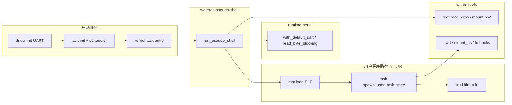

# wateros-pseudo-shell — 架构关系

## 用途

说明伪 shell 在内核 bring-up 中的位置及依赖环规避策略。

## 关系图

## 环依赖规避

- **不依赖** `wateros-runtime` 聚合 crate（`mm-impl-sv39` → `runtime` 已存在）。
- 串口仅经 `wateros-runtime-serial` 薄层访问 UART。
- VFS/task/cred/mm 均为既有组件门面，不新增反向边。

## 与真实 syscall shell 的区别

| 维度 | pseudo-shell | BusyBox sh |
|------|----------------|------------|
| 输入 | 内核态 UART 轮询 | 用户态 read + syscall |
| 命令 | 硬编码子集 | 完整 shell |
| 用途 | 早期文件系统/ELF 烟雾测试 | 生产交互 |

## 修订

| 日期 | 说明 |
|------|------|
| 2026-06-29 | 初版 |
