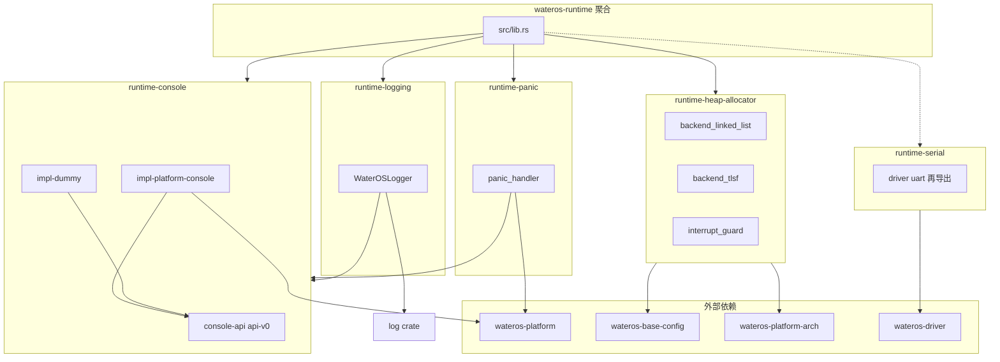

# wateros-runtime — 架构与模块关系

## 组件定位

`wateros-runtime` 提供内核**早期与全程**所需的 panic、控制台、开发日志、全局堆与可选串口，不包含任务调度或 syscall 分发。

## 目录结构

```text
os/components/wateros-runtime/
  Cargo.toml                    # workspace + 聚合 feature
  src/lib.rs                    # 再导出子模块
  runtime-panic/
  runtime-console/
    console-api/api-v0/
    console-impl/impl-dummy/
    console-impl/impl-platform-console/
  runtime-logging/
  runtime-heap-allocator/
  runtime-serial/               # optional
```

## 依赖关系



## Feature 接线

| 聚合 feature | 子 crate feature |
|--------------|------------------|
| `impl-platform-console` | `console/impl-platform-console`, `logging/impl-platform-console`, `panic/impl-platform-console` |
| `impl-dummy` | `console/impl-dummy`, `logging/impl-dummy`, `panic/impl-dummy` |
| `impl-*`（日志级别） | `logging/impl-*` |
| `serial-uart-virt` | `dep:runtime-serial` |

堆分配器在 **子 crate** 内选择：`impl-linked-list-allocator`（默认）或 `impl-tlsf`（互斥）。

## 与根 crate 的边界

- `wateros` 挂接 `runtime::panic::panic_handler` 与 `heap_allocator::handle_alloc_error`。
- 引导顺序由 `os/src/main.rs` 决定；runtime 聚合层**不**强制 `init` 调用顺序。
- `runtime-logging` 与 `wateros-klog` **零依赖**。

## 修订

| 日期 | 说明 |
|------|------|
| 2026-06-29 | 初版导出 |
