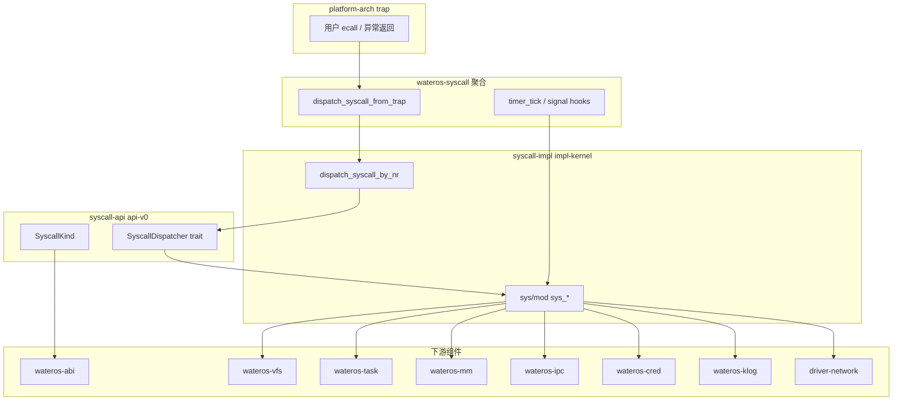

# wateros-syscall — 架构关系

## 用途

描述 syscall 组件在内核中的位置、子 crate 分层与 trap 接线。事实来源：`os/components/wateros-syscall/**`、`platform-arch` trap 处理。

## 分层

## 分发路径

1. **热路径**：裸 `syscall_nr` → `syscall_nr_dispatch.rs` 单次 match → `KernelSyscallDispatcher::dispatch_*` → `sys_*`。
2. **旁路**：`dispatch_syscall_aliases` 处理号表未收录但 Linux 常用的号（`statx`、`faccessat2` 等）。
3. **契约路径**：`api-v0::SyscallDispatcher::dispatch_syscall_from_trap` 经 `SyscallKind::decode`（供 trait 默认实现与测试）。

## impl-kernel 内部模块

| 模块 | 职责 |
|------|------|
| `sys/` | 各 `sys_*` 按 Linux 调用分文件 |
| `user_copy` | 用户地址安全拷贝 |
| `vfs_util` | `VfsError` → `ErrNo` |
| `poll_engine` | poll/ppoll/select 共享等待 |
| `epoll_fd` / `socket_fd` | 匿名 fd 侧表 |
| `unix_sock` | AF_UNIX 实现 |
| `fallible_buf` | 可失败内核缓冲分配 |
| `linux_stat` / `stat_times` | stat/statx 布局与时间戳覆盖 |

## 依赖约束

- `impl-kernel` 依赖 `abi`、`vfs`、`task`、`mm`、`ipc`、`cred`、`klog`、`driver` 等；**不被** `runtime` 反向依赖。
- `pseudo-shell` 不经过 syscall 聚合层执行命令（直接调 VFS/task），但用户程序经 trap 进入本组件。

## 修订

| 日期 | 说明 |
|------|------|
| 2026-06-29 | 初版 |
