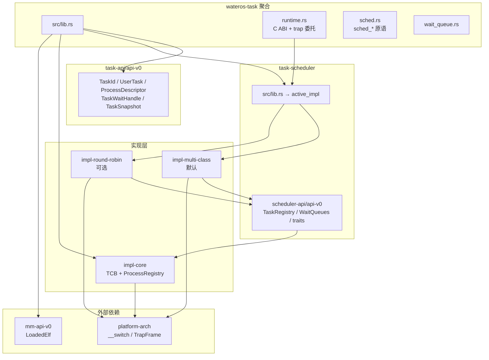

# wateros-task — 架构与模块关系

## 用途

描述任务子系统内 API、调度实现与 TCB/进程 registry 的边界与数据流。事实来源：`os/components/wateros-task/**`。

## 分层总览



## 职责边界（不变量）

| 层 | 负责 | 不负责 |
|----|------|--------|
| **api-v0** | 跨 crate 语义类型、等待句柄、进程快照形状 | TCB 字段布局、就绪顺序 |
| **impl-core** | 单任务资源（栈、trap 帧、bootstrap）、进程 registry | 全局就绪队列、tick 推进 |
| **scheduler-api** | TCB 表、等待/睡眠/退出队列、切换指针对 | 定义 `TaskControlBlock` 内部 |
| **scheduler-impl** | 选下一个 runnable、`ScheduleReason` 解释、`__switch` 调用 | 用户页表分配（交 MM） |
| **聚合 lib.rs** | 组合 spawn+registry、syscall 友好再导出、trap 入口注册 | 具体轮转/RT 算法 |

## TaskId 编码

`scheduler-api/registry.rs` 使用 **slot + generation**：

- 低 32 位：表槽索引
- 高 32 位：世代号（reap 后递增，防止 ABA）
- `IDLE_TASK_ID = 0` 固定槽，不参与 free list

## 上下文切换路径

```text
schedule_tick / yield / block / wait / exit
    → active_impl::schedule* (关中断 InterruptGuard)
    → TaskRegistry::take_current_switch_out + pick_next
    → arch::__switch(current_cx, next_cx)

run_first_task
    → prepare_first_switch (bootstrap_cx → first runnable)
    → __switch (不返回)

用户任务首次运行
    → TCB.task_cx → __arch_user_task_entry
    → __wateros_task_runtime_enter_current_user_task
    → restore trap frame → __wateros_arch_restore_user_task
```

## 等待队列模型

`WaitQueues`（与具体 run-queue 解耦）维护：

- 显式 `WaitQueueId` → `VecDeque<TaskId>`
- 按目标任务/父任务的退出等待表
- `blocked_queue`、`sleep_queue`（按 wake_tick 排序）、`wait_timeouts`
- `exited_queue`（待 reap）

就绪任务通过 `ReadyTaskSink::enqueue_ready_task` 回注具体实现（`OtherReadyQueue` / RT 队列）。

## 进程 vs 任务

```text
TaskId     — 调度器内部可运行实体（TCB）
ProcessId  — 用户可见进程（getpid/waitpid）
ThreadId   — 用户可见线程（gettid/futex）

ProcessRegistry（impl-core）
    维护 PID→PCB、task 列表、rlimit/nice/pgid/sid
    不参与 pick_next
```

spawn 路径：scheduler 创建 TCB → 聚合层 `create_process_for_task` → `enqueue_ready_task`。

## Feature 选择

```text
default = ["api-v0", "impl-core", "impl-multi-class"]

impl-multi-class ⊥ impl-round-robin  (compile_error 互斥)
```

## 修订

| 日期 | 说明 |
|------|------|
| 2026-06-29 | 初版导出 |
