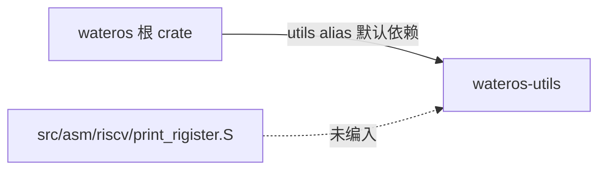

# wateros-utils — 架构

事实来源：`wateros-utils/Cargo.toml`、`src/lib.rs`。

## 组件结构



## 定位

- 单层 crate，无 `api-*` / `impl-*` 拆分
- 意图作为与 `wateros-base` 等平台类型解耦的工具层
- 当前仅 `src/lib.rs` 参与编译

## 依赖 DAG

```
wateros-utils（叶子，无依赖）
    ↑
wateros（根，default 引入）
```

不应反向依赖 `wateros-base`、`wateros-platform` 等，以免工具层卷入平台细节。

## 缺口

- 无子模块、无 feature 门控
- 汇编辅助文件孤立，未形成 riscv 调试子模块 API
