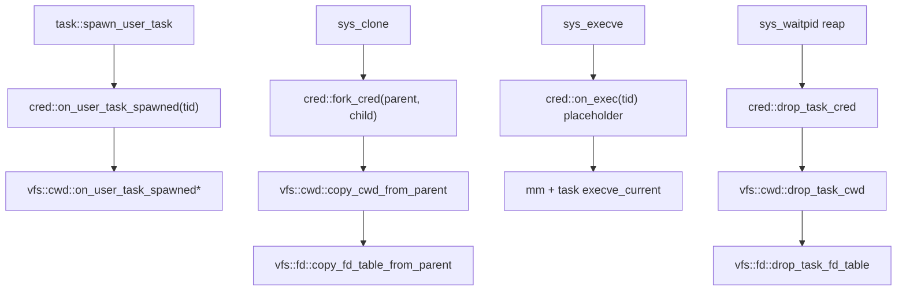

# wateros-cred 模块设计方案

## 用途与范围

本文档描述 **`wateros-cred`** 一级组件的设计方案，目标是在 WaterOS 中引入与 Linux `struct cred` 对齐的**进程凭证（credentials）**抽象，以支撑 BusyBox / musl / glibc 用户态对 `getuid` / `geteuid` / `getgid` / `getegid` / `getgroups` 等系统调用的自检。

**首版范围（MVP）**：

- 新建 `wateros-cred` 组件（api-v0 + impl-root），按 `TaskId` 侧表存储凭证。
- 实现上述 5 个 get* syscall；所有 ID 恒为 root（0）。
- fork 继承父凭证；execve 预留 `on_exec` 钩子（首版 no-op）。
- 权限检查 trait 占位（P1），impl-root 恒通过。
- VFS `fstat` 仍返回硬编码 `st_uid/st_gid = 0`（V1），但在三处代码位置留下 **ext4 inode 用户信息** 对接占位。

**明确不在首版**：

- 真实多用户、setuid/setgid 语义、capabilities 位图、namespace。
- VFS 路径权限检查（open/mkdir 等仍不校验 owner）。
- `prctl(PR_CAPBSET_*)` 迁移至 cred 模块（保留现有 syscall 桩，文档标明最终归口）。

## 事实来源

- 架构范式：`docs/prompts/architecture.md`、`docs/exports/architecture/module-relations.md`
- syscall 策略：`docs/roadmap/riscv64-busybox/busybox-phased-plan.md` §一
- 现有 per-task 资源模式：`os/components/wateros-vfs/src/cwd.rs`、`fd.rs`
- 现有 syscall 分发：`os/components/wateros-syscall/syscall-api/api-v0/`、`syscall-impl/impl-kernel/`
- 现有 stat 布局：`os/components/wateros-syscall/syscall-impl/impl-kernel/src/linux_stat.rs`
- ext4 inode 字段：`os/components/wateros-fs/fs-impl/impl-ext4/`

## 设计决策摘要

| 编号 | 议题 | 决策 |
|------|------|------|
| Q1 | 组件形态 | 新建一级组件 **`wateros-cred`**（方案 B） |
| Q2 | 存储 | **B2**：`TaskId → ProcessCredentials` 侧表（impl 内） |
| Q3 | 首版 syscall | **getuid/euid/gid/egid + getgroups(G1)** |
| Q4 | 失败策略 | 已实现 → 正常返回；未实现 → **panic**（`syscall_unsupported` / `dispatch_unknown`） |
| Q5 | getgroups | **G1**：`ngroups=0` 返回 supplementary 数量 `1`；写入 `[0]` |
| Q6 | VFS stat | **V1** 暂不改行为；三处代码占位（见 §VFS 对接占位） |
| Q7 | 生命周期 hook | **H2**：`task` 不依赖 `cred`；fork/exec/waitpid 在 syscall；spawn/reap 在 call site |
| Q8 | 权限框架 | **P1**：`has_cap` / `may_access` trait 占位，impl-root 恒 true |
| R1 | 首 spawn init | 接受与 vfs 同模式：`cred::on_user_task_spawned(tid)` 在 call site 调用 |
| R2 | set* 未实现 | **S-登记+显式 panic**：号表登记，`dispatch_set*` → `syscall_unsupported("setuid")` 等 |
| R3 | 无 cred 条目 | **M-panic**：`current_credentials()` 无条目时 panic，消息含 `tid` |
| R4 | getgroups 边界 | **E-minimal**：happy path 正常返回；其余情况 panic 并说明原因 |
| R5 | 命名 | 一级组件 **`wateros-cred`** |
| R6 | 占位范围 | 三处代码占位即可（§VFS 对接占位） |

## 组件目录结构

```
os/components/wateros-cred/
  Cargo.toml
  src/lib.rs                    # 聚合层，feature 选择 impl
  cred-api/api-v0/
    Cargo.toml
    src/lib.rs                    # Uid, Gid, ProcessCredentials, CredentialBackend, AccessCheck
  cred-impl/impl-root/
    Cargo.toml
    src/lib.rs                    # B2 侧表 + 恒 root 实现
```

与现有组件一致：

- **`cred-api/api-v0`**：稳定契约，不含平台/策略细节。
- **`cred-impl/impl-root`**：bring-up 阶段「全员 root」策略。
- **`src/lib.rs`**：根据 feature 导出统一门面函数。

## api-v0 类型与 trait

### 基础类型

```rust
/// Linux 语义下的用户 ID（32-bit，与 stat/syscall 返回一致）。
pub struct Uid(u32);

/// Linux 语义下的组 ID。
pub struct Gid(u32);

/// 进程凭证快照（对齐 Linux cred 子集；首版八 ID 相同均为 0）。
pub struct ProcessCredentials {
    pub real_uid: Uid,
    pub real_gid: Gid,
    pub effective_uid: Uid,
    pub effective_gid: Gid,
    pub saved_uid: Uid,      // 首版 = effective
    pub saved_gid: Gid,
    pub fs_uid: Uid,         // 首版 = effective；将来 VFS 访问检查用
    pub fs_gid: Gid,
    // supplementary_groups：首版固定 [Gid(0)]，getgroups G1
}
```

首版常量：

```rust
impl ProcessCredentials {
    pub const ROOT: Self = /* 全部 Uid(0)/Gid(0) */;
}
```

### CredentialBackend（生命周期）

```rust
pub trait CredentialBackend {
    /// 读取当前任务的凭证；无条目时由 impl 决定（impl-root：M-panic）。
    fn current(&self, tid: TaskId) -> ProcessCredentials;

    /// 新用户任务 spawn 后初始化（impl-root：写入 ROOT）。
    fn on_user_task_spawned(&mut self, tid: TaskId);

    /// fork 后复制父凭证到子任务。
    fn fork_cred(&mut self, parent: TaskId, child: TaskId);

    /// execve 后更新凭证（首版 no-op；将来解析 S_ISUID/S_ISGID）。
    fn on_exec(&mut self, tid: TaskId /* , exec_ctx */);

    /// 任务 reap 后删除侧表条目。
    fn drop_task_cred(&mut self, tid: TaskId);
}
```

### AccessCheck（P1 占位）

```rust
pub trait AccessCheck {
    /// 是否拥有指定 capability（首版 impl-root：恒 true）。
    fn has_cap(&self, cred: &ProcessCredentials, cap: Capability) -> bool;

    /// 是否允许对 inode 元数据执行 access 类操作（首版 impl-root：恒 true）。
    fn may_access_inode(
        &self,
        cred: &ProcessCredentials,
        inode_uid: Uid,
        inode_gid: Gid,
        mode: u32,
        access_mask: u32,
    ) -> bool;
}
```

`Capability` 枚举首版可只留 `Placeholder` 或少量 Linux cap 常量占位，impl-root 全部返回 `true`。

### 聚合门面（`wateros-cred/src/lib.rs`）

对外导出与 vfs 风格一致的薄包装：

```rust
pub fn on_user_task_spawned(tid: TaskId);
pub fn fork_cred(parent: TaskId, child: TaskId);
pub fn on_exec(tid: TaskId);
pub fn drop_task_cred(tid: TaskId);
pub fn current_credentials() -> ProcessCredentials;  // 内部取 current_task_id + backend
```

## impl-root 行为

| 操作 | 行为 |
|------|------|
| `on_user_task_spawned` | 侧表插入 `ProcessCredentials::ROOT` |
| `fork_cred` | `child` ← clone(`parent` 条目)；父无条目 → **panic**（含 parent tid） |
| `on_exec` | **no-op**（保留函数体与 `TODO(cred-exec-setuid)` 注释） |
| `drop_task_cred` | 移除侧表条目；不存在时 no-op 或 debug 日志 |
| `current` | 有条目 → 返回；无条目 → **panic**（含 tid，M-panic） |
| `has_cap` / `may_access_inode` | 恒 `true` |

侧表实现：`BTreeMap<TaskId, ProcessCredentials>` 或项目内已有的等价容器（`no_std` + `alloc`）。

## Syscall 接线

### 号表（`wateros-abi`）

在 `SyscallNumberTable` 与 `LinuxGeneric64` 中新增：

| 常量 | Linux generic64 号 | 首版 handler |
|------|-------------------|--------------|
| `GETUID` | 174 | 返回 `real_uid` |
| `GETEUID` | 175 | 返回 `effective_uid` |
| `GETGID` | 176 | 返回 `real_gid` |
| `GETEGID` | 177 | 返回 `effective_gid` |
| `GETGROUPS` | 155 | G1 语义（见下） |
| `SETUID` | 146 | `syscall_unsupported("setuid")` |
| `SETGID` | 144 | `syscall_unsupported("setgid")` |
| `SETREUID` | 145 | `syscall_unsupported("setreuid")` |
| `SETREGID` | 143 | `syscall_unsupported("setregid")` |
| `SETRESUID` | 147 | `syscall_unsupported("setresuid")` |
| `SETRESGID` | 149 | `syscall_unsupported("setresgid")` |

set* 族：**登记 + 显式 dispatch + panic**（R2），避免落入 API trait 默认 `ENOSYS`。

未列入上表的 identity syscall（如 `getresuid`）：仍走 `dispatch_unknown` → panic；strace 看到后再补登记。

### SyscallKind + Dispatcher

在 `syscall-api/api-v0` 增加对应 `SyscallKind` 变体与 `decode` 分支；在 `KernelSyscallDispatcher` 实现 `dispatch_getuid` 等。

建议新建 `syscall-impl/impl-kernel/src/sys/cred.rs`（或 `user_id.rs`），handler 调用 `cred::current_credentials()`。

### getgroups 语义（G1 + E-minimal）

| 条件 | 行为 |
|------|------|
| `size == 0` | 返回 supplementary 组数量 `1`（不写用户内存） |
| `size >= 1` 且 `list` 指针有效 | 向用户态写入 `[0]`（一个 `gid_t`），返回 `1` |
| `size < 0` | **panic**：`syscall_unsupported("getgroups: negative size")` |
| `list` 非 0 但 `copy_to_user` 失败 | **panic**：`syscall_unsupported("getgroups: EFAULT ...")` 或返回 EFAULT（实现时二选一并文档化；当前倾向 panic 并说明 copy 失败原因，与 R4 一致） |
| 当前任务无 cred 条目 | **panic**：`[cred] no cred for tid=...`（M-panic） |

panic 消息须包含：**syscall 名、失败原因、相关 tid/参数**，便于 bring-up 查缺补漏。

## 生命周期与调用点

与 **`wateros-vfs`** per-task 资源保持同模式：`task` crate **不**依赖 `cred`。



### call site 清单（spawn / reap）

与 vfs 相同位置需补 `cred::` 调用：

| 文件 | spawn | reap |
|------|-------|------|
| `os/src/user_bringup_busybox.rs` | `on_user_task_spawned(tid)` | `drop_task_cred(e.id)` |
| `os/src/self_tests/task.rs` | 同上 | 若 reap 则同上 |
| `os/components/wateros-pseudo-shell/src/lib.rs` | 同上 | 同上 |
| `os/components/wateros-syscall/.../sys/task.rs`（waitpid） | — | `drop_task_cred` |
| `os/components/wateros-syscall/.../sys/clone.rs` | — | `fork_cred` |
| `os/components/wateros-syscall/.../sys/execve.rs` | — | `on_exec` |

**注意**：内核 runner（`spawn_kernel_task`）不初始化 cred；若误调 get* syscall 且无条目，M-panic 暴露 wiring 错误。

## VFS 对接占位（V6 / R6）

首版 **不**改变 `fill_linux_stat` 行为（仍 `st_uid/st_gid = 0`）。以下三处须留 `TODO(cred-vfs)` 注释，说明后续工作与原因。

### 占位 1：`linux_stat.rs` — `fill_linux_stat`

```rust
// TODO(cred-vfs): st_uid/st_gid 当前硬编码 0。
// 后续应从 VfsMetadata 读取 ext4 inode owner，并结合 cred.fs_uid/fs_gid
// 决定 stat 返回值（Linux 语义）或 access 检查时的 effective id。
st_uid: 0,
st_gid: 0,
```

### 占位 2：`impl-ext4` — inode → `VfsMetadata`

ext4 inode 已含 uid/gid 字段，尚未完整上传到 `VfsMetadata`。后续需：

- 在 ext4 读 inode 时填充 `VfsMetadata.owner_uid / owner_gid`（字段名实现时定）。
- 文档引用本文 §「VFS 对接占位」。

### 占位 3：`sys/execve.rs` — setuid 位

```rust
// TODO(cred-exec-setuid): exec 可执行文件若带 S_ISUID/S_ISGID，
// 应按 Linux 规则更新 ProcessCredentials（effective/saved/fs id）。
// 依赖占位 2 的 inode mode/owner 信息。
cred::on_exec(current_tid);
```

`on_exec` 首版为 no-op，但调用点应存在，便于 strace 与后续填充。

## Feature 链

### `wateros-cred/Cargo.toml`

```toml
[features]
default = ["api-v0", "impl-root"]
api-v0 = ["cred-api-v0/api-v0"]
impl-root = ["api-v0", "cred-impl-root"]
```

### 根 `os/Cargo.toml`

在 `qemu-riscv64-opensbi` / `qemu-loongarch64-virt` feature 中增加：

```toml
cred = { package = "wateros-cred", path = "./components/wateros-cred/", ... }
"cred/api-v0",
"cred/impl-root",
```

### `wateros-syscall`

增加对 `wateros-cred` 的依赖（仅 impl-kernel 路径需要）；**不**让 `wateros-task` 依赖 `cred`。

## 与现有 prctl 桩的关系

`sys/task.rs` 中 `PR_CAPBSET_READ` / `PR_CAPBSET_DROP` 等 prctl 子集暂保留。P1 落地后：

- capabilities 的**权威语义**归 `cred-api` 的 `AccessCheck::has_cap`。
- prctl handler 将来可转调 `cred`；首版不迁移，避免 scope 膨胀。
- 在 `cred-api` 模块文档注明此归口关系。

## 实现检查清单

按建议顺序实施：

1. [ ]  scaffold `os/components/wateros-cred/`（Cargo workspace 成员、`src/lib.rs`）
2. [ ] `cred-api/api-v0`：类型 + trait + 模块级 `//!` 说明
3. [ ] `cred-impl/impl-root`：B2 侧表 + M-panic
4. [ ] `wateros-abi`：号表常量（get* + set* 登记）
5. [ ] `wateros-syscall`：`SyscallKind`、decode、`sys/cred.rs`、dispatcher
6. [ ] `sys/clone.rs`、`sys/execve.rs`、`sys/task.rs`：生命周期 hook
7. [ ] bring-up / pseudo-shell / self_tests：spawn & reap call site
8. [ ] 三处 VFS/exec 占位注释
9. [ ] `os/feature-tree.txt` 与 `docs/exports/features/wateros-cred.md`（实现完成后导出）

## 验收标准

1. BusyBox bring-up 调用 `getuid/geteuid/getgid/getegid/getgroups` **不 panic**，均返回 0 / G1 语义。
2. `fork` 后子进程 get* 仍返回 0（凭证已复制）。
3. 故意省略 `on_user_task_spawned` 时，get* **panic** 且消息含 `tid`。
4. 用户态调用 `setuid` **panic**，消息为 `[syscall] unsupported: setuid`（或等价）。
5. `fstat` 仍返回 `st_uid/st_gid = 0`（V1 回归不变）。

## 后续工作索引

| 优先级 | 工作项 | 触发条件 |
|--------|--------|----------|
| P2 | ext4 inode uid/gid → `VfsMetadata` | 需要 `ls -l` 显示真实 owner |
| P2 | `fill_linux_stat` 读 metadata | 与 P2 同步 |
| P3 | execve S_ISUID/S_ISGID | strace / setuid 测例 |
| P3 | VFS path permission（`may_access_inode`） | open/mkdir 权限拒绝 |
| P4 | capabilities 位图 + prctl 迁移 | 安全/容器测例 |
| P4 | setuid/setgid 真实现 | 显式实现 set* syscall 族 |

## 相关文档

- BusyBox 分阶段计划：`docs/roadmap/riscv64-busybox/busybox-phased-plan.md`
- syscall 功能快照（实现后同步）：`docs/exports/features/wateros-syscall.md`
- VFS per-task 模式参考：`docs/guides/filesystem-current.md`（cwd/fd 章节）
- 架构组件图（实现后更新）：`docs/exports/architecture/components.md`
