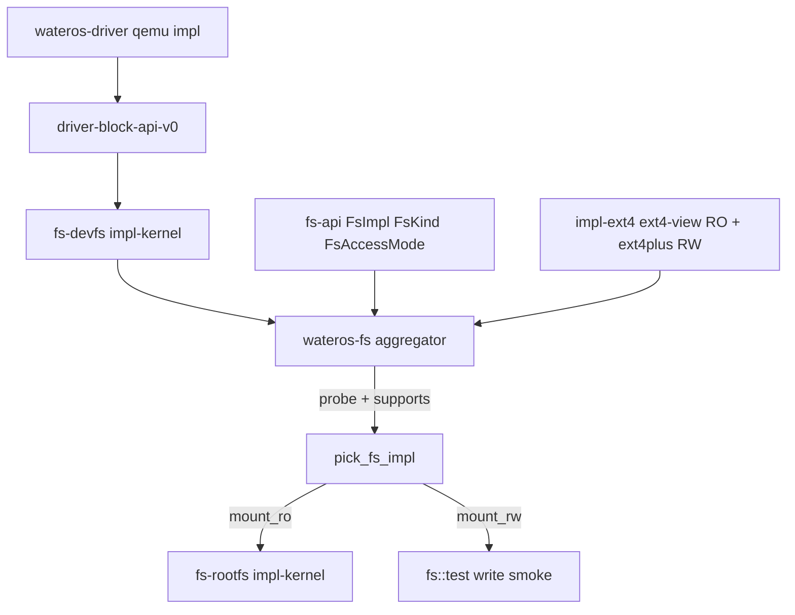

# WaterOS 文件系统组件现状说明

## 用途与范围

本文档面向需要了解 **当前内核 bring-up 阶段文件系统栈** 的开发者：说明 `wateros-fs` 一级组件的职责划分、默认 feature 下的数据流、对外入口（含 **`FsImpl` 注册表**）与已知缺口。叙述范围以 **`os/components/wateros-fs/`** 为主，并说明其与 **`wateros-driver`（块设备注册）**、**`wateros-vfs`** 的衔接关系：可选 **`vfs/bridge-fs-api`**（`wateros-vfs-impl-fs-bridge`）仅通过 **`wateros-fs`** 公开 API 做路径规范化后的单根委托与 RW 烟囱，**不是**统一 inode/dentry 或 syscall 级 VFS。

用户态 ELF 由 `wateros-mm` 的 `mm-impl/impl-sv39`（`kernel_elf`）经 `ReadOnlyFs::read` 从根卷读取；默认尝试路径为 `mm::kernel_mm::DEFAULT_USER_ELF_PATH`（可按镜像内容调整或放置文件）。

## 事实来源

以下路径为本文事实依据；若代码变更，应同步更新本文与 `docs/exports/features/wateros-fs.md`、`docs/exports/public-api/wateros-fs.md`，以及与 VFS 桥接相关的 `docs/exports/public-api/wateros-vfs.md`、`docs/exports/features/wateros-vfs.md`。

- 聚合与入口：`os/components/wateros-fs/Cargo.toml`、`os/components/wateros-fs/src/lib.rs`
- 通用 FS 契约（`ReadOnlyFs` / `ReadWriteFs` / `FsImpl` / `FsKind` / `FsAccessMode`）：`os/components/wateros-fs/fs-api/api-v0/src/lib.rs`
- 设备文件抽象：`os/components/wateros-fs/fs-devfs/`（`devfs-api`、`impl-kernel` / `impl-dummy`）
- 根卷管理：`os/components/wateros-fs/fs-rootfs/`（`rootfs-api`、`impl-kernel` / `impl-dummy`）
- ext4 实现（RO + RW 合一）：`os/components/wateros-fs/fs-impl/impl-ext4/src/{lib.rs,ro.rs,rw.rs,selftest.rs}`
- 内核启动接线：`os/src/main.rs`（在 `driver::active_impl::init_after_boot()` 成功后调用 `fs::init()` / `fs::test()`；默认 QEMU feature 下可再跑 `vfs::test()` 与 `vfs::bridge` RW 读回校验，见 `docs/exports/public-api/wateros-vfs.md`）
- QEMU 块设备（VirtIO-MMIO 实现）：`os/components/wateros-driver/driver-block/block-impl/impl-virtio-mmio/src/lib.rs`；DTB 枚举与注册：`os/components/wateros-driver/driver-impl/impl-qemu-riscv64-opensbi/src/lib.rs`

## 一级组件与目录结构

`wateros-fs` 采用 **workspace 内多 crate** 组织：根 package `wateros-fs` 聚合导出，子 crate 按 **api / impl** 拆分。

| 子区域 | 说明 |
|--------|------|
| `fs-api/api-v0` | 包名 `wateros-fs-api-v0`：FS 契约（`ReadOnlyFs` / `ReadWriteFs`）、能力描述（`FsKind` / `FsAccessMode` / `FsCapability` / `FsImpl`）、`SharedFs` / `SharedRwFs` 等 |
| `fs-devfs` | 包名 `wateros-fs-devfs`：设备节点路径与块设备查找（`DevFsManager`），并暴露 `KernelDevFsImpl: FsImpl` 仅供 supported_fs 列示 |
| `fs-rootfs` | 包名 `wateros-fs-rootfs`：根卷挂载与全局 `SharedFs` 句柄（`RootFsManager`），由聚合层注入选好的 `FsImpl` |
| `fs-impl/impl-ext4` | 包名 `wateros-fs-impl-ext4`：ext4 单一 impl，**RO 路径**基于 `ext4-view`、**RW 路径**基于 `ext4plus`（beta），对外暴露 `Ext4FsImpl` 与 `pub static IMPL` |
| `fs-impl/impl-dummy` | 占位（当前聚合层未作为默认根 FS） |
| `fs-impl/impl-devfs` | 历史/备用 impl 目录，主线 devfs 在 **`fs-devfs`** |

聚合层 `src/lib.rs` 不再用 `active_impl` 单选某 impl；而是通过 **静态注册表** `registered_fs_impls()` 按 cfg 静态拼接所有可用 impl，再由挂载流程按 `probe` + `supports(kind, mode)` 选择。

## Feature 与默认构建

摘自 `wateros-fs/Cargo.toml`：

- **`default`**：`api-v0` + **`impl-ext4`**（默认根卷为 ext4，RO+RW 同源）。
- **`api-v0`**：向下打开各子 crate 的 `api-v0` feature。
- **`impl-ext4` / `impl-dummy` / `impl-devfs`**：独立 feature 位，用于裁剪 impl crate 编译入。

`fs-devfs` 默认 **`impl-kernel`**（从 `driver_block_api_v0` 枚举块设备并生成 `/dev/vblkN`）。`fs-rootfs` 默认 **`impl-kernel`**（`mount_default_root`、`root_fs()` 等模块级入口；通过 `set_active_fs_impl(&dyn FsImpl)` 接受聚合层注入）。

## 启动阶段数据流（QEMU RISC-V 典型路径）

1. **`driver::active_impl::init_after_boot()`**（如 `impl-qemu-riscv64-opensbi`）：DTB 扫描、初始化 virtio-blk、**`register_block_device`**，随后 **`devfs::active_impl::refresh()`**。
2. **`fs::init()`**：
   - 打印 `[fs] supported: ...` 一行（来自 `supported_fs_summary()`）；
   - 再次 **`devfs::active_impl::refresh()`**；
   - 取 **`default_root_block_path()`** 与对应 **`SharedBlockDevice`**；
   - 遍历 **`registered_fs_impls()`** 调 **`probe(&device)`**；首个返回 `Some(kind)` 且 `supports(kind, ReadOnly)` 的 impl 被选中，调用 **`rootfs::active_impl::set_active_fs_impl(imp)`**；
   - 调用 **`mount_default_root()`**：内部经 **`imp.mount_ro(device)`** 得到 `SharedFs`，写入全局；
   - 挂载成功后：打印 **`/`**、枚举 **`list_nodes()`** 设备路径，并对根卷调用 **`ReadOnlyFs::boot_dump_all_paths()`**（ext4 上 DFS 打印 `[fs::boot-tree]` 路径）。
3. **`fs::test()`**：
   - 调用 `fs-api` 的样例自检；
   - **`impl_ext4::ro_self_test(root_fs)`**：固定路径元数据 / 文本前缀读 / ELF 头解析；
   - **`pick_fs_impl(Ext4, ReadWrite)`** 取得 RW impl，对当前根设备 **`mount_rw`** → **`impl_ext4::rw_smoke_self_test(rw, "hello", b"hello")`**；
   - 再用 **现有只读句柄** `root.read("/hello")` 校验内容（**`[fs::ext4][test] verify OK`**）。

根 crate **`os`** 通过 `fs = { package = "wateros-fs", ... default-features = true }` 依赖上述默认链。

## 架构关系（简图）

下列关系描述 **当前已实现** 的依赖与调用；可选 **`wateros-vfs`** 桥接层见 `docs/exports/features/wateros-vfs.md`（不在此图中展开）。

## 各层职责摘要

### `fs-api`

- **只读契约 `ReadOnlyFs`**：`mount`、`is_mounted`、`exists`、`metadata`、`read`；默认实现的 `read_prefix`、`read_to_string`；**`boot_dump_all_paths`**（默认空，ext4 实现覆盖）。
- **读写契约 `ReadWriteFs`**：`mount_rw`、`is_mounted`、`write_regular_file_at_root`。
- **能力描述**：`FsKind`（Ext4 / Ext2 / Ext3 / DevFs / Other）、`FsAccessMode`（ReadOnly / ReadWrite）、`FsCapability { kind, access }`。
- **统一注册接口 `FsImpl`**：`name() / supported() / supports(kind, mode) / probe(device) / mount_ro(device) / mount_rw(device)`；`probe` 与 `mount_rw` 有默认实现（不识别 / 不支持）。
- **句柄**：**`SharedFs = Arc<Mutex<LocalFs>>`** 包装 `Box<dyn ReadOnlyFs>`；**`SharedRwFs = Arc<Mutex<LocalRwFs>>`** 包装 `Box<dyn ReadWriteFs>`；当前阶段假定单核串行访问。
- **与驱动类型**：依赖 **`driver_block_api_v0::SharedBlockDevice`** 作为挂载输入。

### `fs-devfs`（`DevFsManager` + `KernelDevFsImpl`）

- **kernel 实现**：根据 **`block_device_count` / `block_device_at`** 重建 **`/dev/vblk{idx}`** 列表，并维护路径到 **`SharedBlockDevice`** 的映射；**`default_root_block_path`** 返回第一个块设备路径；DTB 列出但内核未支持的节点登记为 `DevNodeType::Unsupported`。
- **`KernelDevFsImpl: FsImpl`**：`name = "devfs"`、`supported = &[FsKind::DevFs RO]`；devfs 不挂在块设备上，因此 `probe` 始终返回 `Ok(None)`、`mount_ro` 返回 `Unsupported`，仅供 `supported_fs` 列示。

### `fs-rootfs`（`RootFsManager`）

- **kernel 实现**：维护静态 `ACTIVE_FS_IMPL: Mutex<Option<&'static dyn FsImpl>>`；**`set_active_fs_impl`** 由聚合层在 `probe` 命中后注入；**`mount_root_from_block_path`** 只调 `imp.mount_ro(device)`，不再 import 任何具体 ext4 crate。
- **全局状态**：**`Mutex<Option<SharedFs>>`** 保存当前根卷；**`root_fs()`** 克隆 **`Arc`** 供读取；**`current_root_device_path()`** 返回挂载时使用的设备路径，供 RW 自检复用。

### `impl-ext4`（合并的 ext4 实现）

- **RO 路径**（`ro.rs`）：`Ext4Fs` 对块设备做 `read_bytes` 适配 `ext4-view::Ext4Read`，实现 `ReadOnlyFs`；启动树打印 `walk_ext4_tree`。
- **RW 路径**（`rw.rs`）：`Ext4FsRw` 对块设备做按块读改写回的 `Ext4Read + Ext4Write` 适配，调用 `ext4plus::Ext4::load_with_writer`，实现 `ReadWriteFs`；`write_regular_file_at_root` 在根目录创建/覆盖普通文件。
- **`Ext4FsImpl`**（`lib.rs`）：`name = "ext4"`、`supported = &[(Ext4, RO), (Ext4, RW)]`、`probe` 通过读取 superblock magic `0xEF53` 判断是否 ext2/3/4。
- **错误映射**：RO 与 RW 各自把 `Ext4Error` / `ext4plus::error::Ext4Error` 映射到 `FsError`。
- **自检**：`ro_self_test` 读固定路径 `/src/bin/000_hello_world.rs`、`/elf/000_hello_world.elf`；`rw_smoke_self_test` 在根目录写入指定文件（自检脚本由聚合层串起来）。

## 与 `wateros-vfs` 的边界

当前 **`wateros-fs`** 栈提供 **「块设备 + devfs 路径 + ext4 根卷（RO+RW）」** 的 bring-up 能力。**`wateros-vfs`** 在启用 **`bridge-fs-api`** 时仅通过本组件**公开 API** 提供单根路径视图与 RW 烟囱（`SingleRootReadView` / `RootRwSession` 等），**仍不**提供统一 inode/dentry 或 syscall 级 `open/read`。若后续要做用户态或完整内核 VFS，需要在架构上扩展挂载表与 vnode，并明确与 **`ReadOnlyFs`/`SharedFs`** 的边界；超出本文档所述 bring-up 范围。

## 日志约定

- 聚合初始化：**`[fs]`**（含 `[fs] supported: ...` 列示）。
- ext4 挂载与测试：**`[fs::ext4]`**、**`[fs::ext4][test]`**。
- rootfs：**`[fs::rootfs]`**。
- devfs（子 crate 内）：**`[fs::devfs]`**。
- 启动路径遍历：**`[fs::boot-tree]`**。

日志应通过 **`wateros-runtime-logging`**（如 **`logging::info!`**），与内核其余模块一致。

## 验证方式

- 在 **`riscv64gc-unknown-none-elf`** 目标下对 **`wateros-fs`** 与 **`wateros`** 执行 **`cargo check`**（宿主 `x86_64` 直接 `cargo check` 可能因依赖链中的 RISC-V 内联汇编失败，属环境预期）。
- QEMU **`qemu-riscv64-opensbi`** 镜像：配置 virtio-blk 与带 ext4 的磁盘镜像后，观察启动期日志：`[fs] supported: ...`、`[fs] init: probe matched impl=ext4 kind=Ext4`、`[fs::boot-tree] /...`、`[fs::ext4][test] wrote /hello`、`[fs::ext4][test] verify OK`。

## 当前缺口与后续方向

| 方向 | 当前状态 |
|------|----------|
| 写路径稳定性 | RW 由 `ext4plus`（beta）承载，无完整 journal；仅用于 bring-up 与小文件测试 |
| 多挂载点、命名空间 | 仅单全局根卷句柄 |
| 与 `wateros-vfs` 统一 | 仅可选 **桥接**（路径委托 + RW 烟囱）；无多挂载 inode 树 |
| 字符设备 devfs | API 有 **`DevNodeType::Character`**，kernel devfs 当前主要填充块设备节点 |
| 错误与恢复策略 | 挂载失败仅打日志；无重试或备用根卷策略 |
| 并发 | `SharedFs` / `SharedRwFs` 使用互斥锁；多核策略未定义 |
| `FsKind` 细分 | 当前 `probe` 不区分 ext2/3/4，统一归并到 `FsKind::Ext4` |

## 后续维护入口

- 能力级一句话快照：`docs/exports/features/wateros-fs.md`
- 对外类型与入口列表：`docs/exports/public-api/wateros-fs.md`
- 新增 impl 的 Cargo 与聚合 checklist：`docs/exports/impl-guide/wateros-fs.md`
- 本文： **`docs/guides/filesystem-current.md`**（叙述型完整说明）
