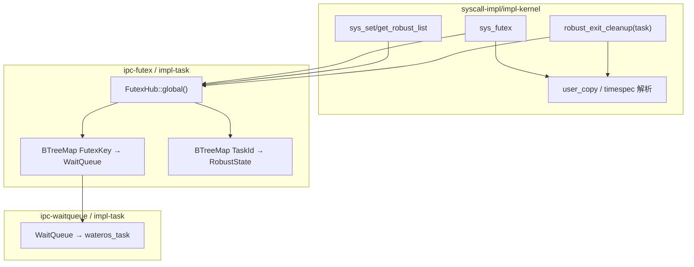
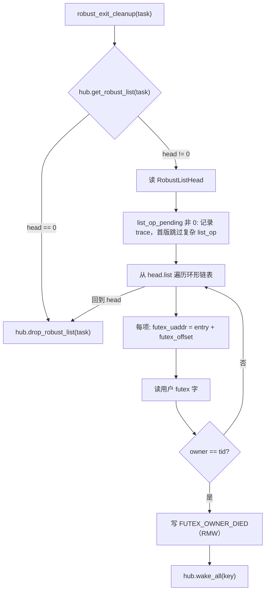

# ipc-futex `impl-task` 设计方案

## 用途与范围

本文档描述 **`ipc-futex`** 子组件 **`futex-impl/impl-task`** 的完整设计方案，目标是在 WaterOS 中落地基于任务等待队列的 futex 实现，并补齐 pthread / musl / BusyBox 所需的 **robust futex** 系统调用与线程退出清理语义。

**本方案覆盖（单 PR 闭环）**：

- 扩展 **`futex-api/api-v0`**：`KernelFutexOps`、错误枚举、`FutexKey`、robust 常量。
- 新增 **`futex-impl/impl-task`**：全局 `FutexHub`、等待队列表、per-task robust 状态表。
- 接线 **`wateros-ipc`** feature：`default` 与 `impl-riscv64` 均选择 `impl-task`。
- 重构 **`syscall-impl/impl-kernel`**：`futex` / `set_robust_list` / `get_robust_list` 委托 IPC；删除重复的 `FutexTable`。
- 在线程退出路径（`exit` / `exit_group` / `kill` / `execve` 杀线程）挂钩 **深清理** robust 链表。

**明确不在本方案首版**：

- 共享 futex（非 `FUTEX_PRIVATE`）的 inode/文件键空间。
- `FUTEX_REQUEUE` / `FUTEX_CMP_REQUEUE` / `FUTEX_WAKE_OP` 等扩展操作。
- 用户态 futex 原子 `cmpxchg` 专用 helper（首版用 syscall 串行 + read-modify-write 近似）。
- `futex` 被信号打断返回 `EINTR`（待信号子系统阶段 3 再统一）。
- `#[cfg(test)]` 可替换单例；测试通过聚合层 `test()` 与 bring-up 验收。

## 事实来源

- 架构范式：`docs/prompts/architecture.md`、`docs/prompts/coding.md`
- IPC 新增 impl 步骤：`docs/exports/impl-guide/wateros-ipc.md`
- BusyBox syscall 策略：`docs/roadmap/riscv64-busybox/busybox-phased-plan.md` §一、§二
- 现有 futex syscall（待迁移）：`os/components/wateros-syscall/syscall-impl/impl-kernel/src/sys/futex.rs`
- 现有 futex API 占位：`os/components/wateros-ipc/ipc-futex/futex-api/api-v0/`
- 等待队列参考实现：`os/components/wateros-ipc/ipc-waitqueue/waitqueue-impl/impl-task/`
- Pipe syscall 委托模式：`os/components/wateros-syscall/syscall-impl/impl-kernel/src/sys/pipe2.rs`
- 任务/线程模型：`os/components/wateros-task/`（`clone` 线程、`exit` / `kill_task` / `exit_group`）
- Linux generic64 号表：`os/components/wateros-abi/abi-impl/impl-linux-generic64/`

## 设计决策摘要

| 编号 | 议题 | 决策 |
|------|------|------|
| M1 | 总体路线 | **方案 2**：wait/wake 迁入 `impl-task`，syscall 变薄并委托 IPC |
| M2 | API 形态 | **选项 A**：扩展单一 trait `KernelFutexOps` |
| M3 | 用户内存 | **S1**：用户读写留在 syscall；impl 管队列与 per-task 状态 |
| M4 | 交付范围 | **B**：IPC + syscall + dispatch + 退出挂钩，单 PR 闭环 |
| M5 | robust 状态存储 | **2a**：`impl-task` 内 `BTreeMap<TaskId, RobustState>` |
| M6 | `get_robust_list` | **2b**：补 ABI 号 100、`SyscallKind`、dispatch、handler |
| M7 | 退出清理深度 | **深清理**：遍历用户链表、`FUTEX_OWNER_DIED`、wake |
| M8 | 退出触发路径 | **`sys_exit` + `sys_exit_group` + `sys_kill` + `execve` 杀线程** |
| M9 | 清理职责切分 | **拆**：syscall 遍历用户内存并写 `OWNER_DIED`；impl 负责 wake / 清状态 |
| M10 | 共享 futex | **4a**：非 private → `EINVAL`（首版不支持共享键空间） |
| M11 | `FutexKey` | **5b**：编入 `is_private`（来自 `FUTEX_PRIVATE_FLAG`） |
| M12 | `wait` 超时 | **7b**：`Option<TaskTick>`；映射 Linux `timespec` ABI |
| M13 | 超时 errno | 新枚举 **`FutexError::TimedOut`** → `ETIMEDOUT` |
| M14 | 零超时 | `timespec {0,0}` → 非阻塞复查，不入睡 |
| M15 | `TaskId` 类型 | **6a**：`futex-api` 依赖 `wateros-task-api-v0::TaskId` |
| M16 | 全局枢纽 | **`FutexHub::global()`** + **`spin::Mutex`** 保护内部表 |
| M17 | 测试单例 | **不做** `#[cfg(test)]` 可替换 mock |
| M18 | feature 默认 | **`default` 与 `impl-riscv64` 均选 `impl-task`** |

## 现状与问题

### 重复实现

`syscall-impl/impl-kernel/src/sys/futex.rs` 已内嵌：

- `BTreeMap<usize, WaitQueue>` 全局 futex 表
- `FUTEX_WAIT` / `FUTEX_WAKE`（含 bitset 变体）
- `wake_user_addr` 供 `set_tid_address` / `exit` 清理路径使用

当前 `ipc-futex` 已由 `impl-task` 提供实现，并通过统一 IPC feature 接入 syscall 依赖图。

### 缺失能力

| 能力 | 现状 |
|------|------|
| `set_robust_list` | `SyscallKind` 已解码；`impl-kernel` 未 override → API 默认 `syscall_unsupported` **panic** |
| `get_robust_list` | ABI 号表、解码、dispatch **均未登记** |
| robust 退出清理 | `KernelFutexOps::on_thread_exit_robust` 为占位 `Nosys` |
| `futex` 超时 | 当前 WAIT **永久阻塞** |

### 目标架构



## 组件目录结构

```
os/components/wateros-ipc/ipc-futex/
  Cargo.toml                          # 新增 impl-task feature；default → impl-task
  src/lib.rs                            # active_impl 切换；导出 FutexHub
  futex-api/api-v0/
    Cargo.toml                          # 新增 task-api 依赖
    src/
      lib.rs
      error.rs                          # + TimedOut
      key.rs                            # FutexKey { uaddr, is_private }
      ops.rs                            # 扩展 KernelFutexOps
      robust.rs                         # + FUTEX_OWNER_DIED 等常量
  futex-impl/
    impl-task/                          # 新增
      Cargo.toml
      src/
        lib.rs
        hub.rs                          # FutexHub + Mutex + 两张表
        robust.rs                       # RobustState（仅内核侧元数据）
```

## api-v0 契约

### `FutexKey`

```rust
/// 由用户 futex 地址与 private 标志派生的队列键。
#[derive(Clone, Copy, Debug, PartialEq, Eq, PartialOrd, Ord, Hash)]
pub struct FutexKey {
    pub uaddr: usize,
    pub is_private: bool,
}

impl FutexKey {
    pub const fn from_syscall(uaddr: usize, futex_op: u32) -> Self {
        const FUTEX_PRIVATE_FLAG: u32 = 128;
        Self {
            uaddr,
            is_private: (futex_op & FUTEX_PRIVATE_FLAG) != 0,
        }
    }
}
```

**语义**：

- `is_private == true`：键为 `(uaddr, private)`，与 Linux 进程私有 futex 一致。
- `is_private == false`：syscall 在进入 hub 前返回 `FutexError::Invalid`（映射 `EINVAL`）；首版不支持共享 futex 键空间。

### `FutexError`

在现有 `Again` / `Fault` / `Invalid` / `Nosys` 基础上新增：

```rust
/// 带超时等待超时（`ETIMEDOUT`）。
TimedOut,
```

syscall 层映射表：

| `FutexError` | `ErrNo` |
|--------------|---------|
| `Again` | `EAGAIN` |
| `Fault` | `EFAULT` |
| `Invalid` | `EINVAL` |
| `Nosys` | `ENOSYS` |
| `TimedOut` | `ETIMEDOUT` |

### `robust.rs` 常量

```rust
/// Linux `FUTEX_OWNER_DIED`。
pub const FUTEX_OWNER_DIED: u32 = 0x4000_0000;

/// 用户态 `struct robust_list` 中 `list` 指针字段大小（64-bit）。
pub const ROBUST_LIST_ENTRY_SIZE: usize = core::mem::size_of::<usize>();
```

保留现有 `RobustListHead`、`ROBUST_LIST_HEAD_SIZE == 24`。

### `KernelFutexOps`（扩展后）

移除默认占位的 `on_thread_exit_robust(list_head)`，改为显式 per-task 状态 API 与等待 API：

```rust
use task_api::TaskId;
use task_api::TaskTick;

pub trait KernelFutexOps: Sized {
    /// 在 `key` 上等待；`timeout == None` 表示永久等待。
    ///
    /// 调用方（syscall）须在 `wait_current_while*` 闭包内完成用户 u32 复查（S1）。
    /// impl 仅负责在条件仍成立时阻塞当前任务。
    fn wait(
        &self,
        key: FutexKey,
        expected: u32,
        timeout: Option<TaskTick>,
        condition: impl FnMut() -> bool,
    ) -> FutexResult<()>;

    fn wake(&self, key: FutexKey, max_wake: u32) -> FutexResult<usize>;

    fn wake_all(&self, key: FutexKey) -> FutexResult<usize>;

    /// 登记当前语义下的 robust 链表头；`len` 须等于 `ROBUST_LIST_HEAD_SIZE`。
    fn set_robust_list(&self, task: TaskId, head: usize, len: usize) -> FutexResult<()>;

    /// 读取 per-task robust 状态；无登记时返回 `(0, 0)`（与 Linux 一致）。
    fn get_robust_list(&self, task: TaskId) -> FutexResult<(usize, usize)>;

    /// 任务退出后删除 robust 侧表条目（在 syscall 完成用户态清理后调用）。
    fn drop_robust_list(&self, task: TaskId);
}
```

**关于 `wait` 的 `condition` 闭包**：

- 为在保持 **S1** 的同时复用 `ipc-waitqueue` 的 `wait_current_while_for_ticks`，将「读用户内存」闭包由 syscall 传入。
- impl 内部调用 `WaitQueue::wait_current_while_for_ticks(timeout, condition)`。
- `expected` 参数保留在签名中用于文档与断言；实际比较逻辑在闭包内完成。

> **备选简化**：若 trait 中 `FnMut` 对 `dyn`/对象安全不友好，`FutexHub` 可提供 inherent 方法承载闭包，`KernelFutexOps` 仅保留无闭包的 `wake*` / robust API。聚合层对外仍以 `FutexHub` 为入口。

### per-task 状态（impl 内部）

```rust
struct RobustState {
    head: usize,
    len: usize,
}
```

仅存 syscall 已校验过的 `(head, len)`；**不**在 impl 内缓存用户链表内容。

## impl-task：`FutexHub`

### 单例与并发

```rust
use spin::Mutex;

pub struct FutexHub {
    inner: Mutex<FutexTables>,
}

struct FutexTables {
    queues: BTreeMap<FutexKey, ipc_waitqueue::WaitQueue>,
    robust: BTreeMap<TaskId, RobustState>,
}

impl FutexHub {
    pub fn global() -> &'static FutexHub { ... }
}
```

- 使用 `spin::Mutex` 保护两张表（决策 **8a**，为多核扩展预留）。
- 单核下 syscall 串行，锁开销可接受。
- **不使用** `#[cfg(test)]` 注入替代单例；测试走 `ipc-futex::test()` 与真实 `global()`。

### `set_robust_list` / `get_robust_list`

**`set_robust_list(task, head, len)`**（impl 内逻辑）：

1. 若 `len != ROBUST_LIST_HEAD_SIZE` → `Invalid`。
2. `head == 0` 允许（清空语义由 `set` 写入或 `drop` 处理；Linux 允许设置空 head）。
3. 插入或更新 `robust[task]`。

**`get_robust_list(task)`**：

- 有条目 → `(head, len)`。
- 无条目 → `(0, 0)`。

syscall 侧额外校验（在调用 hub 前）：

- `head` 非零时，尝试 `copy_from_user` 读取 `RobustListHead` 前 8 字节（`list` 字段），失败 → `EFAULT`。
- `len` 由 syscall 参数传入，与 hub 存储值一致。

### `wait` / `wake`

从现有 `sys/futex.rs` 迁移核心逻辑：

- `get_queue(key) -> &WaitQueue`：`BTreeMap::entry(...).or_insert_with(WaitQueue::new)`。
- `wake`：`max_wake == 0` 时唤醒 **1** 个（保持与现内核行为一致）。
- `wake_all`：遍历唤醒全部 waiters（供 `wake_user_addr` / robust 清理使用）。

### 生命周期挂钩（impl 侧）

| 事件 | impl 行为 |
|------|-----------|
| `clone` 新线程 | **不继承** robust；新 `TaskId` 无条目，直至用户态 `set_robust_list` |
| `execve` 清线程 | 由 syscall 对被杀线程调用 `robust_exit_cleanup` 后 `drop_robust_list` |
| 任务退出后 | syscall 清理完成后 `drop_robust_list(task)` |

impl **不**订阅 task 回调；生命周期由 syscall / exec 路径显式驱动（与 `wateros-cred` H2 模式一致）。

## syscall 层设计

### 依赖与 feature

`syscall-impl/impl-kernel/Cargo.toml`：

- `ipc` 依赖增加 `ipc/futex`（可并入现有 `fd-session` 或独立 `futex-session` feature，与 `pipe` 同级）。
- `impl-riscv64` / `impl-loongarch64` 传递 `ipc/impl-riscv64` → `futex/impl-task`。

`wateros-ipc/Cargo.toml`：

```toml
[features]
default = ["api-v0"]                  # 聚合层按 feature 启用 impl-task
futex = ["dep:futex", "futex/api-v0", "futex/impl-task"]
impl-riscv64 = [
    "futex?/impl-task",
    ...
]
```

`ipc-futex/Cargo.toml`：

```toml
[features]
default = ["api-v0", "impl-task"]
impl-task = []
```

### `sys_futex` 行为

保留操作码常量与 `FUTEX_CMD_MASK` 解析，委托 `ipc::futex::FutexHub::global()`。

| cmd | 行为 |
|-----|------|
| `FUTEX_WAIT` | 读 `uaddr` u32；不等 → `EAGAIN`；相等 → `hub.wait(..., timeout_from_arg3)` |
| `FUTEX_WAIT_BITSET` | `bitset` 为 0 或全匹配视为无条件；`timeout` 取自 arg4（Linux ABI） |
| `FUTEX_WAKE` | `hub.wake(key, val)` |
| `FUTEX_WAKE_BITSET` | 同 WAKE（bitset 校验后） |
| `FUTEX_REQUEUE` 等 | `ENOSYS` |

**超时解析（5a）**：

- `timeout` 指针为 0 → `None`（永久等待）。
- 非 0 → `copy_from_user_struct::<timespec>` → 转为 `TaskTick`（与 `nanosleep` / `task` 层 tick 映射一致）。
- `sec == 0 && nsec == 0` → `Some(0)`，配合 `wait_current_while_for_ticks(0, ...)` 实现 **5c 非阻塞复查**。

**非 private futex**：

- `FutexKey::from_syscall` 后若 `!is_private` → 直接 `EINVAL`，不进入 hub。

### `sys_set_robust_list` / `sys_get_robust_list`

**ABI 登记（2b）**：

| 调用 | generic64 号 |
|------|----------------|
| `set_robust_list` | 99（已有） |
| `get_robust_list` | **100（新增）** |

**`set_robust_list(head, len)`**：

1. 取 `task::current_task_id()`，无 → `ESRCH`。
2. 校验 `len == ROBUST_LIST_HEAD_SIZE`，否则 `EINVAL`。
3. 可选：`head != 0` 时探测用户头可读。
4. `hub.set_robust_list(tid, head, len)` → 映射 `FutexError` → `UserRet`。

**`get_robust_list(head_out, len_out)`**：

1. 当前 tid。
2. `hub.get_robust_list(tid)` → 写回两个用户指针；写失败 → `EFAULT`。

`syscall-api/api-v0`：

- 新增 `SyscallKind::GetRobustList`。
- 默认 `dispatch_get_robust_list` 仍为 `syscall_unsupported`；`impl-kernel` override 为真实 handler。

### `robust_exit_cleanup(task_id)`（syscall 内部函数）

在线程**真正标记退出之前**调用（`exit` / `kill_task` / `exit_group` 杀线程 / `execve` 终止兄弟线程）。



**深清理细节（对齐 Linux 子集）**：

1. 从用户空间复制 `RobustListHead`（24 字节）。
2. `futex_offset` 来自头字段；遍历从 `head.list` 指向的第一个 `robust_list` 节点开始。
3. 环形链表：终止条件为回到 `head` 的 `list` 节点地址；设置最大步数防死循环（如 `ROBUST_LIST_LIMIT = 4096`），超出 → `trace` + 中止遍历。
4. 对每个节点：
   - `futex_uaddr = node_addr + futex_offset`（按 Linux，`futex_offset` 相对 `list` 成员）。
   - 读取当前 futex 值；若低 30 位表示的 owner 等于 `task_id`（Linux 以 `FUTEX_TID_MASK` 比较），则写入 `FUTEX_OWNER_DIED | (value & FUTEX_TID_MASK)`。
   - 首版无用户 `cmpxchg`：在 syscall 上下文串行执行 **read → compute → write**（单核与 syscall 互斥下可接受；文档标明与真 cmpxchg 的差异）。
5. 调用 `hub.wake_all(FutexKey { uaddr: futex_uaddr, is_private: true })`。
6. 最后 `hub.drop_robust_list(task)`。

**`list_op_pending`**：若非 0，首版记录 `log::trace!` 并跳过 `list_op` 执行（BusyBox 常规路径多为 0）；后续可对齐 Linux `handle_futex_death` 补全。

### 退出路径挂钩点

| 路径 | 挂钩方式 |
|------|----------|
| `sys_exit` | 在 `clear_child_tid` 处理之后、`task::exit_current` 之前，对**当前 tid** 调 `robust_exit_cleanup` |
| `sys_exit_group` | 对每个将被杀死的**兄弟线程**先 `robust_exit_cleanup(tid)`，再 `kill_task`；当前线程走 `sys_exit` 路径 |
| `sys_kill` | 若终止信号且目标非当前任务：在 `kill_task` 之前对**目标 tid** 调 `robust_exit_cleanup`；若杀当前任务：走 `exit_current` 统一路径 |
| `execve` | `terminate_other_threads_for_exec` 杀每个兄弟线程前调 `robust_exit_cleanup` |

抽取公共函数避免遗漏：

```rust
// sys/futex.rs 或 sys/robust.rs
pub(crate) fn robust_exit_cleanup(task_id: TaskId) { ... }

pub(crate) fn wake_user_addr(uaddr: usize) -> usize {
    let hub = ipc::futex::FutexHub::global();
    hub.wake_all(FutexKey { uaddr, is_private: true }).unwrap_or(0)
}
```

`wake_user_addr` 保留为 `task.rs` / `set_tid_address` 的既有入口，内部改为委托 hub。

### 删除重复代码

迁移完成后，从 `sys/futex.rs` **删除**：

- 本地 `FutexKey`、`FutexTable`、`TABLE` 静态表
- 直接 `use task::WaitQueue`

保留：操作码、`sys_futex` 入口、`wake_user_addr`、`robust_exit_cleanup`、robust syscall 入口。

## feature 与 workspace 变更清单

| 文件 | 变更 |
|------|------|
| `os/components/wateros-ipc/Cargo.toml` | workspace members 增加 `impl-task`；`futex` feature → `impl-task`；`default` / `impl-riscv64` 指向 `impl-task` |
| `os/components/wateros-ipc/ipc-futex/Cargo.toml` | 增加 `impl-task` 依赖与 feature |
| `os/components/wateros-ipc/ipc-futex/src/lib.rs` | `#[cfg(feature = "impl-task")]` 导出 `FutexHub` |
| `os/components/wateros-syscall/syscall-impl/impl-kernel/Cargo.toml` | `ipc/futex` feature 链接 |
| `os/components/wateros-abi/abi-api/api-v0/src/syscall_number.rs` | `GET_ROBUST_LIST` trait 常量 |
| `os/components/wateros-abi/abi-impl/impl-linux-generic64/src/lib.rs` | 号 100 |
| `os/components/wateros-syscall/syscall-api/api-v0/src/lib.rs` | `GetRobustList` decode + dispatch 槽 |
| `os/components/wateros-syscall/syscall-impl/impl-kernel/src/lib.rs` | `dispatch_set_robust_list` / `dispatch_get_robust_list` |

## 测试与验收

### 聚合层自检

`ipc-futex::test()` 串联：

1. `api_v0::test()`（robust 头 24 字节等）。
2. `FutexHub::global()`：`set/get_robust_list` 往返。
3. 同线程 `wake` 无 waiter 返回 0；`wait` + 另一上下文 `wake`（若单测可简化为直接 wake 已构造队列）。

### syscall / bring-up

| 用例 | 期望 |
|------|------|
| musl 初始化调用 `set_robust_list` | 返回 0，不 panic |
| `get_robust_list` 读回 | 与 set 一致 |
| 现有 futex WAIT/WAKE 冒烟 | 行为与迁移前一致 |
| `set_tid_address` + `exit` | 仍唤醒 waiters（`wake_user_addr`） |
| 持 robust 锁线程 `exit` | 等待者观察到 `FUTEX_OWNER_DIED`，被 wake |

### 文档同步（实现 PR 附带）

- `docs/exports/features/wateros-ipc.md`：futex 接入聚合层与 impl-task。
- `docs/exports/public-api/wateros-ipc.md`：导出 `FutexHub` / `KernelFutexOps`。
- `os/components/wateros-syscall/TODO.md`：`futex` / `set_robust_list` / `get_robust_list` 标为已实现。
- `docs/roadmap/todolist.md`：IPC futex 行更新。

## 实现顺序建议

1. **api-v0**：`FutexKey`、`FutexError::TimedOut`、`KernelFutexOps` 扩展、robust 常量。
2. **impl-task**：`FutexHub` + 表 + `set/get/drop_robust_list` + `wait/wake`。
3. **ipc-futex 聚合**：feature、`active_impl`、`test()`。
4. **wateros-ipc**：feature 传递、`impl-riscv64` / `default`。
5. **abi + syscall-api**：`GET_ROBUST_LIST` 号表与 decode。
6. **syscall**：迁移 `sys_futex`、新增 robust syscall、`robust_exit_cleanup`、退出路径挂钩。
7. **删除** syscall 内重复 `FutexTable`。
8. **文档与 bring-up** 验收。

## 风险与后续

| 风险 | 缓解 |
|------|------|
| 无用户 cmpxchg，robust 写 owner died 非原子 | 单核 + syscall 串行；文档标明；后续在 `mm` 增加 `cmpxchg_user` |
| `wait` trait 闭包对象安全 | 优先 inherent `FutexHub` 方法；trait 仅保留无闭包操作 |
| `exit_group` 遗漏某线程清理 | 统一 `robust_exit_cleanup` 辅助函数，所有杀线程路径强制经过 |
| 共享 futex 需求出现 | 在 `FutexKey` 扩展 file/inode 键，单独里程碑 |

## 相关文档

| 文档 | 用途 |
|------|------|
| [busybox-phased-plan.md](../roadmap/riscv64-busybox/busybox-phased-plan.md) | syscall 优先级与验收阶段 |
| [wateros-ipc impl 指南](../exports/impl-guide/wateros-ipc.md) | 新增 impl 检查清单 |
| [cred-module-design.md](./cred-module-design.md) | 同类「设计方案」文档结构参考 |
