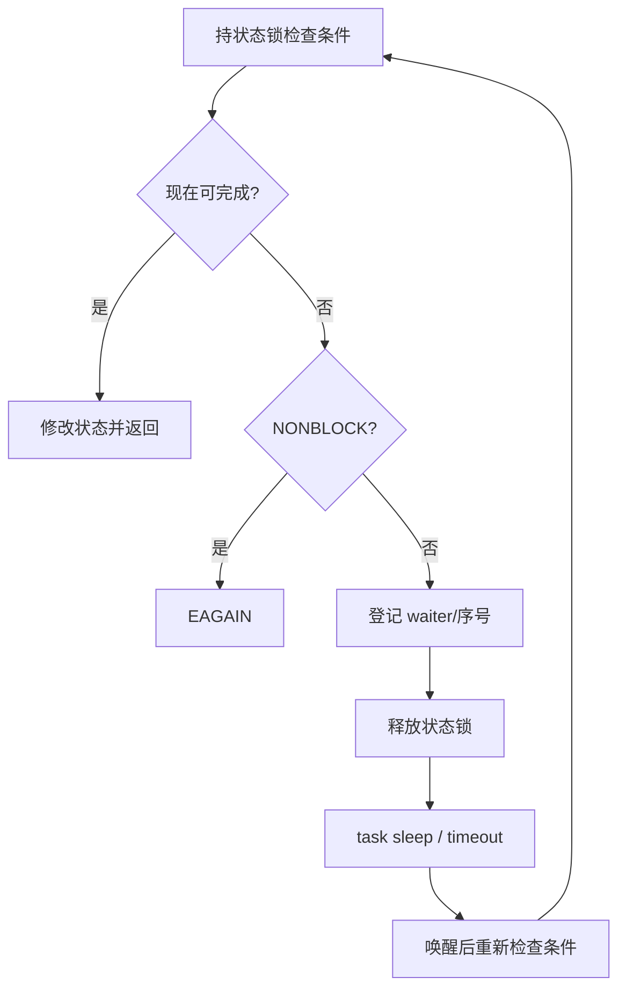

# 添加或补全一个系统调用

本章给出 WaterOS 当前 generic64 ABI 的完整落地路径。不要只添加 `sys_xxx` 函数：调用号、导出、
分发表、用户内存、生命周期、回归缺一项都可能让实现“能编译但不可用”。

## 修改点总览

```text
用户 ABI 调用号
  components/wateros-syscall/syscall-api/api-v0/src/number.rs
        ↓
领域 handler 与辅助结构
  components/wateros-syscall/syscall-impl/impl-kernel/src/sys/<domain>/*.rs
        ↓
领域 mod.rs 的 pub(crate) use
        ↓
syscall_nr_dispatch.rs 的稠密表
        ↓
必要的 MM/VFS/task/IPC/network 状态实现
        ↓
self_test / 用户态 smoke / QEMU workload
```

## 第一步：确认 ABI，而不是猜参数

记录以下信息：

- asm-generic64 调用号；RISC-V64 与 LoongArch64 在本项目中共用该编号集合。
- 每个参数的宽度、有符号性、指针方向和零长度语义。
- 结构体的 `repr(C)` 布局、对齐、保留字段和 32/64 位时间版本。
- flag 的已知位、互斥组合以及未知位应返回的 errno。
- 成功返回值、部分成功、阻塞/非阻塞、信号中断与 restart 语义。

调用号定义在
[`number.rs`](../../os/components/wateros-syscall/syscall-api/api-v0/src/number.rs)。若常量已存在，不要
重复定义。`SELECT = usize::MAX` 这类值表示 generic64 没有独立编号，不能放进稠密分发表。

## 第二步：选择领域和状态所有者

| syscall 类别 | handler 目录 | 真正状态通常位于 |
| --- | --- | --- |
| 文件、fd、路径、xattr | `sys/fs` | VFS/FS |
| clone/exec/wait/sched | `sys/task` | task，附带 MM/VFS/IPC/cred 生命周期 |
| mmap/brk/mlock | `sys/mem` | MM，文件映射还依赖 VFS |
| futex/signal/SysV IPC | `sys/ipc` | IPC + task/MM |
| socket | `sys/net` | network 或 syscall 的 AF_UNIX 状态 |
| poll/epoll | `sys/poll` | `poll_engine.rs`、fd handle readiness |
| clock/timer | `sys/time` | platform timer、task/signal timer 状态 |
| uid/gid/capability | `sys/cred` | cred registry |

handler 只做 ABI 解码、校验、用户复制、领域调用和 errno 映射。跨调用长期存在的 map、queue、counter
不应以新的 syscall 层全局变量临时保存，除非该机制本来就由 syscall 组合层拥有。

## 第三步：实现统一签名

普通 handler 使用：

```rust
pub(crate) fn sys_example(args: SyscallArgs) -> UserRet {
    let first = args.arg(0);
    let user_ptr = args.arg(1);

    if first > EXAMPLE_MAX {
        return UserRet::from_error(ErrNo::EINVAL);
    }

    match backend_operation(first) {
        Ok(value) => UserRet::from_success(value),
        Err(error) => UserRet::from_error(example_error_to_errno(error)),
    }
}
```

规则：

- `ErrNo` 在内核内部保持正数，只在 `UserRet::from_error` 编码为负数。
- 不要对用户传入的长度直接 `vec![0; len]`；使用 `fallible_buf` 或 `try_reserve`，并设置 ABI 上限。
- 所有加法、乘法、页对齐、offset 转换使用 `checked_*`/`try_from`。
- 未知 flag 默认 `EINVAL` 或 ABI 指定错误；不能静默接受可能改变语义的位。
- 不支持的改变状态功能返回 `ENOSYS/EOPNOTSUPP`，不要返回成功。

## 用户指针模板

### 固定结构输入

先定义内核可验证的 ABI 结构：

```rust
#[repr(C)]
#[derive(Clone, Copy, Default)]
struct UserExample {
    value: u64,
    flags: u32,
    reserved: u32,
}
```

然后通过 `user_copy` 的结构或字节复制辅助函数读取。必须检查：

- 指针为零时该 syscall 是 `EFAULT`、查询模式还是合法空值；
- `reserved` 是否必须为零；
- 用户在复制后修改原内存不会影响已经校验的内核快照。

### 可变数组输入

```text
检查 count 上限
  -> checked_mul(count, size_of::<T>())
  -> 可失败分配内核缓冲
  -> copy_from_user
  -> 逐元素校验
  -> 执行操作
```

不要边持 registry 锁边逐元素复制。否则用户缺页可能进入 MM、调度或文件 I/O，形成锁序反转。

### 输出和部分结果

先构造完整内核值，再 `copy_to_user`。如果 ABI 允许部分结果，要明确“返回已复制个数”还是整体
`EFAULT`。消费型对象使用 reserve/finish：复制失败时 rollback，使 pipe/socket/eventfd 等数据仍可重试。

## 第四步：领域错误只转换一次

已有集中转换函数：

- [`vfs_util.rs`](../../os/components/wateros-syscall/syscall-impl/impl-kernel/src/vfs_util.rs)：`VfsError -> ErrNo`；
- [`mm_util.rs`](../../os/components/wateros-syscall/syscall-impl/impl-kernel/src/mm_util.rs)：`MmError -> ErrNo`；
- socket、futex、SHM 等在各领域文件内有专用映射。

不要先把底层错误编码为负数，再交给 `UserRet::from_error`。也不要把所有错误统一成 `EINVAL`；测试通常
依赖 `EBADF/EFAULT/EACCES/ENOMEM/EAGAIN/EINTR` 的区别。

## 第五步：导出和登记

1. 在领域 `mod.rs` 声明模块并 `pub(crate) use` handler。
2. 在
   [`syscall_nr_dispatch.rs`](../../os/components/wateros-syscall/syscall-impl/impl-kernel/src/syscall_nr_dispatch.rs)
   的 `arg_syscalls!` 中加入 `api_v0::NUMBER => sys::sys_example`。
3. 若 handler 没有标准签名，优先写很薄的本地 adapter；不要让整个热路径改成动态匹配。
4. 如果 syscall 可在 `EINTR` 后自动重启，更新同文件的 restartable 表并验证信号语义。

分发表大小当前是 `EPOLL_PWAIT2 + 1`。添加更大的合法调用号时，必须同步扩大上界，否则数组常量
初始化会越界或运行时永远落入 `ENOSYS`。

## 现有实例：`getcpu`

`getcpu(cpu_ptr, node_ptr, unused)` 展示了一个简单但完整的输出型 syscall：

1. 调用号 `GETCPU` 在 `number.rs`；
2. handler 位于 task/scheduler 领域；
3. 从 platform/task 获取当前逻辑 CPU；
4. 非零输出指针分别复制 `u32`，坏地址返回 `EFAULT`；
5. NUMA node 在当前非 NUMA QEMU 平台返回定义好的退化值；
6. `syscall_nr_dispatch.rs` 明确登记。

沿这条链阅读比复制某个 stub 更安全。若新功能需要长期状态，`getcpu` 不再是合适模板，应选择与
资源类型相近的已有实现，例如 fd 型看 `eventfd2/timerfd_create`，阻塞型看 pipe/futex，路径型看
`openat/readlinkat`。

## fd 型 syscall 的额外清单

创建新 fd 资源时至少回答：

- `VfsResourceKind` 是什么，poll readiness 如何计算；
- `read/write/ioctl/close/duplicate` 哪些操作有效；
- `O_NONBLOCK` 和 `O_CLOEXEC` 分别存在哪里；
- fork 后共享什么，exec 关闭什么，最后一个引用如何释放；
- 用户复制失败是否会消费资源状态；
- 达到 `RLIMIT_NOFILE` 或分配失败时，已创建对象如何回滚。

`FD_CLOEXEC` 属于 fd 槽位；`O_NONBLOCK/O_APPEND` 通常属于共享打开描述。混淆二者会导致 dup/fork
行为不符合预期。

## 阻塞型 syscall 的额外清单

典型协议：



必须覆盖正常 wake、超时、signal `EINTR`、对象关闭/删除和伪唤醒。只在睡眠前检查一次条件会产生
lost wakeup；持对象锁进入 scheduler 则可能死锁。

## 生命周期型 syscall 的额外清单

修改 clone/exec/exit 时画出资源表，逐项标注：创建、共享、复制、替换、退出、reap。当前主要 side
table 包括 fd/cwd、signal、credential、futex robust、timer、pidfd/epoll、地址空间和各类 IPC。

特别注意 exit 与 reap 不总是同一时刻：退出必须让等待者看到稳定的 exit 状态，但某些外围资源只有
父进程 reap 后才最终释放。不要在两处重复释放同一地址空间或句柄。

## 验证清单

### 编译与静态检查

```bash
make check ARCH=rv PROFILE=pre
make check ARCH=rv PROFILE=final
make check ARCH=la PROFILE=final
git diff --check
```

### 用户态最小测试

测试程序至少包含：

- 一条成功路径；
- 每个关键非法 flag；
- 空指针、跨页坏指针、零长度和最大允许长度；
- 资源耗尽与关闭后操作；
- 阻塞、非阻塞、timeout 和 signal interrupt；
- fork/exec/exit 后状态与资源计数。

不要只依赖 libc wrapper。必要时用内联汇编或 `syscall(2)` 直接发出编号，打印原始返回值和 errno。
项目现有入口是 `user/packages/operator-tools/src/syscall-transfer-smoke.c`。

### QEMU 回归层级

1. `MODE=shell` 运行单个最小程序；
2. 对资源型 syscall 连续运行两轮并比较 `/proc/meminfo`、fd/任务计数；
3. 运行相关 LTP case；
4. 运行所在测试组；
5. 最后运行 `make run ARCH=<arch> PROFILE=<profile>` 自动队列。

任何层级出现 panic、OOM、地址空间销毁告警或资源单调下降，都不能用“用例退出码 0”判定通过。

