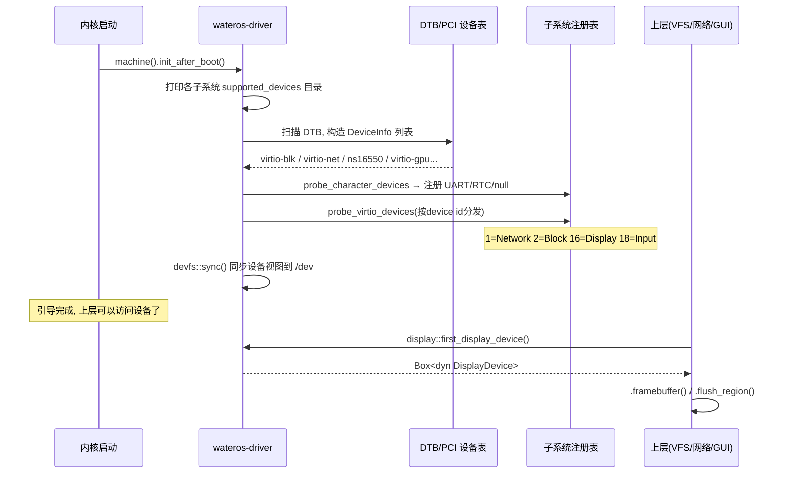

# wateros-driver：设备驱动

用"用户怎么用 + 数据结构 + 完整故事"的方式介绍 `wateros-driver`。一句话本质：

> **driver 模块 = 内核的"硬件翻译官"：负责在引导期扫描 DTB/PCI、认出有哪些设备（磁盘/串口/显卡/键盘/网卡）、把硬件能力包装成统一的 trait，供上层（VFS/MM/网络/syscall）使用。** 它是最底层——硬件之上、所有模块之下。

---

## 第一步：用户怎么用？

用户几乎**不会直接碰到 driver**——他们通过上层间接使用：

```c
// 用户看到的（其实底层都是 driver 在干活）
read(0, buf, 100);        // ← 串口(UART/NS16550) 驱动
open("/dev/fb0", ...);    // ← 显卡(VirtIO GPU) 驱动 + mmap
int fd = socket(...);     // ← 网卡(VirtIO net) 驱动
scanf(...);               // ← 键盘(VirtIO input) 驱动
```

用户视角是"读串口、开显卡、上网"。内核视角是：**这些能力都来自五个设备子系统**——`block`（磁盘）、`character`（串口/时钟）、`display`（显卡）、`input`（键盘/鼠标）、`network`（网卡）。

---

## 第二步：核心数据结构——MachineDriver 与设备模型

`driver-api/api-v0` 定义跨子系统共享的数据模型：

```rust
pub enum DeviceType {         // 统一设备分类
    Block, Character, Network, Display, Input, Unknown,
}

pub struct DeviceInfo {       // 一次扫描结果
    node_name: ..., compatible: ...,  // DTB compatible 列表
    dev_type: DeviceType,
    mmio: MmioRegion, irq: IrqLine,   // MMIO 区间 + 中断线
}

pub struct SupportedDeviceEntry { ... }  // 子系统声明"我能绑定什么"

pub trait MachineDriver {     // 机器级契约
    fn init_after_boot(&self);
    fn realtime_ns(&self);
    // ...
}
```

再配五个**领域 trait**，每个子系统一个（驱动只暴露硬件能力，不碰 syscall/errno）：

| 子系统 | 领域 trait | 暴露能力 |
|---|---|---|
| block | `BlockDevice` | 按 LBA 块读写；`BlockCacheManager` 写穿 LRU 缓存 |
| character | `CharacterDevice` / `SerialPort` | 字符流读写 + poll；NS16550 串口 |
| display | `DisplayDevice` | `FramebufferInfo` + 借帧缓冲 + `flush()`/`flush_region()` |
| input | `InputDevice` | 非阻塞 `pop_event()` 返回 evdev 三元组 `RawInputEvent` |
| network | `NetworkDevice` | L2 帧 `send`/`receive` + `mac_address`/`mtu`/`is_link_up` |

**分层原则**（README 强调）：驱动只"描述硬件能力并暴露领域 trait"，**不解析 syscall 号、不把错误转 errno**——ABI 与用户指针都留在 syscall 层。这是"驱动不掺和系统调用"的清晰边界。

---

## 第三步：一个完整故事（引导期扫描 → 注册 → 上层使用）



**绑定过程**：DTB 节点 → 与各子系统 `supported_devices()` 的 `compatible` 匹配（如 `virtio,mmio`、`ns16550a`、`pci1af4,10xx`）→ 构造具体设备（如 `VirtioGpuMmioDevice::from_mmio`）→ 注册进子系统注册表 → 上层用子系统公共 API 取用。

**`machine()` 三选一**（`driver-impl`）：QEMU RISC-V、QEMU LoongArch64 virt、或 dummy 占位。上层只依赖 `MachineDriver` 契约，不感知具体平台——换平台不用改上层。

---

## 第四步：几个关键实现细节

**① VirtIO device id 分发**

```
1 → Network    2 → Block    16 → Display    18 → Input
```

扫描时按 device id 分发到对应子系统；也可按 `compatible` 精确匹配。`display`/`input` 需要 `gui` 或 `user-graphics` feature 显式启用（两者互斥），**默认比赛构建不探测 GPU/输入设备**。

**② DMA 内存必须物理连续**

各实现用 `Hal::dma_alloc` 向 frame allocator 申请**连续物理帧**；不连续时整体回滚返回错误。这是硬件 DMA 的硬性要求。

**③ 块缓存加速**（`BlockCacheManager`）

写穿 LRU 包装任意 `BlockDevice`：连续未命中合并为单次底层读、读数据二次命中才准入（避免顺序扫描污染缓存）、`capacity_blocks` 为 0 时透传。

**④ 输入设备自动识别**

初始化时查询设备名 + `EV_REL`/`EV_ABS` 能力位图 + 绝对轴范围，自动判断 `Keyboard`/`Pointer`/`Unknown`，供 devfs 建 `keyboard0`/`pointer0` 别名。非阻塞 + 轮询友好：GUI/evdev 轮询任务无事件时 sleep，不忙等。

**⑤ 失败只记日志，不向上报错**（当前契约）：`init_after_boot` 里设备探测失败只打 warning，不中断启动——缺网卡/缺 GPU 内核照常跑。

---

## 对应回 WaterOS 代码

| 概念 | 代码位置 |
|---|---|
| 公共数据模型（`DeviceType`/`DeviceInfo`/`MachineDriver`） | `driver-api/api-v0/src/lib.rs` |
| 块设备（VirtIO + 缓存 + dummy） | `driver-block/` |
| 字符设备（UART/RTC/null） | `driver-character/` |
| 显示设备（VirtIO GPU + 帧缓冲刷新） | `driver-display/` |
| 输入设备（VirtIO 键盘/平板） | `driver-input/` |
| 网络设备（VirtIO 网卡） | `driver-network/` |
| 机器驱动（dummy / DTB / QEMU RV/LA） | `driver-impl/` |

---

## 一句话串起来

> 用户通过 `/dev`、`read`、`socket`、`mmap` 间接用硬件。内核在引导期用 `MachineDriver::init_after_boot` 扫描 DTB/PCI，按 `DeviceType` 和 `compatible` 把硬件实例化成 `BlockDevice`/`CharacterDevice`/`DisplayDevice`/`InputDevice`/`NetworkDevice` 等**领域 trait**，注册进子系统注册表并同步到 devfs。上层只依赖这些 trait 和 `machine()` 单例，**不碰具体 transport**。**扫描 → 匹配 → 注册 → 上层取用**，就是 driver 的全部；驱动只讲硬件能力，不掺和 syscall 和 errno。

这样 driver 就清晰了：**一套公共设备模型 + 五个领域 trait + 引导期扫描注册 + 与平台解耦的 `MachineDriver`**。也是理解"为什么上层代码换块显卡/换台机器不用改"的统一答案。

---

## 与其它组件的衔接

| 上层需求 | 依赖的 driver 子系统 | 衔接路径 |
|---|---|---|
| 控制台输入/输出 | `character`（UART） | tty → VFS 字符设备 → UART 驱动 |
| 磁盘文件 | `block`（VirtIO blk） | vfs/fs（ext4）→ 块设备 |
| 图形界面 | `display`（VirtIO GPU） | `/dev/fb0` → `DisplayDevice`（配合 mm 的设备 mmap） |
| 键盘/鼠标 | `input`（VirtIO input） | evdev → `InputDevice` |
| 网络 | `network`（VirtIO net） | network 协议栈 → `NetworkDevice`（L2 帧） |
