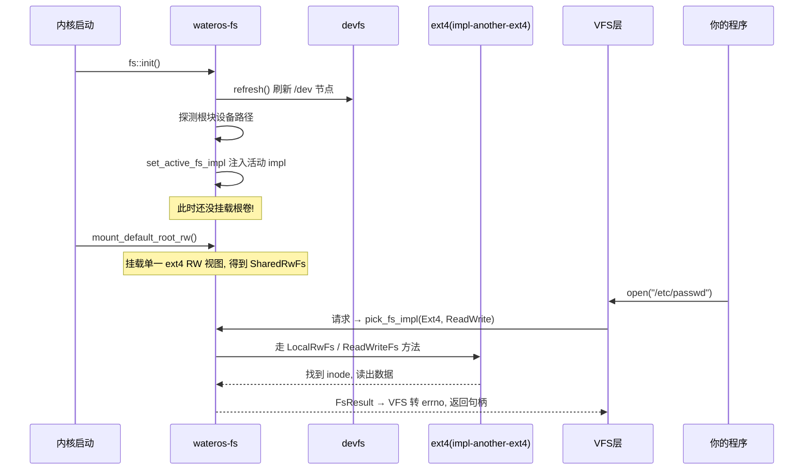

# wateros-fs：文件系统实现层

用"用户怎么用 + 数据结构 + 完整故事"的方式介绍 `wateros-fs`。一句话本质：

> **fs 模块 = 内核的"档案库管理员"：真正把字节存到磁盘/内存/伪文件里去的那些具体文件系统（ext4、ramfs、devfs、procfs），并维护一张"哪种请求用哪个实现"的注册表。** 它是上一讲 `vfs` 的**下层**——VFS 负责统一接口，fs 负责真正落地。

---

## 第一步：先分清 vfs 和 fs 的分工

这是最容易混淆的一点，先看分层：

```
你的程序 open("/etc/passwd", O_RDONLY)
        │
        ▼
  wateros-vfs  ← 统一句柄抽象 + fd表 + 挂载表(上次讲过)
        │  按 FsKind + FsAccessMode 挑实现
        ▼
  wateros-fs  ← 真正的文件系统: ext4 / ramfs / devfs / procfs
        │
        ▼
  wateros-driver ← 块设备/字符设备(下次讲)
```

- **VFS**：把一切包装成"打开的文件句柄"，不关心数据存在哪。
- **fs**：负责"数据到底怎么组织"——ext4 用 inode+块，ramfs 用物理页，procfs 用内核状态。
- **driver**：真正读写硬件（磁盘/串口）。

---

## 第二步：用户怎么用？

普通用户**不直接调 fs**，他们调 `open`/`read`，数据最终落到 fs。但内核视角里 fs 提供这几类"卷"：

| 伪卷 | 背后实现 | 特点 |
|---|---|---|
| `/` （根卷） | ext4（默认 `impl-another-ext4`） | 真磁盘，inode + 数据块 |
| `/dev` | devfs | 设备节点视图，实时刷新 |
| `/proc` | procfs | 进程/内核信息伪文件 |
| `/tmp` | tmpfs（基于 ramfs） | 纯内存，物理页当存储 |

用户无感知，但**路径经过 VFS 路由到不同 fs 实现**，这就是上一讲挂载表的底层落地。

---

## 第三步：核心数据结构——FsImpl 注册表

fs 用一套"能力声明 + 注册表"机制选实现（`fs-api/api-v0`）：

```rust
pub enum FsKind {                       // 是什么文件系统
    Ext2, Ext3, Ext4, DevFs, RamFs, Other(&'static str),
}

pub enum FsAccessMode { ReadOnly, ReadWrite }   // 能不能写

pub struct FsCapability { kind, access }        // "我支持什么"

pub trait FsImpl {                              // 聚合注册面
    fn name(&self) -> &'static str;
    fn supported(&self) -> &[FsCapability];
    fn supports(&self, kind, mode) -> bool;
    // LocalFs / LocalRwFs / ReadOnlyFs / ReadWriteFs 等方法
}
```

```
注册表 registered_fs_impls (按特性宏静态拼接)
  ├── ext4 族 (默认 impl-another-ext4)
  ├── ramfs
  ├── devfs
  └── procfs

请求来了:
  pick_fs_impl(kind, mode) → 在注册表里匹配一条
     同时支持 (FsKind, FsAccessMode) 的 impl
```

错误也统一成一个枚举（`FsError`）：`NotMounted`/`NotFound`/`NotAFile`/`Exists`/`NotEmpty`/`Unsupported`/`Driver`/`Corrupt`/`Io`/`NoSpace`。**实现方把底层 I/O 错误映射到这个稳定枚举**，上层（VFS）再转成 errno。

---

## 第四步：一个完整故事（启动挂载 + 读一个文件）



一个关键约定（README 强调）：`init` **只刷新 devfs、探测块设备、注入活动 impl，不挂载根卷**；真正挂载由 `mount_default_root_rw` 完成。启动顺序分开，便于测试和控制时机。

---

## 第五步：几种 fs 实现的特点

| 实现 | 说明 |
|---|---|
| `impl-another-ext4`（默认） | vendored `another_ext4`，固定 4096 块、同步块设备 trait、superblock magic `0xEF53`；带 lookup cache 和 negative cache |
| `impl-ext4-rs` / `impl-ext4` | 回退 feature，**互斥**，同时启用多个 ext4 后端编译期报错 |
| `impl-ramfs` | 物理页当 payload 的纯内存 fs；tmpfs 策略层基于它创建挂载实例 |
| `impl-devfs` | devfs 的 fs impl 适配 |
| `fs-procfs` | `/proc` 进程信息伪文件系统 |
| `fs-devfs` | 设备节点刷新、`lookup_block_device`/`lookup_character_device`、默认根块路径 |
| `fs-rootfs` | 维护"当前根卷"共享句柄（`ROOT_FS`/`ROOT_RW_FS`）、根设备路径、挂载代数 |

`SharedFs`/`SharedRwFs` 是**共享句柄**（`spin::Mutex` 保护），供 VFS 桥接层在锁内使用——仍是那句"调用方需保证访问边界"。

---

## 对应回 WaterOS 代码

| 概念 | 代码位置 |
|---|---|
| `FsImpl`/`FsKind`/`FsError`/共享句柄 | `fs-api/api-v0/src/lib.rs` |
| 注册表 / `init` / `mount_default_root_rw` / `pick_fs_impl` | `src/lib.rs` |
| ext4 默认后端 | `fs-impl/impl-another-ext4/`（回退：`impl-ext4-rs`/`impl-ext4`） |
| ramfs / tmpfs 基础 | `fs-impl/impl-ramfs/` |
| devfs / procfs / rootfs | `fs-devfs/`、`fs-procfs/`、`fs-rootfs/` |

---

## 一句话串起来

> 用户 open 一个文件，路径经 VFS 路由到 fs 层；fs 用一张 **`FsImpl` 注册表**（`FsKind` + `FsAccessMode` 声明能力），`pick_fs_impl` 挑出对应的真实现——ext4 管磁盘、ramfs 管内存、devfs 管设备节点、procfs 管内核信息。启动时先 `init`（刷新 devfs + 探测根块设备 + 注入 impl）再 `mount_default_root_rw`（挂载根卷），之后所有读写都走统一的 `FsError` 错误面。**VFS 管"统一接口"，fs 管"真正落地"**——两者分工清晰。

这样 fs 就清晰了：**一张能力注册表 + 四种卷实现 + 两段式启动（init 再 mount）+ 统一错误枚举**。也是理解"为什么一个文件系统层能同时挂 ext4、/proc、/tmp"的答案。
