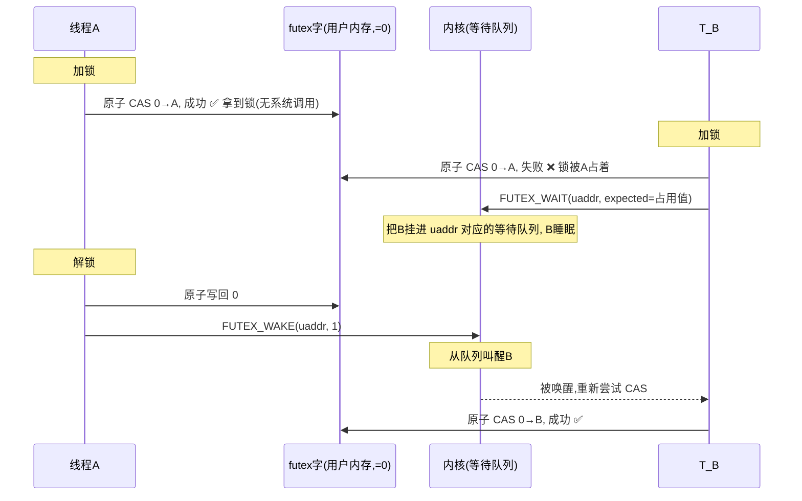
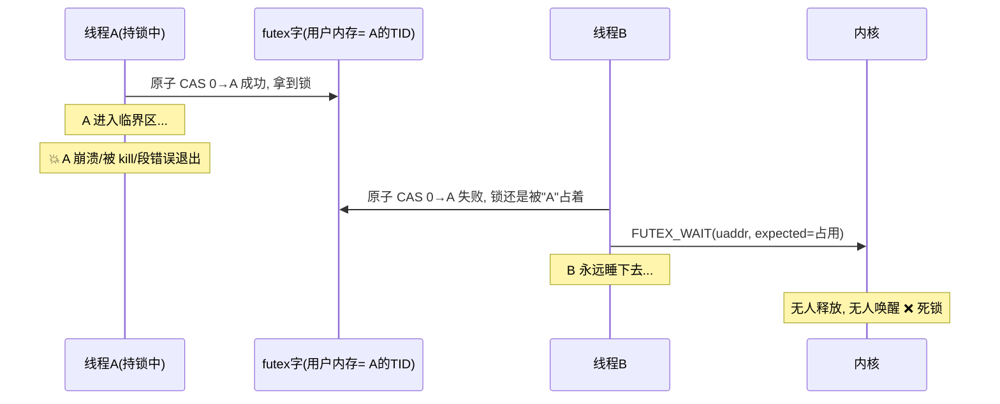
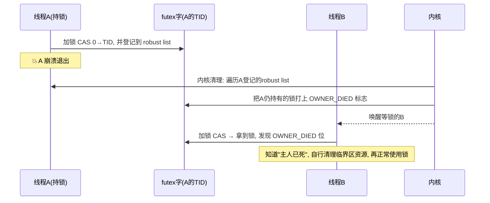

> **futex = 给"等锁"这件事提供睡觉和叫醒服务的内核原语。** 名字是 **fast userspace mutex**——重点在 *fast*，意思是大多数时候根本不用进内核。

---

## 第一步：用户到底怎么用它？

普通程序员**从不直接调用 `futex()`**。你写的是：

```c
pthread_mutex_lock(&m);   // 加锁
// ... 临界区 ...
pthread_mutex_unlock(&m); // 解锁
```

而 `pthread_mutex` 的底层实现（glibc）就是用 futex 搭起来的。所以**"用户怎么用 futex" = 用户怎么用互斥锁**。真正调 `futex(2)` 的是锁库，不是你的业务代码。

那把锁库的需求翻译成内核语言，其实就是三个问题：


| 锁库需要                         | futex 提供的                                   |
| ---------------------------------- | ------------------------------------------------ |
| 抢不到锁时，我不想空转浪费 CPU   | **FUTEX_WAIT**：把我睡眠，等锁释放了叫我       |
| 我释放锁了，得把等锁的人叫醒     | **FUTEX_WAKE**：叫醒一个（或一群）等这把锁的人 |
| 排队等锁时，得知道"等的是哪把锁" | 用**futex 字**（一个 32 位内存整数）做身份     |

---

## 第二步：futex 字——用户态唯一的"数据结构"

futex 的核心思想：**锁的状态放在用户内存里，由用户自己原子地维护，不劳烦内核。**

那把锁 = 一个 32 位整数，就放在 `uaddr` 指向的地址上：

```
uaddr ──▶ [ 32-bit futex 字 ]
```

- `0` → 锁是空闲的
- `非0`（比如持有者 TID）→ 锁被占用

加锁 / 解锁的**原子操作完全在用户态完成**（用 `atomic compare-and-swap`），**不用进内核**——这就是 "fast" 的来源：

```
线程 A 加锁：原子地把 0 改成 我的TID   ← 成功，拿到锁，全程没进内核！
线程 A 解锁：原子地把 TID 改回 0      ← 同样没进内核
```

只有**抢不到锁（要睡觉）**和**释放后叫醒别人**这两种情况才需要打扰内核。

---

## 第三步：一个完整的加锁/解锁故事

用两个线程抢一把锁举例，时序如下：



注意 `FUTEX_WAIT` 带的 `expected` 参数很关键：它说"**只有当我看到的锁状态还是我以为是的那样时，才去睡**"。内核会原子地检查：如果 futex 字已经不等于 `expected`（说明条件已变），就不睡、直接返回。这就是前面 `error.rs` 里 `Again`（`EAGAIN`）的由来。

---

## 第四步：内核里对应什么数据结构？

用户态只有一个 futex 字，那内核里得有地方记住"谁在等这把锁"。这就是你前面看的几个文件组合出来的：

```
用户 futex 字 (uaddr 指向的 int)
        │
        │ 派生出
        ▼
   FutexKey  ── 键：uaddr + 是否private + 地址空间   ← key.rs
        │
        │ 作为 key 查表
        ▼
   WaitQueue (等待队列)   ← 每个 key 对应一个队列
        │
        ├── Waiter A (睡眠中的线程 + 它的登记)
        ├── Waiter B
        └── ...
```

对应到 WaterOS 的代码：


| 概念               | WaterOS 里的东西                                                        |
| -------------------- | ------------------------------------------------------------------------- |
| futex 字           | 用户内存中的 32 位整数（syscall 层去读写）                              |
| 锁的身份           | `FutexKey`（`key.rs`）                                                  |
| 等待队列           | `WaitQueue`（在 `futex-impl` 的 `registry.rs`，委托给 `ipc-waitqueue`） |
| 睡眠的结果         | `FutexWaitOutcome`（`wait.rs`：被唤醒/条件已变/超时/被中断）            |
| 线程异常死了怎么办 | `RobustListHead` 登记（`robust.rs`），内核帮忙清锁                      |

---

## 第五步：为什么需要"两次条件检查"？

这是 futex 实现里最微妙的地方（对应 `readme.md` 里的调用链）。有个经典竞态：

```
线程B: 我要睡了（FUTEX_WAIT）
线程A: 在我睡着之前，把锁释放并调用了 FUTEX_WAKE  ← 这时我还没睡进队列！
线程B: 终于睡进去，但 A 的唤醒已经过去了，没人叫我了 → 永远睡着 ❌
```

解决方式（WaterOS 采用的就是这个方案）：**进内核后、真正睡眠前，再检查一次条件**；检查完到真正切换睡眠之间用 `wake_sequence` 计数器兜底——只要中间发生过 wake，sequence 变了，就放弃睡眠。这样任何时刻都不会"错过了唤醒还睡死过去"。

---

## 一句话串起来

> 用户用 `pthread_mutex` 加解锁，锁库底层用 futex。**锁状态 = 用户内存里的一个 int**，抢锁靠用户态原子操作（所以快）；**只有要睡/要叫人醒时才进内核**，内核用「futex 地址 → 等待队列」记着谁在等，`WAIT` 负责睡、`WAKE` 负责叫醒、`REQUEUE` 负责把排队的人挪到另一把锁的队列。

这样再回头看 `key.rs` 的 `FutexKey`、`error.rs` 的 `FutexError`、`robust.rs` 的登记，应该就都能对上了。如果还有哪一块卡住，告诉我具体是哪一句，我顺着给你拆。解决方式（WaterOS 采用的就是这个方案）：**进内核后、真正睡眠前，再检查一次条件**；检查完到真正切换睡眠之间用 `wake_sequence` 计数器兜底——只要中间发生过 wake，sequence 变了，就放弃睡眠。这样任何时刻都不会"错过了唤醒还睡死过去"。

---

## 一句话串起来

> 用户用 `pthread_mutex` 加解锁，锁库底层用 futex。**锁状态 = 用户内存里的一个 int**，抢锁靠用户态原子操作（所以快）；**只有要睡/要叫人醒时才进内核**，内核用「futex 地址 → 等待队列」记着谁在等，`WAIT` 负责睡、`WAKE` 负责叫醒、`REQUEUE` 负责把排队的人挪到另一把锁的队列。

这样再回头看 `key.rs` 的 `FutexKey`、`error.rs` 的 `FutexError`、`robust.rs` 的登记，应该就都能对上了。如果还有哪一块卡住，告诉我具体是哪一句，我顺着给你拆。

现在你已经懂了 futex 是"用 int 当锁、靠内核睡觉/叫醒"，那 robust 就好讲了——它是给这个机制**补一个致命漏洞**的补丁。

## 漏洞在哪？

回到上一轮的加锁故事。假如：



问题在于：**futex 字里的 TID 指向一个已经死了的线程**，锁永远变不回 0。等锁的线程就这么被饿死。

## robust 怎么补这个洞？

**Robust = 健壮/防死**。核心思路一句话：

> **锁的"持有者身份"是可验证的。** 一旦发现持有者线程已经死了，内核就主动站出来：把锁标记为"主人已死"，并唤醒等锁的人，让他们自己接管清理。

要做到这点，需要三件事配合，正好对应 `robust.rs` 里的常量：

### ① futex 字里塞进"死亡标志"

回顾 futex 字（32 位）的位布局——就是文件顶部的三个常量：

```
31           30          29                         0
┌──────────┬──────────┬─────────────────────────────┐
│WAITERS位  │OWNER_DIED│       持有者 TID (低30位)    │
│0x8000_0000│0x4000_0000│       FUTEX_TID_MASK       │
└──────────┴──────────┴─────────────────────────────┘
```

- 低 30 位：谁持有锁（TID）
- `FUTEX_OWNER_DIED`（`0x4000_0000`）：**"持有者已死"** ← robust 的核心标志
- `FUTEX_WAITERS`（`0x8000_0000`）：有人在等这把锁

### ② 线程登记"我持有哪些锁"——robust list

内核怎么知道一个死掉的线程手上有哪些锁？靠**每个线程自己登记一份链表**：

```
线程A 向内核登记 (set_robust_list)：
┌────────────────────────────────────────────┐
│  robust_list_head                          │
│   ├─ list:        → 链表头指针             │  ← RobustListHead
│   ├─ futex_offset: 从节点到futex字的偏移    │
│   └─ list_op_pending: 待处理的链操作        │
└────────────────────────────────────────────┘
        │ list 指向
        ▼
  ┌──────────────┐   ┌──────────────┐
  │ 节点1: 锁A    │──▶│ 节点2: 锁B    │──▶ ...
  │ 内嵌 futex字  │   │ 内嵌 futex字  │
  └──────────────┘   └──────────────┘
```

每个节点里都内嵌着一个 futex 字（即一把锁）。`robust.rs` 里的 `RobustListHead`（`list` + `futex_offset` + `list_op_pending`）就是**对 Linux `struct robust_list_head` 的布局镜像**——IPC 层只描述这个布局，真正的地址访问在 syscall 层。

### ③ 用户怎么用：不是自己写，而是用锁的属性

和普通 mutex 一样，用户不直接碰 robust 链表，而是用 glibc 的**健壮互斥锁属性**：

```c
pthread_mutexattr_t attr;
pthread_mutexattr_setrobust(&attr, PTHREAD_MUTEX_ROBUST); // 开启健壮
pthread_mutex_init(&m, &attr);
```

就这么一个开关。开启后，锁库里每次 `lock/unlock` 会自动维护那条 robust 链表（加锁时挂节点，解锁时摘节点），用户无感知。

---

## robust 的完整流程



关键一点：`FUTEX_OWNER_DIED` **不会自动清除**。抢到锁的人（B）看到这个位，就知道上一任持锁者死在临界区里，必须自己做善后（比如释放临界区里被保护的数据结构），然后把标志清掉再用锁。

---

## 对应回 `robust.rs`


| `robust.rs` 里的东西     | 作用                                                                                               |
| -------------------------- | ---------------------------------------------------------------------------------------------------- |
| `FUTEX_OWNER_DIED`       | 给 futex 字打"主人死了"标记，唤醒后由新持有者清理                                                  |
| `FUTEX_WAITERS`          | 记录有人在等锁，配合唤醒                                                                           |
| `FUTEX_TID_MASK`         | 低 30 位，区分"谁持有"与"标志位"                                                                   |
| `RobustListHead`         | 用户态链表头的 ABI 布局（对齐 Linux），描述`list`/`futex_offset`/`list_op_pending`                 |
| `RobustListRegistration` | 线程登记的快照：链表头 + 长度 + 所属地址空间；线程退出时`take_robust_list` 取走，交 syscall 层清理 |
| `ROBUST_LIST_LIMIT`      | 内核遍历链表最多走 4096 步，**防止用户伪造坏链让内核死循环**                                       |

---

## 一句话对比


|              | 普通 futex mutex       | robust futex mutex                                       |
| -------------- | ------------------------ | ---------------------------------------------------------- |
| 持锁线程崩溃 | 锁永远卡死，等待者饿死 | 内核标记`OWNER_DIED` 并唤醒，等待者接管清理              |
| 用户怎么开   | 默认                   | `pthread_mutexattr_setrobust(..., PTHREAD_MUTEX_ROBUST)` |
| 额外机制     | 无                     | 每线程登记 robust list + 退出时内核遍历清理              |

所以 robust 就是**"持锁者猝死也能自动解锁"**的那套机制，用一条线程登记的链表 + futex 字里的死亡标志位实现。之前看不懂没关系，现在把它挂回"int 当锁、内核管睡觉/叫醒"的模型上，它就只是多了一个"发现主人死了就标记并叫醒"的内核动作。
