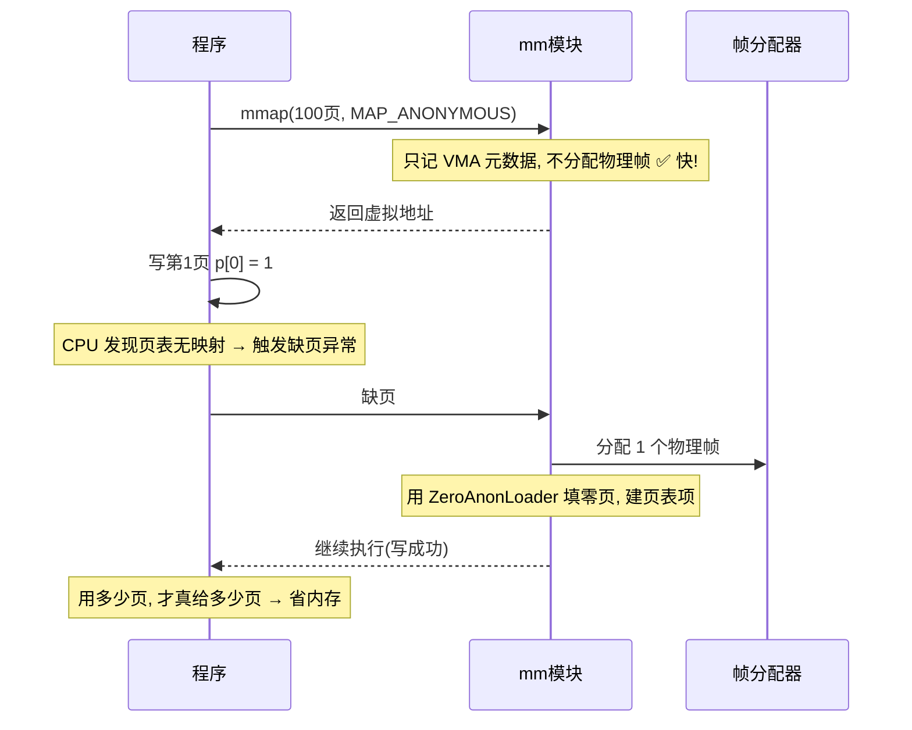
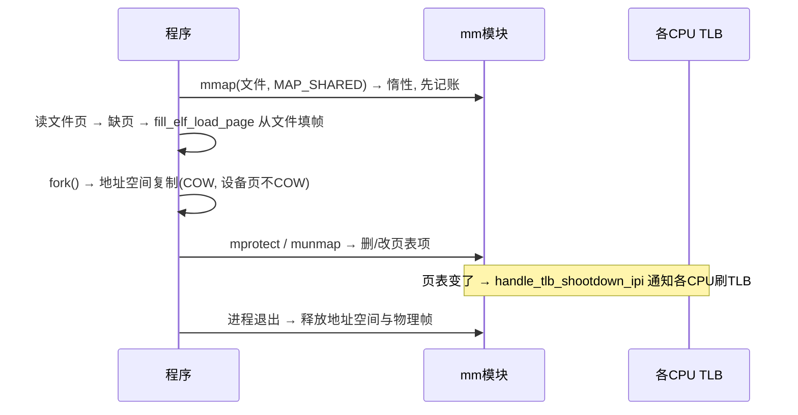

# wateros-mm：内存管理

用"用户怎么用 + 数据结构 + 完整故事"的方式介绍 `wateros-mm`。一句话本质：

> **mm 模块 = 内核的"房产中介"：负责把物理内存（有限的房子）出租给虚拟地址空间（每个进程以为自己有 4G 豪宅），并处理"按需分配"和"写时复制"这些省内存的巧活。** 你的程序里 `malloc`、`mmap`、`brk` 背后全是它。

---

## 第一步：用户到底怎么用它？

用户通过 syscall 间接使用：

```c
// ① 分配一大块匿名内存（malloc 底层就是它）
void *p = mmap(NULL, 4096 * 100, PROT_READ|PROT_WRITE,
               MAP_PRIVATE|MAP_ANONYMOUS, -1, 0);

// ② 堆区扩展（早期 malloc 就是它）
brk(heap_top + 4096);

// ③ 映射一个文件到内存（省一次 read 拷贝）
void *f = mmap(NULL, len, PROT_READ, MAP_SHARED, fd, 0);

// ④ 保护页 / 解除映射
mprotect(p, 4096, PROT_READ);   // 之后写它 → 段错误
munmap(p, 4096 * 100);
```

用户视角：**我 mmap 了一块内存，读写它，用完 munmap**。内核视角：这一切是"虚拟地址 → 页表 → 物理帧"的映射游戏。

---

## 第二步：核心概念——地址、页与页表

`mm-api` 用 4 个透明类型表达"地址"和"页号"（`addr.rs`），页大小固定 **4 KiB**：

```
VirtAddr  (虚拟字节地址)  ──floor_page──▶  VirtPageNum (虚拟页号)
PhysAddr  (物理字节地址)  ──floor_page──▶  PhysPageNum (物理页号)
        PAGE_SIZE = 4096;  PPN * 4096 = PhysAddr
```

```
进程的虚拟地址空间(以为有 4G)
┌────────────────────────────────────┐
│  0x0000_0000 代码段  │──┐          │
│  堆(向高地址长)       │  │ 页表映射  │
│  ...                │  │          │
│  mmap 区            │  │          │
│  栈(向低地址长)       │  └─▶ 物理帧  │
│  0xFFFF_FFFF        │   (真正4K的页)│
└────────────────────────────────────┘
```

**每个进程都有自己的一张页表**，把它的"虚拟地址"翻译成真实的"物理地址"。mm 模块的两大职责就是：**管好物理帧的分配**（`mm-frame-alloctor`，栈式分配器）**和管好页表的增删**（`mm-impl`，Sv39/LoongArch64 实现）。

---

## 第三步：核心技巧——"惰性"分配

这是 mm 最巧妙的地方（README 强调）：**mmap 的时候不真给内存，等访问才给**。



好处：程序 mmap 了 1GB 却只碰了 4KB，那内核只真给 4KB。**先记账、后付钱，按需分配。**

### COW（写时复制）——fork 的省内存魔法

`fork` 要复制整个地址空间，如果真复制会又慢又费内存。mm 的解法：**父子先共享同一份物理页，谁写谁才复制**：

```
fork 时:  父子页表都指向同一物理帧, 标记只读(COW)
子进程写:  触发 COW 缺页 → 复制一帧 → 各指各的 → 标记可写
父进程写:  同样触发 COW, 各改各的, 互不影响
```

这就是 `handle_cow_fault` 干的事。**大多数 fork 后立刻 exec 的程序（shell 就是），全程零复制。**

---

## 第四步：一个完整故事（mmap + fork + 设备映射）



**设备 mmap** 有个特别约定（README）：`/dev/fb0` 这类设备页映射后，解除映射**只删 PTE，不把设备页交还普通帧分配器**；fork 时设备页共享、**不做 COW**。因为设备页是硬件映射的，不能当普通物理内存回收。

**TLB shootdown**：多核上改页表后，其他 CPU 的 TLB 缓存还是旧的，必须发 IPI 让它们刷新——`handle_tlb_shootdown_ipi`。

---

## 对应回 WaterOS 代码

| 概念 | 代码位置 |
|---|---|
| 地址/页号类型、`PAGE_SIZE` | `mm-api/api-v0/src/addr.rs` |
| 语义契约（地址空间/mmap/brk/用户访问） | `mm-api/api-v0/src/address_space.rs`、`mmap.rs`、`brk.rs`、`user_access.rs` |
| 物理帧分配器 | `mm-frame-alloctor/`（栈式分配，`PhysPageNum` 粒度） |
| Sv39 / LoongArch64 页表 | `mm-impl/impl-sv39/`、`mm-impl/impl-loongarch64/`（互斥编译） |
| ELF 装载 / 惰性零页 / COW | `mm-impl/common/`（`ZeroAnonLoader`、`handle_cow_fault`） |
| TLB shootdown | `mm-impl/.../pagetable.rs`（`handle_tlb_shootdown_ipi`） |

---

## 一句话串起来

> 用户用 `mmap`/`brk`/`mprotect`/`munmap` 操纵自己的地址空间。内核用 **页表** 把虚拟地址翻译成物理帧（4 KiB 一页），用 `mm-frame-alloctor` 分配物理帧；关键在"**惰性**"——mmap 只记账，缺页才真分配（`ZeroAnonLoader` 填零），fork 用 **COW** 共享页、写才复制，设备页映射后不回收。多核上页表一变就 **IPI 刷 TLB**。**先记账后付钱、能共享就共享**，这就是 mm 省内存的两大原则。

这样 mm 就清晰了：**地址/页号类型 + 页表 + 帧分配器 + 惰性缺页 + COW + TLB shootdown**。也是理解 malloc、mmap、fork 内存语义的统一框架。
