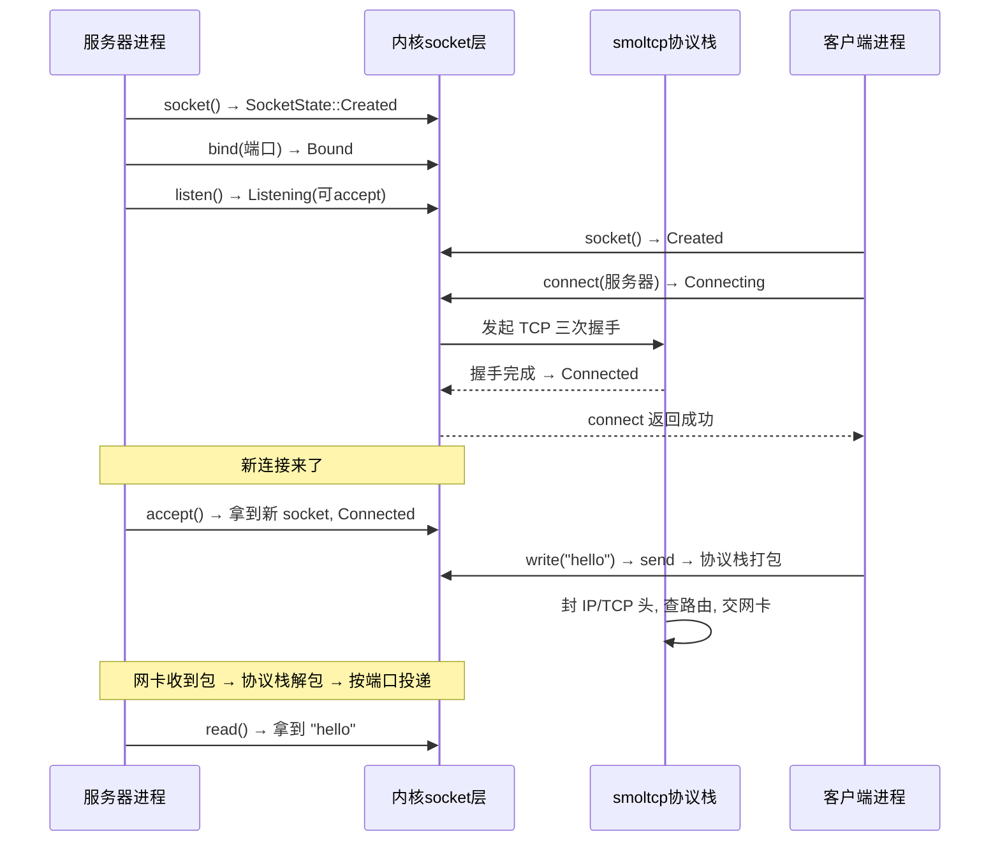

# wateros-network：网络协议栈

用"用户怎么用 + 数据结构 + 完整故事"的方式介绍 `wateros-network`。一句话本质：

> **network 模块 = 内核的"邮局"：把程序要发的数据（字节）打包成 IP 包、交给网卡发出去；收到包再拆开、按端口号投递给对应的 socket。** 你的 `curl`、`nginx`、`ping` 底层全走它。

---

## 第一步：用户到底怎么用它？

用户通过 POSIX socket API 使用：

```c
// 服务器端
int fd = socket(AF_INET, SOCK_STREAM, 0);
bind(fd, &addr, sizeof(addr));      // 绑定端口
listen(fd, 5);                      // 开始监听
int c = accept(fd, NULL, NULL);     // 等一个客户端连进来
read(c, buf, 100); write(c, "hi", 2);

// 客户端
int fd = socket(AF_INET, SOCK_STREAM, 0);
connect(fd, &addr, sizeof(addr));   // 连服务器
write(fd, "hello", 5);
```

用户视角：**socket → bind/listen/connect → accept → read/write**。内核视角：这是一套"创建 socket → 状态机推进 → 协议栈收发 → 网卡搬运"的流程。

---

## 第二步：核心概念——socket 与状态机

`network-api` 定义后端无关的语义类型（不依赖具体 smoltcp 实现）：

```rust
pub enum SocketKind { Tcp, Udp }        // 流 / 数据报

pub enum SocketState {                  // 内核侧跟踪的状态机
    Created,
    Bound { port: u16 },
    Listening { port: u16 },
    Connecting,
    Connected,
    Closed,
}

pub struct Ipv4Endpoint {               // 一个"地址:端口"
    address: [u8; 4],
    port: u16,
}
```

`SocketState` 是**内核自己跟踪的**状态机，不是 smoltcp 内部状态——这样上层（syscall）不依赖协议栈实现细节。socket 生命周期就是这套状态机的推进：

```
Created → Bound → Listening → (accept) → Connected
Created → Bound → Connecting → Connected
                              ↕
                            Closed
```

**socket 和 fd 是一回事**：`wateros-network` 把协议栈裸句柄包成 `SocketRef`，再 `into_vfs_handle` 变成 `TcpSocketHandle`/`UdpSocketHandle`（实现 `VfsIoHandle`），桥接进前面 `vfs.md` 讲的统一 fd 表。所以 `read`/`write`/`poll` 一套 API 通吃文件和 socket。

---

## 第三步：一个完整故事（TCP 服务器 + 客户端）



**poll 模型**（`impl-smoltcp` 只暴露稳定调用面）：协议栈是**事件驱动轮询**的，不是每字节都中断：

```
stack::init(config)          // 启动时初始化全局栈状态
stack::poll_at_millis(...)   // 问: 下一个该处理的时刻?
stack::poll_socket_events(...)  // 处理到达的事件
socket_poll_snapshot(...)    // 供 poll/select 判断可读可写
```

**接收也是预约模型**（和 VFS 一样）：`prepare_receive` 产生 `SocketReceiveLease`，用户复制成功后 `finish` 提交；非阻塞语义由 `SocketRecvError`/`SocketSendError` 映射成 Linux errno（`WouldBlock` → `EAGAIN` 等）。

---

## 第四步：协议栈怎么和网卡对接？

```
┌──────────────────────────────────────────────┐
│ syscall 层 (不依赖 smoltcp)                  │
│   └── SocketRef / TcpSocketHandle(VfsIoHandle)│
├──────────────────────────────────────────────┤
│ wateros-network (impl-smoltcp)               │
│   └── IPv4 协议栈: TCP/UDP/IP 语义           │
│        ↑ 收L2帧      ↓ 发L2帧                │
├──────────────────────────────────────────────┤
│ wateros-driver 的 NetworkDevice (网卡驱动)    │
│   └── 真正的硬件收发(如VirtIO网卡)           │
└──────────────────────────────────────────────┘
```

`adapter.rs` 连接 `wateros-driver` 的 `NetworkDevice`：**驱动提供 L2 帧收发，协议栈负责 IP/TCP/UDP 语义**，分工明确。`NetworkConfig{address, prefix_len, gateway}` 就是启动时告诉协议栈"我 IP 多少、网关多少"。

**管理接口**：`NetworkSocketSnapshot` 提供 `/proc/net` 这类只读视图（kind/state/local/peer/收发队列），方便诊断。

---

## 对应回 WaterOS 代码

| 概念 | 代码位置 |
|---|---|
| 语义类型（Endpoint/Config/State/Error） | `network-api/api-v0/src/lib.rs` |
| smoltcp 实现 / 稳定调用面 | `network-impl/impl-smoltcp/`（`stack::init`/`poll`/`poll_socket_events`） |
| socket 共享句柄 / fd 桥接 | `src/socket/`（`SocketRef`、`TcpSocketHandle`/`UdpSocketHandle`） |
| 网卡适配 | `network-impl/impl-smoltcp/.../adapter.rs`（连 `wateros-driver` 的 `NetworkDevice`） |
| 预约接收 / 非阻塞 errno 映射 | `src/socket/`（`SocketReceiveLease`、`SocketRecvError`/`SocketSendError`） |

---

## 一句话串起来

> 用户用 `socket`/`bind`/`listen`/`connect`/`accept`/`read`/`write` 一套 API 上网。内核用 **`SocketState` 状态机**跟踪每个 socket 的一生，用 **`SocketRef` 把 socket 桥接成 VFS 的 fd**（所以 `read`/`write`/`poll` 通吃文件和 socket），协议栈（smoltcp）按**事件驱动轮询**收发，网卡驱动只管 L2 帧、协议栈管 IP/TCP/UDP。**状态机 + 统一 fd + 轮询模型**，就是网络模块的全部骨架。

这样 network 就清晰了：**socket 状态机 + fd 桥接 + smoltcp 轮询 + 网卡适配**。也是理解"socket 为什么能当文件用"、"协议栈为什么不每字节中断"的统一答案。
