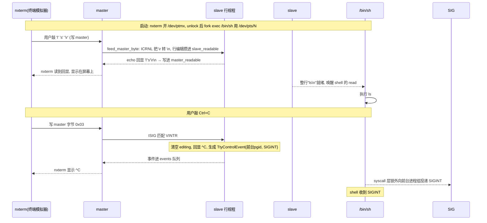

> **PTY 是一对"软件模拟的终端"：master（主端）像一个键盘+屏幕，slave（从端）像一个真实终端设备。** 让那些坚持"要和终端说话"的程序，在没有真实硬件时也能跑起来。

---

## 第一步：用户怎么用？

你见过的最典型场景就是 **`nxterm`（终端模拟器）+ shell**：

```c
// ① 终端模拟器 nxterm 打开 master 端，得到一个"虚拟终端"的入口
int master_fd = open("/dev/ptmx", O_RDWR);   // 伪终端 master
ioctl(master_fd, TIOCGPTN, &n);              // 问编号：几号 pts？
ioctl(master_fd, TIOCSPTLCK, 0);             // unlockpt 解锁 slave

// ② shell 从 slave 端读/写，完全像操作一个真实终端
int slave_fd = open("/dev/pts/N", O_RDWR);   // slave = 被模拟的终端设备
read(slave_fd, buf, 256);                    // 读"键盘输入"
write(slave_fd, "hi\n", 3);                  // 写"屏幕输出"
```

**关键**：shell 以为自己在跟一个真实终端打交道（能读行、能退格、能收 Ctrl+C），但其实那个"终端"完全是软件模拟的，背后另一头是 `nxterm` 这个程序。

---

## 第二步：为什么要发明 PTY？

真实终端（串口 UART）长这样：

```
键盘/屏幕 (硬件) ←→ UART ←→ 内核 TTY ←→ shell
```

但现在的"终端"都是软件程序（`nxterm`、`ssh`），没有硬件。怎么让 shell 继续用原来那套 TTY 逻辑？答案是**把"硬件那半截"也换成软件**：

```
nxterm(程序) ←→ [master] ←→ 内核行规程 ←→ [slave] ←→ shell(程序)
                └──── 一个 PTY pair 就是一对 master/slave ────┘
```

- **master**：扮演"键盘+屏幕"那头，供 `nxterm` 读写。
- **slave**：扮演"终端设备"那头，供 shell 读写，和真实 TTY 行为**一模一样**（行编辑、echo、信号检测都有）。

数据流向（README 里的图）：

```text
nxterm 写 master → slave 行规程 → /bin/sh 从 slave 读取     ← 键盘输入方向
/bin/sh 写 slave → OPOST/ONLCR → nxterm 从 master 读取      ← 屏幕输出方向
```

---

## 第三步：数据结构——PTY 的三层状态

对应代码里的几个结构：

```
PtyRegistry (全局注册表, 静态)
  ├─ pairs:    BTreeMap<u32, Weak<SharedTerminal>>   编号 → PTY 实例
  └─ sessions: BTreeMap<usize, TerminalId>           session → 控制终端

SharedTerminal (一个 PTY 对, Arc 共享)
  └─ PtyState (行规程 + 队列, 短锁保护)
      ├─ termios / winsize / foreground_pgid / controlling_sid
      ├─ slave_readable ← master 输入加工后的字节(shell要读的)
      ├─ slave_editing  ← slave 端的"半行"
      ├─ master_readable← slave 输出/echo 后的字节(nxterm要读的)
      ├─ 两个 64 KiB 有界队列
      └─ events: VecDeque<TtyControlEvent>   控制键事件队列
```

几个值得注意的点：

- **两个方向各一个队列**：`slave_readable`（键盘→shell）和 `master_readable`（屏幕←shell），互不干扰。
- **上限 64 个 PTY**（`MAX_PTYS = 64`），`QUEUE_CAPACITY = 64 KiB` 有界队列——防止一端疯狂写把另一端内存撑爆。
- `pairs` 存的是 `Weak`（弱引用）：最后一个 master/slave fd 关掉后，实例自动释放。

---

## 第四步：一个完整故事（nxterm 里敲命令 + Ctrl+C）



注意 `feed_master_byte` 的代码几乎**复用**了 console 那套行编辑逻辑（`VERASE`/`VKILL`/`VEOF`/`\n`/`ISIG`）——PTY slave 就是一个"软件版 TTY"。

---

## 第五步：几个关键的"终端归属"机制

`PtyState` 里有几个字段对应经典 UNIX job-control 概念：

**① 初始是锁定的**

```rust
let mut state = PtyState::new();   // locked: true
```

`/dev/ptmx` 刚 open 出来的 pair 是**锁定**的：slave 还不能打开，必须先 `unlockpt()`（`TIOCSPTLCK`）解锁。防止别人抢先打开你的 slave。

**② 控制终端 + 会话（`controlling_sid`）**

```
setsid()  → 成为新 session leader
打开 /dev/pts/N → 自动成为该 session 的"控制终端"
/dev/tty  → 根据当前 SID 返回这个 PTY slave(或系统 console)
```

这是 shell 判断"我是前台还是后台"的基础。

**③ 前台进程组（`foreground_pgid`）**

信号**只发给前台进程组**：`emit_signal` 里 `if self.foreground_pgid != 0` 才把事件推入队列。后台进程组敲 Ctrl+C 不应该被打到（除非 `TOSTOP`）。

**④ 挂断语义（hangup）**

```rust
master_open_descriptions / slave_open_descriptions
master_hung_up / slave_hung_up
```

最后一个 **master** fd 关闭 → slave 收到 hangup（读返回 EOF / 收到 `SIGHUP`）——这模拟了"拔掉显示器"的效果，让 shell 知道终端没了。

---

## 第六步：为什么 signal 仍然"只发事件"？

看 `emit_signal` 的实现：它只是 `self.events.push_back(TtyControlEvent{...})`，把事件塞进队列，**自己不投递信号**。和 console 一样，真正的 `SIGINT` 由 syscall 层在**释放 PTY 锁之后**从 `events` 队列取出来投递。这是整个 `wateros-tty` 一贯的锁纪律：**持锁时绝不碰信号投递和调度**。

---

## 一句话串起来

> 用户看到的是"nxterm 里能开 shell、能敲命令、Ctrl+C 能杀人"。本质是 PTY 把"终端硬件"用一对 **master/slave 软件对**替换了：`nxterm` 写 master、shell 从 slave 读，中间是**同一套行规程**（行编辑、echo、信号检测）在加工字节；用 `slave_readable`/`master_readable` 两个 64 KiB 队列分别承载两个方向的字节流，用 `locked`/`controlling_sid`/`foreground_pgid`/`hung_up` 管理终端的归属和生命周期，控制键只产生 `TtyControlEvent` 交给 syscall 层锁外投递。

这样 PTY 就清晰了：**一对 master/slave + 两套方向队列 + 一套复用的行规程 + 一套终端归属状态**。这也是为什么 `nxterm`、`ssh`、`tmux` 这些程序能"假装自己是终端"——它们都只是 master 端的用户程序而已。最后一个 **master** fd 关闭 → slave 收到 hangup（读返回 EOF / 收到 `SIGHUP`）——这模拟了"拔掉显示器"的效果，让 shell 知道终端没了。

---

## 第六步：为什么 signal 仍然"只发事件"？

看 `emit_signal` 的实现：它只是 `self.events.push_back(TtyControlEvent{...})`，把事件塞进队列，**自己不投递信号**。和 console 一样，真正的 `SIGINT` 由 syscall 层在**释放 PTY 锁之后**从 `events` 队列取出来投递。这是整个 `wateros-tty` 一贯的锁纪律：**持锁时绝不碰信号投递和调度**。

---

## 一句话串起来

> 用户看到的是"nxterm 里能开 shell、能敲命令、Ctrl+C 能杀人"。本质是 PTY 把"终端硬件"用一对 **master/slave 软件对**替换了：`nxterm` 写 master、shell 从 slave 读，中间是**同一套行规程**（行编辑、echo、信号检测）在加工字节；用 `slave_readable`/`master_readable` 两个 64 KiB 队列分别承载两个方向的字节流，用 `locked`/`controlling_sid`/`foreground_pgid`/`hung_up` 管理终端的归属和生命周期，控制键只产生 `TtyControlEvent` 交给 syscall 层锁外投递。

这样 PTY 就清晰了：**一对 master/slave + 两套方向队列 + 一套复用的行规程 + 一套终端归属状态**。这也是为什么 `nxterm`、`ssh`、`tmux` 这些程序能"假装自己是终端"——它们都只是 master 端的用户程序而已。
