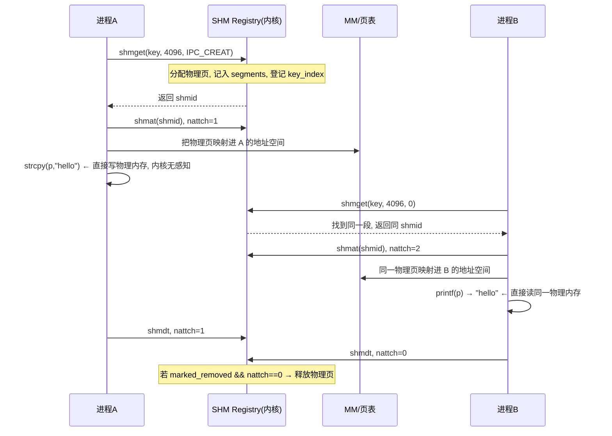

Searched for regex `shm|shmat|shmget|shmctl|SharedMemory` (`**/os/components/wateros-ipc/**`), 153 results

Searched for regex `shm|shmat|shmget|Shared|shared` (`**/os/components/wateros-mm/**`), 181 results

Read

Read , lines 1 to 120

用同样的方法介绍 **shm（SysV 共享内存，shared memory）**。一句话本质：

> **SHM = 让多个进程"看见同一块物理内存"。** 进程 A 写一个字，进程 B 立刻读到——不需要任何拷贝，是**最快**的进程间通信（IPC）方式。

和 futex 一样，先讲**用户怎么用**，再看**数据结构**，最后**一个完整故事**。

---

## 第一步：用户怎么用？

共享内存用户界面就是 4 个系统调用：

```c
// 进程 A
int shmid = shmget(key, 4096, IPC_CREAT | 0666); // ① 创建一段共享内存, 拿 id
char *p = shmat(shmid, NULL, 0);                 // ② 映射进自己的地址空间
strcpy(p, "hello from A");                       // ③ 直接读写
// ... 用完了
shmdt(p);                                        // ④ 解除映射

// 进程 B (用同一个 key)
int shmid = shmget(key, 4096, 0);                // ① 按 key 找到同一段
char *p = shmat(shmid, NULL, 0);                 // ② 也映射进自己的空间
printf("%s\n", p);                               // ③ 立刻读到 "hello from A"
```


| 调用                           | 作用                           | 类比           |
| -------------------------------- | -------------------------------- | ---------------- |
| `shmget(key, size, flags)`     | 创建/按 key 查找一段共享内存   | 开一个"公告板" |
| `shmat(shmid, addr, flags)`    | 把这段内存映射进自己的地址空间 | 走到公告板前   |
| `shmdt(addr)`                  | 解除映射                       | 从公告板前走开 |
| `shmctl(shmid, IPC_RMID, ...)` | 删除/查属性                    | 拆掉公告板     |

用户视角就一句话：**用 key 找到同一块内存，映射进来，当普通指针用。**

---

## 第二步：为什么它是最快的 IPC？

对比三种 IPC 的数据搬运方式：


| IPC           | 数据怎么走                     | 拷贝次数     |
| --------------- | -------------------------------- | -------------- |
| pipe（管道）  | A 写内核缓冲 → B 从内核缓冲读 | 2 次拷贝     |
| message queue | A 拷进内核消息 → B 拷出去     | 2 次拷贝     |
| **shm**       | **同一块物理页，两边都映射**   | **0 次拷贝** |

SHM 的秘诀：**物理内存只有一份**，但被映射进多个进程的页表。进程 A 写它、进程 B 读它，内核全程不参与数据搬运——这就是它快的原因。

---

## 第三步：数据结构——内核里的一张"账本"

对应 `registry.rs` / `state.rs`，核心是三个数据结构 + 一个注册表：

```rust
pub struct ShmSegment {          // 一个共享内存段 = 一段物理内存 + 元数据
    key: usize,                  // 用户的 key(身份证)
    size: usize,
    mode: usize,                 // 权限 0666
    pages: Vec<PhysPageNum>,     // 真正拥有的物理页！
    nattch: usize,               // 当前有几个进程 attach 着(引用计数)
    marked_removed: bool,        // 是否已被 shmctl(IPC_RMID) 标记删除
}

pub struct ShmAttachment {       // 一个进程的一次映射
    shmid: ShmId,
    base: usize,                 // 映射到该进程的哪个虚拟地址
    size: usize,
    readonly: bool,
}

pub struct ShmRegistry {         // 全局注册表
    segments:      BTreeMap<ShmId, ShmSegment>,         // 段ID → 段
    key_index:     BTreeMap<usize, ShmId>,              // key → 段ID
    attachments:   BTreeMap<TaskId, Vec<ShmAttachment>>,// 任务 → 它的所有映射
}
```

注意几个核心设计点：

1. **`pages: Vec<PhysPageNum>` 是唯一的一份物理内存**——`ShmRegistry` 拥有物理页所有权。
2. **`nattch` 引用计数**：每 `shmat` 一次 +1，每 `shmdt` 一次 -1。
3. **`key_index`**：用 key 找段，让两个进程能"对上暗号"（这就是 `IPC_PRIVATE` 与普通 key 的区别：私有的不登记 key）。

---

## 第四步：一个完整故事（进程 A 写、进程 B 读）



**生命周期不变量**（`state.rs` 注释里写得很清楚）：

> 当 `marked_removed && nattch == 0` 时，段必须从 registry 删除并释放 `pages`。

即：`shmctl(IPC_RMID)` 不会立即销毁内存——它只是**标记**删除。真正销毁要等最后一个 attach 也解除（`nattch` 归零）。这样能保证"正在用的人不会突然内存消失"。

---

## 第五步：WaterOS 实现里的两个巧妙细节

**① "两阶段 attach"（`ShmAttachReservation`）**

```rust
pub struct ShmAttachReservation { id, shmid }   // 不可伪造的凭据
```

为什么 attach 要分两步？因为 `shmat` 要**在 registry 锁内**登记引用计数，但**映射页表、TLB 刷新必须在锁外**做（注释：`用户 VA 预留、页表映射、TLB 刷新均由调用方在 registry 锁外完成`）。所以：

```
begin_attach()  → 锁内: nattch+1, 发一个 reservation 凭据
   ...解锁, 做真正的 MM 页表映射...
finish_attach() 或 cancel_attach_reservation()  → 提交或回滚
```

`reservation` 是**不可伪造**的：不能只凭 `shmid` 去结束别人的并发 attach——防止两条并发 `shmat` 互相干扰。

**② 锁纪律**

`impl-frame/src/lib.rs` 开头强调：**任何用户地址空间映射都属于 syscall/MM 层，绝不能在 SHM registry 锁内进行**。这和你前面看到的 TTY/PTY 是同一个原则：**持锁时不碰重活**（页表操作、用户拷贝、调度、信号）。

---

## 第六步：SHM 与前面讲的东西怎么协同？

一个经典的完整画面——两个进程用 SHM 共享数据，还需要**同步**：

```text
进程A: 写数据到 shm  → 想告诉B"我写好了"
进程B: 读数据

  SHM 负责"共享"数据本身  ← 0拷贝, 快
  futex / semaphore 负责"同步"读写顺序  ← 防止A没写完B就读了
```

这正是 futex 里 **shared futex**（`FutexKey::shared`）的用武之地：两个进程映射的是**同一块物理内存里的同一个 futex 字**，MM 把它解析成稳定的共享身份，两个进程的锁才能对上。

---

## 一句话串起来

> 用户用 `shmget` 创建/找段、`shmat` 映射、`shmdt` 解除、`shmctl` 删除。本质是一段**唯一的物理内存**（`ShmSegment.pages`）被映射进多个进程的地址空间，所以读写零拷贝。内核用 `ShmRegistry` 三张表（段表 + key 索引 + 任务映射表）记账，用 `nattch` 引用计数管生命周期——`IPC_RMID` 只标记，最后一个 attach 解除才真正释放。**共享归 SHM、同步归 futex**，两者配合才是完整的跨进程数据交换。

这样 SHM 就清晰了：**一份物理内存 + 一张注册表 + 一个引用计数 + 两阶段 attach 的锁纪律**。要不要我再补一个 WaterOS 里 SHM 与 `shmat` syscall 层的具体调用链（怎么从 syscall 走到 registry 再走到 MM 映射）？
