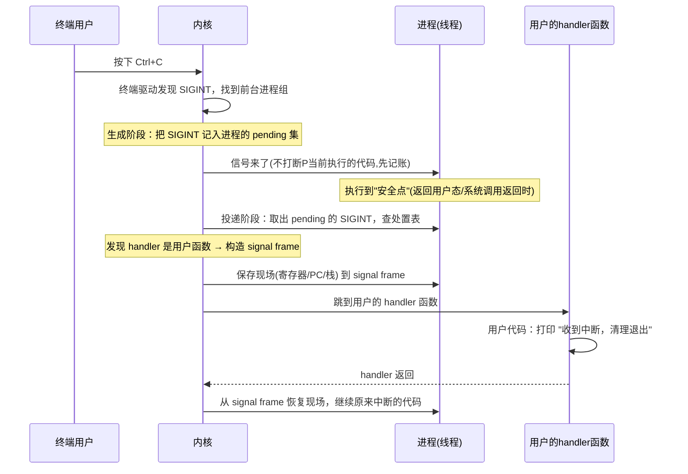

Searched for files matching `**/signal*`, 20 matches

Searched for regex `signal|sigaction|SIGKILL|sigset` (`**/os/components/wateros-syscall/**`), 145 results

Searched for files matching `**/wateros-ipc/**/signal/**`, no matches

Searched for regex `pub struct SignalSet|pub struct SignalAction|pub enum SignalEffect|pub struct Sigaction|SIG_DFL|SIG_IGN` (`**/os/components/wateros-ipc/**`), 13 results

Read , lines 1 to 260

用同样的方法：**从用户怎么用 + 数据结构 + 一个完整故事**来介绍 signal。本质一句话：

> **signal = 内核给进程/线程发的一条"异步通知"：停下你正在做的事，去处理一件事（比如"按了 Ctrl+C"、"内存访问违规"、"定时器到点"）。**

它和 futex 最大的不同：futex 是线程**主动**去睡/被叫醒；signal 是**别人（或内核）主动打断**你，你**被动**响应。而且时机不可控——信号可能在你执行任意一条指令时到来。

---

## 第一步：用户怎么用？

普通程序会碰到三种 signal 场景：

```c
// ① 发信号给别人（比如给 PID 1234 发 SIGTERM 让它优雅退出）
kill(1234, SIGTERM);

// ② 给自己设"处理函数"：SIGINT（Ctrl+C）来了就打印然后退出
signal(SIGINT, my_handler);        // 简单版
sigaction(SIGINT, &act, NULL);     // 完整版：能设标志、掩码等

// ③ 临时屏蔽某些信号，防止处理到一半被再次打断
sigprocmask(SIG_BLOCK, &mask, NULL);
```

用户层面一共就四件事：**发信号**（`kill`/`raise`）、**设处理方式**（`signal`/`sigaction`）、**屏蔽信号**（`sigprocmask`）、**等待信号**（`sigsuspend`/`sigwait`）。

---

## 第二步：核心概念——信号号 & 处理方式（disposition）

信号就是一个整数编号（`SIGINT=2`、`SIGKILL=9`、`SIGSEGV=11`……）。每个信号对应一种**处理方式（disposition）**，三选一：


| disposition       | 含义                                         | 例子                                 |
| ------------------- | ---------------------------------------------- | -------------------------------------- |
| `SIG_DFL`（默认） | 内核按默认动作处理：多数=终止进程，有些=忽略 | `SIGSEGV` → 崩溃退出                |
| `SIG_IGN`（忽略） | 直接扔掉，不处理                             | 程序不在乎`SIGWINCH`（终端窗口变化） |
| 自定义 handler    | 跳到你写的用户态函数去执行                   | `Ctrl+C` 时做清理再退出              |

对应 WaterOS `ipc-signal` 里的：

```rust
pub const SIG_DFL : usize = 0;   // 默认
pub const SIG_IGN : usize = 1;   // 忽略
pub struct SignalAction { handler, flags, restorer, mask }  // 一个信号的处置描述
```

`SignalAction` 就是 Linux `struct sigaction` 的内核视图：`handler` 是处理函数地址（0/1 是特殊值），`flags` 是 `SA_*` 行为标志，`mask` 是进入 handler 时临时屏蔽的信号集。

---

## 第三步：数据结构——每个线程的两张"位图"

每个线程有两个关键的**信号集合（用一位表示一个信号）**，对应 `SignalSet(u64)`（64 位掩码，每位一个信号号）：

```
                bit:  9   8   7   6   5   4   3   2   1
                      │   │   │   │   │   │   │   │   │
  pending 集      ... 0   0   0   0   0   0   1   0   0   ← 来了但还没处理
  blocked  集     ... 0   0   0   0   1   0   0   0   0   ← 暂时不处理的信号
```

- **pending 集**：已经发给这个线程、但还没处理掉的信号。
- **blocked 集**：用户临时"挂起"的信号号（`sigprocmask` 设置）。

再加上一张**信号号 → SignalAction** 的处置表（每个信号一个动作），这就是内核里一个线程的全部 signal 状态。

关键规则：

- 信号**不能丢失语义但会合并**：同一信号重复来两次，pending 集里只有一位，处理一次就够（这正是 `SignalSet` 注释说的"重复投递不记录次数"）。
- `SIGKILL` 和 `SIGSTOP` **永远不能屏蔽、不能忽略**——这是内核的保底手段（`SignalError::InvalidSignal` 就是管这类非法操作）。

---

## 第四步：一个完整的故事（Ctrl+C）



整个流程分两个阶段，WaterOS 代码里也有明确对应：

1. **生成阶段**（`SignalDelivery`）：`kill()`/`Ctrl+C` 来了，内核只往目标线程的 **pending 集**写一个位，然后返回。**不立即打断任何人。**
2. **投递阶段**（`SignalEffect`）：等目标线程运行到**安全点**（比如从 syscall 返回用户态时，见 `lib.rs` 里 `deliver_pending_signal`），才真正取出 pending 信号、判断处置：

```rust
pub enum SignalEffect {
    Handler(PendingSignal),  // 有自定义 handler → 构造 signal frame 跳过去
    Terminate { signal },    // SIG_DFL 且默认是终止 → 杀掉进程
    Stop { signal },         // SIGSTOP → 挂起
    Continue { signal },     // SIGCONT → 继续
}
```

---

## 第五步：异步打断是怎么安全实现的？—— signal frame

用户 handler 是在**当前正在跑的代码中间**被强行插入执行的。处理器函数执行完后，必须精确回到"刚才被打断的那条指令"，否则程序就崩了。内核靠 **signal frame** 解决：

```
被打断时:
  PC = 0x...4080  (正在执行的指令)
  寄存器 = ...
  栈  = ...

投递时内核构造 signal frame:
  把 被打断的 PC / 寄存器 / 标志位  保存到栈上  ← 相当于"书签"
  把 PC 改成 handler 地址, 跳进用户代码

handler 返回时:
  内核/restorer 读回 frame
  恢复 PC / 寄存器
  回到 0x...4080 继续跑  ← 仿佛什么都没发生过
```

这就是为什么 `SignalAction` 里要存 `restorer`（`SA_RESTORER` 恢复桩）——负责 handler 结束后把现场从 frame 里捞回来。

---

## 对应回 WaterOS 代码（`ipc-signal/signal-api`）


| 概念                     | 代码                                                           |
| -------------------------- | ---------------------------------------------------------------- |
| 信号编号                 | `SIGINT`/`SIGSEGV`/`SIGKILL`... 常量                           |
| 信号掩码（每位一个信号） | `SignalSet(u64)`：`contains`/`insert`/`first_signal`           |
| 一个信号的处置           | `SignalAction`（`handler`/`flags`/`restorer`/`mask`）          |
| 生成阶段路由             | `SignalDelivery`（Ignored/Pending/Stop/Continue）              |
| 投递阶段效果             | `SignalEffect`（Handler/Terminate/Stop/Continue）              |
| 构造 frame 的信息        | `PendingSignal`（信号号 + 处置快照 + 旧掩码）                  |
| 备用信号栈               | `AlternateSignalStack`（`sigaltstack`，防止 handler 把栈用爆） |

---

## 一句话串起来

> 用户用 `kill` 发信号、用 `sigaction` 设 handler、用 `sigprocmask` 屏蔽信号。**信号来了内核不打断你，只往 pending 集记一笔账；等你跑到安全点，才查处置表**——默认就杀进程、忽略就丢掉、自定义就保存现场跳进你的函数、返回再恢复现场。所以 signal 是"**记账 → 安全点 → 投递**"三步的异步机制。

这样 signal 就不再是一团"信号怎么处理"的模糊概念了，而是：**一个编号 + 一张处置表 + 两张位图 + 一个恢复现场用的 frame**。要不要我再顺着讲讲和 futex 的联动（比如 `EINTR` 是怎么来的，或者 futex 等待为什么会被信号打断）？
