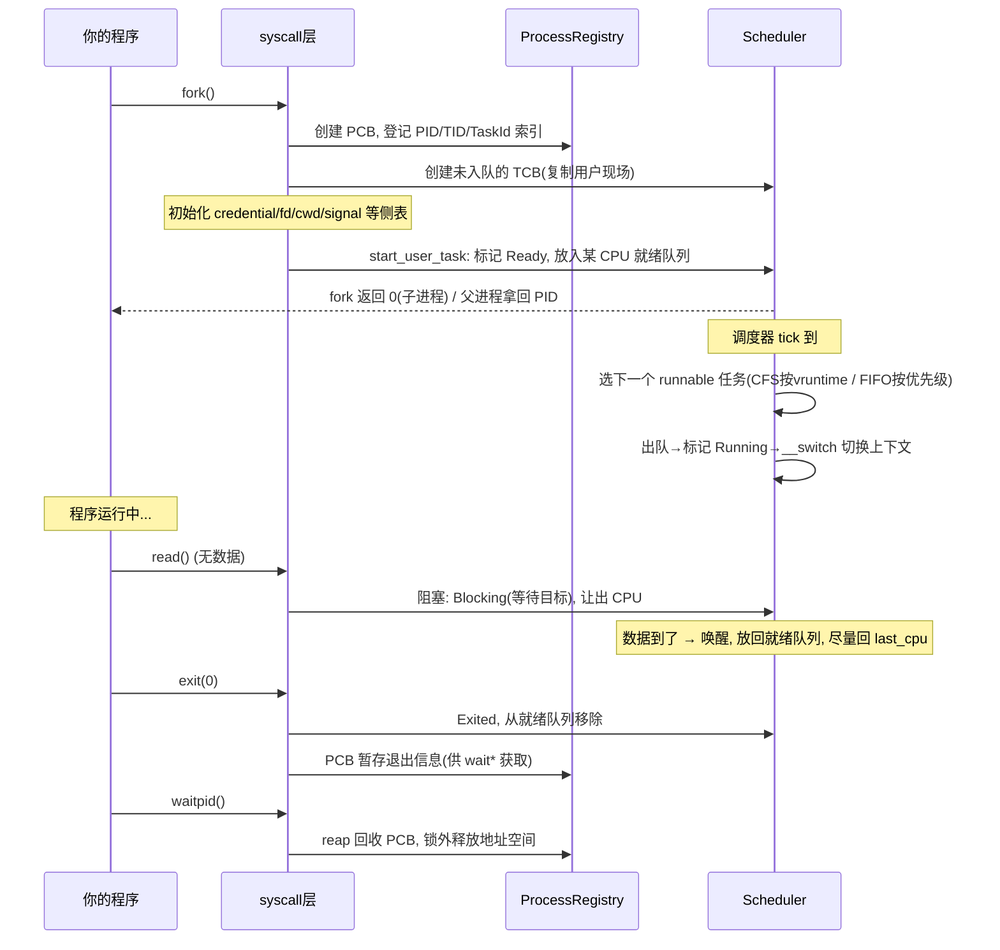

# wateros-task：进程、线程与调度器

用"用户怎么用 + 数据结构 + 完整故事"的方式介绍 `wateros-task`。一句话本质：

> **task 模块 = 内核的"人事部"：负责创建进程/线程（PCB/TCB）、决定下一个该谁跑（调度器）、以及处理它们从生到死的全过程（fork/exec/exit/wait）。** 你的程序能"同时"跑起来、能被打断、能让出 CPU，全靠它。

---

## 第一步：用户到底怎么用它？

用户（程序）不直接调用 task 模块，而是通过 syscall 间接使用：

```c
// ① 创建子进程
pid_t pid = fork();                 // 复制一份自己

// ② 跑一个新程序
execl("/bin/ls", "ls", NULL);       // 替换当前程序映像

// ③ 线程
pthread_create(&t, NULL, fn, arg);  // clone：同进程内再加一条执行流

// ④ 退出 & 回收
exit(0);                            // 自己退出
waitpid(pid, &status, 0);           // 等子进程结束并回收
```

用户视角：**我 fork 了一个子进程、开了个线程、让它跑、等它结束**。内核视角：这一切都是"创建任务 → 调度运行 → 阻塞/退出 → 回收"的状态机。

---

## 第二步：核心概念——PCB 与 TCB 的一对多模型

`wateros-task` 用两类结构管理"进程"和"线程"（见 `task-api/api-v0`）：

```
┌─────────────────────────────────────────────┐
│ ProcessId (PID)  ← 用户看到的进程号          │
│ PCB (进程控制块, impl-core/src/process.rs)    │
│   ├─ 地址空间、父进程、leader task、线程表     │
│   ├─ 进程组 PGID / 会话 SID / rlimit / umask  │
│   └─ 进程状态 Running/Stopped/Exiting/Exited  │
│                                              │
│   ├── TCB (线程控制块, impl-core/src/tcb.rs)  │
│   │     ├─ TaskId（调度器内部编号）            │
│   │     ├─ 内核栈 + 上下文 + trap frame        │
│   │     ├─ 调度属性（策略/优先级/vruntime）    │
│   │     └─ TaskState 状态机                   │
│   └── TCB (第2条线程) ...                     │
└─────────────────────────────────────────────┘
```

关键点（README 明说）：

- **一对多**：一个 PCB 可以维护一个 leader task + 多个 member task（线程）。
- `TaskId` = 调度器内部可运行实体编号；`ProcessId` = 用户态 PID；`ThreadId` = 用户态 TID。
- **内核任务和每 CPU 的 idle 任务只有 TCB、没有 PCB**；用户任务必须登记到 PCB。

TCB 的调度生命周期（`TaskState`）就是任务的全部人生：

```rust
pub enum TaskState {
    Ready,                                   // 就绪，排队等 CPU
    Running,                                 // 正在某 CPU 上跑
    Blocking(TaskWaitTarget),                // 阻塞（等锁/等 IO/等信号...）
    Sleeping { wake_tick: TaskTick },        // 睡到某个 tick 再醒
    Exited(TaskExitCode),                    // 已退出，不再被调度
}
```

---

## 第三步：一个完整故事（程序从生到死）



**两阶段创建**是这里最精妙的设计（README 强调）：

> 用户任务通常采用"**创建但不入队 → 初始化全部侧表 → 发布到就绪队列**"的两阶段流程，避免其它 CPU 提前运行尚未初始化完成的任务。

即 `create_user_task` 先造出"半成品" TCB，等 fd/cred/cwd/signal 全部配齐，`start_user_task` 才把它扔进就绪队列。否则别的 CPU 可能立刻把它抢去跑，而它还没初始化完。

---

## 第四步：调度器——下一个该谁跑？

调度器维护每 CPU 的就绪队列，支持五种策略（`task-scheduler`）：

| 策略 | 队列方式 |
|---|---|
| `SCHED_OTHER` / `BATCH` / `IDLE` | 基于 vruntime 的**公平队列**（CFS 风格） |
| `SCHED_FIFO` | 按 priority 分桶，先到先跑，跑完才让 |
| `SCHED_RR` | 按 priority 分桶，时间片轮转 |

每个 CPU 维护自己的：

```
CPUState
  ├─ current / idle task
  ├─ 五类就绪队列(公平+3优先级桶+...)
  ├─ timer/switch 统计
  └─ need_resched 标志(该不该立刻换人)
```

**唤醒尽量回 `last_cpu`**（README 提到）：唤醒任务时优先放到它上次运行的 CPU，利用缓存局部性；需要时才发定向 IPI 让别的 CPU 重新调度。

**锁纪律**：scheduler 和 process registry 分别由多核安全锁保护，但**实际 IPI、地址空间回调、信号投递和 `__switch` 不应在持有这些锁时执行**——还是那句"持锁不干重活"。

---

## 对应回 WaterOS 代码

| 概念 | 代码位置 |
|---|---|
| 任务状态机 / 运行统计 | `task-api/api-v0/src/task.rs`（`TaskState`、`TaskRuntimeStats`） |
| PCB / 进程注册表 | `task-impl/impl-core/src/process.rs`（`processes`/`pid_for_task`/`task_for_thread` 三张表） |
| TCB | `task-impl/impl-core/src/tcb.rs` |
| 调度策略 / 就绪队列 | `task-scheduler/scheduler-api` 与 `scheduler-impl/impl-multi-class` |
| 快照（锁外诊断） | `task-api/api-v0/src/snapshot.rs`（`TaskSnapshot`，供 dashboard/GDB） |

---

## 一句话串起来

> 用户用 `fork`/`clone`/`exec`/`exit`/`wait` 操纵进程和线程。内核用 **PCB 管进程语义（PID/进程组/侧表）、TCB 管执行流（内核栈/调度属性/状态机）**，用一对多模型让一个进程拥有多条线程；调度器用"公平队列 + 优先级桶"决定下一个谁跑，用"创建不入队 → 配齐侧表 → 发布入队"的两阶段流程保证任务不会在初始化前被别的 CPU 抢跑。**生、老（调度）、病（阻塞）、死（退出回收）都在这个模块里闭环。**

这样 task 就清晰了：**PCB + TCB + 一套状态机 + 一组就绪队列 + 两阶段发布**。这是理解 fork/线程/调度这三件"内核最忙的事"的统一框架。
